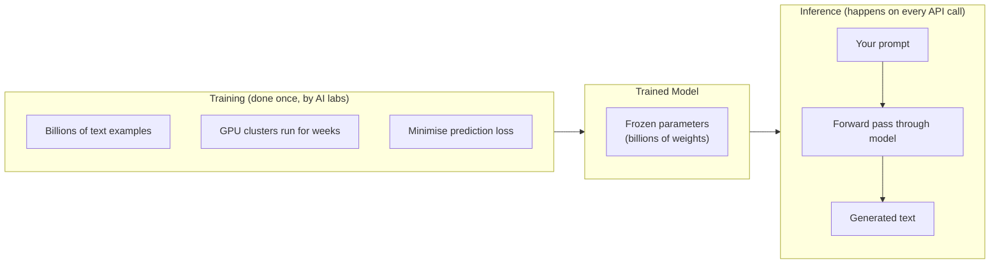
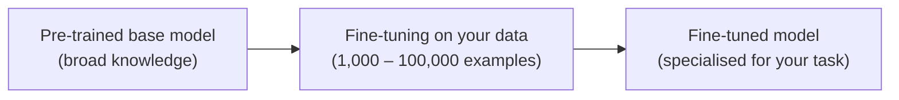
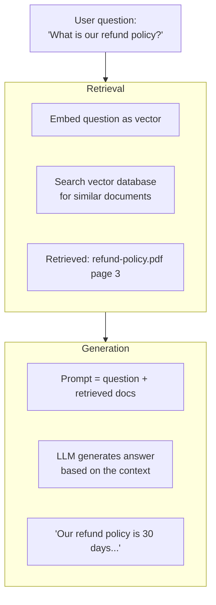
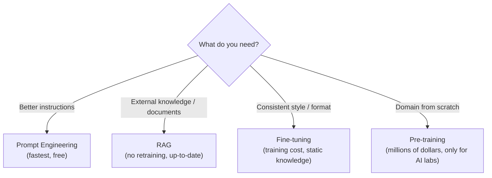

import { Tabs, TabItem } from '@astrojs/starlight/components';
import { Aside, Card, CardGrid, Steps, Badge } from '@astrojs/starlight/components';

There are two fundamentally different phases in working with AI models: **training** (teaching the model) and **inference** (using the model). Most people only ever interact with the inference phase, but understanding both is essential for deciding how to best adapt AI to your specific use case.

---

## Training vs Inference at a Glance

| | Training | Inference |
|---|---|---|
| **What happens** | Model learns from data | Model produces predictions/outputs |
| **Compute** | Extremely expensive (GPUs for weeks/months) | Much cheaper (milliseconds per request) |
| **Who does it** | AI labs, researchers, large companies | Everyone — via APIs or local models |
| **When** | Once (or periodically) | Every time a user sends a message |
| **Parameters** | Updated continuously | Fixed (read-only) |



---

## Pre-training

The first and most expensive step. The model is trained from scratch on massive datasets — trillions of tokens from the internet, books, code, Wikipedia, and more.

- GPT-3 training cost: ~$4–12 million in compute.
- The resulting model understands language and has broad knowledge but doesn't follow instructions well.
- Pre-training is done by AI labs (OpenAI, Anthropic, Google, Meta, Mistral). You will almost never do this yourself.

---

## Fine-Tuning

Fine-tuning is continued training on a **smaller, task-specific dataset**, starting from a pre-trained model. The model's parameters are updated, but only slightly — it builds on what it already knows.



### When to use fine-tuning

| Use case | Example |
|---|---|
| Consistent tone/style | Always respond like a formal legal assistant |
| Domain-specific knowledge | Medical terminology, internal company jargon |
| Structured output | Always return JSON in a specific schema |
| Speed / cost | A fine-tuned small model can outperform a larger model at a specific task |

### When NOT to use fine-tuning

- You want to add new factual knowledge (fine-tuning teaches style and patterns, not facts reliably).
- Your knowledge changes frequently (you'd need to retrain often).
- You haven't tried prompt engineering first — it's much cheaper and faster.

### Fine-tuning example with OpenAI

```jsonc
// training data format (JSONL file)
{"messages": [
  {"role": "system", "content": "You are a helpful IT support agent."},
  {"role": "user", "content": "My laptop won't turn on."},
  {"role": "assistant", "content": "Let's start with the basics. Is the battery charged? Try holding the power button for 10 seconds, then release and press again."}
]}
{"messages": [
  {"role": "system", "content": "You are a helpful IT support agent."},
  {"role": "user", "content": "I forgot my Windows password."},
  {"role": "assistant", "content": "You can reset it from the Windows login screen by clicking 'I forgot my PIN' or using a recovery key if BitLocker is enabled."}
]}
```

---

## Retrieval-Augmented Generation (RAG)

RAG is a technique that gives the model access to **external, up-to-date information** at inference time — without retraining.

Instead of baking knowledge into model weights, you retrieve relevant documents from a database and include them in the prompt as context.



### When to use RAG

| Situation | Reason |
|---|---|
| Knowledge changes frequently | New documents are indexed, not retrained |
| Need to cite sources | Retrieved documents are attached to the answer |
| Large private document stores | Company wikis, PDFs, databases |
| Avoid hallucination on facts | Model answers from real documents, not memory |

### RAG vs Fine-tuning

| | RAG | Fine-tuning |
|---|---|---|
| Adds new knowledge | Yes | Unreliably |
| Teaches style / format | No | Yes |
| Knowledge freshness | Real-time | Static (need retrain) |
| Cost | Retrieval cost per query | One-time training cost |
| Best for | Facts, documents | Tone, format, domain adaptation |

---

## Vector Embeddings & Semantic Search

RAG relies on **vector embeddings** to find relevant documents. An embedding converts text into a vector (array of numbers) that captures its meaning. Semantically similar texts end up close together in vector space.

<Tabs>
<TabItem label="Python">
```python
from openai import OpenAI

client = OpenAI()

def embed(text: str) -> list[float]:
    response = client.embeddings.create(
        model="text-embedding-3-small",
        input=text
    )
    return response.data[0].embedding

# "How do I reset my password?" and "password recovery steps"
# will have very similar vectors, even though the words differ
```
</TabItem>
<TabItem label="JavaScript">
```javascript
import OpenAI from "openai";

const openai = new OpenAI();  // reads OPENAI_API_KEY from env

async function embed(text) {
  const response = await openai.embeddings.create({
    model: "text-embedding-3-small",
    input: text,
  });
  return response.data[0].embedding;
}

// Semantically similar texts produce very similar vectors
```
</TabItem>
<TabItem label="C#">
```csharp
using OpenAI.Embeddings;

var client = new EmbeddingClient("text-embedding-3-small");

async Task<ReadOnlyMemory<float>> Embed(string text) {
    var result = await client.GenerateEmbeddingAsync(text);
    return result.Value.ToFloats();
}

// Semantically similar texts produce very similar vectors
```
</TabItem>
<TabItem label="Java">
```java
// Using the OpenAI Java SDK (com.openai:openai-java)
import com.openai.client.OpenAIClient;
import com.openai.client.okhttp.OpenAIOkHttpClient;
import com.openai.models.CreateEmbeddingRequest;

OpenAIClient client = OpenAIOkHttpClient.fromEnv();

List<Double> embed(String text) {
    return client.embeddings().create(
        CreateEmbeddingRequest.builder()
            .model("text-embedding-3-small")
            .input(text)
            .build()
    ).data().get(0).embedding();
}
```
</TabItem>
</Tabs>

A **vector database** (Pinecone, Weaviate, Chroma, pgvector) stores these embeddings and supports fast nearest-neighbour search to find the most semantically relevant documents.

---

## Inference Optimisation

When running models at scale, several techniques reduce cost and latency:

| Technique | What it does |
|---|---|
| Quantisation | Reduce weight precision (float32 → int8) — smaller, faster, slightly less accurate |
| KV-Cache | Cache attention keys/values for the same prompt prefix — avoids recomputing |
| Batching | Process multiple requests in parallel on the same GPU |
| Streaming | Send tokens as they are generated (reduces perceived latency) |
| Model distillation | Train a small "student" model to mimic a large "teacher" model |

---

## The Adaptation Landscape



Start with prompt engineering. Add RAG when you need external knowledge. Fine-tune when you need consistent style. Pre-train only if you are building a foundation model.

---

## Next Steps

- [How LLMs Work](/ai/llm/how-llms-work) — the model architecture that training produces
- [Using AI APIs](/ai/tools/using-apis) — calling models at inference time
- [AI Safety & Ethics](/ai/concepts/ai-safety-ethics) — risks introduced at training and inference
