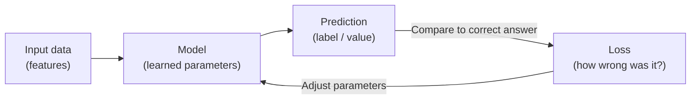
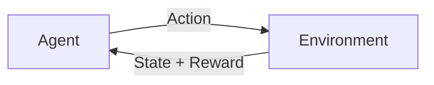
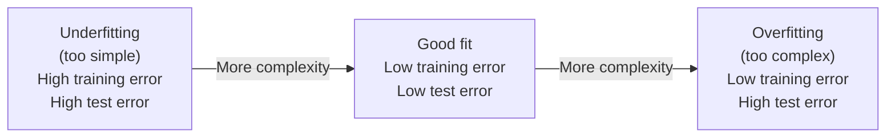
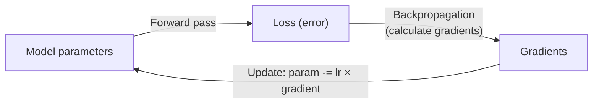
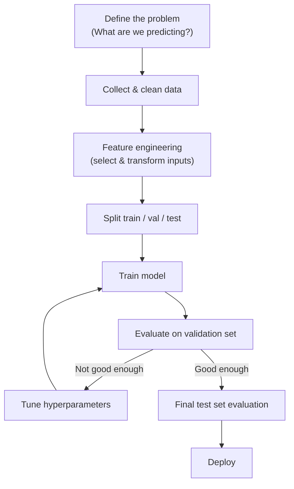

import { Tabs, TabItem } from '@astrojs/starlight/components';
import { Aside, Card, CardGrid, Steps, Badge } from '@astrojs/starlight/components';

Machine learning (ML) is the process of teaching a computer to find patterns in data without programming those patterns explicitly. You provide examples and a feedback signal, and an algorithm adjusts internal parameters until it gets good at making predictions.

## The Core Idea



This loop — predict, measure error, adjust — runs millions of times during training. Eventually the model's parameters stabilise at values that produce good predictions.

---

## Types of Machine Learning

### Supervised Learning

The most common type. You provide labelled examples: input + correct output. The model learns to map inputs to outputs.

```
Training data: (email text → spam / not spam)
                (house features → price)
                (image → "cat" / "dog")
```

**Real examples:**
| Task | Input | Output |
|---|---|---|
| Email spam filter | Email text | Spam / Not spam |
| House price prediction | Bedrooms, size, location | Price in £ |
| Image classification | Pixel values | "Cat", "Dog", "Car" |
| Sentiment analysis | Review text | Positive / Negative |
| Credit scoring | Financial history | Approve / Deny |

### Unsupervised Learning

No labels. The model finds structure in the data on its own — groupings, patterns, compressed representations.

**Real examples:**
| Technique | What it finds | Use case |
|---|---|---|
| Clustering (k-means) | Groups of similar items | Customer segments |
| Dimensionality reduction (PCA) | Compact representation | Visualisation, compression |
| Anomaly detection | Outliers | Fraud detection |
| Topic modelling | Topics in text | Organising documents |

### Reinforcement Learning

An agent takes actions in an environment and receives rewards or penalties. It learns to maximise cumulative reward through trial and error. No labelled dataset needed — the feedback comes from the environment.



**Real examples:**
- AlphaGo / AlphaZero (board games)
- Training robot arms
- Game-playing AI (Atari, OpenAI Five)
- ChatGPT fine-tuning via RLHF (Reinforcement Learning from Human Feedback)

---

## Key Concepts

### Features and Labels

- **Feature:** An input variable the model uses to make a prediction (e.g. email length, number of exclamation marks, sender domain).
- **Label:** The correct answer you want the model to learn to predict (e.g. "spam" or "not spam").

The following example trains a logistic regression classifier to detect spam based on three numeric features.

<Tabs>
<TabItem label="Python">
```python
# Using scikit-learn
from sklearn.linear_model import LogisticRegression

# Features: [email_length, exclamation_count, from_known_sender]
X_train = [
    [120, 0, 1],   # not spam
    [45,  5, 0],   # spam
    [300, 1, 1],   # not spam
    [30,  8, 0],   # spam
]
y_train = [0, 1, 0, 1]  # 0 = not spam, 1 = spam

model = LogisticRegression()
model.fit(X_train, y_train)

print(model.predict([[60, 6, 0]]))  # → [1] (spam)
```
</TabItem>
<TabItem label="JavaScript">
```javascript
// Using ml-logistic-regression (npm install ml-logistic-regression)
import { LogisticRegression } from 'ml-logistic-regression';

// Features: [email_length, exclamation_count, from_known_sender]
const X_train = [
  [120, 0, 1],  // not spam
  [45,  5, 0],  // spam
  [300, 1, 1],  // not spam
  [30,  8, 0],  // spam
];
const y_train = [0, 1, 0, 1];  // 0 = not spam, 1 = spam

const model = new LogisticRegression({ numSteps: 1000, learningRate: 5e-3 });
model.train(X_train, y_train);

console.log(model.predict([[60, 6, 0]]));  // [1] (spam)
```
</TabItem>
<TabItem label="C#">
```csharp
// Using ML.NET (dotnet add package Microsoft.ML)
using Microsoft.ML;
using Microsoft.ML.Data;

var mlContext = new MLContext();

var data = mlContext.Data.LoadFromEnumerable(new[] {
    new EmailData { EmailLength = 120, Exclamations = 0, KnownSender = 1, Label = false },
    new EmailData { EmailLength = 45,  Exclamations = 5, KnownSender = 0, Label = true  },
    new EmailData { EmailLength = 300, Exclamations = 1, KnownSender = 1, Label = false },
    new EmailData { EmailLength = 30,  Exclamations = 8, KnownSender = 0, Label = true  },
});

var pipeline = mlContext.Transforms
    .Concatenate("Features", "EmailLength", "Exclamations", "KnownSender")
    .Append(mlContext.BinaryClassification.Trainers.SdcaLogisticRegression());

var trainedModel = pipeline.Fit(data);
// Use trainedModel.Transform() with new data to predict
```
</TabItem>
<TabItem label="Java">
```java
// Using Smile ML library (com.github.haifengl:smile-core)
import smile.classification.LogisticRegression;

// Features: [email_length, exclamation_count, from_known_sender]
double[][] X = {
    {120, 0, 1},  // not spam
    {45,  5, 0},  // spam
    {300, 1, 1},  // not spam
    {30,  8, 0}   // spam
};
int[] y = {0, 1, 0, 1};  // 0 = not spam, 1 = spam

var model = LogisticRegression.fit(X, y);
System.out.println(model.predict(new double[]{60, 6, 0}));  // 1 (spam)
```
</TabItem>
</Tabs>

### Training, Validation, and Test Sets

Never evaluate a model on the same data it was trained on — it will look great but fail on new data (memorisation, not learning).

| Split | Purpose | Typical % |
|---|---|---|
| Training set | Fit model parameters | 70–80% |
| Validation set | Tune hyperparameters, early stopping | 10–15% |
| Test set | Final, unbiased evaluation | 10–15% |

### Overfitting and Underfitting



- **Underfitting:** The model is too simple to capture the pattern. Solution: more parameters, better features.
- **Overfitting:** The model memorised training data and doesn't generalise. Solution: more data, regularisation, dropout, simpler model.

### Loss Function

A number measuring how wrong the model's predictions are. Training is the process of minimising this number.

| Task type | Common loss function | What it measures |
|---|---|---|
| Binary classification | Binary cross-entropy | Probability error on yes/no |
| Multi-class | Categorical cross-entropy | Probability error across classes |
| Regression | Mean Squared Error (MSE) | Average squared distance from correct value |

### Gradient Descent

The optimiser that actually adjusts model parameters to reduce loss. It calculates which direction to nudge each parameter to reduce the error, then takes a small step in that direction.



**Learning rate** controls the step size. Too high → overshoot. Too low → very slow.

---

## Model Evaluation Metrics

### Classification

| Metric | Formula | When to use |
|---|---|---|
| Accuracy | Correct / Total | Balanced classes |
| Precision | True Positive / (TP + FP) | When false positives are costly |
| Recall | True Positive / (TP + FN) | When false negatives are costly |
| F1 Score | 2 × (Precision × Recall) / (P + R) | Imbalanced classes |

**Example:** A cancer detection model.
- **High recall** is critical (missing a cancer is worse than a false alarm).
- **High precision** matters for spam (you don't want to delete real emails).

### Regression

| Metric | What it means |
|---|---|
| MAE (Mean Absolute Error) | Average absolute difference from correct value |
| MSE (Mean Squared Error) | Average squared difference (penalises large errors more) |
| R² (R-squared) | How much variance the model explains (1.0 = perfect) |

---

## Common ML Algorithms

| Algorithm | Type | Good for |
|---|---|---|
| Linear Regression | Supervised | Predicting continuous values |
| Logistic Regression | Supervised | Binary classification |
| Decision Tree | Supervised | Interpretable classifications |
| Random Forest | Supervised | Tabular data, robust to noise |
| K-Nearest Neighbours | Supervised | Simple classification/regression |
| K-Means | Unsupervised | Clustering |
| Neural Network | Supervised/Unsupervised | Images, text, audio, complex patterns |
| SVM | Supervised | High-dimensional classification |

---

## The ML Workflow



---

## Next Steps

- [Neural Networks](/ai/fundamentals/neural-networks) — how deep learning models are structured
- [Training vs Inference](/ai/concepts/training-vs-inference) — the difference between building a model and using it
- [How LLMs Work](/ai/llm/how-llms-work) — machine learning applied to language at scale
