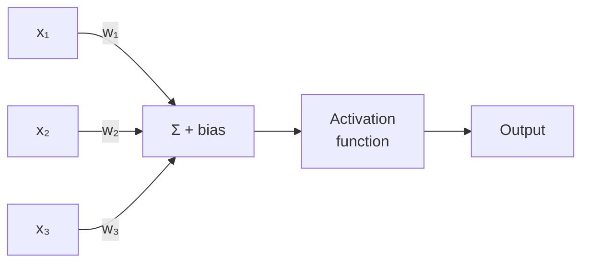
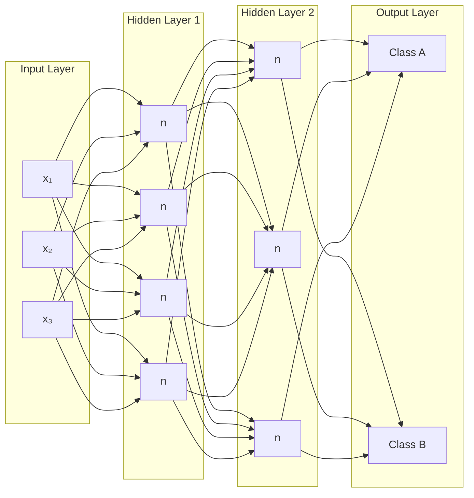
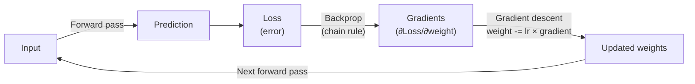
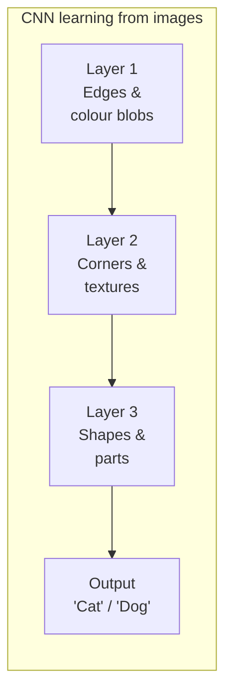

A neural network is a mathematical function made of many small connected units called neurons. It takes in numbers, performs many simple calculations in layers, and produces an output. With enough layers and training data, neural networks can approximate extremely complex patterns — which is why they power everything from face recognition to language models.

## The Biological Analogy (and its Limits)

Neural networks are *loosely* inspired by the brain. A biological neuron receives signals from many others, and if the combined signal is strong enough, it fires and passes the signal forward. Artificial neurons do something similar but much simpler — they multiply inputs by weights, sum them, and apply a threshold function.

The analogy is useful for building intuition but don't take it too far: artificial neural networks are not brains, they don't "think," and they work on completely different principles at the detail level.

---

## The Neuron (Perceptron)

The basic unit. It takes several inputs, multiplies each by a weight, sums the results, adds a bias, and passes the result through an activation function.

```
output = activation(w₁x₁ + w₂x₂ + w₃x₃ + bias)
```



- **Weights (w):** Learned parameters — how much influence each input has.
- **Bias:** A constant offset so the neuron can fire even when all inputs are zero.
- **Activation function:** Introduces non-linearity so the network can model complex patterns.

---

## Layers

Neurons are organised into layers:



| Layer | Role |
|---|---|
| Input layer | Receives the raw features (one neuron per feature) |
| Hidden layers | Learn intermediate representations — the "thinking" |
| Output layer | Produces the final prediction |

**Deep learning** = networks with many hidden layers. "Deep" refers to depth (number of layers), not complexity of thought.

---

## Activation Functions

Without an activation function, stacking many linear layers is equivalent to a single linear transformation — no complexity is gained. Activation functions introduce non-linearity.

| Function | Formula | Output range | When to use |
|---|---|---|---|
| ReLU | max(0, x) | [0, ∞) | Most hidden layers (fast, simple) |
| Sigmoid | 1 / (1 + e⁻ˣ) | (0, 1) | Binary classification output |
| Softmax | eˣᵢ / Σeˣ | (0, 1), sum=1 | Multi-class classification output |
| Tanh | (eˣ - e⁻ˣ) / (eˣ + e⁻ˣ) | (-1, 1) | RNNs, some hidden layers |

**ReLU in plain English:** If the input is negative, output 0. If positive, output the input unchanged. Simple but very effective.

---

## The Forward Pass

Computing an output from an input. Each layer's output becomes the next layer's input.

```python
import numpy as np

def relu(x):
    return np.maximum(0, x)

def sigmoid(x):
    return 1 / (1 + np.exp(-x))

# A tiny neural network: 2 inputs → 3 hidden → 1 output
# (weights would be learned during training)
W1 = np.array([[0.5, -0.2, 0.1],
               [0.3,  0.8, -0.4]])  # shape (2, 3)
b1 = np.array([0.1, 0.2, -0.1])

W2 = np.array([[0.7], [-0.3], [0.5]])  # shape (3, 1)
b2 = np.array([0.0])

def forward(x):
    h = relu(x @ W1 + b1)   # hidden layer
    y = sigmoid(h @ W2 + b2) # output layer
    return y

x = np.array([1.0, 0.5])
print(forward(x))  # e.g. [[0.72]] — probability of class 1
```

---

## The Backward Pass (Backpropagation)

After the forward pass produces a prediction, we measure the error (loss). Backpropagation calculates how much each weight contributed to that error (the gradient) and adjusts it to reduce the loss.



**The key insight:** Backpropagation uses calculus (the chain rule) to trace how each parameter contributed to the error, working backwards from the output to the input.

---

## Common Network Architectures

### Fully Connected (Dense) Network

Every neuron in one layer connects to every neuron in the next. Good for tabular data. What most examples above show.

### Convolutional Neural Network (CNN)

Designed for images. Uses small filters that slide across the image to detect edges, textures, and shapes. Much more efficient than fully connected for spatial data.

```
Input image → Conv layers (detect features) → Pooling (downsample) → Dense → Output
```

**Used for:** image classification, object detection, medical imaging.

### Recurrent Neural Network (RNN) / LSTM

Processes sequences by maintaining a hidden state that carries information forward. Used for time series and text before transformers took over.

**Limitation:** Struggles with long sequences (vanishing gradient problem). Largely replaced by Transformers for language tasks.

### Transformer

The architecture behind all modern LLMs (GPT, Claude, Gemini, BERT). Uses **attention** to weigh relationships between every position in a sequence simultaneously.

See [How LLMs Work](/ai/llm/how-llms-work) for a detailed explanation.

---

## Key Hyperparameters

These are settings you choose before training — unlike weights, they are not learned.

| Hyperparameter | What it controls |
|---|---|
| Number of layers | Model depth / capacity |
| Neurons per layer | Width / capacity |
| Learning rate | How large each weight update step is |
| Batch size | How many examples to process before updating weights |
| Epochs | How many times to loop over the full training set |
| Dropout rate | Fraction of neurons randomly disabled each step (prevents overfitting) |

---

## What Neurons Actually Learn

Deep networks build up hierarchical representations:



Early layers detect low-level features; later layers combine them into concepts. This hierarchical feature learning is one reason deep networks are so powerful.

---

## Next Steps

- [How LLMs Work](/ai/llm/how-llms-work) — transformers, the architecture that powers modern AI
- [Training vs Inference](/ai/concepts/training-vs-inference) — the compute phases: training vs using a model
- [Machine Learning Basics](/ai/fundamentals/machine-learning-basics) — how training data and loss functions work
