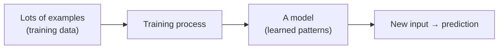
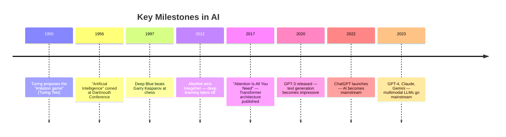
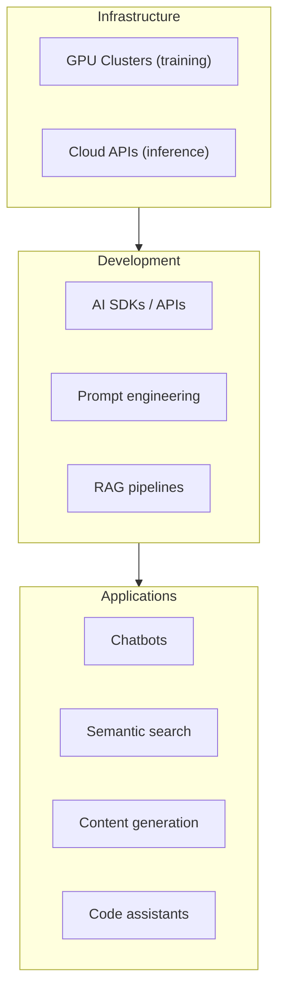

Artificial Intelligence (AI) is software that can perform tasks that would normally require human intelligence — recognising speech, translating languages, generating text, identifying objects in photos, or recommending what to watch next. It doesn't mean the computer is "thinking" the way humans do; it means it has been trained to produce outputs that look intelligent.

## A Simple Mental Model

Think of AI as a very sophisticated pattern-matcher. You show it millions of examples, it figures out the patterns, and then it applies those patterns to new inputs it has never seen before.



## Types of AI

### Narrow AI (Weak AI)

What every AI system in the world today actually is. It is very good at **one specific task** and completely useless at anything else.

| Example | What it does | What it cannot do |
|---|---|---|
| Spam filter | Classify email as spam or not | Write an email, browse the web |
| Face recognition | Identify faces in photos | Understand text, play chess |
| Chess engine (Stockfish) | Play chess better than any human | Identify a face, understand language |
| ChatGPT | Generate and understand text | Control a robot arm, drive a car |

Every AI tool you use today — ChatGPT, Google Translate, Spotify recommendations, autocorrect — is narrow AI.

### General AI (AGI)

A hypothetical AI that could perform **any intellectual task a human can**. It does not exist yet. This is an active research area and there is serious disagreement among researchers about when (or if) it will be achieved.

### Super AI (ASI)

A further hypothetical AI that would surpass human intelligence across every domain. This is the subject of much speculation but is not relevant to anything you can build or use today.

---

## A Short History



---

## Key Terms Explained Simply

### Machine Learning (ML)

Instead of writing rules by hand ("if the email contains 'win a prize' it's spam"), you show the system thousands of labelled examples and let it **learn the rules itself**.

**Traditional programming:**
```
Rules + Data → Output
```

**Machine Learning:**
```
Data + Output (labels) → Rules (a model)
```

### Deep Learning

A type of machine learning that uses **neural networks** with many layers. It works especially well for images, audio, and text. Most modern AI (including LLMs) is built on deep learning.

### Generative AI

AI that creates new content — text, images, audio, video, code — rather than just classifying or predicting. ChatGPT, DALL-E, Midjourney, Stable Diffusion, and GitHub Copilot are all generative AI.

---

## Real-World Examples You Already Use

| Where | What the AI does |
|---|---|
| Google Search | Ranks and understands search queries |
| Gmail | Spam filtering, Smart Compose (text suggestions) |
| Netflix / Spotify | Recommends content based on past behaviour |
| Face ID / fingerprint | Biometric recognition |
| Google Translate | Neural machine translation |
| Autocorrect / autocomplete | Predicts next word on phone keyboard |
| TikTok / Instagram Reels | Ranks what to show you next |
| GitHub Copilot | Suggests code completions |
| ChatGPT / Claude | Conversational text generation |

---

## What AI is NOT

It is worth clearing up some common misconceptions.

| Misconception | Reality |
|---|---|
| "AI understands what it's saying" | LLMs predict likely next tokens — they don't have understanding or beliefs |
| "AI is always right" | AI makes mistakes, sometimes confidently (called hallucinations) |
| "AI will take over" | Today's AI is narrow; it has no goals, desires, or self-awareness |
| "AI learns from every conversation" | Most deployed AI models are static — they don't update their weights in real time |
| "AI is magic" | It is statistics and linear algebra applied at enormous scale |

---

## How AI Fits into IT



---

## Next Steps

- [Machine Learning Basics](/ai/fundamentals/machine-learning-basics) — how models are trained
- [How LLMs Work](/ai/llm/how-llms-work) — the transformer architecture that powers ChatGPT and Claude
- [AI Tools Overview](/ai/tools/ai-tools-overview) — the main tools available today
