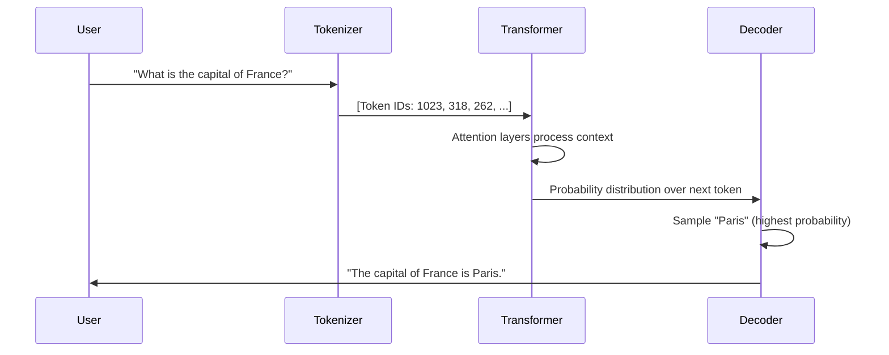

import \{ Tabs, TabItem \} from '@astrojs/starlight/components';
import \{ Aside, Card, CardGrid, Steps, Badge \} from '@astrojs/starlight/components';

This section covers AI from the ground up — what machine learning actually is, how neural networks learn, how large language models (LLMs) like ChatGPT and Claude work under the hood, and how to use them effectively in your own projects.

## What's Covered

| Section | Topics |
|---|---|
| [What is AI?](/ai/fundamentals/what-is-ai) | Narrow AI vs AGI, history, real-world examples |
| [Machine Learning Basics](/ai/fundamentals/machine-learning-basics) | Supervised, unsupervised, reinforcement learning, training data |
| [Neural Networks](/ai/fundamentals/neural-networks) | Neurons, layers, activation functions, backpropagation |
| [How LLMs Work](/ai/llm/how-llms-work) | Transformers, attention, training, what they can and can't do |
| [Tokens & Context](/ai/llm/tokens-and-context) | Tokenisation, context windows, why token limits matter |
| [Prompt Engineering](/ai/llm/prompting) | System prompts, few-shot, chain-of-thought, best practices |
| [Training vs Inference](/ai/concepts/training-vs-inference) | How models are built, fine-tuning, RAG |
| [AI Safety & Ethics](/ai/concepts/ai-safety-ethics) | Hallucinations, bias, responsible AI |
| [AI Tools Overview](/ai/tools/ai-tools-overview) | ChatGPT, Claude, Gemini, Copilot, open-source models |
| [Using AI APIs](/ai/tools/using-apis) | OpenAI & Anthropic API basics, code examples |

## The AI Landscape at a Glance

```mermaid
flowchart TB
    subgraph AI["Artificial Intelligence"]
        subgraph ML["Machine Learning"]
            subgraph DL["Deep Learning"]
                NN["Neural Networks"]
                CNN["CNNs (images)"]
                RNN["RNNs (sequences)"]
                subgraph GEN["Generative AI"]
                    LLM["LLMs (text)"]
                    DIFF["Diffusion Models (images)"]
                end
            end
            SVM["Support Vector Machines"]
            DT["Decision Trees"]
            RF["Random Forests"]
        end
        ES["Expert Systems (rules)"]
        CV["Computer Vision"]
        NLP["Natural Language Processing"]
    end
```

## How an LLM Answers a Question

## Quick Navigation

| I want to… | Go to |
|---|---|
| Understand what AI actually is | [What is AI?](/ai/fundamentals/what-is-ai) |
| Learn how machine learning works | [Machine Learning Basics](/ai/fundamentals/machine-learning-basics) |
| Understand neural networks | [Neural Networks](/ai/fundamentals/neural-networks) |
| Know how ChatGPT works | [How LLMs Work](/ai/llm/how-llms-work) |
| Write better prompts | [Prompt Engineering](/ai/llm/prompting) |
| Understand tokens and limits | [Tokens & Context](/ai/llm/tokens-and-context) |
| Use AI in my own code | [Using AI APIs](/ai/tools/using-apis) |
| Compare AI tools | [AI Tools Overview](/ai/tools/ai-tools-overview) |
| Understand AI risks | [AI Safety & Ethics](/ai/concepts/ai-safety-ethics) |

## Learning Path

| Stage | Topics | Files |
|---|---|---|
| **Foundations** | What AI is, types of ML, basic concepts | What is AI → ML Basics |
| **How They Learn** | Neural networks, training, inference | Neural Networks → Training vs Inference |
| **LLMs** | Transformers, tokens, context, prompting | How LLMs Work → Tokens → Prompting |
| **Practical Use** | Tools, APIs, code examples | AI Tools → Using APIs |
| **Responsible Use** | Safety, ethics, hallucinations, bias | AI Safety & Ethics |

## Related Sections

- [Security / Web](/security/web/owasp-top-10) — prompt injection and AI-specific attack surfaces
- [Cloud / Fundamentals](/cloud/fundamentals/cloud-concepts) — cloud platforms power most AI/ML workloads (GPU VMs, managed ML services)
- [Auth / Tokens](/auth/tokens/api-keys) — AI APIs use API keys and bearer tokens for access
