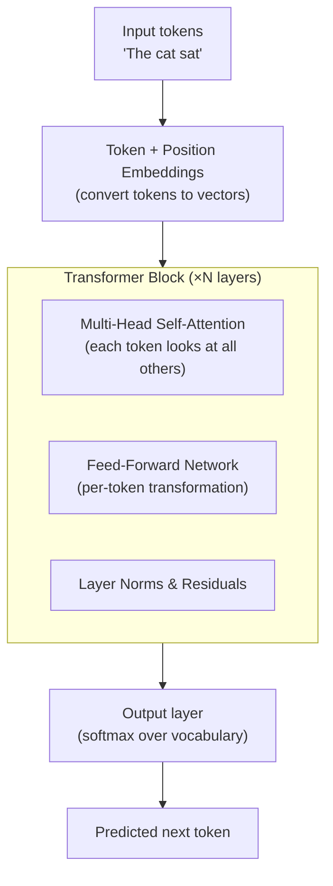
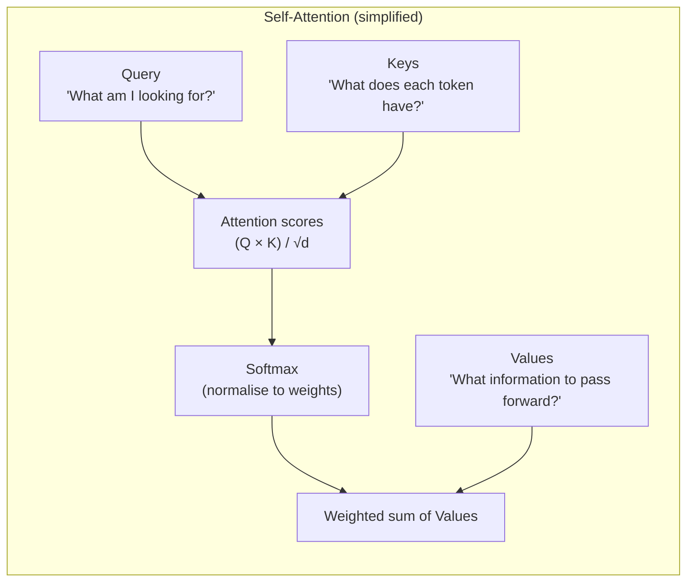
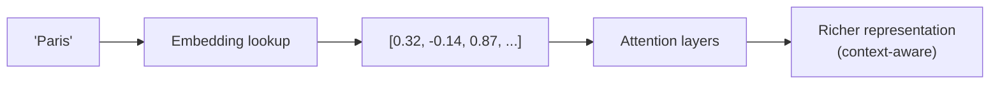
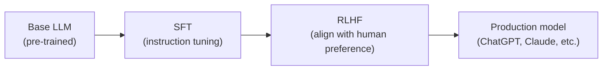

---
title: "How LLMs Work"
description: "How large language models work — the transformer architecture, self-attention, training on text, and what these models can and cannot do."
---

import { Tabs, TabItem } from '@astrojs/starlight/components';
import { Aside, Card, CardGrid, Steps, Badge } from '@astrojs/starlight/components';


A Large Language Model (LLM) is a neural network trained to predict the next word (more precisely, the next token) in a sequence of text. Trained on enormous amounts of text, these models develop surprisingly rich internal representations of language, facts, reasoning patterns, and even code.

ChatGPT, Claude, Gemini, LLaMA, and Mistral are all LLMs. They differ in size, training data, fine-tuning, and guardrails — but they all share the same core architecture: the **Transformer**.

---

## The Core Task: Next-Token Prediction

During training, the model is given a sequence of text and asked to predict what comes next, over and over, billions of times.

```
Input:  "The capital of France is"
Predict: "Paris"

Input:  "def calculate_area(radius):\n    return"
Predict: "math.pi"

Input:  "To boil water you need to"
Predict: "heat"
```

That's it. Through predicting the next token on internet-scale text, the model indirectly learns grammar, facts, reasoning, coding style, and much more — because all of those are patterns present in the training data.

---

## The Transformer Architecture

Introduced in the 2017 paper *"Attention Is All You Need"*, the Transformer is the architecture behind all modern LLMs.



The model stacks many identical Transformer blocks. GPT-3 has 96 layers; GPT-4 and Claude are rumoured to have more.

---

## Self-Attention: The Key Innovation

The critical idea in Transformers is **self-attention**: when processing a token, the model can look at every other token in the context and decide how much to "attend" to each one.

**Example:** In the sentence *"The animal didn't cross the street because it was too tired"* — what does "it" refer to? A human knows it's "the animal," not "the street." Self-attention lets the model figure this out by computing relationships between all words.



For each token:
1. Compute a **Query** (what this token is looking for)
2. Compare against **Keys** of all other tokens (what they offer)
3. Scale and softmax to get attention weights
4. Take a weighted sum of **Values** to produce the output

Multi-head attention runs this process in parallel with different learned projections, allowing the model to attend to multiple relationship types simultaneously.

---

## Embeddings: Turning Words into Vectors

Computers work with numbers, not words. Embeddings are dense vector representations of tokens in a high-dimensional space (e.g. 768 or 4096 dimensions).

- Similar concepts end up close together in this space.
- "king" - "man" + "woman" ≈ "queen" (the famous word2vec example).



Positional embeddings are added to encode the position of each token in the sequence, since unlike RNNs, Transformers process all tokens in parallel.

---

## Training an LLM

Training an LLM is a three-stage process:

### Stage 1: Pre-training

Train on massive, diverse text (the internet, books, code, Wikipedia) with the next-token prediction objective. This is extremely compute-intensive — GPT-3 required ~3.14×10²³ floating-point operations.

- **Result:** A base model that knows language, facts, and patterns but doesn't follow instructions well.

### Stage 2: Supervised Fine-Tuning (SFT)

Show the model human-written examples of good responses to instructions. The model learns to follow a prompt format.

```
[User]: Summarise this article in 3 bullet points.
[Assistant]: • Point one...
```

### Stage 3: Reinforcement Learning from Human Feedback (RLHF)

Human raters rank different model responses. A reward model is trained on those rankings, and the LLM is fine-tuned with RL to maximise reward. This aligns the model with human preferences — making it more helpful, accurate, and safe.



---

## How the Model Generates Text

The model outputs a probability distribution over its entire vocabulary (~50,000 tokens) for the next position. It samples from this distribution, appends the chosen token, and repeats.

```
Input:  "The sky is"
Vocab probs: {"blue": 0.42, "red": 0.08, "clear": 0.21, "dark": 0.15, ...}
Sample:       "blue"
New input: "The sky is blue"
Vocab probs: {"and": 0.18, ".": 0.31, "today": 0.14, ...}
```

**Temperature** controls how random the sampling is:
- `temperature=0` → always pick the highest probability token (deterministic but repetitive)
- `temperature=1` → sample proportionally (balanced)
- `temperature=2` → very random / creative

---

## What LLMs Can and Cannot Do

| Can do (well) | Limitations |
|---|---|
| Generate fluent, coherent text | Can "hallucinate" — generate plausible-sounding falsehoods |
| Summarise, translate, paraphrase | No persistent memory by default (limited to context window) |
| Answer questions from training data | Training data has a knowledge cutoff date |
| Write and explain code | Cannot execute code (unless given tools) |
| Follow complex instructions | May misunderstand ambiguous requests |
| Reason step-by-step (with prompting) | Mathematical and logical errors are common |
| Adopt personas and tones | Cannot verify real-world facts in real time (without search tools) |

---

## Model Size and the Scaling Laws

LLM capability scales predictably with:
- Number of parameters (model size)
- Amount of training data
- Compute used for training

Larger models are generally more capable but cost more to run. Modern models range from 7B parameters (LLaMA 3.1 7B, runs on a laptop) to hundreds of billions (GPT-4, Claude 3 Opus — cloud only).

| Size class | Approx parameters | Where it runs |
|---|---|---|
| Small | 1B–7B | Laptop / consumer GPU |
| Medium | 13B–70B | High-end workstation / cloud |
| Large | 70B+ | Multi-GPU server / cloud |
| Frontier | Unknown (100B–1T+) | Large cloud clusters only |

---

## Next Steps

- [Tokens & Context](/ai/llm/tokens-and-context) — what tokens are and why context windows matter
- [Prompt Engineering](/ai/llm/prompting) — how to write effective prompts
- [Training vs Inference](/ai/concepts/training-vs-inference) — fine-tuning and RAG
