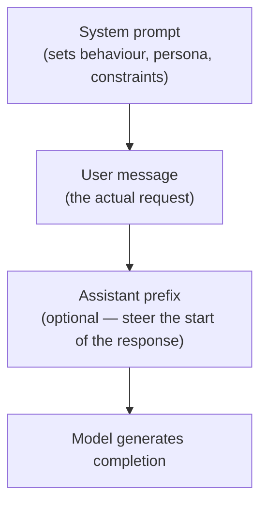
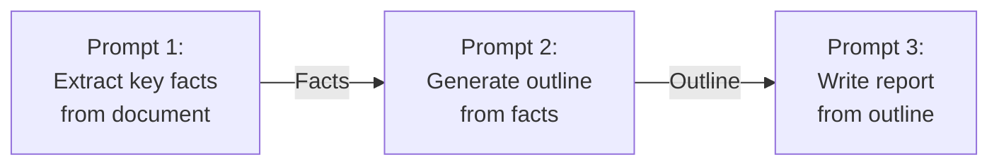

import \{ Tabs, TabItem \} from '@astrojs/starlight/components';
import \{ Aside, Card, CardGrid, Steps, Badge \} from '@astrojs/starlight/components';


Prompt engineering is the practice of crafting inputs to an LLM to get the outputs you want. It is the most accessible way to improve model performance — no training required. A well-structured prompt can mean the difference between a useless response and an excellent one.

---

## How LLMs Read a Prompt

Most LLM APIs split the input into roles:



| Role | Purpose |
|---|---|
| `system` | Persistent instructions — persona, tone, format, constraints |
| `user` | The human's message or task |
| `assistant` | The model's response (used in multi-turn conversations) |

---

## The Anatomy of a Good Prompt

A well-structured prompt answers four questions:

1. **Who are you?** (persona / role)
2. **What should you do?** (task)
3. **What format should the output be in?** (format)
4. **What constraints apply?** (rules / limits)

```
You are a senior software engineer specialising in Python.          ← persona
Your task is to review the following code and identify bugs.        ← task
Return your findings as a numbered list.                            ← format
Do not suggest style improvements — only functional bugs.           ← constraint

[CODE HERE]
```

---

## Core Techniques

### Be Specific

Vague prompts produce vague responses.

| Vague | Specific |
|---|---|
| "Write an email" | "Write a short, professional email to a client apologising for a delayed delivery, offering a 10% discount, and giving a new expected delivery date of 15 June." |
| "Summarise this" | "Summarise the following article in exactly 3 bullet points, each under 20 words." |
| "Fix my code" | "The following Python function raises an IndexError when the list is empty. Identify the bug and return the corrected function only." |

### Assign a Role

Giving the model a persona improves the quality of domain-specific responses.

```
You are an expert network engineer with 15 years of experience.
Explain the difference between TCP and UDP to a junior developer.
```

```
You are a friendly Python tutor teaching a complete beginner.
Do not use jargon. Use simple analogies and short code examples.
```

### Specify the Output Format

Tell the model exactly what structure you want.

```
Return your answer as a JSON object with these fields:
{
  "summary": "...",
  "key_points": ["...", "..."],
  "confidence": "high" | "medium" | "low"
}
```

```
Format your response as a markdown table with columns: Name, Description, Example.
```

---

## Few-Shot Prompting

Provide examples of the input/output pattern you want. The model will follow the pattern.

```
Classify the sentiment of these movie reviews.

Review: "An absolute masterpiece. I was moved to tears."
Sentiment: Positive

Review: "Boring and predictable. I fell asleep twice."
Sentiment: Negative

Review: "It had some great moments but dragged in the middle."
Sentiment: Mixed

Review: "The best film I have seen this decade."
Sentiment:
```

The model will output `Positive` — matching the pattern of your examples.

**Zero-shot** = no examples, just the task description.  
**One-shot** = one example.  
**Few-shot** = 2–5 examples.

---

## Chain-of-Thought Prompting

Ask the model to explain its reasoning step by step before giving the final answer. This significantly improves accuracy on logic, maths, and multi-step problems.

```
Q: A train travels 120km in 2 hours. It then travels another 90km in 1.5 hours.
   What is the average speed for the whole journey?

Think step by step before answering.
```

**Without chain-of-thought:** The model might guess 105 km/h (wrong — that's the average of the two speeds, not the overall average).

**With chain-of-thought:**
```
Step 1: Total distance = 120 + 90 = 210 km
Step 2: Total time = 2 + 1.5 = 3.5 hours
Step 3: Average speed = 210 / 3.5 = 60 km/h

Answer: 60 km/h
```

The phrase `"Think step by step"` or `"Let's think through this carefully"` reliably triggers this behaviour.

---

## System Prompt Patterns

### Persona + Constraints

```
You are a helpful IT support assistant for a company called Acme Corp.
You only answer questions about Acme Corp's internal software tools.
If a user asks about anything else, politely redirect them.
Be concise — keep responses under 150 words.
```

### Structured Output Enforcer

```
You extract information from text and return it as JSON.
Always return valid JSON. Never include explanations outside the JSON.
If a field cannot be found, set its value to null.
```

### Code Reviewer

```
You are a code reviewer. When given code:
1. Check for bugs and logical errors first.
2. Check for security vulnerabilities second.
3. Note performance issues third.
4. Use the format: [BUG], [SECURITY], [PERF] as prefixes.
Do not suggest stylistic changes unless asked.
```

---

## Common Mistakes

| Mistake | Problem | Fix |
|---|---|---|
| Too vague | Model guesses what you want | Add specifics: format, length, constraints |
| Too long | Model loses track of instructions | Put the most critical instruction last |
| Conflicting instructions | Unpredictable output | Review for contradictions |
| No format specified | Inconsistent structure | Specify output format explicitly |
| Asking everything at once | Shallow answers | Break into multiple focused prompts |
| Trusting the output blindly | Hallucinations pass unnoticed | Always verify factual claims |

---

## Advanced Techniques

### Self-Consistency

Ask the model to solve the same problem multiple times, then take the majority answer. Useful for maths and logic.

### ReAct (Reason + Act)

Prompt the model to alternate between reasoning steps and tool actions:

```
Thought: I need to find the population of Tokyo.
Action: search("Tokyo population 2024")
Observation: 13.96 million (city), 37.4 million (metro)
Thought: The question asked for the city proper.
Answer: 13.96 million
```

Used in AI agent frameworks where the model can call external tools.

### Prompt Chaining

Break a complex task into a pipeline of simpler prompts. The output of each prompt becomes input to the next.



---

## Prompt Engineering Checklist

| Check | Description |
|---|---|
| Clear task | Is the goal unambiguous? |
| Persona | Does a role help for this task? |
| Format | Have you specified the output structure? |
| Length | Have you set length expectations? |
| Examples | Would 1–3 examples help? |
| Constraints | What should the model NOT do? |
| Verify | Will you check factual claims in the output? |

---

## Next Steps

- [Tokens & Context](/ai/llm/tokens-and-context) — fitting prompts within token limits
- [Using AI APIs](/ai/tools/using-apis) — calling LLMs programmatically
- [Training vs Inference](/ai/concepts/training-vs-inference) — when prompting isn't enough (fine-tuning, RAG)
