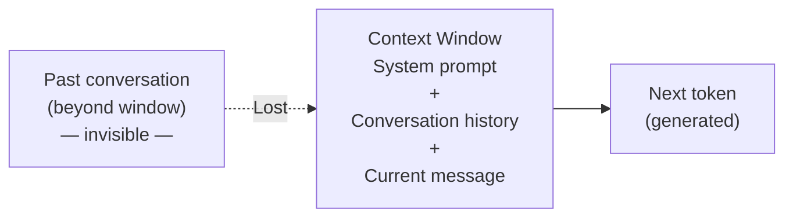
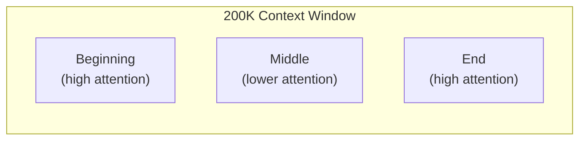

When you send a message to an LLM, it doesn't process individual characters or words. It works with **tokens** — chunks of text that are somewhere between a character and a word in size. Understanding tokens is essential for using LLMs effectively, because everything — pricing, limits, and model behaviour — revolves around token counts.

---

## What is a Token?

A token is a unit of text from the model's vocabulary. Common English words are usually one token. Rarer words, long words, or words in other languages may be split into multiple tokens.

| Text | Tokens | Count |
|---|---|---|
| `Hello` | `Hello` | 1 |
| `tokenisation` | `token` `isation` | 2 |
| `ChatGPT` | `Chat` `G` `PT` | 3 |
| `The quick brown fox` | `The` ` quick` ` brown` ` fox` | 4 |
| `supercalifragilistic` | `super` `cal` `if` `rag` `il` `istic` | 6 |

**Rule of thumb for English:** ~1 token per 4 characters, or ~0.75 tokens per word.

- 100 tokens ≈ 75 words
- 1,000 tokens ≈ 750 words ≈ 1–2 pages of text
- 100,000 tokens ≈ 75,000 words ≈ a full novel

---

## Why Tokens and Not Words?

Using a fixed vocabulary of tokens solves several problems:

- **Unknown words:** Subword tokenisation means the model can handle any text by decomposing it into known pieces.
- **Consistency:** The same word in different contexts tokenises the same way.
- **Efficiency:** A vocabulary of ~50,000 tokens can represent any text, while working with individual characters would make sequences too long.

The most common tokenisation algorithm is **Byte Pair Encoding (BPE)**, which builds a vocabulary by repeatedly merging the most common pairs of characters or subwords from a large text corpus.

---

## The Context Window

The context window is the maximum amount of text (in tokens) that an LLM can "see" at once. Everything outside the context window is invisible to the model.



The context window contains:
1. The **system prompt** (instructions to the model)
2. The full **conversation history** (all prior messages)
3. The **current user message**
4. The **model's response so far** (during generation)

When the conversation exceeds the context window, the oldest messages are dropped or summarised.

---

## Context Window Sizes (2024–2025)

| Model | Context Window |
|---|---|
| GPT-3.5 Turbo | 16K tokens |
| GPT-4o | 128K tokens |
| Claude 3.5 Sonnet | 200K tokens |
| Claude 3 Opus | 200K tokens |
| Gemini 1.5 Pro | 1M tokens |
| Gemini 1.5 Flash | 1M tokens |
| LLaMA 3.1 70B | 128K tokens |
| Mistral 7B | 32K tokens |

200K tokens ≈ ~150,000 words — enough to fit the entire Lord of the Rings trilogy in a single prompt.

---

## Why Context Window Size Matters

### What you can put in a long context

- An entire codebase for code review or generation
- A full research paper or legal document
- A long conversation without losing earlier context
- Multiple documents for cross-referencing

### The "Lost in the Middle" Problem

LLMs tend to pay more attention to the **beginning and end** of the context and may "forget" information in the middle of very long contexts. This is a known limitation even with large context windows.



**Practical tip:** Put the most important instructions at the top (system prompt) and the most relevant content near the end of the context, closest to the generation point.

### Longer Context = Slower & More Expensive

Processing long contexts requires more computation. APIs typically charge per token — both input tokens (what you send) and output tokens (what the model generates).

---

## Tokens and Pricing

Most AI APIs charge by the token. As of 2025, approximate prices:

| Model | Input (per 1M tokens) | Output (per 1M tokens) |
|---|---|---|
| GPT-4o | ~$5 | ~$15 |
| GPT-4o mini | ~$0.15 | ~$0.60 |
| Claude 3.5 Sonnet | ~$3 | ~$15 |
| Claude 3 Haiku | ~$0.25 | ~$1.25 |
| Gemini 1.5 Flash | ~$0.075 | ~$0.30 |

**Cost example:** Summarising a 50-page document (≈ 25,000 input tokens) with GPT-4o costs roughly $0.125, plus the cost of the output.

---

## Counting Tokens in Code

```python
# Using tiktoken (OpenAI's tokeniser library)
import tiktoken

enc = tiktoken.encoding_for_model("gpt-4o")

text = "Hello, how many tokens is this sentence?"
tokens = enc.encode(text)

print(f"Token IDs: {tokens}")
print(f"Token count: {len(tokens)}")
# Token count: 9
```

```python
# Using Anthropic's token counting API
import anthropic

client = anthropic.Anthropic()

response = client.messages.count_tokens(
    model="claude-3-5-sonnet-20241022",
    messages=[{"role": "user", "content": "Hello, how many tokens is this?"}]
)
print(response.input_tokens)  # e.g. 12
```

---

## Practical Implications

| Situation | What to do |
|---|---|
| Hitting context limit in a chat | Summarise earlier conversation and start fresh |
| Need to process a very long document | Chunk it and process sections separately (or use RAG) |
| Want to reduce API costs | Use a smaller model; trim unnecessary context |
| Model ignores early instructions | Repeat key instructions near the end of your prompt |
| Working with code | Count tokens before sending; large files can be expensive |

---

## Token Visualiser Example

Here is how the sentence "Machine learning is amazing!" might be tokenised:

```
M  ach  ine   learn  ing   is   am  az  ing  !
↓   ↓    ↓      ↓     ↓    ↓    ↓   ↓   ↓   ↓
[token IDs: 44, 710, 290, 4673, 278, 374, 267, 5655, 278, 0]
```

Spaces are often included at the start of the following token (`" learn"` rather than `"learn"`). This is a tokeniser implementation detail but good to know when debugging unexpected splits.

---

## Next Steps

- [Prompt Engineering](/ai/llm/prompting) — how to write prompts that fit within context limits and get better results
- [How LLMs Work](/ai/llm/how-llms-work) — the architecture that uses tokens
- [Using AI APIs](/ai/tools/using-apis) — practical code examples for calling LLM APIs
