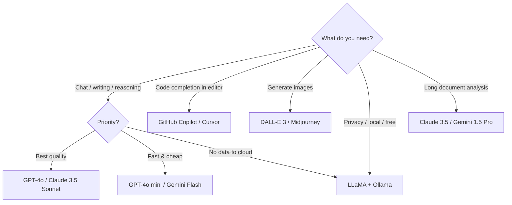

---
title: "AI Tools Overview"
description: "A practical guide to the main AI tools available in 2025 — ChatGPT, Claude, Gemini, Copilot, open-source models, and image/code generation tools."
---

import { Tabs, TabItem } from '@astrojs/starlight/components';
import { Aside, Card, CardGrid, Steps, Badge } from '@astrojs/starlight/components';


The AI landscape in 2025 is rich and fast-moving. This page maps the major tools, what they are good at, how they compare, and when to reach for each one.

---

## The Main LLM Assistants

These are conversational AI systems powered by large language models. You interact via a chat interface or API.

### ChatGPT (OpenAI)

The tool that brought LLMs to mainstream attention (launched November 2022). The most widely used AI assistant.

| | |
|---|---|
| **Models** | GPT-4o, GPT-4o mini, o1 (reasoning) |
| **Strengths** | Broad capability, excellent coding, huge ecosystem, plugins/tools |
| **Weaknesses** | Hallucinations on recent events, occasional refusals |
| **Free tier** | GPT-4o with limits |
| **Paid** | ChatGPT Plus ($20/month) unlocks GPT-4o, image generation, file upload |
| **API** | OpenAI API (pay per token) |

**Best for:** General-purpose tasks, coding, summarisation, creative writing.

---

### Claude (Anthropic)

Designed with a focus on being helpful, harmless, and honest. Particularly strong at long-context tasks and nuanced writing.

| | |
|---|---|
| **Models** | Claude 3.5 Sonnet (best balance), Claude 3 Opus (most capable), Claude 3 Haiku (fastest/cheapest) |
| **Strengths** | 200K context window, excellent at following complex instructions, more nuanced safety |
| **Weaknesses** | Sometimes overly cautious |
| **Free tier** | claude.ai with daily limits |
| **Paid** | Claude Pro ($20/month) for priority and extended use |
| **API** | Anthropic API (pay per token) |

**Best for:** Long documents, research, code review, nuanced writing, tasks requiring careful instructions.

---

### Gemini (Google)

Google's LLM family, tightly integrated with Google's products and infrastructure.

| | |
|---|---|
| **Models** | Gemini 1.5 Pro (1M context), Gemini 1.5 Flash (fast/cheap), Gemini 2.0 Flash |
| **Strengths** | Huge context window (1M tokens), Google Search integration, multimodal |
| **Weaknesses** | Inconsistent quality compared to GPT-4o / Claude |
| **Free tier** | Google AI Studio (generous free tier for API) |
| **Paid** | Google One AI Premium ($20/month), Vertex AI for enterprise |
| **API** | Google AI / Vertex AI |

**Best for:** Very long documents, Google Workspace integration, multimodal tasks.

---

### Meta LLaMA (Open Source)

Meta's open-weight models that you can download, run, and modify yourself.

| | |
|---|---|
| **Models** | LLaMA 3.1 8B, 70B, 405B |
| **Strengths** | Free to run locally, no data sent to third parties, fully customisable |
| **Weaknesses** | Requires your own hardware or cloud setup |
| **Where to run** | Ollama (local), Groq (fast cloud), Together AI, Replicate |

```bash
# Run LLaMA locally with Ollama
ollama pull llama3.1
ollama run llama3.1

# Then just type your message
>>> Explain neural networks in simple terms.
```

**Best for:** Privacy-sensitive use cases, offline use, customisation/fine-tuning.

---

### Mistral (Open & Commercial)

European AI company with strong open-weight models known for efficiency.

| Model | Size | Context | Strengths |
|---|---|---|---|
| Mistral 7B | 7B | 32K | Fast, efficient, good for edge |
| Mixtral 8×7B | ~47B (MoE) | 32K | High quality for size |
| Mistral Large | Unknown | 128K | Flagship commercial model |

**MoE (Mixture of Experts):** Only a subset of the model's parameters activate for each token, making it more efficient than a dense model of the same size.

---

## Comparison at a Glance

| | ChatGPT (4o) | Claude (3.5 Sonnet) | Gemini (1.5 Pro) | LLaMA 3.1 70B |
|---|---|---|---|---|
| Context window | 128K | 200K | 1M | 128K |
| Coding | Excellent | Excellent | Good | Good |
| Reasoning | Excellent | Excellent | Good | Good |
| Long documents | Good | Excellent | Excellent | Good |
| Privacy | Cloud | Cloud | Cloud | Local option |
| Cost | Paid | Paid | Free tier generous | Free (self-hosted) |
| Open source | No | No | No | Yes |

---

## Code-Specific AI Tools

### GitHub Copilot

AI code completion integrated directly into your editor (VS Code, JetBrains, Neovim).

- Suggests whole lines or blocks of code as you type.
- Understands your codebase context — not just the current file.
- Copilot Chat: natural language Q&A about your code.
- Powered by OpenAI Codex / GPT-4o.
- **Cost:** $10/month individual, free for students/open-source.

### Cursor

An AI-native code editor (fork of VS Code) with deeper model integration.

- Edit mode: describe a change and it diffs your whole file.
- Composer: multi-file edits from a single prompt.
- Built-in chat with codebase indexing.

### Aider

Command-line AI coding assistant. Open source, works with any LLM.

```bash
pip install aider-chat
aider --model claude-3-5-sonnet-20241022

# then type your request in natural language
> Add input validation to the register function
```

---

## Image Generation Tools

| Tool | Model | Strengths |
|---|---|---|
| DALL-E 3 | Proprietary (OpenAI) | Good prompt adherence, safe |
| Midjourney | Proprietary | High artistic quality |
| Stable Diffusion | Open source | Free, local, fully customisable |
| Adobe Firefly | Proprietary | Safe for commercial use (trained on licensed data) |
| Ideogram | Proprietary | Excellent text rendering in images |

---

## Specialised AI Tools

| Tool | Purpose |
|---|---|
| Whisper (OpenAI) | Speech-to-text transcription (open source) |
| ElevenLabs | Text-to-speech, voice cloning |
| Suno / Udio | AI music generation |
| Runway / Sora | AI video generation |
| Perplexity | AI search (answers with citations) |
| NotebookLM (Google) | Document Q&A and analysis |
| Cursor / Copilot | AI coding assistants |

---

## Choosing the Right Tool



---

## Next Steps

- [Using AI APIs](/ai/tools/using-apis) — write code that calls these models
- [Prompt Engineering](/ai/llm/prompting) — get better outputs from any of these tools
- [AI Safety & Ethics](/ai/concepts/ai-safety-ethics) — what to watch out for when using AI tools
