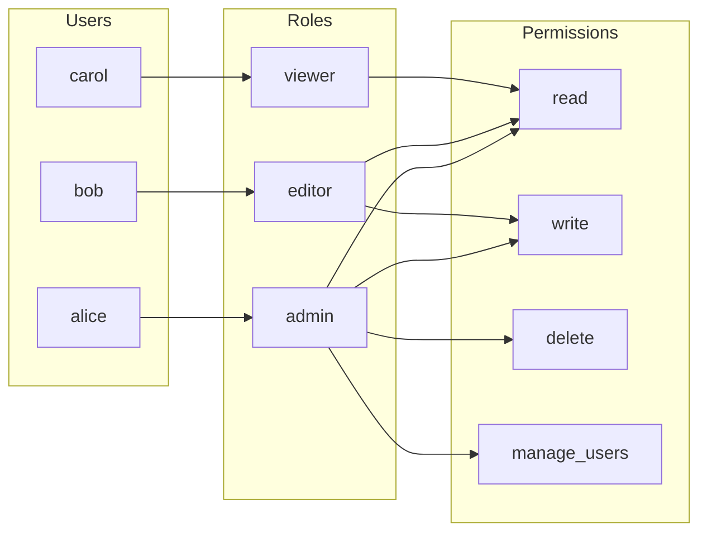

import { Tabs, TabItem } from '@astrojs/starlight/components';
import { Aside } from '@astrojs/starlight/components';

## Role-Based Access Control (RBAC)

Users are assigned roles; roles have permissions. Simple, auditable, widely understood.



<Tabs>
<TabItem label="Python">
```python
from enum import Enum
from fastapi import Depends, HTTPException

class Role(str, Enum):
    admin = "admin"
    editor = "editor"
    viewer = "viewer"

PERMISSIONS = {
    Role.admin:  {"read", "write", "delete", "manage_users"},
    Role.editor: {"read", "write"},
    Role.viewer: {"read"},
}

def require_permission(permission: str):
    def checker(user = Depends(get_current_user)):
        if permission not in PERMISSIONS.get(user.role, set()):
            raise HTTPException(status_code=403, detail="Forbidden")
        return user
    return checker

@app.delete("/users/{user_id}")
async def delete_user(user_id: str, _=Depends(require_permission("manage_users"))):
    ...
```
</TabItem>
<TabItem label="JavaScript">
```javascript
// Define roles and their permissions
const PERMISSIONS = {
  admin:  ['read', 'write', 'delete', 'manage_users', 'billing'],
  editor: ['read', 'write'],
  viewer: ['read'],
};

// Middleware factory — requires a specific permission
const requirePermission = (permission) => (req, res, next) => {
  const role = req.user?.role;  // from JWT claim or session
  const allowed = PERMISSIONS[role] ?? [];

  if (!allowed.includes(permission)) {
    return res.status(403).json({ error: 'Forbidden' });
  }
  next();
};

// Usage
app.get('/reports', requirePermission('read'), getReports);
app.post('/reports', requirePermission('write'), createReport);
app.delete('/users/:id', requirePermission('manage_users'), deleteUser);
```
</TabItem>
<TabItem label="C#">
```csharp
public static class Permissions
{
    public static readonly Dictionary<string, List<string>> RolePermissions = new()
    {
        ["admin"]  = new() { "read", "write", "delete", "manage_users", "billing" },
        ["editor"] = new() { "read", "write" },
        ["viewer"] = new() { "read" },
    };
}

bool HasPermission(User user, string resource, string action)
    => Permissions.RolePermissions.TryGetValue(user.Role, out var perms)
       && perms.Contains(action);

// Usage via policy
[Authorize(Policy = "RequireWrite")]
[HttpPost("/reports")]
public IActionResult CreateReport() => Ok();
```
</TabItem>
<TabItem label="Java">
```java
public enum Role { ADMIN, EDITOR, VIEWER }

private static final Map<Role, List<String>> PERMISSIONS = Map.of(
    Role.ADMIN,  List.of("read", "write", "delete", "manage_users"),
    Role.EDITOR, List.of("read", "write"),
    Role.VIEWER, List.of("read")
);

boolean hasPermission(User user, String resource, String action) {
    return PERMISSIONS.getOrDefault(user.getRole(), List.of()).contains(action);
}

@PreAuthorize("hasRole('ADMIN')")
@DeleteMapping("/users/{userId}")
public ResponseEntity<Void> deleteUser(@PathVariable String userId) {
    return ResponseEntity.noContent().build();
}
```
</TabItem>
</Tabs>

## Attribute-Based Access Control (ABAC)

More flexible than RBAC — access decisions are based on attributes of the subject (user), resource, action, and environment. Enables fine-grained, context-aware policies.

```
Policy: Allow access if:
  subject.department == resource.owner_department
  AND subject.clearance_level >= resource.classification
  AND environment.time is within business_hours
  AND action == "read"
```

<Tabs>
<TabItem label="Python">
```python
from datetime import datetime

def is_authorized(subject, resource, action, environment):
    # Department-based access
    if subject.department != resource.owner_department:
        return False
    # Clearance level check
    if subject.clearance_level < resource.classification_level:
        return False
    # Time-based restriction
    hour = datetime.fromisoformat(environment.timestamp).hour
    if hour < 8 or hour > 18:
        return False
    # Action whitelist for this resource type
    allowed_actions = resource_actions.get(resource.type, [])
    if action not in allowed_actions:
        return False
    return True
```
</TabItem>
<TabItem label="JavaScript">
```javascript
function isAuthorized(subject, resource, action, environment) {
  // Department-based access
  if (subject.department !== resource.ownerDepartment) return false;

  // Clearance level check
  if (subject.clearanceLevel < resource.classificationLevel) return false;

  // Time-based restriction
  const hour = new Date(environment.timestamp).getHours();
  if (hour < 8 || hour > 18) return false;

  // Action whitelist for this resource type
  const allowedActions = resourceActions[resource.type] ?? [];
  if (!allowedActions.includes(action)) return false;

  return true;
}
```
</TabItem>
<TabItem label="C#">
```csharp
bool IsAuthorized(Subject subject, Resource resource, string action, Environment env)
{
    if (subject.Department != resource.OwnerDepartment) return false;
    if (subject.ClearanceLevel < resource.ClassificationLevel) return false;
    var hour = env.Timestamp.Hour;
    if (hour < 8 || hour > 18) return false;
    var allowedActions = resourceActions.GetValueOrDefault(resource.Type, new List<string>());
    return allowedActions.Contains(action);
}
```
</TabItem>
<TabItem label="Java">
```java
boolean isAuthorized(Subject subject, Resource resource, String action, Environment env) {
    if (!subject.getDepartment().equals(resource.getOwnerDepartment())) return false;
    if (subject.getClearanceLevel() < resource.getClassificationLevel()) return false;
    int hour = env.getTimestamp().getHour();
    if (hour < 8 || hour > 18) return false;
    List<String> allowedActions = resourceActions.getOrDefault(resource.getType(), List.of());
    return allowedActions.contains(action);
}
```
</TabItem>
</Tabs>

## RBAC vs ABAC

| | RBAC | ABAC |
|---|---|---|
| **Complexity** | Simple | Complex |
| **Flexibility** | Lower (role boundaries) | Very high (any attribute combination) |
| **Auditability** | Easy (roles are clear) | Harder (many policy conditions) |
| **Best for** | Most apps; clear role boundaries | Complex orgs; context-sensitive access |
| **Example tools** | Casbin, built-in middleware | OPA (Open Policy Agent), AWS IAM |
