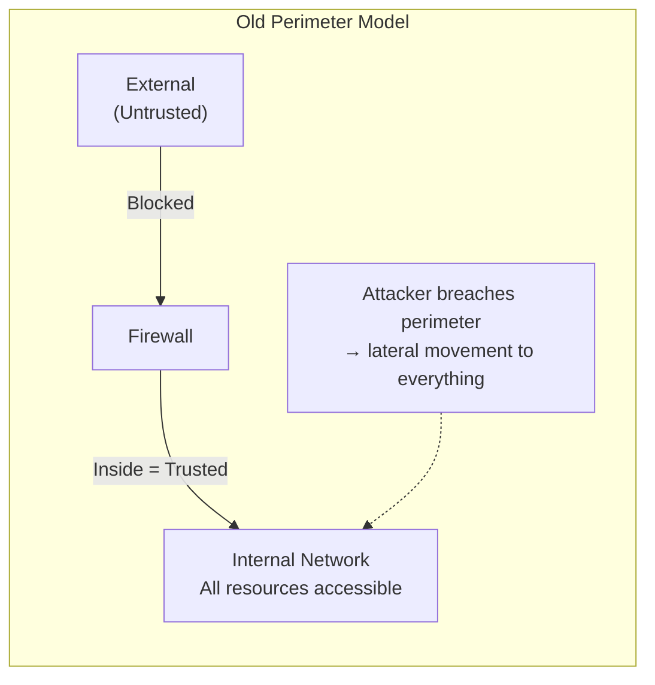
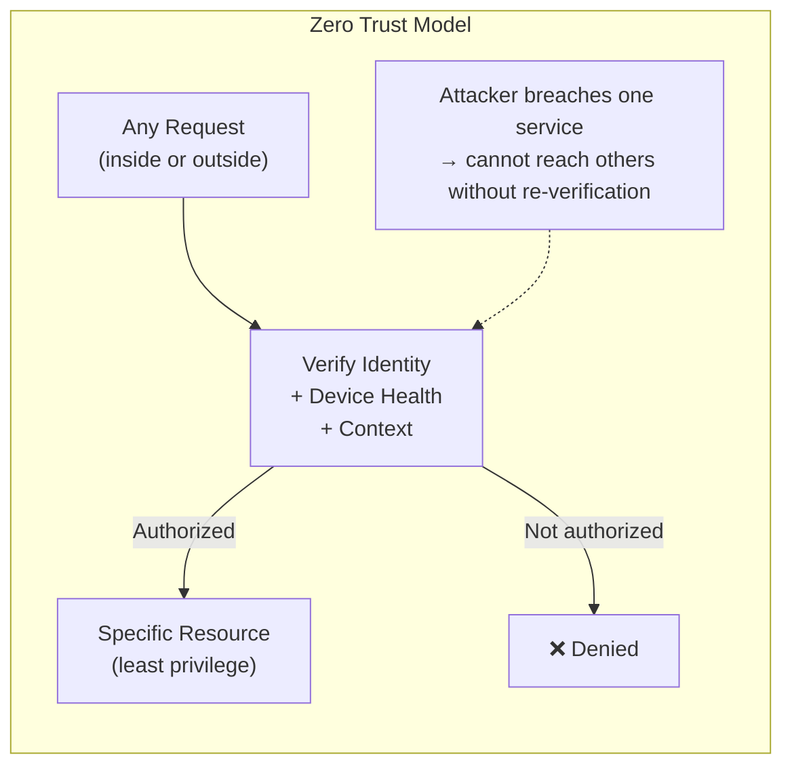

import { Aside } from '@astrojs/starlight/components';

## Old Model vs Zero Trust





**Old "castle and moat" model:**
Once an attacker is inside the perimeter (via phishing, VPN compromise, etc.) they can move laterally to any resource.

**Zero Trust model:** Never trust. Always verify. Regardless of network location.

## Zero Trust Principles

1. **Verify explicitly** — Always authenticate and authorize using all available data: identity, location, device health, service, workload, data classification, anomalies

2. **Least-privilege access** — Limit access with just-in-time (JIT) and just-enough-access (JEA). Time-box elevated permissions.

3. **Assume breach** — Minimize blast radius. Segment everything. Encrypt all traffic. Use analytics to detect anomalies.

## Zero Trust in Practice

```
Network:  Micro-segmentation — services can only talk to declared dependencies
Identity: Every request carries a verified identity token
Devices:  Device health checked before granting access (MDM, certificate)
Apps:     mTLS between all services in a service mesh
Data:     Encrypt at rest and in transit; classify and label data
Logging:  All access events logged; real-time anomaly detection
```

## Service Mesh with mTLS

```yaml
# Istio PeerAuthentication — enforce mTLS for all services
apiVersion: security.istio.io/v1beta1
kind: PeerAuthentication
metadata:
  name: default
  namespace: production
spec:
  mtls:
    mode: STRICT  # reject plaintext connections

# Authorization policy — only allow specific services to call each other
apiVersion: security.istio.io/v1beta1
kind: AuthorizationPolicy
metadata:
  name: payments-policy
spec:
  selector:
    matchLabels:
      app: payments-service
  rules:
  - from:
    - source:
        principals: ["cluster.local/ns/production/sa/orders-service"]
    to:
    - operation:
        methods: ["POST"]
        paths: ["/payments/*"]
```
