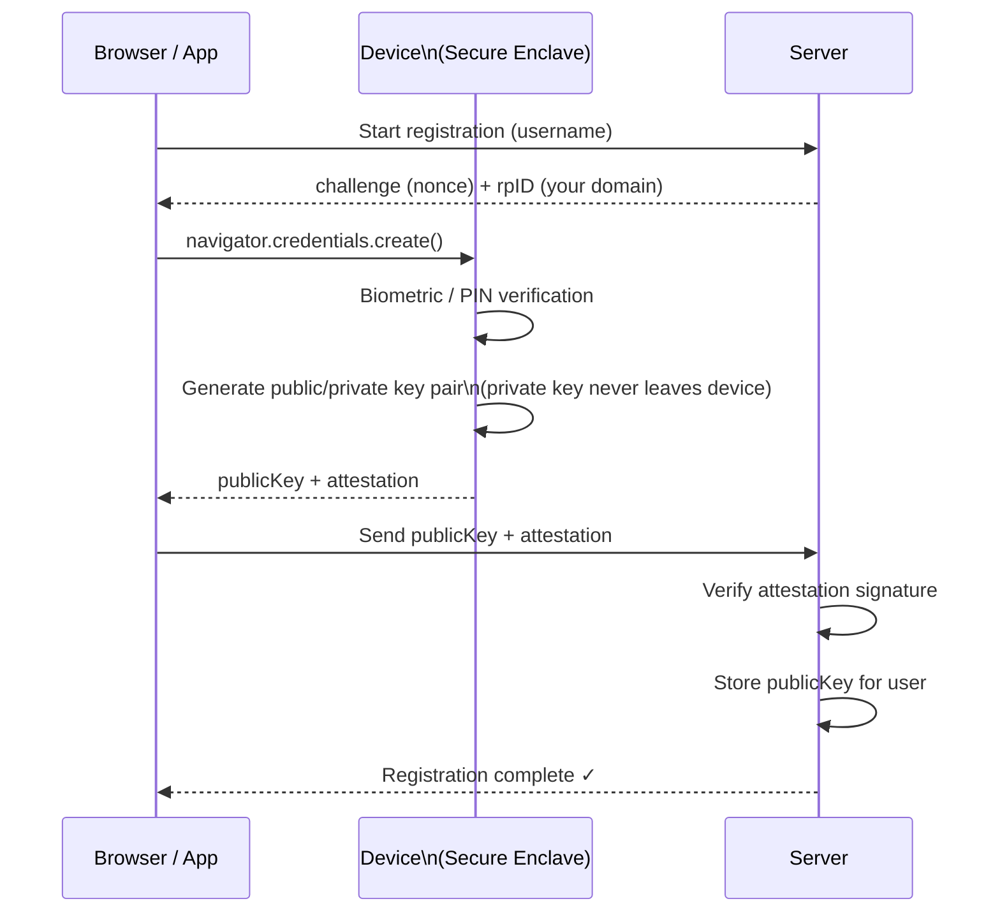
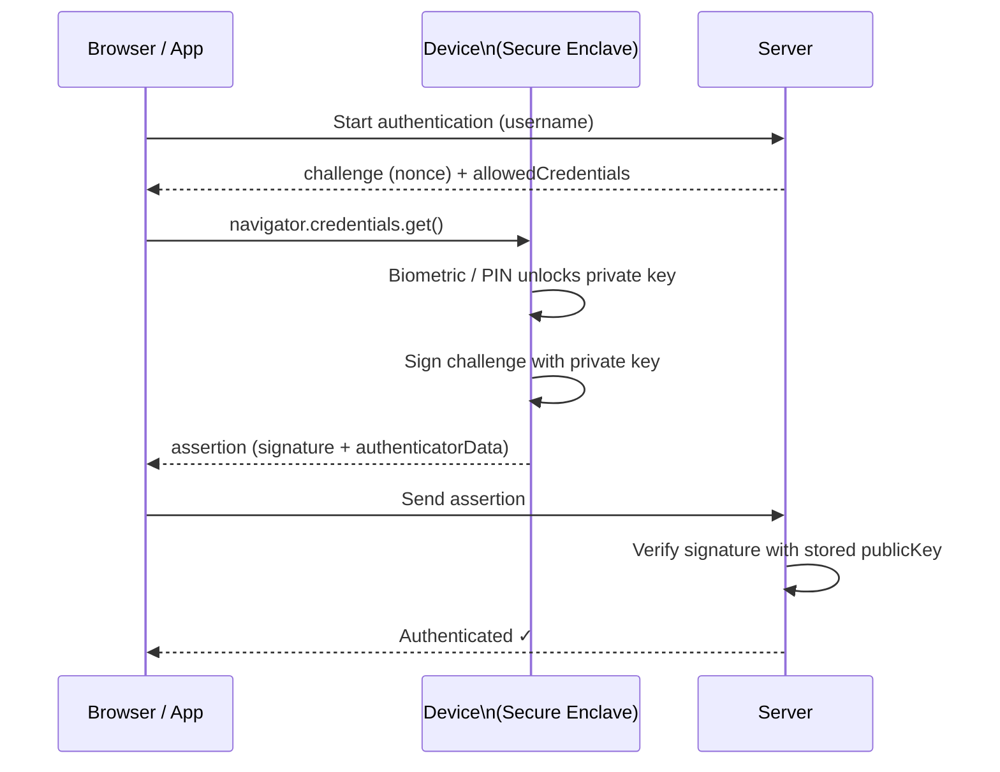
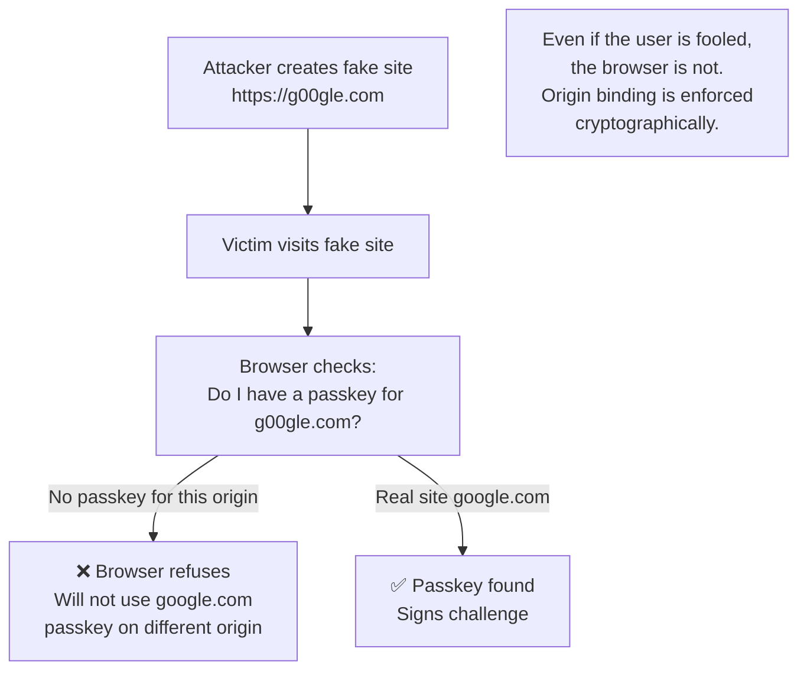

import { Tabs, TabItem } from '@astrojs/starlight/components';
import { Aside } from '@astrojs/starlight/components';

## Biometric Authentication

Biometrics verify identity using biological characteristics. Unlike passwords, they cannot be forgotten — but they also cannot be changed if compromised.

| Type | Technology | Strength | Use Case |
|---|---|---|---|
| Fingerprint | Capacitive/optical sensor | High | Mobile unlock, Touch ID |
| Face recognition | 3D structured light / IR | High | Face ID, Windows Hello |
| Iris scan | Near-infrared camera | Very high | High-security access control |
| Voice print | Neural audio matching | Medium | Phone banking, smart speakers |
| Behavioral | Typing cadence, mouse patterns | Low-medium | Continuous authentication |

<Aside type="caution">
Biometrics are used locally to unlock a key — the biometric data itself is never sent over the network. On a phone, Face ID unlocks a private key stored in the secure enclave; the server only sees a cryptographic signature.
</Aside>

## Passkeys (FIDO2 / WebAuthn)

Passkeys are the modern replacement for passwords. They use public-key cryptography and are phishing-resistant by design.

**Key properties:**
- **Passwordless** — no password to steal, forget, or reuse
- **Phishing-resistant** — keys are bound to the exact origin (domain); a fake site gets nothing
- **Biometric-backed** — device PIN or biometric unlocks the private key
- **Synced across devices** — via iCloud Keychain, Google Password Manager, or hardware key

## WebAuthn Registration Flow



## WebAuthn Authentication Flow



## Why Passkeys Are Phishing-Resistant



## WebAuthn Code (Server-side)

<Tabs>
<TabItem label="Python">
```python
from webauthn import generate_registration_options, verify_registration_response
from webauthn.helpers.structs import (
    AuthenticatorSelectionCriteria,
    ResidentKeyRequirement,
    UserVerificationRequirement,
)

# Generate registration challenge
options = generate_registration_options(
    rp_id="myapp.com",
    rp_name="My App",
    user_id=user.id,
    user_name=user.email,
    authenticator_selection=AuthenticatorSelectionCriteria(
        resident_key=ResidentKeyRequirement.PREFERRED,
        user_verification=UserVerificationRequirement.PREFERRED,
    ),
)

# Verify registration response
verification = verify_registration_response(
    credential=request_body,
    expected_challenge=saved_challenge,
    expected_rp_id="myapp.com",
    expected_origin="https://myapp.com",
)

if verification.verified:
    # Store verification.credential_public_key
    pass
```
</TabItem>
<TabItem label="JavaScript">
```javascript
const { generateRegistrationOptions, verifyRegistrationResponse } = require('@simplewebauthn/server');

// Generate registration challenge
const options = await generateRegistrationOptions({
  rpName: 'My App',
  rpID: 'myapp.com',
  userID: user.id,
  userName: user.email,
  attestationType: 'none',
  authenticatorSelection: {
    residentKey: 'preferred',
    userVerification: 'preferred',
  },
});

// Verify registration response
const verification = await verifyRegistrationResponse({
  response: req.body,
  expectedChallenge: savedChallenge,
  expectedOrigin: 'https://myapp.com',
  expectedRPID: 'myapp.com',
});

if (verification.verified) {
  // Store verification.registrationInfo.credentialPublicKey
}
```
</TabItem>
<TabItem label="C#">
```csharp
// Using Fido2NetLib
var fido2 = new Fido2(new Fido2Configuration
{
    ServerDomain = "myapp.com",
    ServerName = "My App",
    Origins = new HashSet<string> { "https://myapp.com" },
});

// Generate registration options
var options = fido2.RequestNewCredential(user, existingKeys,
    AuthenticatorSelection.Default, AttestationConveyancePreference.None);

// Verify registration
var result = await fido2.MakeNewCredentialAsync(
    attestationResponse, options, IsCredentialIdUniqueToUserAsync);

if (result.Status == "ok")
{
    // Store result.Result.PublicKey
}
```
</TabItem>
<TabItem label="Java">
```java
// Using webauthn4j
WebAuthnManager webAuthnManager = WebAuthnManager.createNonStrictWebAuthnManager();

// Generate registration challenge
PublicKeyCredentialCreationOptions options = new PublicKeyCredentialCreationOptionsBuilder()
    .rp(new PublicKeyCredentialRpEntity("myapp.com", "My App"))
    .user(new PublicKeyCredentialUserEntity(userId, userName, userDisplayName))
    .challenge(new DefaultChallenge())
    .build();

// Verify registration response
RegistrationData registrationData = webAuthnManager.parse(registrationRequest);
webAuthnManager.validate(registrationData, registrationParameters);

// Store registrationData.getAttestationObject().getAuthenticatorData()
//   .getAttestedCredentialData().getCOSEKey()
```
</TabItem>
</Tabs>
