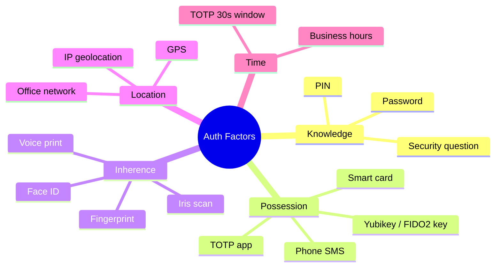
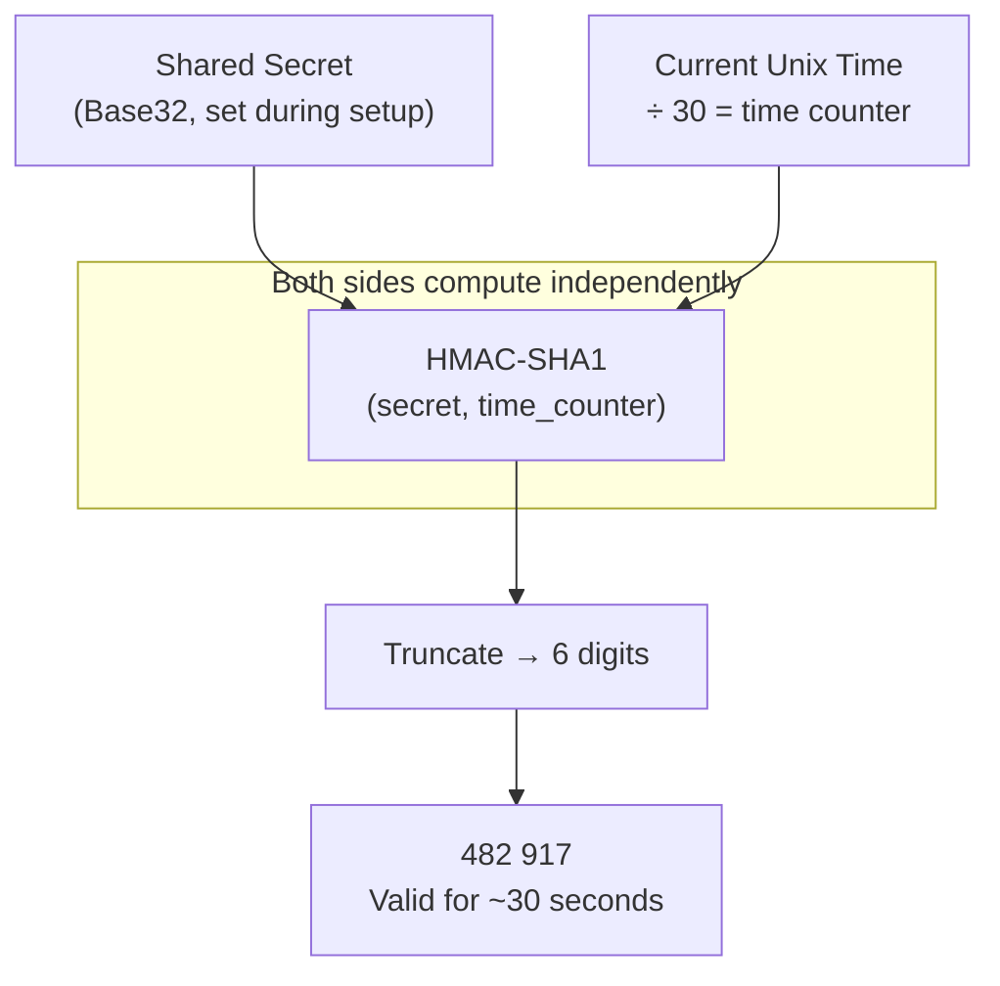

Authentication factors are categories of evidence used to prove identity.



## The Five Factor Categories

| Factor | Also Called | What It Is | Examples |
|---|---|---|---|
| **Knowledge** | Something you know | Secret information only the user knows | Password, PIN, security question, passphrase |
| **Possession** | Something you have | A physical or digital device/token | Phone (OTP), Yubikey, smart card, TOTP app |
| **Inherence** | Something you are | A biological or behavioral characteristic | Fingerprint, Face ID, iris scan, voice, typing cadence |
| **Location** | Somewhere you are | Physical or network location | IP geolocation, GPS, office network, country |
| **Time** | Something time-bound | Temporal constraints on access | Business hours only, TOTP 30-second windows |

## Multi-Factor Authentication (MFA)

MFA requires two or more factors from *different categories*. Using two passwords is not MFA — it's still just "something you know" twice.

**Strength ranking (weakest → strongest):**

| Method | Strength | Notes |
|---|---|---|
| Password only | ⚠️ Weak | Single factor; phishable; leaked in breaches |
| Password + SMS OTP | 🟡 Moderate | SIM swap vulnerability; better than nothing |
| Password + TOTP app | 🟢 Good | Standard recommendation for most apps |
| Password + hardware key (FIDO U2F) | 🔵 Strong | Phishing-resistant; physical possession required |
| Passkey (FIDO2) + biometric | 🔵 Strong | Passwordless + phishing-resistant by design |
| Hardware key + PIN + biometric (3FA) | 🟣 Very strong | High-security / enterprise environments |

## How TOTP Works (RFC 6238)



Both the authenticator app and the server perform the same calculation independently. They match → authentication succeeds. No code is ever transmitted over the network during login — only the result.

**Clock skew tolerance:** Servers typically accept codes from the current window ±1 (the last 30 seconds and the next 30 seconds) to handle slight clock drift.

## Common MFA Combinations

```
Consumer 2FA (recommended):    Password + TOTP app
Consumer 2FA (weak):           Password + SMS OTP  ← SIM swap risk
Enterprise 3FA:                Password + Yubikey + Face ID
Passwordless (best):           Passkey + biometric unlock
High-security:                 Certificate + hardware token + PIN
```
