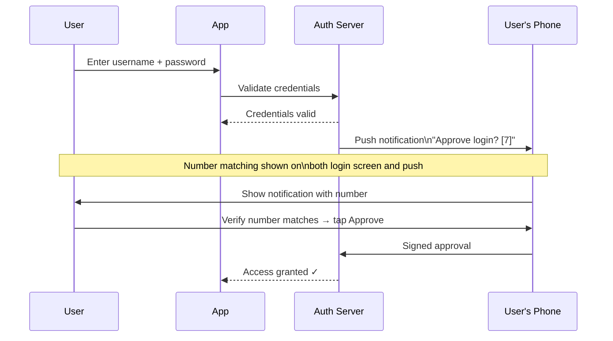

import { Aside } from '@astrojs/starlight/components';

## TOTP vs HOTP

| | TOTP (RFC 6238) | HOTP (RFC 4226) |
|---|---|---|
| **Based on** | Current time (30-second windows) | Incrementing counter |
| **Algorithm** | `HMAC-SHA1(secret, ⌊time/30⌋)` | `HMAC-SHA1(secret, counter)` |
| **Expiry** | Every 30 seconds | One-use, no time limit |
| **Sync issue** | Clock skew (±1 window tolerance) | Counter desync if codes generated unused |
| **Apps** | Google Authenticator, Authy, 1Password | YubiKey OTP (HOTP mode) |

## FIDO U2F vs FIDO2

| | FIDO U2F | FIDO2 / WebAuthn |
|---|---|---|
| **Year** | 2014 | 2019 |
| **Device** | Hardware key (Yubikey, etc.) | Hardware key OR platform authenticator |
| **Platform authenticators** | No | Yes (Touch ID, Face ID, Windows Hello) |
| **Passwordless** | No (used as second factor) | Yes (can replace password entirely) |
| **Sync across devices** | No | Yes (synced passkeys via cloud) |

## Push Authentication (Duo, Okta Verify)

<Aside type="caution">
**Push fatigue attacks** — attacker repeatedly sends push notifications hoping user accidentally taps Approve. Mitigated by number matching (show a number on login screen that user must match in push).
</Aside>

## SMS OTP — Why It's Weak

1. **SIM swap:** Attacker convinces carrier to transfer phone number to their SIM
2. **SS7 attacks:** Protocol vulnerabilities allow interception of SMS
3. **Malware:** Malicious apps with SMS permission can read OTPs
4. **Social engineering:** Support staff tricked into sending codes

<Aside type="danger">
NIST SP 800-63B no longer recommends SMS OTP for new implementations. Use TOTP apps or FIDO2 instead.
</Aside>
