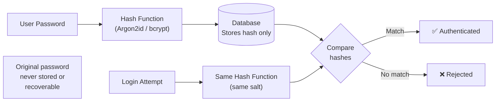
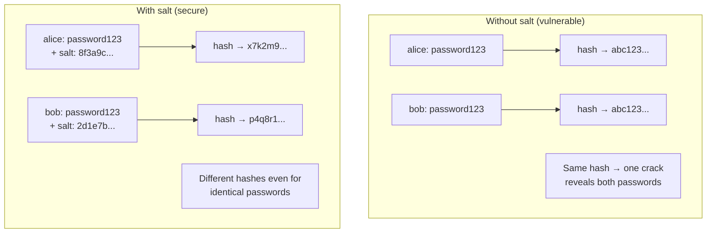

import { Tabs, TabItem } from '@astrojs/starlight/components';
import { Aside } from '@astrojs/starlight/components';

<Aside type="danger">
Passwords must be stored as one-way hashes — never in plaintext, never with reversible encryption.
</Aside>



## Why You Can't Use General-Purpose Hash Functions

MD5, SHA-1, SHA-256, and SHA-512 are designed to be **fast**. A modern GPU can compute billions of SHA-256 hashes per second, making brute-force and rainbow table attacks trivial. Password hashing algorithms are intentionally slow and memory-hard.

## Password Hashing Algorithms

| Algorithm | Use? | Key Properties |
|---|---|---|
| `MD5` | ❌ Never | Broken, no salt, catastrophically fast |
| `SHA-1 / SHA-256` | ❌ Never for passwords | Too fast; use only for data integrity |
| `bcrypt` | ✅ Good | Built-in salt; tunable cost factor; 72-char limit |
| `scrypt` | ✅ Good | Memory-hard; resists GPU/ASIC attacks |
| `Argon2id` | ✅ Best | PHC winner; memory + CPU hard; OWASP recommended |
| `PBKDF2` | ⚠️ Acceptable | FIPS-compliant; weaker than Argon2 against GPU attacks |

<Aside type="note">
**OWASP recommendations (2024):**
- **Argon2id:** m=64MB, t=3 iterations, p=4 parallelism
- **bcrypt:** cost factor ≥ 12 (aim for ~250ms hashing time)
- **PBKDF2-HMAC-SHA512:** ≥ 600,000 iterations
</Aside>

## Password Hashing in Code

<Tabs>
<TabItem label="Python">
```python
from argon2 import PasswordHasher
from argon2.exceptions import VerifyMismatchError

ph = PasswordHasher(
    time_cost=3,      # iterations
    memory_cost=65536, # 64MB
    parallelism=4
)

# Hash
hash = ph.hash(password)  # "$argon2id$v=19$m=65536,t=3,p=4$..."

# Verify
try:
    ph.verify(hash, password)
    # Re-hash if parameters have been updated
    if ph.check_needs_rehash(hash):
        hash = ph.hash(password)
except VerifyMismatchError:
    pass  # Wrong password
```
</TabItem>
<TabItem label="JavaScript">
```javascript
const bcrypt = require('bcrypt');

// Hash a password (saltRounds = cost factor)
const saltRounds = 12; // ~250ms on modern hardware
const hash = await bcrypt.hash(plainPassword, saltRounds);
// Returns: "$2b$12$KIXQlm..." (60-char string, includes salt)

// Verify during login — constant-time comparison built in
const match = await bcrypt.compare(plainPassword, storedHash);
if (match) { /* authenticated */ }
```
</TabItem>
<TabItem label="C#">
```csharp
// Using BCrypt.Net-Next
string hash = BCrypt.Net.BCrypt.HashPassword(password, workFactor: 12);
// Returns: "$2a$12$..." (includes salt)

// Verify — constant-time comparison built in
bool isValid = BCrypt.Net.BCrypt.Verify(password, hash);
if (isValid) { /* authenticated */ }
```
</TabItem>
<TabItem label="Java">
```java
// Using Spring Security BCryptPasswordEncoder
BCryptPasswordEncoder encoder = new BCryptPasswordEncoder(12);

// Hash
String hash = encoder.encode(plainPassword);
// Returns: "$2a$12$..." (includes salt)

// Verify — constant-time comparison built in
boolean isValid = encoder.matches(plainPassword, hash);
if (isValid) { /* authenticated */ }
```
</TabItem>
</Tabs>

## Password Policy Best Practices

- **Minimum length:** 12+ characters (NIST recommends 8 minimum, but 12+ is better)
- **Maximum length:** 64–72 characters (bcrypt truncates at 72 bytes)
- **Complexity:** Avoid complex rules (uppercase + number + symbol) — they hurt usability more than security
- **Block common passwords:** Check against lists like HaveIBeenPwned (top 1M breached passwords)
- **Block contextual passwords:** App name, username, company name in password
- **No periodic forced rotation:** NIST SP 800-63B no longer recommends forced rotation — it leads to weak incremental changes
- **Do force rotation:** On suspected breach, or when user requests it

## Salting

A salt is a random value added to the password before hashing. It ensures two users with the same password have different hashes, and prevents precomputed rainbow table attacks.



<Aside type="note">
bcrypt, Argon2, and scrypt all handle salting automatically and store the salt inside the output string.
</Aside>
