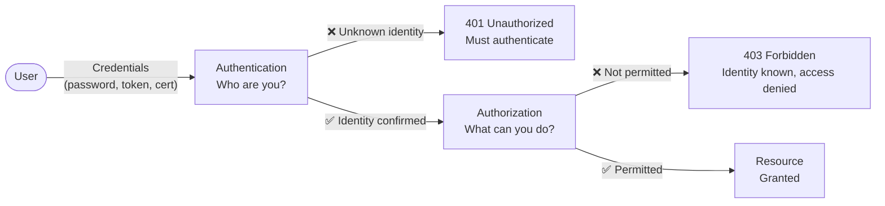
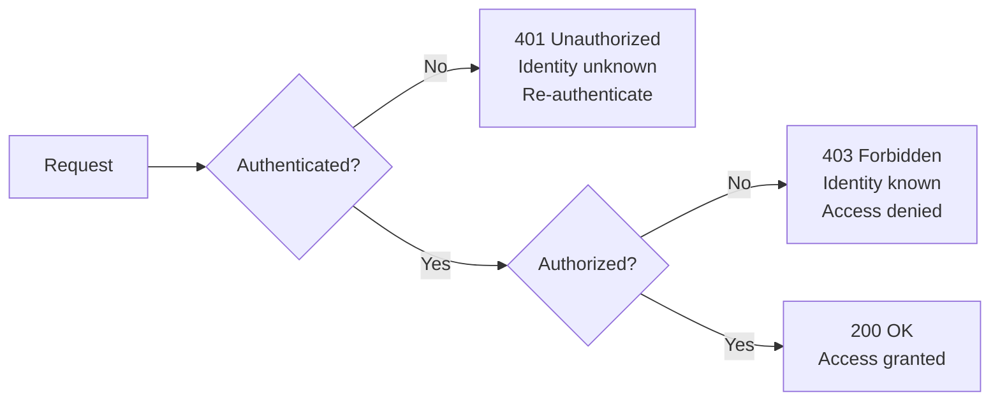
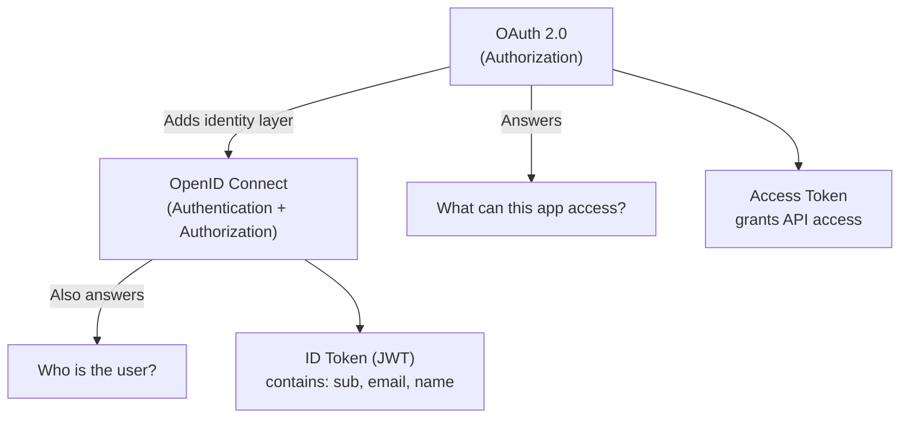

These two concepts are frequently confused, with serious security consequences.

## Authentication (AuthN)

- **Question:** "Who are you?"
- **Happens:** First — before any resource access
- **Proven by:** Passwords, biometrics, certificates, hardware tokens, passkeys
- **Result:** A confirmed identity (e.g. `alice@company.com`, `user_id: 123`)
- **On failure:** `401 Unauthorized`
- **Protocols:** OIDC, SAML 2.0, LDAP, WebAuthn, Kerberos

## Authorization (AuthZ)

- **Question:** "What are you allowed to do?"
- **Happens:** After authentication succeeds
- **Expressed as:** Roles, scopes, permissions, ACLs, attribute policies
- **Result:** Allow or Deny for a specific operation on a specific resource
- **On failure:** `403 Forbidden`
- **Protocols:** OAuth 2.0 (authorization framework), XACML, OPA policies

## Critical Distinction: HTTP Status Codes

> Many APIs return `404` instead of `403` on sensitive resources to avoid leaking that the resource exists.

## Common Mistake: OAuth 2.0 is NOT Authentication

OAuth 2.0 grants a third-party app access to resources — it is an **authorization** framework. Using an OAuth access token to determine *who a user is* is incorrect and can be exploited.

**OpenID Connect (OIDC)** is the correct solution — it adds an identity layer (ID token) on top of OAuth 2.0.

