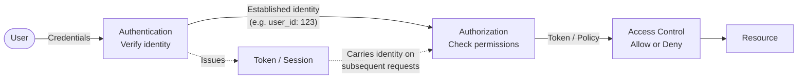
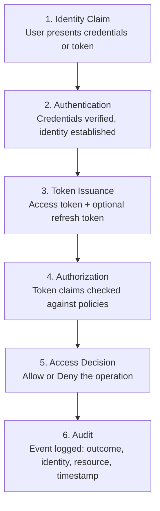

Authentication and authorization are the twin pillars of application security. They are distinct but work together to protect resources.

| Concept | Description |
|---|---|
| **Authentication (AuthN)** | Proves identity. "Who are you?" — login, credentials, tokens |
| **Authorization (AuthZ)** | Decides access. "What are you allowed to do?" — roles, scopes, policies |
| **Session** | Server-side state tracking an authenticated user between requests |
| **Token** | Portable credential carrying identity claims (JWT, session ID, API key) |
| **Credential** | Proof of identity: password, certificate, biometric, hardware key |
| **Principal** | The authenticated entity — a user, service, or device |
| **Identity Provider (IdP)** | A trusted system that authenticates users (Google, Okta, ADFS) |
| **Resource Server** | The API or service that protects resources and validates tokens |
| **Claim** | A statement about an entity, carried inside a token (name, role, email) |

## The Auth Pipeline

Every authenticated request passes through this sequence:

