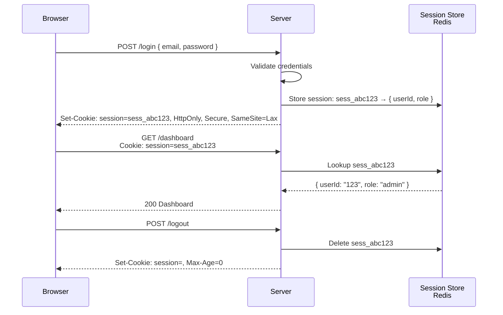

import { Tabs, TabItem } from '@astrojs/starlight/components';
import { Aside } from '@astrojs/starlight/components';

## Session-Based Authentication

In session-based auth, user data lives on the server. The browser holds only a session ID (a random string) in a cookie.



## Cookie Security Attributes

| Attribute | Value | Effect |
|---|---|---|
| `HttpOnly` | (flag) | JavaScript cannot access `document.cookie`. **Prevents XSS token theft.** Always set. |
| `Secure` | (flag) | Cookie only sent over HTTPS. **Prevents interception over HTTP. Always set in production.** |
| `SameSite=Strict` | Strict | Cookie never sent in cross-site requests. Maximum CSRF protection. May break cross-origin OAuth flows. |
| `SameSite=Lax` | Lax | Sent on same-site requests + top-level navigations (GET). **Recommended default.** Breaks most CSRF attacks. |
| `SameSite=None` | None | Sent in all contexts (cross-site). Required for third-party cookies. Must also set `Secure`. |
| `Max-Age` | Seconds | Persistent cookie — survives browser close. `Max-Age=0` deletes cookie. |
| `Expires` | Date | Alternative to Max-Age. Prefer Max-Age (relative, not clock-dependent). |
| `Domain` | domain.com | Which hosts receive the cookie. Omit to restrict to exact hostname. |
| `Path` | /path | Restrict cookie to a URL path. Use `/` for app-wide. |

**Recommended session cookie:**
```http
Set-Cookie: session=sess_abc123; HttpOnly; Secure; SameSite=Lax; Max-Age=86400; Path=/
```

## Session vs JWT

| | Server Session | JWT (Stateless) |
|---|---|---|
| **Data location** | Server (Redis, database) | Inside the token (client) |
| **Revocation** | Instant — delete session | Hard — must wait for expiry or use allowlist |
| **Scalability** | Requires shared session store | Scales horizontally without shared state |
| **Cookie size** | Tiny (just a random ID) | Large (100–500+ bytes) |
| **Inspection** | Requires DB lookup | Decoded anywhere (but tampering detected) |
| **Best for** | Traditional web apps, admin panels | APIs, microservices, distributed systems |

## Session Management Code

<Tabs>
<TabItem label="Python">
```python
from flask import Flask, session, request, jsonify
from flask_session import Session
import redis

app = Flask(__name__)
app.config["SESSION_TYPE"] = "redis"
app.config["SESSION_REDIS"] = redis.from_url(os.environ["REDIS_URL"])
app.config["SECRET_KEY"] = os.environ["SESSION_SECRET"]
app.config["SESSION_COOKIE_HTTPONLY"] = True
app.config["SESSION_COOKIE_SECURE"] = True
app.config["SESSION_COOKIE_SAMESITE"] = "Lax"
Session(app)

@app.post("/auth/login")
def login():
    user = authenticate_user(request.json["email"], request.json["password"])
    if not user:
        return jsonify({"error": "Invalid credentials"}), 401
    session.clear()  # prevent session fixation
    session["user_id"] = user.id
    session["role"] = user.role
    return jsonify({"success": True})

@app.post("/auth/logout")
def logout():
    session.clear()
    return jsonify({"success": True})
```
</TabItem>
<TabItem label="JavaScript">
```javascript
const session = require('express-session');
const RedisStore = require('connect-redis').default;
const { createClient } = require('redis');

const redisClient = createClient({ url: process.env.REDIS_URL });
await redisClient.connect();

app.use(session({
  store: new RedisStore({ client: redisClient }),
  secret: process.env.SESSION_SECRET,  // rotate periodically
  name: 'sid',                          // don't leak 'connect.sid' default
  resave: false,
  saveUninitialized: false,
  cookie: {
    httpOnly: true,
    secure: process.env.NODE_ENV === 'production',
    sameSite: 'lax',
    maxAge: 24 * 60 * 60 * 1000, // 24 hours
  },
}));

// Login
app.post('/auth/login', async (req, res) => {
  const user = await authenticateUser(req.body.email, req.body.password);
  if (!user) return res.status(401).json({ error: 'Invalid credentials' });

  // Regenerate session ID on login to prevent session fixation
  req.session.regenerate((err) => {
    req.session.userId = user.id;
    req.session.role = user.role;
    res.json({ success: true });
  });
});

// Logout
app.post('/auth/logout', (req, res) => {
  req.session.destroy((err) => {
    res.clearCookie('sid');
    res.json({ success: true });
  });
});
```
</TabItem>
<TabItem label="C#">
```csharp
// Program.cs
builder.Services.AddDistributedMemoryCache(); // or Redis
builder.Services.AddSession(options =>
{
    options.Cookie.HttpOnly = true;
    options.Cookie.SecurePolicy = CookieSecurePolicy.Always;
    options.Cookie.SameSite = SameSiteMode.Lax;
    options.Cookie.Name = "sid";
    options.IdleTimeout = TimeSpan.FromHours(24);
});

// Login endpoint
[HttpPost("/auth/login")]
public IActionResult Login([FromBody] LoginRequest req)
{
    var user = _authService.ValidateCredentials(req.Email, req.Password);
    if (user == null) return Unauthorized(new { error = "Invalid credentials" });

    // Regenerate session to prevent session fixation
    HttpContext.Session.Clear();
    HttpContext.Session.SetString("userId", user.Id);
    HttpContext.Session.SetString("role", user.Role);
    return Ok(new { success = true });
}
```
</TabItem>
<TabItem label="Java">
```java
@RestController
public class AuthController {

    @PostMapping("/auth/login")
    public ResponseEntity<?> login(@RequestBody LoginRequest req, HttpServletRequest request) {
        User user = authService.validateCredentials(req.getEmail(), req.getPassword());
        if (user == null) return ResponseEntity.status(401).body(Map.of("error", "Invalid credentials"));

        // Invalidate old session to prevent session fixation
        request.getSession().invalidate();
        HttpSession session = request.getSession(true);
        session.setAttribute("userId", user.getId());
        session.setAttribute("role", user.getRole());
        return ResponseEntity.ok(Map.of("success", true));
    }

    @PostMapping("/auth/logout")
    public ResponseEntity<?> logout(HttpServletRequest request) {
        request.getSession().invalidate();
        return ResponseEntity.ok(Map.of("success", true));
    }
}
```
</TabItem>
</Tabs>

<Aside type="danger">
Always regenerate the session ID on login to prevent session fixation attacks. An attacker who forces a known session ID before login would otherwise have access after the user authenticates.
</Aside>
