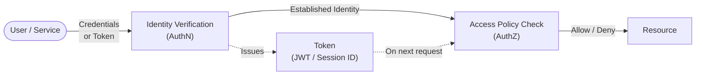
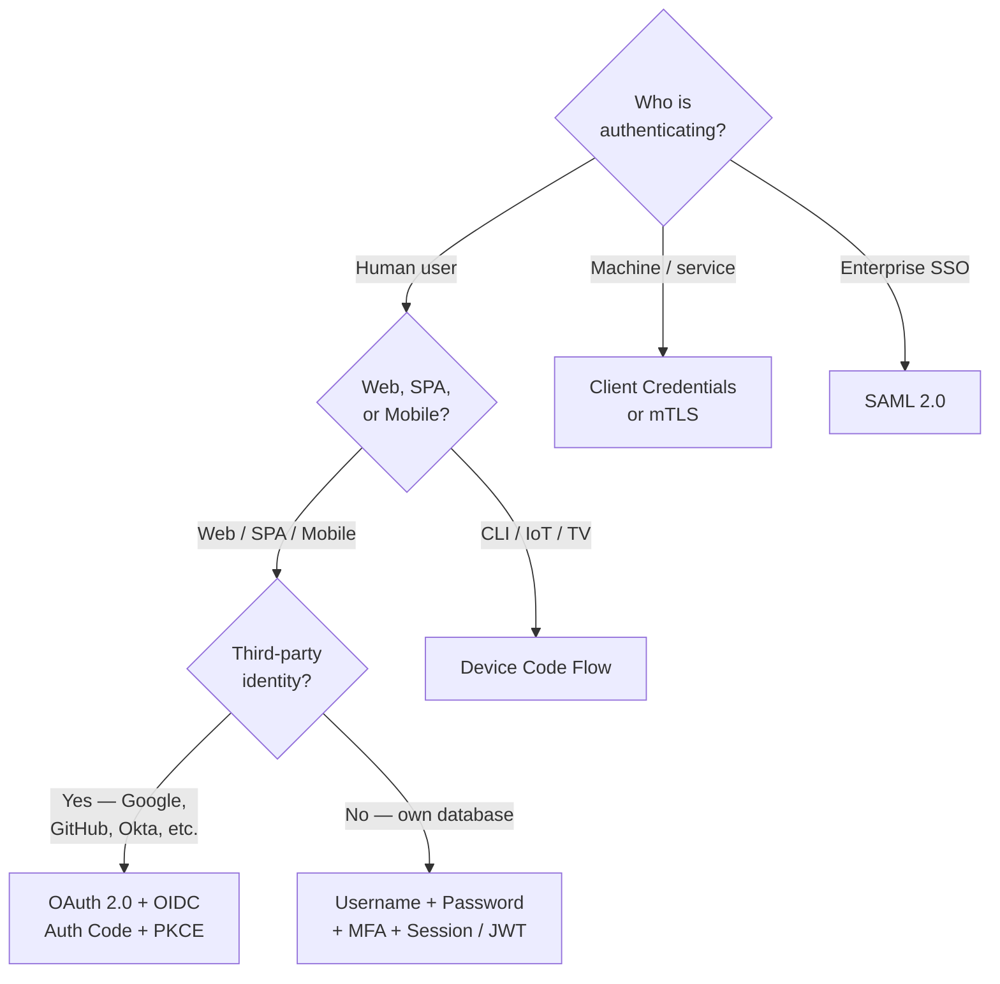
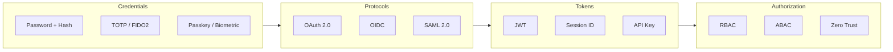

import { Tabs, TabItem } from '@astrojs/starlight/components';
import { Aside, Card, CardGrid, Steps, Badge } from '@astrojs/starlight/components';

This section covers everything needed to build secure authentication and authorization into applications — from foundational concepts to production-ready patterns.

## What's Covered

| Section | Topics |
|---|---|
| [Core Concepts](/auth/fundamentals/overview) | AuthN vs AuthZ, the auth pipeline, terminology |
| [Credentials](/auth/credentials/mfa-factors) | MFA, password hashing, passkeys, biometrics |
| [Tokens](/auth/tokens/jwt) | JWT, bearer tokens, API keys, token storage |
| [Protocols](/auth/protocols/oauth2) | OAuth 2.0, OIDC, SAML, certificates |
| [Authorization](/auth/authorization/rbac-abac) | RBAC, ABAC, Zero Trust, scopes |
| [Implementation](/auth/implementation/auth-in-code) | Code examples, sessions, cookies, security headers |
| [Security](/auth/security/threats-attacks) | Threat catalog, best practices, pre-launch checklist |

## How Authentication Works

Every authenticated request passes through four phases:

## Choosing the Right Approach

## The Auth Ecosystem

## Quick Navigation

**Starting from zero?**  
→ [Core Concepts](/auth/fundamentals/overview) then [AuthN vs AuthZ](/auth/fundamentals/authn-vs-authz)

**Implementing login for a web or mobile app?**  
→ [OAuth 2.0 + PKCE](/auth/protocols/oauth2) → [OIDC](/auth/protocols/oidc) → [Sessions & Cookies](/auth/implementation/sessions-cookies)

**Working with JWTs?**  
→ [JWT Reference](/auth/tokens/jwt) — structure, signing algorithms, full validation checklist

**Adding MFA?**  
→ [MFA Factors](/auth/credentials/mfa-factors) → [MFA Protocols Deep Dive](/auth/credentials/mfa-protocols)

**Designing roles and permissions?**  
→ [RBAC & ABAC](/auth/authorization/rbac-abac) → [Permissions & Scopes](/auth/authorization/permissions-scopes)

**Connecting to enterprise identity (Active Directory, Okta)?**  
→ [SAML 2.0 & Enterprise SSO](/auth/protocols/saml-sso) → [OIDC](/auth/protocols/oidc)

**Service-to-service / API auth?**  
→ [API Keys](/auth/tokens/api-keys) → [Client Credentials (OAuth)](/auth/protocols/oauth2) → [Certificates & mTLS](/auth/protocols/certificates-pki)

**Hardening an existing system?**  
→ [Threats & Attacks](/auth/security/threats-attacks) → [Best Practices](/auth/security/best-practices) → [Security Checklist](/auth/security/security-checklist)

## Learning Path

| Level | Recommended Order |
|---|---|
| **Foundations** | [Core Concepts](/auth/fundamentals/overview) → [AuthN vs AuthZ](/auth/fundamentals/authn-vs-authz) → [JWT](/auth/tokens/jwt) → [Bearer Tokens](/auth/tokens/bearer-tokens) |
| **Intermediate** | [OAuth 2.0](/auth/protocols/oauth2) → [OIDC](/auth/protocols/oidc) → [RBAC & ABAC](/auth/authorization/rbac-abac) → [Sessions & Cookies](/auth/implementation/sessions-cookies) |
| **Advanced** | [SAML SSO](/auth/protocols/saml-sso) → [Zero Trust](/auth/authorization/zero-trust) → [Certificates & PKI](/auth/protocols/certificates-pki) → [HTTP Security Headers](/auth/implementation/http-security-headers) |
| **Pre-launch** | [Threats & Attacks](/auth/security/threats-attacks) → [Best Practices](/auth/security/best-practices) → [Security Checklist](/auth/security/security-checklist) |

## Auth vs Security

This section focuses on identity and access. For complementary topics see the [Security](/security) section:

- **Encryption and key management** → [Cryptography](/security/cryptography/fundamentals)
- **Input validation and injection** → [OWASP Top 10](/security/web/owasp-top-10) / [SQL Injection](/security/web/sql-injection)
- **XSS and CSRF** → [Web App Security](/security/web/xss)
- **Logging auth events** → [Logging & Monitoring](/security/incident-response/logging-monitoring)
