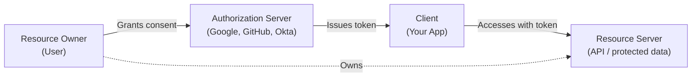
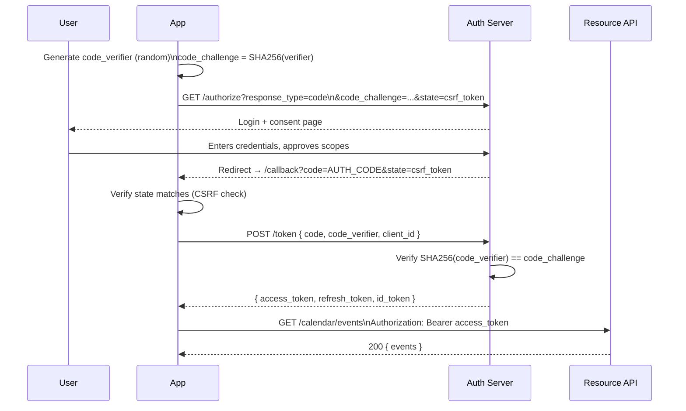

OAuth 2.0 (RFC 6749) is a **delegated authorization** framework. It lets a user grant a third-party app limited access to their resources without sharing their password.



## Core Roles

| Role | Description | Example |
|---|---|---|
| **Resource Owner** | The user who owns the data | Alice |
| **Client** | The app requesting access | A todo app wanting to access Alice's calendar |
| **Authorization Server** | Issues tokens after consent | Google's auth server |
| **Resource Server** | Hosts the protected resources | Google Calendar API |

## The Four Grant Types

### 1. Authorization Code + PKCE (recommended for user-facing apps)

The most secure flow. Used for web apps, SPAs, and mobile apps. PKCE (Proof Key for Code Exchange) prevents authorization code interception attacks.



### 2. Client Credentials (M2M)

Used when no user is involved — a service authenticating as itself.

```javascript
// Node.js: get an access token using client credentials
const params = new URLSearchParams({
  grant_type: 'client_credentials',
  client_id: process.env.CLIENT_ID,
  client_secret: process.env.CLIENT_SECRET,
  scope: 'read:reports write:reports',
});

const res = await fetch('https://auth.example.com/oauth/token', {
  method: 'POST',
  body: params,
  headers: { 'Content-Type': 'application/x-www-form-urlencoded' },
});

const { access_token, expires_in } = await res.json();

// Cache the token and reuse until expires_in seconds
// Refresh proactively (60 seconds before expiry)
```

### 3. Device Code (Input-Constrained Devices)

For CLIs, TVs, and devices without a browser.

```
1. App → Auth Server: POST /device_authorization
   Body: client_id=... &scope=...
   ← { device_code, user_code: "WXYZ-1234", verification_uri: "example.com/activate", expires_in: 300 }

2. App displays: "Go to example.com/activate and enter WXYZ-1234"

3. App polls: POST /token
   Body: grant_type=urn:ietf:params:oauth:grant-type:device_code &device_code=...
   ← 400 authorization_pending  (user hasn't approved yet)
   ← 400 slow_down              (poll less frequently)
   ← 200 { access_token }       (user approved)
```

### 4. Implicit (Deprecated)

**Do not use.** Access tokens were returned directly in the redirect URL fragment — leakable via Referer headers, browser history, and server logs. Replaced by Authorization Code + PKCE.

## OAuth Scopes

Scopes define the specific permissions an access token grants. Always request the minimum scope needed.

```
openid          → Required for OIDC (identity)
profile         → User's name, picture, website
email           → User's email address
read:users      → Read user records
write:users     → Create/update user records
delete:users    → Delete user records
admin:all       → Full admin access (high-privilege — use carefully)
```

**Scope design principles:**
- Use `resource:action` format for clarity
- Separate read and write scopes
- Never design a single all-access scope
- Scopes appear on the user consent screen — make them human-readable

## Token Endpoint Response

```json
{
  "access_token": "eyJhbGciOiJSUzI1NiIsInR5cCI6IkpXVCJ9...",
  "token_type": "Bearer",
  "expires_in": 3600,
  "refresh_token": "rt_5FKyU8mP3qN7vW2xA1bC",
  "scope": "openid email read:calendar",
  "id_token": "eyJhbGciOiJSUzI1NiIsInR5cCI6IkpXVCJ9..."
}
```
