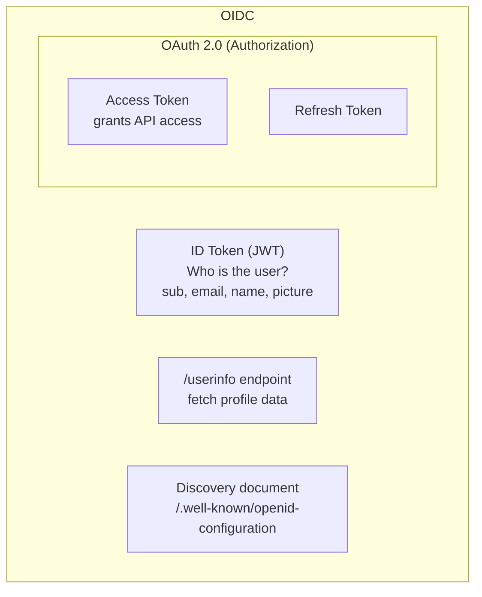

OpenID Connect 1.0 (OIDC) is an identity layer on top of OAuth 2.0. It adds:


- The **ID token** — a signed JWT proving who the user is
- The `/userinfo` endpoint for fetching user profile data
- Standard user claims (`sub`, `email`, `name`, `picture`)
- A discovery document at `/.well-known/openid-configuration`

## OIDC vs OAuth 2.0

```
OAuth 2.0:  "Here is an access token that lets you access my calendar"
OIDC:       "Here is an ID token proving that alice@google.com just logged in"
            + "Here is an access token to call the userinfo endpoint"
```

## ID Token Claims

| Claim | Description | Notes |
|---|---|---|
| `sub` | Stable unique user identifier at this IdP | **Use this as your primary user key**, not email |
| `iss` | Issuer URL | Must match your IdP's URL |
| `aud` | Audience | Must match your client_id |
| `exp` | Expiration | Validate this |
| `iat` | Issued at | When the token was created |
| `email` | User's email | Only if `email` scope requested |
| `email_verified` | Whether IdP verified the email | Don't trust unverified emails for auth |
| `name` | Display name | Only if `profile` scope requested |
| `picture` | Profile picture URL | Only if `profile` scope requested |
| `nonce` | Replay-attack prevention | Your app sends; IdP reflects back. Verify it matches. |

## Discovery Document

OIDC providers publish a discovery document at:
```
GET https://accounts.google.com/.well-known/openid-configuration
```

This document contains all the endpoints, supported algorithms, and JWKS URI your app needs:
```json
{
  "issuer": "https://accounts.google.com",
  "authorization_endpoint": "https://accounts.google.com/o/oauth2/v2/auth",
  "token_endpoint": "https://oauth2.googleapis.com/token",
  "userinfo_endpoint": "https://openidconnect.googleapis.com/v1/userinfo",
  "jwks_uri": "https://www.googleapis.com/oauth2/v3/certs",
  "scopes_supported": ["openid", "email", "profile"],
  "id_token_signing_alg_values_supported": ["RS256"]
}
```

## OIDC Code (Node.js with openid-client)

```javascript
const { Issuer, generators } = require('openid-client');

// Auto-discover OIDC configuration
const issuer = await Issuer.discover('https://accounts.google.com');
const client = new issuer.Client({
  client_id: process.env.GOOGLE_CLIENT_ID,
  client_secret: process.env.GOOGLE_CLIENT_SECRET,
  redirect_uris: ['https://myapp.com/auth/callback'],
  response_types: ['code'],
});

// Start auth flow
const nonce = generators.nonce();
const state = generators.state();
const url = client.authorizationUrl({
  scope: 'openid email profile',
  nonce,
  state,
});

// Handle callback
const params = client.callbackParams(req);
const tokenSet = await client.callback(
  'https://myapp.com/auth/callback',
  params,
  { nonce, state }
);

const claims = tokenSet.claims();
// claims.sub — stable user ID
// claims.email — alice@gmail.com
// claims.name — Alice Smith
```
