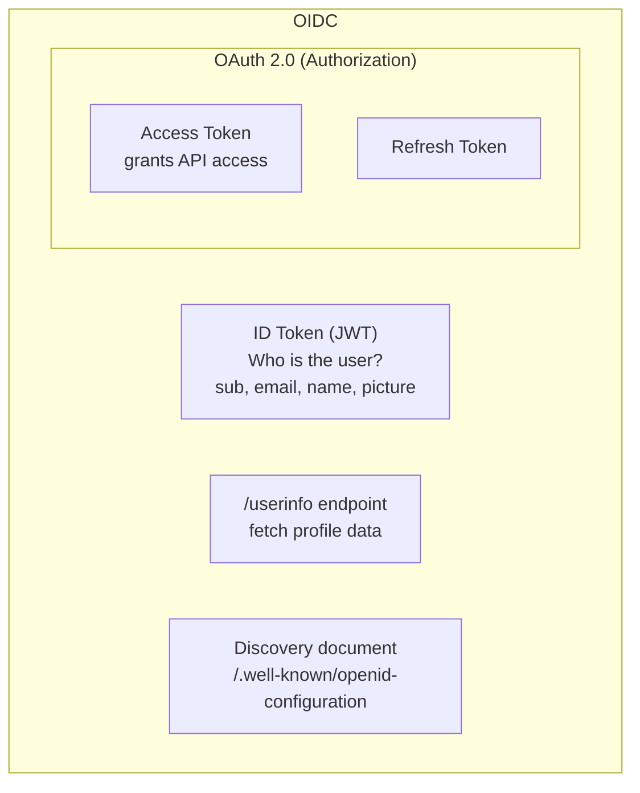

import { Tabs, TabItem } from '@astrojs/starlight/components';
import { Aside, Card, CardGrid, Steps, Badge } from '@astrojs/starlight/components';

OpenID Connect 1.0 (OIDC) is an identity layer on top of OAuth 2.0. It adds:


- The **ID token** — a signed JWT proving who the user is
- The `/userinfo` endpoint for fetching user profile data
- Standard user claims (`sub`, `email`, `name`, `picture`)
- A discovery document at `/.well-known/openid-configuration`

## OIDC vs OAuth 2.0

```
OAuth 2.0:  "Here is an access token that lets you access my calendar"
OIDC:       "Here is an ID token proving that alice@google.com just logged in"
            + "Here is an access token to call the userinfo endpoint"
```

## ID Token Claims

| Claim | Description | Notes |
|---|---|---|
| `sub` | Stable unique user identifier at this IdP | **Use this as your primary user key**, not email |
| `iss` | Issuer URL | Must match your IdP's URL |
| `aud` | Audience | Must match your client_id |
| `exp` | Expiration | Validate this |
| `iat` | Issued at | When the token was created |
| `email` | User's email | Only if `email` scope requested |
| `email_verified` | Whether IdP verified the email | Don't trust unverified emails for auth |
| `name` | Display name | Only if `profile` scope requested |
| `picture` | Profile picture URL | Only if `profile` scope requested |
| `nonce` | Replay-attack prevention | Your app sends; IdP reflects back. Verify it matches. |

## Discovery Document

OIDC providers publish a discovery document at:
```
GET https://accounts.google.com/.well-known/openid-configuration
```

This document contains all the endpoints, supported algorithms, and JWKS URI your app needs:
```json
{
  "issuer": "https://accounts.google.com",
  "authorization_endpoint": "https://accounts.google.com/o/oauth2/v2/auth",
  "token_endpoint": "https://oauth2.googleapis.com/token",
  "userinfo_endpoint": "https://openidconnect.googleapis.com/v1/userinfo",
  "jwks_uri": "https://www.googleapis.com/oauth2/v3/certs",
  "scopes_supported": ["openid", "email", "profile"],
  "id_token_signing_alg_values_supported": ["RS256"]
}
```

## OIDC Code Examples

The following examples show how to auto-discover an OIDC provider's configuration, initiate the authorization flow with a `nonce` and `state` for security, handle the callback, and extract user claims from the returned ID token.

<Tabs>
<TabItem label="JavaScript">
```javascript
const { Issuer, generators } = require('openid-client');

// Auto-discover OIDC configuration
const issuer = await Issuer.discover('https://accounts.google.com');
const client = new issuer.Client({
  client_id: process.env.GOOGLE_CLIENT_ID,
  client_secret: process.env.GOOGLE_CLIENT_SECRET,
  redirect_uris: ['https://myapp.com/auth/callback'],
  response_types: ['code'],
});

// Start auth flow
const nonce = generators.nonce();
const state = generators.state();
const url = client.authorizationUrl({
  scope: 'openid email profile',
  nonce,
  state,
});

// Handle callback
const params = client.callbackParams(req);
const tokenSet = await client.callback(
  'https://myapp.com/auth/callback',
  params,
  { nonce, state }
);

const claims = tokenSet.claims();
// claims.sub — stable user ID
// claims.email — alice@gmail.com
// claims.name — Alice Smith
```
</TabItem>
<TabItem label="Python">
```python
from authlib.integrations.requests_client import OAuth2Session
import os

# Create an OAuth2 session with OIDC scopes
client = OAuth2Session(
    client_id=os.environ['GOOGLE_CLIENT_ID'],
    client_secret=os.environ['GOOGLE_CLIENT_SECRET'],
    scope='openid email profile',
    redirect_uri='https://myapp.com/auth/callback',
)

# Fetch the OIDC discovery document
metadata = client.load_server_metadata(
    'https://accounts.google.com/.well-known/openid-configuration'
)

# Start auth flow — get authorization URL with nonce + state
uri, state = client.create_authorization_url(
    metadata['authorization_endpoint'],
    nonce=client.create_nonce(),
)
# Store state and nonce in session before redirecting

# Handle callback
token = client.fetch_token(
    metadata['token_endpoint'],
    authorization_response=request.url,
    state=session['oauth_state'],
)

# Decode and verify the ID token
claims = client.parse_id_token(token, nonce=session['oauth_nonce'])
# claims['sub']   — stable user ID
# claims['email'] — alice@gmail.com
# claims['name']  — Alice Smith
```
</TabItem>
<TabItem label="C#">
```csharp
using IdentityModel.Client;
using IdentityModel.OidcClient;

// Auto-discover OIDC configuration
var options = new OidcClientOptions
{
    Authority = "https://accounts.google.com",
    ClientId = Environment.GetEnvironmentVariable("GOOGLE_CLIENT_ID"),
    ClientSecret = Environment.GetEnvironmentVariable("GOOGLE_CLIENT_SECRET"),
    RedirectUri = "https://myapp.com/auth/callback",
    Scope = "openid email profile",
};

var oidcClient = new OidcClient(options);

// Start auth flow — get login URL with state and nonce
var state = await oidcClient.PrepareLoginAsync();
// Redirect user to state.StartUrl

// Handle callback — exchange code for tokens
var result = await oidcClient.ProcessResponseAsync(
    callbackUrl,  // full callback URL with code and state
    state
);

if (!result.IsError)
{
    var claims = result.User.Claims;
    var sub   = claims.FirstOrDefault(c => c.Type == "sub")?.Value;
    var email = claims.FirstOrDefault(c => c.Type == "email")?.Value;
    var name  = claims.FirstOrDefault(c => c.Type == "name")?.Value;
}
```
</TabItem>
<TabItem label="Java">
```java
import com.nimbusds.openid.connect.sdk.*;
import com.nimbusds.openid.connect.sdk.op.OIDCProviderMetadata;
import com.nimbusds.oauth2.sdk.*;
import java.net.URI;

// Auto-discover OIDC configuration
URI issuerURI = new URI("https://accounts.google.com");
OIDCProviderMetadata metadata = OIDCProviderMetadata.resolve(issuerURI);

// Generate state and nonce for CSRF + replay protection
State state = new State();
Nonce nonce = new Nonce();

// Build authorization URL
AuthenticationRequest authRequest = new AuthenticationRequest.Builder(
    new ResponseType("code"),
    new Scope("openid", "email", "profile"),
    new ClientID(System.getenv("GOOGLE_CLIENT_ID")),
    new URI("https://myapp.com/auth/callback"))
    .state(state)
    .nonce(nonce)
    .endpointURI(metadata.getAuthorizationEndpointURI())
    .build();
// Redirect user to authRequest.toURI()

// Handle callback — exchange code for tokens
AuthenticationResponse response = AuthenticationResponseParser.parse(
    new URI(callbackUrl)
);
AuthenticationSuccessResponse success = response.toSuccessResponse();

TokenRequest tokenRequest = new TokenRequest(
    metadata.getTokenEndpointURI(),
    new ClientSecretBasic(
        new ClientID(System.getenv("GOOGLE_CLIENT_ID")),
        new Secret(System.getenv("GOOGLE_CLIENT_SECRET"))
    ),
    new AuthorizationCodeGrant(success.getAuthorizationCode(),
        new URI("https://myapp.com/auth/callback"))
);

OIDCTokenResponse tokenResponse = OIDCTokenResponse.parse(
    tokenRequest.toHTTPRequest().send()
);

JWTClaimsSet claims = tokenResponse.getOIDCTokens()
    .getIDToken().getJWTClaimsSet();
String sub   = claims.getSubject();
String email = (String) claims.getClaim("email");
String name  = (String) claims.getClaim("name");
```
</TabItem>
</Tabs>

<Aside type="tip">
Always verify the `nonce` from the ID token matches the one you stored in your session before the redirect. This prevents replay attacks where an attacker reuses a captured authorization code.
</Aside>
