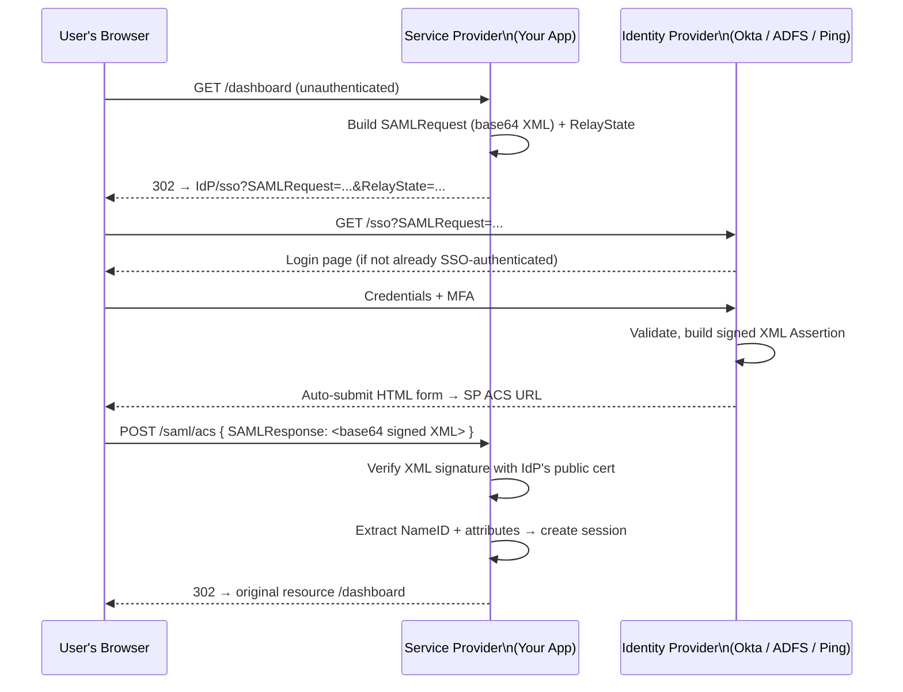

SAML (Security Assertion Markup Language) 2.0 is an XML-based federation protocol dominant in enterprise environments. It enables Single Sign-On (SSO) across organizational boundaries.

## Key Concepts

| Term | Meaning |
|---|---|
| **Service Provider (SP)** | The application user wants to access (your app) |
| **Identity Provider (IdP)** | The organization's auth system (Okta, ADFS, Ping) |
| **Assertion** | An XML document signed by the IdP, containing user attributes |
| **NameID** | The user identifier in the assertion (email, employee ID, etc.) |
| **ACS URL** | Assertion Consumer Service URL — where IdP posts the assertion to SP |
| **Entity ID** | Unique identifier for SP or IdP in the federation |
| **Metadata** | XML document describing an SP or IdP (endpoints, certificates, entity ID) |

## SP-Initiated SSO Flow



## SAML Assertion (simplified)

```xml
<samlp:Response>
  <Assertion>
    <Issuer>https://idp.company.com</Issuer>
    <Conditions NotBefore="..." NotOnOrAfter="...">
      <AudienceRestriction>
        <Audience>https://app.mycompany.com</Audience>
      </AudienceRestriction>
    </Conditions>
    <AttributeStatement>
      <Attribute Name="email"><AttributeValue>alice@company.com</AttributeValue></Attribute>
      <Attribute Name="role"><AttributeValue>admin</AttributeValue></Attribute>
      <Attribute Name="department"><AttributeValue>Engineering</AttributeValue></Attribute>
    </AttributeStatement>
    <Signature> <!-- RSA signature by IdP's private key --> </Signature>
  </Assertion>
</samlp:Response>
```

## SAML vs OIDC

| | SAML 2.0 | OIDC |
|---|---|---|
| **Format** | XML | JSON / JWT |
| **Complexity** | High | Lower |
| **Mobile support** | Poor (browser-dependent) | Excellent |
| **Typical use** | Enterprise SSO, legacy apps | Modern web, mobile, APIs |
| **Providers** | Okta, ADFS, Ping, OneLogin, Azure AD | Google, GitHub, Auth0, Okta, Azure AD |
| **Token type** | XML Assertion | JSON ID Token + Access Token |
| **Age** | 2005 | 2014 |

**Choose OIDC** for new projects. Use SAML only when required by enterprise customers with legacy IdPs.
