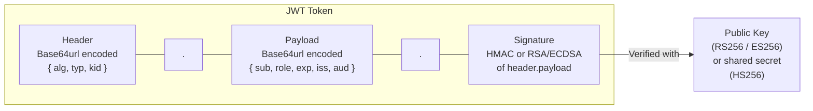

JWTs are compact, URL-safe tokens that carry **claims** (statements about an entity). They are self-contained: the server can verify them without a database lookup by checking the cryptographic signature.



## JWT Structure

A JWT has three base64url-encoded parts separated by dots:

```
eyJhbGciOiJSUzI1NiIsInR5cCI6IkpXVCJ9          ← Header
.eyJzdWIiOiJ1c2VyXzEyMyIsInJvbGUiOiJhZG1pbiJ9 ← Payload
.SflKxwRJSMeKKF2QT4fwpMeJf36POk6yJV_adQssw5c   ← Signature
```

**Header:**
```json
{
  "alg": "RS256",
  "typ": "JWT",
  "kid": "key-id-2024"
}
```

**Payload:**
```json
{
  "sub": "user_123",
  "name": "Alice",
  "email": "alice@company.com",
  "role": "admin",
  "iat": 1700000000,
  "exp": 1700003600,
  "iss": "https://auth.myapp.com",
  "aud": "myapi.com"
}
```

**Signature:**
```
RSASHA256(
  base64url(header) + "." + base64url(payload),
  privateKey
)
```

## ⚠️ JWT is NOT Encrypted by Default

The payload is only **base64-encoded** — not encrypted. It is fully readable by anyone who has the token. Never put sensitive data (passwords, PII, secrets, SSNs) in JWT claims unless you use **JWE (JSON Web Encryption)**.

## Standard Claims (RFC 7519)

| Claim | Full Name | Description |
|---|---|---|
| `iss` | Issuer | Who created the token (URL of auth server). Always validate. |
| `sub` | Subject | Who the token is about (user ID). Your primary user identifier. |
| `aud` | Audience | Who the token is intended for. **Always validate this.** |
| `exp` | Expiration | Unix timestamp after which token is invalid. **Always set.** |
| `iat` | Issued At | When the token was created. |
| `nbf` | Not Before | Token invalid before this timestamp. |
| `jti` | JWT ID | Unique identifier. Use to prevent replay attacks. |

## Signing Algorithms

| Algorithm | Type | Key | Use Case | Recommendation |
|---|---|---|---|---|
| `HS256` | HMAC-SHA256 | Symmetric (shared secret) | Single-service, same app signs + verifies | ⚠️ Caution — shared secret must be protected |
| `RS256` | RSA-SHA256 | Asymmetric (key pair) | Auth server signs, APIs verify with public key | ✅ Good — standard for distributed systems |
| `ES256` | ECDSA-SHA256 | Asymmetric (key pair) | Smaller keys/signatures, mobile-friendly | ✅ Best — smaller and faster than RSA |
| `none` | No signature | None | Never | ❌ Critical vulnerability — never accept |

**Use RS256 or ES256 for any system with multiple services.** The auth server keeps the private key; all APIs only need the public key (which can be distributed freely via JWKS endpoint).

## JWT Validation — Complete Checklist

When verifying a JWT, you must check **all** of the following:

1. ✅ Signature is valid (using the correct key)
2. ✅ `alg` header matches your explicit allowlist (never trust the token's own `alg`)
3. ✅ `exp` — token has not expired
4. ✅ `iss` — issuer matches expected auth server URL
5. ✅ `aud` — audience includes your service's identifier
6. ✅ `nbf` — current time is after "not before" (if present)
7. ✅ Token structure is valid (3 parts, valid base64url)

## JWT Code Examples

**Node.js — Issue and verify:**
```javascript
const jwt = require('jsonwebtoken');

// Issue a token (auth server)
const token = jwt.sign(
  {
    sub: 'user_123',
    email: 'alice@company.com',
    role: 'admin',
  },
  privateKey,  // RS256 private key
  {
    algorithm: 'RS256',
    expiresIn: '15m',
    audience: 'myapi.com',
    issuer: 'https://auth.myapp.com',
  }
);

// Verify a token (API server)
try {
  const payload = jwt.verify(token, publicKey, {
    algorithms: ['RS256'],  // ← ALWAYS explicit — prevents "alg:none" attack
    audience: 'myapi.com',
    issuer: 'https://auth.myapp.com',
  });
  // payload.sub, payload.role are now trusted
} catch (err) {
  // TokenExpiredError, JsonWebTokenError, NotBeforeError
  res.status(401).json({ error: 'Invalid token' });
}
```

**Python — with python-jose:**
```python
from jose import jwt, JWTError

# Issue
token = jwt.encode(
    {"sub": "user_123", "role": "admin", "exp": datetime.utcnow() + timedelta(minutes=15)},
    private_key,
    algorithm="RS256"
)

# Verify
try:
    payload = jwt.decode(
        token,
        public_key,
        algorithms=["RS256"],
        audience="myapi.com",
        issuer="https://auth.myapp.com"
    )
except JWTError:
    raise HTTPException(status_code=401, detail="Invalid token")
```

## JWKS — JSON Web Key Sets

In distributed systems, the auth server exposes a public JWKS endpoint. APIs fetch the public keys from it automatically, enabling seamless key rotation:

```
GET https://auth.myapp.com/.well-known/jwks.json

{
  "keys": [
    {
      "kty": "RSA",
      "use": "sig",
      "kid": "key-id-2024",
      "n": "sD9...",
      "e": "AQAB"
    }
  ]
}
```

The `kid` (key ID) in the JWT header tells the verifier which key to use. This enables zero-downtime key rotation.
