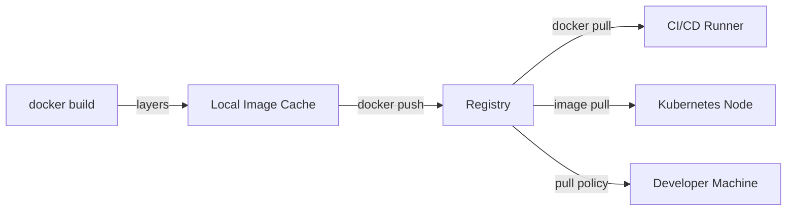

A container registry stores, versions, and distributes OCI-compliant container images. It is the artefact repository for the container world — the equivalent of npm, PyPI, or Maven for packages.

## How Registries Work



Images are transferred as compressed layer tarballs. The registry stores only unique layers — if two images share a base layer, it is stored once (content-addressable storage).

### Image Reference Anatomy

```
registry.example.com/namespace/repository:tag@sha256:digest
│                    │         │           │    └─ immutable content hash
│                    │         │           └─ mutable pointer (e.g. "latest")
│                    │         └─ image name (e.g. "myapp")
│                    └─ org / project / username
└─ registry hostname (omitted = docker.io)
```

**Always pin images by digest in production:**
```bash
# ✗ Mutable — "latest" can change
FROM node:20-alpine

# ✓ Immutable — specific tag
FROM node:20.14.0-alpine3.20

# ✓ Most immutable — content digest
FROM node:20-alpine@sha256:a0b1c2d3...
```

---

## Docker Hub

The default public registry — `docker.io`. Free tier with rate limits (100 pulls/6h anonymous, 200 pulls/6h free account).

```bash
# Login
docker login

# Push to Docker Hub
docker tag myapp:v1 myusername/myapp:v1
docker push myusername/myapp:v1

# Pull
docker pull myusername/myapp:v1
```

### Docker Hub Limits & Plans

| Plan | Pull Limit | Private Repos |
|---|---|---|
| Anonymous | 100/6h per IP | 0 |
| Free | 200/6h | 1 |
| Pro | Unlimited | Unlimited |
| Team / Business | Unlimited | Unlimited + RBAC |

Rate limit workaround for CI: authenticate with a service account or use a pull-through cache.

---

## AWS Elastic Container Registry (ECR)

Fully managed private registry, deeply integrated with AWS IAM, ECS, EKS, and CodePipeline.

```bash
# Authenticate (token valid for 12 hours)
aws ecr get-login-password --region us-east-1 \
  | docker login --username AWS \
    --password-stdin 123456789.dkr.ecr.us-east-1.amazonaws.com

# Create a repository
aws ecr create-repository --repository-name myapp --region us-east-1

# Tag and push
docker tag myapp:v1 123456789.dkr.ecr.us-east-1.amazonaws.com/myapp:v1
docker push 123456789.dkr.ecr.us-east-1.amazonaws.com/myapp:v1
```

### ECR Features

| Feature | Detail |
|---|---|
| Image scanning | Basic (on push) or Enhanced (continuous, powered by Inspector) |
| Lifecycle policies | Auto-expire old images (e.g. keep last 10 tagged, delete untagged after 1 day) |
| Immutable tags | Prevent tag overwriting — enforce by policy |
| Cross-account access | Resource-based IAM policies |
| Replication | Cross-region and cross-account |
| Pull-through cache | Cache Docker Hub, GCR, Quay images locally |

### ECR Lifecycle Policy Example

```json
{
  "rules": [
    {
      "rulePriority": 1,
      "description": "Delete untagged images older than 1 day",
      "selection": {
        "tagStatus": "untagged",
        "countType": "sinceImagePushed",
        "countUnit": "days",
        "countNumber": 1
      },
      "action": { "type": "expire" }
    },
    {
      "rulePriority": 2,
      "description": "Keep only the last 20 tagged images",
      "selection": {
        "tagStatus": "tagged",
        "tagPrefixList": ["v"],
        "countType": "imageCountMoreThan",
        "countNumber": 20
      },
      "action": { "type": "expire" }
    }
  ]
}
```

---

## GCP Artifact Registry

The successor to Google Container Registry (GCR). Supports Docker images plus other artifact formats (npm, Maven, Python, Helm charts).

```bash
# Configure Docker credential helper
gcloud auth configure-docker us-central1-docker.pkg.dev

# Push
docker tag myapp:v1 us-central1-docker.pkg.dev/my-project/my-repo/myapp:v1
docker push us-central1-docker.pkg.dev/my-project/my-repo/myapp:v1
```

### Artifact Registry Highlights

- Supports **Helm chart repositories** in addition to Docker
- **Binary Authorization** — policy enforcement before deploy (attestation-based)
- **Vulnerability scanning** — continuous scanning of stored images
- **VPC Service Controls** — restrict access to specific VPCs

---

## Azure Container Registry (ACR)

```bash
# Login
az acr login --name myregistry

# Push
docker tag myapp:v1 myregistry.azurecr.io/myapp:v1
docker push myregistry.azurecr.io/myapp:v1
```

### ACR Features

| Feature | Detail |
|---|---|
| Geo-replication | Multi-region active-active replication |
| Tasks | Cloud-based image builds triggered by git push or base image update |
| Content Trust | Notary v1 image signing |
| Defender for Containers | Vulnerability scanning |
| Private Link | Access via private endpoint only |

---

## Self-Hosted Registries

### Harbor

The most popular open-source enterprise registry. Features: RBAC, vulnerability scanning (Trivy), content trust, replication, Helm chart hosting, audit logs.

```bash
# Install via Helm
helm repo add harbor https://helm.goharbor.io
helm install harbor harbor/harbor \
  --set expose.type=ingress \
  --set expose.ingress.hosts.core=harbor.example.com \
  --set externalURL=https://harbor.example.com \
  --set harborAdminPassword=Admin12345
```

### Distribution (CNCF)

The reference implementation of the OCI Distribution Spec. Minimal, no UI — used as a building block.

```bash
# Run a local registry for testing
docker run -d -p 5000:5000 --name registry registry:2

# Push to it
docker tag myapp:v1 localhost:5000/myapp:v1
docker push localhost:5000/myapp:v1
```

### Comparison

| Registry | Hosted By | Auth | Scanning | RBAC | Helm |
|---|---|---|---|---|---|
| Docker Hub | Docker | Docker / SSO | ✓ (paid) | ✓ (paid) | ✗ |
| AWS ECR | AWS | IAM | ✓ | IAM Policies | ✗ |
| GCP Artifact Registry | GCP | IAM | ✓ | IAM | ✓ |
| Azure ACR | Azure | Entra ID | ✓ | RBAC | ✓ |
| Harbor | Self | LDAP / OIDC | ✓ (Trivy) | ✓ | ✓ |
| Quay.io | Red Hat | OIDC | ✓ | ✓ | ✗ |
| GitHub Container Registry (GHCR) | GitHub | GitHub | ✗ | Repository perms | ✗ |

---

## Image Tagging Strategies

| Strategy | Example | Notes |
|---|---|---|
| Semantic version | `myapp:1.4.2` | Clear, predictable, recommended |
| Git SHA | `myapp:a3f8c12` | Traceable to exact commit |
| Branch | `myapp:main` | Mutable — useful for dev environments |
| Environment | `myapp:prod` | Mutable — avoid in immutable deployments |
| Date | `myapp:2024-03-15` | Useful for daily builds |
| `latest` | `myapp:latest` | Mutable — never use in production K8s |

**Recommended: combine semver with git SHA:**
```
myapp:1.4.2-a3f8c12
```

---

## Security Best Practices

| Practice | How |
|---|---|
| Enable vulnerability scanning | ECR Enhanced / Artifact Registry scanning / Harbor + Trivy |
| Use immutable tags | Block tag overwrites (ECR: `imageTagMutability: IMMUTABLE`) |
| Sign images | Cosign (sigstore), Docker Content Trust, Binary Authorization |
| Least-privilege pull credentials | Separate push (CI) and pull (runtime) credentials |
| Private registries only in production | Never pull from Docker Hub in prod without a pull-through cache |
| Lifecycle policies | Auto-delete untagged and old images to reduce storage cost and attack surface |
| Network-restrict the registry | Private endpoints / VPC peering — no public internet access |
| Audit pull logs | All pulls should be logged and alertable |

### Signing with Cosign

```bash
# Install cosign
brew install cosign

# Sign after push (keyless via OIDC in CI)
cosign sign myregistry.azurecr.io/myapp:v1.0

# Verify before deploy
cosign verify myregistry.azurecr.io/myapp:v1.0 \
  --certificate-identity https://github.com/myorg/myapp/.github/workflows/release.yml@refs/tags/v1.0 \
  --certificate-oidc-issuer https://token.actions.githubusercontent.com
```
