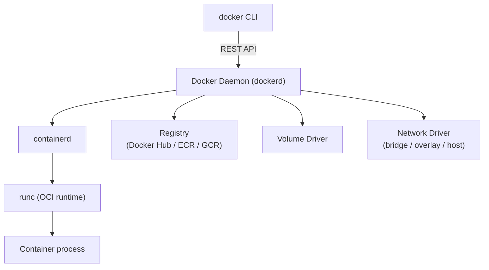
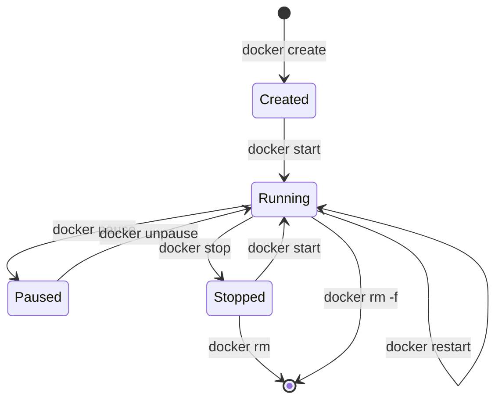

Docker is the most widely used container platform. It packages an application and all its dependencies into a portable image that runs identically across any Linux host (and on Windows/macOS via a Linux VM). Docker consists of a daemon (`dockerd`), a CLI (`docker`), and the container runtime (`containerd` + `runc`).

## Architecture



The Docker daemon is the long-running background service. The CLI communicates with it via a Unix socket (`/var/run/docker.sock`) or TCP.

---

## Images

An image is a read-only, layered filesystem snapshot. Images are identified by a name and tag: `nginx:1.25`, `python:3.12-slim`, `myapp:v2.3.1`.

### Pulling and Inspecting

```bash
docker pull nginx:1.25
docker image ls
docker image inspect nginx:1.25
docker history nginx:1.25          # show layers and sizes
```

### Image Naming Convention

```
[registry/][namespace/]name[:tag][@digest]

docker.io/library/nginx:1.25               # Docker Hub official
ghcr.io/myorg/myapp:latest                 # GitHub Container Registry
123456789.dkr.ecr.us-east-1.amazonaws.com/myapp:v1.0  # AWS ECR
```

---

## Dockerfile

A Dockerfile is the recipe to build an image. Each instruction creates a new immutable layer.

```dockerfile
# ✓ Multi-stage build — build stage separate from runtime stage
FROM node:20-alpine AS builder
WORKDIR /app
COPY package*.json ./
RUN npm ci --only=production

FROM node:20-alpine AS runtime
# ✓ Run as non-root
RUN addgroup -S appgroup && adduser -S appuser -G appgroup
WORKDIR /app
COPY --from=builder /app/node_modules ./node_modules
COPY --chown=appuser:appgroup . .
USER appuser
EXPOSE 3000
HEALTHCHECK --interval=30s --timeout=5s CMD wget -qO- http://localhost:3000/health || exit 1
CMD ["node", "server.js"]
```

### Key Instructions

| Instruction | Purpose |
|---|---|
| `FROM` | Base image (always first) |
| `WORKDIR` | Set working directory (creates if missing) |
| `COPY` | Copy files from build context |
| `ADD` | Like COPY, also supports URLs and tar extraction |
| `RUN` | Execute command in a new layer |
| `ENV` | Set environment variables |
| `ARG` | Build-time variables (not in final image) |
| `EXPOSE` | Document which port the app listens on |
| `HEALTHCHECK` | Define container health probe |
| `USER` | Switch to a non-root user |
| `ENTRYPOINT` | Fixed executable; CMD provides default args |
| `CMD` | Default command (overridable at `docker run`) |
| `VOLUME` | Declare a mount point for external storage |

### Layer Caching Best Practices

```dockerfile
# ✗ Bad — changing source code busts the npm install layer
COPY . .
RUN npm ci

# ✓ Good — package files change less often than source code
COPY package*.json ./
RUN npm ci
COPY . .
```

### Multi-Stage Builds

Keeps final images small — build tools stay in the builder stage:

```dockerfile
# Stage 1: compile
FROM golang:1.22 AS builder
WORKDIR /app
COPY go.* ./
RUN go mod download
COPY . .
RUN CGO_ENABLED=0 go build -o /bin/server ./cmd/server

# Stage 2: minimal runtime
FROM gcr.io/distroless/static-debian12
COPY --from=builder /bin/server /server
ENTRYPOINT ["/server"]
```

Result: a ~8 MB image instead of a ~800 MB Go build image.

---

## Running Containers

```bash
# Basic run
docker run nginx

# Detached with port mapping and name
docker run -d -p 8080:80 --name webserver nginx

# Interactive shell
docker run -it ubuntu bash

# Environment variables
docker run -e DATABASE_URL=postgres://... myapp

# Resource limits
docker run --memory=512m --cpus=1.5 myapp

# Mount a volume
docker run -v /host/path:/container/path myapp
docker run -v myvolume:/data postgres

# Read-only filesystem
docker run --read-only --tmpfs /tmp myapp
```

### Container Lifecycle



### Essential CLI Commands

```bash
# List running containers
docker ps

# List all containers including stopped
docker ps -a

# View logs
docker logs -f mycontainer

# Execute a command in a running container
docker exec -it mycontainer sh

# Copy files
docker cp mycontainer:/app/log.txt ./log.txt

# Resource stats
docker stats

# Stop / remove
docker stop mycontainer
docker rm mycontainer

# Remove all stopped containers
docker container prune
```

---

## Volumes & Storage

Containers have an ephemeral writable layer — all data is lost when the container is removed. Volumes persist data outside the container.

### Volume Types

| Type | Syntax | Use Case |
|---|---|---|
| Named Volume | `-v myvolume:/data` | Databases, persistent app data |
| Bind Mount | `-v /host/dir:/container/dir` | Development (live code reload) |
| tmpfs Mount | `--tmpfs /tmp` | Secrets, temp files — in-memory only |

```bash
# Create and inspect a named volume
docker volume create pgdata
docker volume inspect pgdata

# Run Postgres with persistent data
docker run -d \
  --name postgres \
  -e POSTGRES_PASSWORD=secret \
  -v pgdata:/var/lib/postgresql/data \
  postgres:16

# Backup a volume
docker run --rm \
  -v pgdata:/source:ro \
  -v $(pwd):/backup \
  busybox tar czf /backup/pgdata.tar.gz /source
```

---

## Networking

### Default Networks

```bash
docker network ls

# NETWORK ID   NAME      DRIVER    SCOPE
# abc123       bridge    bridge    local    ← default for standalone containers
# def456       host      host      local    ← share host network stack
# ghi789       none      null      local    ← no network
```

### Bridge Network (default)

Containers on the same bridge network can communicate by container name (DNS resolution built in):

```bash
docker network create mynet

docker run -d --name db --network mynet postgres
docker run -d --name app --network mynet \
  -e DATABASE_URL=postgres://postgres:secret@db:5432/mydb \
  myapp

# app can reach db at hostname "db"
```

### Host Network

Removes network namespace — the container uses the host's network stack directly:

```bash
docker run --network=host nginx
# Nginx listens on host port 80 directly — no port mapping needed
```

**Security note:** Host networking removes network isolation; use only when necessary (performance-critical or legacy apps).

### Port Mapping

```bash
# -p HOST_PORT:CONTAINER_PORT
docker run -p 8080:80 nginx        # map host 8080 → container 80
docker run -p 127.0.0.1:5432:5432 postgres  # bind only to localhost
docker run -P nginx                # auto-assign random host ports
```

---

## Image Build Best Practices

| Practice | Why |
|---|---|
| Use specific tags, not `latest` | `latest` is mutable — builds are not reproducible |
| Use minimal base images (Alpine, distroless) | Smaller attack surface, faster pulls |
| Multi-stage builds | Exclude build tools from production image |
| Run as non-root | Reduces blast radius of container escape |
| Set `HEALTHCHECK` | Orchestrators know when to restart |
| Pin `RUN apt-get` to specific versions | Prevents supply-chain drift |
| Use `.dockerignore` | Exclude `node_modules`, `.git`, secrets from context |
| Avoid `ADD` with URLs | Use `COPY` + build-time `curl` for auditability |

### .dockerignore Example

```
.git
.github
node_modules
*.log
.env
.env.*
__pycache__
*.pyc
dist/
coverage/
```

---

## Useful Shortcuts

```bash
# Build with tag
docker build -t myapp:v1.0 .

# Build targeting a specific stage
docker build --target builder -t myapp:build .

# Push to registry
docker push myregistry/myapp:v1.0

# Remove unused images/containers/networks/volumes
docker system prune -af --volumes

# View disk usage
docker system df

# Format output with Go templates
docker ps --format "table {{.Names}}\t{{.Status}}\t{{.Ports}}"
```
