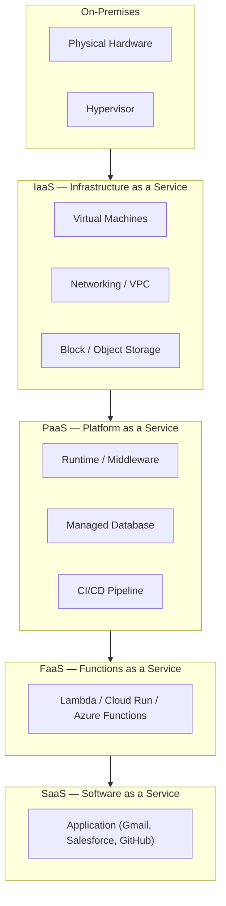
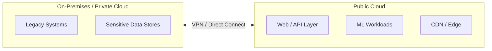
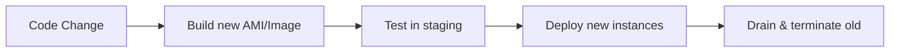
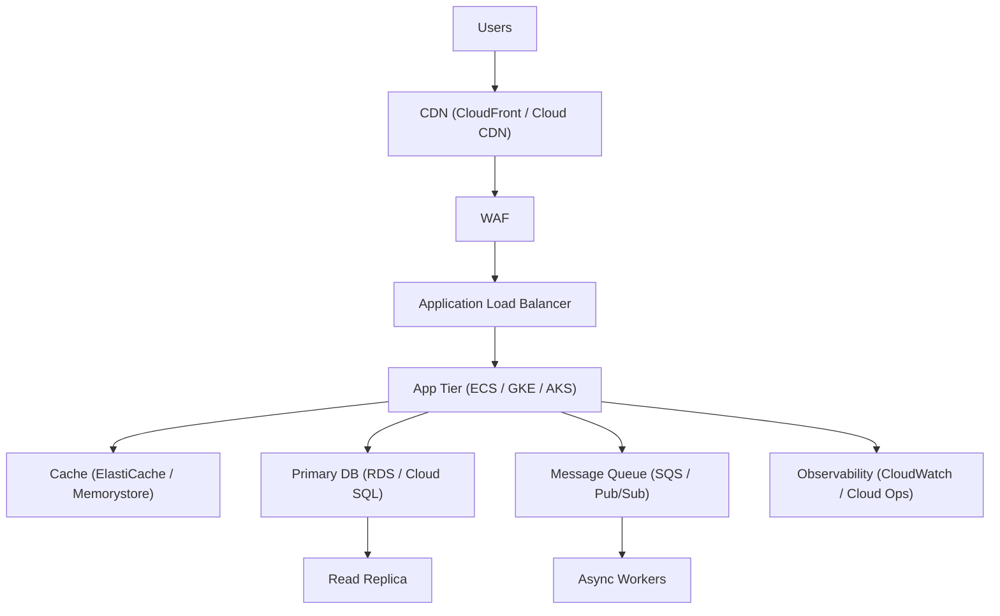

Cloud computing delivers on-demand access to computing resources — servers, storage, databases, networking, software — over the internet, replacing the need to own and operate physical data centres. Understanding the layered service models and deployment strategies is the prerequisite for every architectural decision that follows.

## Service Models

The cloud stack is divided into layers of managed responsibility. The higher up the stack you go, the less infrastructure you manage.



### IaaS — Infrastructure as a Service

You manage: OS, runtime, middleware, applications.  
Provider manages: physical hardware, hypervisor, networking fabric.

| Service | AWS | GCP | Azure |
|---|---|---|---|
| Compute | EC2 | Compute Engine | Virtual Machines |
| Block Storage | EBS | Persistent Disk | Managed Disks |
| Object Storage | S3 | Cloud Storage | Blob Storage |
| Virtual Network | VPC | VPC | Virtual Network |
| Load Balancer | ALB / NLB | Cloud Load Balancing | Azure Load Balancer |

**When to use IaaS:** You need OS-level control, custom kernel modules, legacy software that won't containerise, or BYOL licensing.

### PaaS — Platform as a Service

You manage: application code and configuration.  
Provider manages: OS, runtime, scaling, patching, networking.

| Service | AWS | GCP | Azure |
|---|---|---|---|
| App Platform | Elastic Beanstalk | App Engine | App Service |
| Managed K8s | EKS | GKE | AKS |
| Managed DB | RDS / Aurora | Cloud SQL | Azure SQL |
| Serverless containers | Fargate | Cloud Run | Container Apps |

**When to use PaaS:** You want to ship features without managing servers; good for startups and teams without dedicated ops.

### FaaS — Functions as a Service (Serverless)

Event-triggered, stateless functions billed per invocation. No server management whatsoever.

```python
# AWS Lambda handler (Python)
import json

def handler(event, context):
    body = json.loads(event['body'])
    result = process(body['data'])
    return {
        'statusCode': 200,
        'body': json.dumps({'result': result})
    }
```

**Constraints:** Cold starts, execution time limits (15 min on Lambda), stateless by design, vendor lock-in on triggers/bindings.

### SaaS — Software as a Service

Fully managed applications consumed via browser or API. You manage only data and configuration (user accounts, permissions, integrations).

Examples: GitHub, Slack, Datadog, Snowflake, Salesforce.

---

## Deployment Models

### Public Cloud

Infrastructure shared across thousands of tenants, owned and operated by the provider. Multi-tenancy is isolated at the software/hypervisor layer.

**Pros:** No upfront cost, infinite scalability, global PoPs, managed services for everything.  
**Cons:** Data residency concerns, egress costs, limited customisation, vendor dependency.

### Private Cloud

Infrastructure dedicated to a single organisation — either on-premises (OpenStack, VMware vSphere) or single-tenant hosted (AWS Dedicated Hosts, IBM Cloud Dedicated).

**Pros:** Full control, meets strict compliance requirements (ITAR, FedRAMP High, certain healthcare regulations).  
**Cons:** High capex, requires dedicated ops team, slow provisioning compared to public cloud.

### Hybrid Cloud

Combination of on-premises (or private cloud) and public cloud, connected via VPN or dedicated links (AWS Direct Connect, Azure ExpressRoute, GCP Interconnect).



**Common pattern:** Sensitive data and regulated workloads stay on-premises; elastic compute, ML training, and CDN run in the public cloud.

### Multi-Cloud

Workloads spread across two or more public cloud providers intentionally (not just SaaS).

**Pros:** Avoid vendor lock-in, leverage best-of-breed services, geographic redundancy.  
**Cons:** Operational complexity, inconsistent IAM models, data gravity keeps services co-located anyway.

---

## Major Cloud Providers

### AWS (Amazon Web Services)

Largest market share (~33%). Broadest service catalogue. Strengths: mature ecosystem, widest region coverage, most third-party tooling support.

Key services: EC2, S3, RDS, Lambda, EKS, CloudFront, IAM, CloudWatch, SQS/SNS, DynamoDB.

### GCP (Google Cloud Platform)

~12% market share. Strengths: data/ML (BigQuery, Vertex AI), Kubernetes (invented it), global fibre network, per-second billing.

Key services: GCE, GCS, Cloud SQL, GKE, Cloud Run, BigQuery, Pub/Sub, Cloud Spanner.

### Azure (Microsoft Azure)

~23% market share. Strengths: enterprise Windows/.NET integration, Active Directory/Entra ID, hybrid (Arc), Government clouds.

Key services: VMs, Blob Storage, Azure SQL, AKS, Azure Functions, Entra ID, Azure DevOps.

### Others

| Provider | Strength |
|---|---|
| Oracle Cloud (OCI) | Oracle DB workloads, aggressive pricing |
| IBM Cloud | Mainframe integration, regulated industries |
| Alibaba Cloud | APAC, Chinese market |
| Hetzner / DigitalOcean | Cost-effective IaaS for smaller workloads |

---

## Cloud-Native Patterns

### The Twelve-Factor App

Methodology for building portable, scalable services:

| Factor | Practice |
|---|---|
| Codebase | One repo per service, tracked in version control |
| Dependencies | Explicitly declare and isolate |
| Config | Store in environment variables, not code |
| Backing services | Treat as attached resources (swappable) |
| Build, release, run | Strict separation of stages |
| Processes | Stateless; store state in backing services |
| Port binding | Export services via port |
| Concurrency | Scale out via the process model |
| Disposability | Fast startup and graceful shutdown |
| Dev/prod parity | Keep environments as similar as possible |
| Logs | Treat as event streams |
| Admin processes | Run as one-off processes |

### Immutable Infrastructure

Never modify running servers. Build a new image, deploy it, destroy the old one.



Benefits: eliminates configuration drift, makes rollback trivial (redeploy previous image), aligns with container philosophy.

### Shared Responsibility Model

Security responsibilities are divided between provider and customer:

| Layer | Public Cloud Customer Owns | Provider Owns |
|---|---|---|
| Data | Classification, encryption, access control | — |
| Identity | IAM policies, MFA, credential rotation | Identity infrastructure |
| Applications | Patching app dependencies, secure coding | — |
| OS | Patching (IaaS), hardening | — (managed for PaaS/SaaS) |
| Network | Security groups, VPC config, WAF | Physical network, DDoS |
| Physical | — | Data centre, hardware |

---

## Cost Management

### Key Concepts

- **On-Demand:** Pay per second/hour, no commitment. Highest unit price.
- **Reserved Instances / Committed Use:** 1–3 year commitment, up to 72% discount.
- **Spot / Preemptible:** Spare capacity, up to 90% discount, can be reclaimed with 2-minute notice.
- **Savings Plans (AWS):** Flexible commitment to $/hour of compute, applies across instance families.

### Cost Optimisation Checklist

| Area | Action |
|---|---|
| Compute | Right-size instances; use Spot for batch workloads |
| Storage | Move infrequently accessed data to cold tiers (S3 Glacier, Nearline) |
| Data transfer | Keep traffic within regions; use CDN for static assets |
| Databases | Use read replicas; enable auto-pause for dev DBs |
| Containers | Pack pods tightly; use node auto-provisioner |
| Idle resources | Tag and alert on unattached EBS volumes, idle EIPs, stopped VMs |

---

## Cloud Reference Architecture


