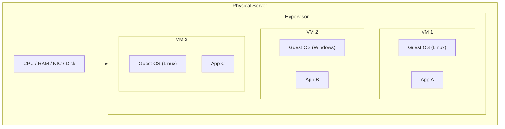
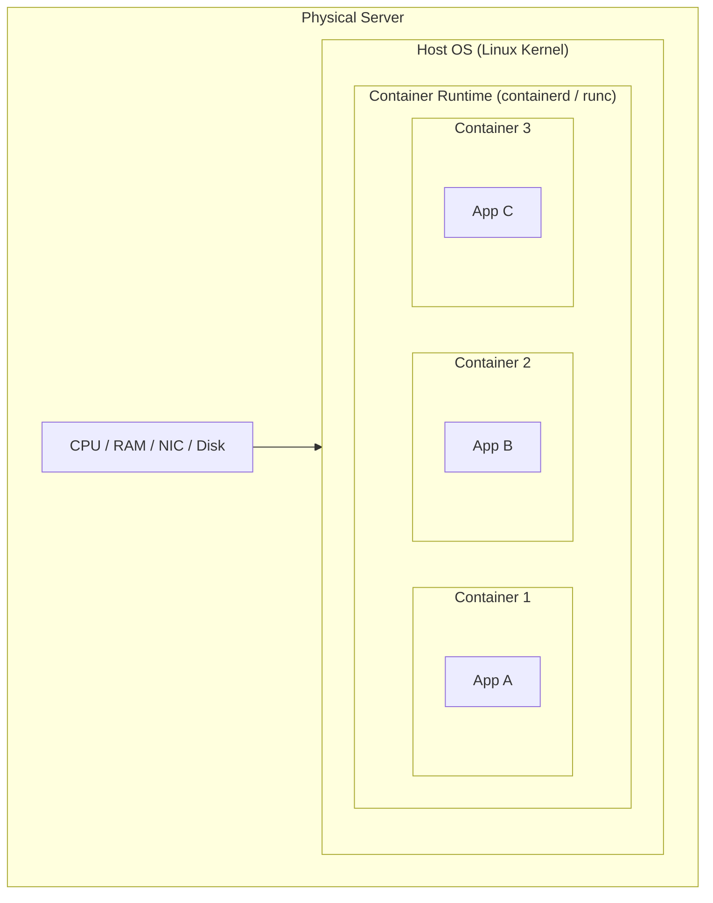
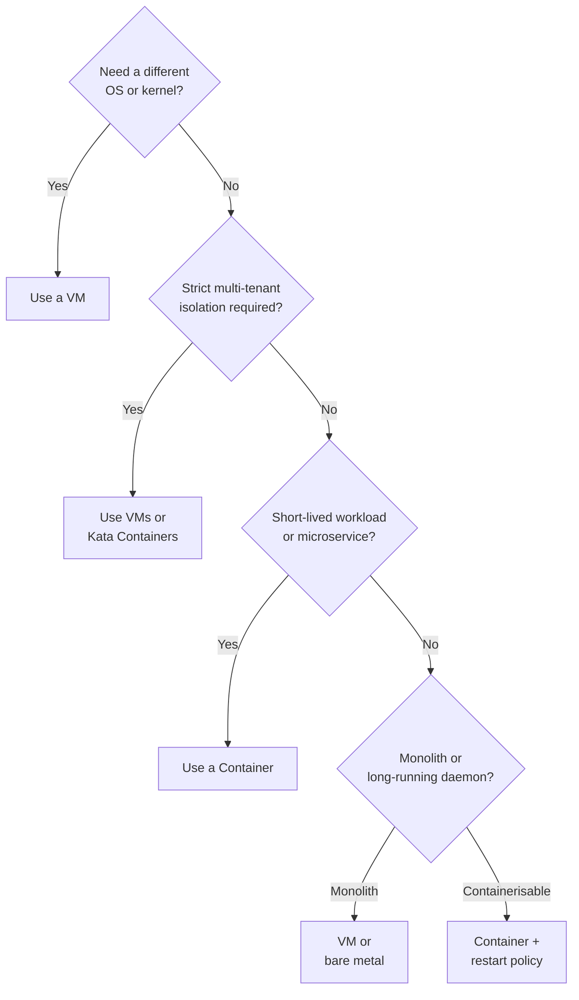

---
title: "Virtualization & Containers"
description: "How hypervisors and containers virtualise hardware and OS resources, the differences between VMs and containers, and when to use each."
---

import { Tabs, TabItem } from '@astrojs/starlight/components';
import { Aside, Card, CardGrid, Steps, Badge } from '@astrojs/starlight/components';


Virtualisation decouples software from the physical hardware it runs on. Two dominant abstractions exist: **virtual machines** (full hardware emulation via a hypervisor) and **containers** (OS-level process isolation via Linux kernel namespaces and cgroups). Understanding both is essential for choosing the right isolation boundary.

## Virtual Machines

A VM is a complete emulation of a physical computer — it has its own kernel, init system, and full OS userland. The **hypervisor** (Virtual Machine Monitor) multiplexes hardware across multiple VMs.



### Type 1 Hypervisors (Bare Metal)

Run directly on hardware. No host OS between the hypervisor and the physical resources — maximum performance and isolation.

| Hypervisor | Vendor | Common Use |
|---|---|---|
| VMware ESXi | Broadcom | Enterprise data centres |
| Microsoft Hyper-V | Microsoft | Windows Server, Azure |
| KVM (Kernel-based VM) | Linux kernel | Red Hat, AWS EC2, GCP |
| Xen | Linux Foundation | AWS EC2 (older), Citrix |

### Type 2 Hypervisors (Hosted)

Run as an application on top of a host OS. Lower performance but easier for development.

| Hypervisor | Use |
|---|---|
| VirtualBox | Cross-platform dev environments |
| VMware Workstation / Fusion | Dev, testing |
| Parallels Desktop | macOS development |
| QEMU | Emulation, CI, embedded dev |

### VM Overhead

Each VM carries the full OS weight:
- Disk: typically 5–30 GB per VM just for the OS
- RAM: kernel + system processes use 200 MB–1 GB before the application starts
- Boot time: 30 seconds to several minutes
- CPU: hardware virtualisation extensions (Intel VT-x / AMD-V) reduce overhead but vCPU scheduling adds latency

---

## Containers

Containers share the host OS kernel but isolate processes using Linux primitives. There is no separate kernel, no boot sequence — a container starts in milliseconds.



### Linux Kernel Primitives

#### Namespaces (Isolation)

| Namespace | Isolates |
|---|---|
| `pid` | Process IDs — container has its own PID 1 |
| `net` | Network interfaces, routing tables, ports |
| `mnt` | Filesystem mount points |
| `uts` | Hostname and domain name |
| `ipc` | System V IPC, POSIX message queues |
| `user` | UIDs and GIDs (rootless containers) |
| `cgroup` | cgroup root (v2) |

#### cgroups (Resource Control)

Control Groups limit and account for resource consumption:

```bash
# View cgroup limits for a container (Docker sets these automatically)
cat /sys/fs/cgroup/memory/docker/<container-id>/memory.limit_in_bytes
cat /sys/fs/cgroup/cpu/docker/<container-id>/cpu.shares
```

Docker resource limits in a run command:
```bash
docker run \
  --memory="512m" \
  --cpus="1.5" \
  --pids-limit=100 \
  nginx
```

#### Union Filesystems (OverlayFS)

Container images are layered. Each `RUN` instruction in a Dockerfile adds a layer. Layers are read-only; a thin writable layer sits on top for runtime changes.

```
Image: nginx:1.25
├── Layer 0: debian:bookworm-slim (base OS binaries)
├── Layer 1: nginx package installed
├── Layer 2: nginx config files
└── (writable container layer — discarded on stop unless volume)
```

Shared layers are deduplicated on disk and in memory, making containers extremely space-efficient.

---

## VMs vs Containers

| Dimension | Virtual Machine | Container |
|---|---|---|
| Isolation | Full hardware boundary | Kernel namespace boundary |
| Security boundary | Strongest (separate kernel) | Weaker (shared kernel — kernel exploits escape) |
| Startup time | 30 s – 5 min | < 1 s |
| Image size | 2–30 GB | 5 MB – 1 GB |
| OS overhead | Separate kernel + init per VM | Shared host kernel |
| Density | 10s per physical host | 100s–1000s per node |
| Portability | Portable (OVF), but large | Highly portable (OCI standard) |
| Stateful storage | Simple (disk attached per VM) | Requires volume management |
| Networking | Full virtual NIC | Shared network namespace |

### Choosing the Right Abstraction



---

## Container Runtimes

The OCI (Open Container Initiative) defines the image and runtime specifications. Multiple runtimes implement it:

| Runtime | Notes |
|---|---|
| **runc** | Reference OCI runtime; used by Docker and containerd |
| **containerd** | Industry-standard daemon; used by Docker, Kubernetes |
| **CRI-O** | Lightweight Kubernetes-specific runtime |
| **Kata Containers** | OCI-compatible but runs each container in a lightweight VM — stronger isolation |
| **gVisor (runsc)** | Syscall interception in userspace (Google); used on GKE Sandbox |

### Runtime Hierarchy (Kubernetes)

```
kubectl → kube-apiserver
           └─ kubelet
               └─ CRI (containerd / CRI-O)
                   └─ runc / kata / gvisor
```

---

## Kata Containers & gVisor (Secure Runtimes)

When you need container density but stronger isolation than standard namespaces:

- **Kata Containers:** Each container/pod runs in a lightweight VM (QEMU or Cloud Hypervisor). Full kernel isolation. ~100–200 ms startup overhead.
- **gVisor:** Intercepts syscalls in a Go-based sandbox kernel (Sentry). No separate VM — but the container's syscalls never reach the host kernel directly.

Both are transparent to the application but impose a performance penalty on syscall-heavy workloads.

---

## Key Takeaways

| Principle | Detail |
|---|---|
| Containers are not VMs | They share the host kernel — a kernel exploit breaks containment |
| Layers are immutable | Only the top writable layer changes at runtime |
| cgroups limit resources | Without limits, one container can starve all others |
| Namespaces provide isolation | Not a security boundary — just process separation |
| OCI is the standard | Images built with Docker run on containerd, Podman, CRI-O |
| Use VMs for strong tenancy | Multi-tenant SaaS, untrusted code execution → VMs or secure runtimes |
