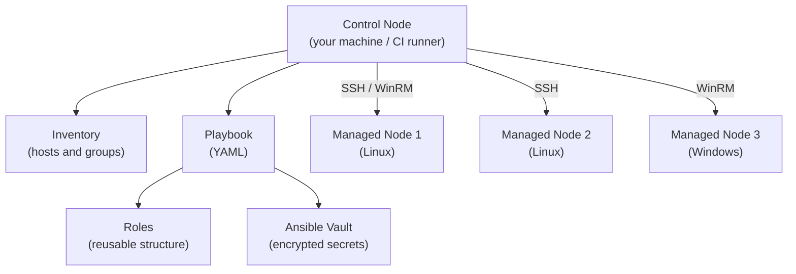

import \{ Tabs, TabItem \} from '@astrojs/starlight/components';
import \{ Aside, Card, CardGrid, Steps, Badge \} from '@astrojs/starlight/components';


Ansible is an agentless automation tool for configuration management, application deployment, and orchestration. It uses SSH (or WinRM for Windows) to connect to target hosts and execute tasks defined in human-readable YAML **playbooks**. No agent software is required on managed nodes — only Python.

## Architecture



Ansible is **push-based** — the control node initiates connections. Compare with Chef/Puppet which are pull-based with agents.

---

## Inventory

The inventory defines which hosts Ansible manages and how to reach them.

### Static Inventory (INI format)

```ini
# inventory/hosts.ini

[webservers]
web1.example.com
web2.example.com ansible_user=ubuntu ansible_ssh_private_key_file=~/.ssh/web.pem

[dbservers]
db1.example.com
db2.example.com

[production:children]
webservers
dbservers

[production:vars]
ansible_python_interpreter=/usr/bin/python3
env=production
```

### Static Inventory (YAML format)

```yaml
# inventory/hosts.yaml
all:
  children:
    webservers:
      hosts:
        web1.example.com:
          ansible_user: ubuntu
        web2.example.com:
          ansible_user: ubuntu
    dbservers:
      hosts:
        db1.example.com:
          ansible_port: 2222
      vars:
        db_port: 5432
  vars:
    ansible_python_interpreter: /usr/bin/python3
```

### Dynamic Inventory

For cloud environments, Ansible can query the cloud API for inventory:

```bash
# AWS EC2 dynamic inventory
pip install boto3
ansible-inventory -i aws_ec2.yaml --list

# aws_ec2.yaml
plugin: amazon.aws.aws_ec2
regions:
  - us-east-1
filters:
  tag:Environment:
    - production
keyed_groups:
  - key: tags.Role
    prefix: role
```

---

## Playbooks

A playbook is a list of plays. Each play maps a group of hosts to a set of tasks.

```yaml
# playbooks/deploy-web.yaml
---
- name: Deploy web application
  hosts: webservers
  become: true             # sudo escalation
  gather_facts: true       # collect host facts (OS, IP, etc.)
  vars:
    app_version: "1.2.3"
    app_port: 3000

  pre_tasks:
    - name: Update apt cache
      ansible.builtin.apt:
        update_cache: true
        cache_valid_time: 3600

  tasks:
    - name: Ensure application directory exists
      ansible.builtin.file:
        path: /opt/myapp
        state: directory
        owner: www-data
        group: www-data
        mode: "0755"

    - name: Copy application binary
      ansible.builtin.copy:
        src: "dist/myapp-{{ app_version }}"
        dest: /opt/myapp/myapp
        owner: www-data
        mode: "0755"
      notify: Restart myapp

    - name: Deploy systemd service file
      ansible.builtin.template:
        src: myapp.service.j2
        dest: /etc/systemd/system/myapp.service
        mode: "0644"
      notify: Restart myapp

    - name: Ensure myapp service is enabled and running
      ansible.builtin.systemd:
        name: myapp
        enabled: true
        state: started
        daemon_reload: true

  handlers:
    - name: Restart myapp
      ansible.builtin.systemd:
        name: myapp
        state: restarted

  post_tasks:
    - name: Verify application is responding
      ansible.builtin.uri:
        url: "http://localhost:{{ app_port }}/health"
        status_code: 200
      retries: 5
      delay: 5
```

---

## Core Modules

| Module | Purpose | Example |
|---|---|---|
| `ansible.builtin.apt` | Manage APT packages | `name: nginx state: present` |
| `ansible.builtin.yum` / `dnf` | Manage RPM packages | |
| `ansible.builtin.package` | Distro-agnostic package | |
| `ansible.builtin.copy` | Copy files to hosts | |
| `ansible.builtin.template` | Render Jinja2 templates | |
| `ansible.builtin.file` | Manage files/dirs/links | |
| `ansible.builtin.lineinfile` | Manage lines in files | |
| `ansible.builtin.systemd` | Manage systemd services | |
| `ansible.builtin.service` | Distro-agnostic service | |
| `ansible.builtin.user` | Manage user accounts | |
| `ansible.builtin.group` | Manage groups | |
| `ansible.builtin.cron` | Manage cron jobs | |
| `ansible.builtin.git` | Clone / update git repos | |
| `ansible.builtin.uri` | HTTP requests | |
| `ansible.builtin.command` | Run a command (no shell) | |
| `ansible.builtin.shell` | Run via shell | |
| `ansible.builtin.script` | Run local script on remote | |
| `ansible.builtin.assert` | Validate conditions | |
| `ansible.builtin.debug` | Print debug messages | |
| `ansible.builtin.set_fact` | Set variables at runtime | |
| `ansible.builtin.include_tasks` | Include task files dynamically | |

---

## Variables

Variables can be defined in many places with a priority order (later overrides earlier):

```
1. role defaults
2. inventory group_vars/all
3. inventory group_vars/<group>
4. inventory host_vars/<host>
5. play vars
6. play vars_files
7. role vars
8. block vars
9. task vars
10. extra vars (ansible-playbook -e) ← highest priority
```

### Variable Files

```
inventory/
├── hosts.yaml
├── group_vars/
│   ├── all.yaml          # applies to all hosts
│   ├── webservers.yaml   # applies to webservers group
│   └── production.yaml   # applies to production group
└── host_vars/
    └── web1.example.com.yaml  # host-specific vars
```

```yaml
# group_vars/all.yaml
ntp_servers:
  - ntp1.example.com
  - ntp2.example.com
timezone: UTC
ansible_python_interpreter: /usr/bin/python3

# group_vars/webservers.yaml
nginx_worker_processes: auto
nginx_worker_connections: 1024
app_port: 3000
```

### Using Variables

```yaml
tasks:
  - name: Set timezone
    community.general.timezone:
      name: "{{ timezone }}"

  - name: Configure nginx
    ansible.builtin.template:
      src: nginx.conf.j2
      dest: /etc/nginx/nginx.conf
    # In nginx.conf.j2:
    # worker_processes {{ nginx_worker_processes }};
    # worker_connections {{ nginx_worker_connections }};
```

---

## Roles

Roles provide a standardised way to organise tasks, variables, handlers, and files into a reusable unit.

```
roles/
└── nginx/
    ├── defaults/
    │   └── main.yaml      # role default variables (lowest priority)
    ├── vars/
    │   └── main.yaml      # role variables (higher priority than defaults)
    ├── tasks/
    │   ├── main.yaml      # task entry point
    │   ├── install.yaml
    │   └── configure.yaml
    ├── handlers/
    │   └── main.yaml
    ├── templates/
    │   └── nginx.conf.j2
    ├── files/
    │   └── default.html
    ├── meta/
    │   └── main.yaml      # role metadata and dependencies
    └── README.md
```

Using roles in a playbook:
```yaml
- name: Configure web servers
  hosts: webservers
  roles:
    - common
    - { role: nginx, nginx_port: 8080 }
    - role: myapp
      vars:
        app_version: "1.2.3"
```

---

## Ansible Vault

Vault encrypts sensitive data (passwords, API keys, certificates) at rest.

```bash
# Create an encrypted file
ansible-vault create secrets.yaml

# Edit an existing encrypted file
ansible-vault edit group_vars/production/vault.yaml

# Encrypt an existing file
ansible-vault encrypt group_vars/all/secrets.yaml

# Decrypt to view
ansible-vault decrypt --output - secrets.yaml

# Re-key (change password)
ansible-vault rekey secrets.yaml

# Encrypt a single value (embed in YAML)
ansible-vault encrypt_string 'mySecretPassword' --name 'db_password'
# Outputs:
# db_password: !vault |
#   $ANSIBLE_VAULT;1.1;AES256
#   ...
```

```bash
# Run playbook with vault password
ansible-playbook site.yaml --ask-vault-pass
ansible-playbook site.yaml --vault-password-file ~/.vault_pass
# Or set env var:
export ANSIBLE_VAULT_PASSWORD_FILE=~/.vault_pass
```

---

## Control Flow

### Conditions

```yaml
tasks:
  - name: Install packages (Debian)
    ansible.builtin.apt:
      name: nginx
    when: ansible_os_family == "Debian"

  - name: Install packages (RedHat)
    ansible.builtin.yum:
      name: nginx
    when: ansible_os_family == "RedHat"

  - name: Deploy only in production
    ansible.builtin.copy:
      src: prod.conf
      dest: /etc/app.conf
    when:
      - env == "production"
      - app_version is defined
```

### Loops

```yaml
tasks:
  - name: Install multiple packages
    ansible.builtin.package:
      name: "{{ item }}"
      state: present
    loop:
      - nginx
      - curl
      - jq
      - htop

  - name: Create user accounts
    ansible.builtin.user:
      name: "{{ item.name }}"
      groups: "{{ item.groups }}"
      shell: /bin/bash
    loop:
      - { name: alice, groups: "sudo,docker" }
      - { name: bob, groups: "docker" }
```

### Error Handling

```yaml
tasks:
  - name: Try to connect to service
    ansible.builtin.uri:
      url: http://myservice/health
    register: health_check
    failed_when: health_check.status != 200
    ignore_errors: true

  - name: Show result
    ansible.builtin.debug:
      msg: "Service responded: {{ health_check.status }}"
    when: health_check is not failed

  - name: Fail explicitly if critical condition
    ansible.builtin.fail:
      msg: "Critical: service is down in production!"
    when:
      - health_check is failed
      - env == "production"
```

---

## CLI Reference

```bash
# Run a playbook
ansible-playbook -i inventory/hosts.yaml playbooks/deploy.yaml

# Limit to specific hosts or groups
ansible-playbook site.yaml --limit webservers
ansible-playbook site.yaml --limit "web1.example.com,web2.example.com"

# Only run specific tags
ansible-playbook site.yaml --tags "install,configure"
ansible-playbook site.yaml --skip-tags "cleanup"

# Dry run (check mode)
ansible-playbook site.yaml --check

# Show diffs of changed files
ansible-playbook site.yaml --diff

# Extra variables
ansible-playbook site.yaml -e "app_version=1.2.3 env=staging"
ansible-playbook site.yaml -e @extra_vars.yaml

# Run ad-hoc commands (without a playbook)
ansible webservers -i inventory/hosts.yaml -m ping
ansible all -m command -a "uptime"
ansible webservers -m service -a "name=nginx state=restarted" --become

# Gather facts
ansible web1.example.com -m setup
ansible web1.example.com -m setup -a "filter=ansible_distribution*"
```

---

## Best Practices

| Practice | Why |
|---|---|
| Use roles for reusable logic | Roles can be shared via Ansible Galaxy |
| Encrypt secrets with Vault | Never commit plaintext passwords |
| Use `become` only where needed | Minimal privilege |
| Always `register` and check return values | Detect silent failures |
| Use `check` + `diff` in CI | Catch unintended changes before applying |
| Idempotent tasks only | Running twice should produce the same result |
| Tag tasks logically | Enable partial runs (`--tags`) for fast iteration |
| Prefer `package`, `service` over `apt`/`yum` | Portability across distros |
| Use `ansible-lint` | Catch style and logic errors before running |
| Store inventory in version control | Treat infrastructure as code |
