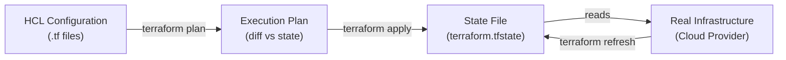

import \{ Tabs, TabItem \} from '@astrojs/starlight/components';
import \{ Aside, Card, CardGrid, Steps, Badge \} from '@astrojs/starlight/components';


Terraform is the most widely used Infrastructure as Code (IaC) tool. It lets you define cloud infrastructure in declarative HCL (HashiCorp Configuration Language), plan changes before applying them, and maintain a **state file** that maps your configuration to real-world resources. Terraform is provider-agnostic — it works with AWS, GCP, Azure, Kubernetes, GitHub, Datadog, and hundreds more.

## Core Concepts



| Concept | Description |
|---|---|
| **Provider** | Plugin that interfaces with an API (AWS, GCP, Azure, etc.) |
| **Resource** | Infrastructure object to create/manage (VM, bucket, DNS record) |
| **Data Source** | Read existing infrastructure without managing it |
| **Variable** | Input parameter for a configuration |
| **Output** | Exported values after apply |
| **State** | JSON file tracking what Terraform has created |
| **Module** | Reusable grouping of resources |
| **Workspace** | Isolated state namespace for the same config |

---

## Project Structure

```
infra/
├── main.tf          # main resources
├── providers.tf     # provider configuration
├── variables.tf     # input variable declarations
├── outputs.tf       # output declarations
├── locals.tf        # local computed values
├── versions.tf      # provider and Terraform version constraints
├── terraform.tfvars # variable values (git-ignored for secrets)
└── modules/
    ├── vpc/
    │   ├── main.tf
    │   ├── variables.tf
    │   └── outputs.tf
    └── eks/
        ├── main.tf
        ├── variables.tf
        └── outputs.tf
```

---

## Providers

```hcl
# versions.tf
terraform {
  required_version = ">= 1.8.0"

  required_providers {
    aws = {
      source  = "hashicorp/aws"
      version = "~> 5.0"    # ~> allows patch and minor updates
    }
    kubernetes = {
      source  = "hashicorp/kubernetes"
      version = ">= 2.25"
    }
  }

  # Remote state backend (see State section)
  backend "s3" {
    bucket         = "mycompany-terraform-state"
    key            = "production/main.tfstate"
    region         = "us-east-1"
    dynamodb_table = "terraform-state-lock"
    encrypt        = true
  }
}

# providers.tf
provider "aws" {
  region = var.aws_region

  default_tags {
    tags = {
      ManagedBy   = "Terraform"
      Environment = var.environment
      Owner       = "platform-team"
    }
  }
}
```

---

## Resources

```hcl
# VPC
resource "aws_vpc" "main" {
  cidr_block           = "10.0.0.0/16"
  enable_dns_hostnames = true
  enable_dns_support   = true

  tags = {
    Name = "${var.environment}-vpc"
  }
}

# Subnet
resource "aws_subnet" "public" {
  count             = length(var.availability_zones)
  vpc_id            = aws_vpc.main.id         # reference to another resource
  cidr_block        = cidrsubnet("10.0.0.0/16", 8, count.index)
  availability_zone = var.availability_zones[count.index]

  map_public_ip_on_launch = true

  tags = {
    Name = "${var.environment}-public-${count.index + 1}"
    "kubernetes.io/role/elb" = "1"    # required for EKS load balancers
  }
}

# Security Group
resource "aws_security_group" "web" {
  name        = "${var.environment}-web-sg"
  description = "Allow HTTPS inbound"
  vpc_id      = aws_vpc.main.id

  ingress {
    from_port   = 443
    to_port     = 443
    protocol    = "tcp"
    cidr_blocks = ["0.0.0.0/0"]
  }

  egress {
    from_port   = 0
    to_port     = 0
    protocol    = "-1"
    cidr_blocks = ["0.0.0.0/0"]
  }
}

# EC2 Instance
resource "aws_instance" "web" {
  ami                    = data.aws_ami.ubuntu.id
  instance_type          = var.instance_type
  subnet_id              = aws_subnet.public[0].id
  vpc_security_group_ids = [aws_security_group.web.id]
  key_name               = aws_key_pair.deployer.key_name

  root_block_device {
    volume_size = 20
    encrypted   = true
  }

  user_data = templatefile("${path.module}/user_data.sh.tpl", {
    environment = var.environment
  })

  lifecycle {
    create_before_destroy = true    # zero-downtime replacement
    ignore_changes        = [ami]   # don't update if AMI changes
  }
}
```

---

## Data Sources

Read existing infrastructure without managing it:

```hcl
# Look up the latest Ubuntu 24.04 AMI
data "aws_ami" "ubuntu" {
  most_recent = true
  owners      = ["099720109477"]  # Canonical

  filter {
    name   = "name"
    values = ["ubuntu/images/hvm-ssd-gp3/ubuntu-noble-24.04-amd64-server-*"]
  }

  filter {
    name   = "virtualization-type"
    values = ["hvm"]
  }
}

# Reference an existing VPC (not managed by this config)
data "aws_vpc" "shared" {
  tags = {
    Name = "shared-services-vpc"
  }
}

# Read SSM Parameter Store
data "aws_ssm_parameter" "db_password" {
  name = "/production/myapp/db-password"
}
```

---

## Variables

```hcl
# variables.tf
variable "aws_region" {
  description = "AWS region to deploy into"
  type        = string
  default     = "us-east-1"

  validation {
    condition     = can(regex("^[a-z]+-[a-z]+-[0-9]$", var.aws_region))
    error_message = "Must be a valid AWS region (e.g. us-east-1)."
  }
}

variable "environment" {
  description = "Deployment environment"
  type        = string

  validation {
    condition     = contains(["development", "staging", "production"], var.environment)
    error_message = "Must be development, staging, or production."
  }
}

variable "instance_type" {
  type    = string
  default = "t3.micro"
}

variable "availability_zones" {
  type    = list(string)
  default = ["us-east-1a", "us-east-1b", "us-east-1c"]
}

variable "tags" {
  type    = map(string)
  default = {}
}

# Sensitive variable — value hidden in plan/apply output
variable "db_password" {
  type      = string
  sensitive = true
}
```

```hcl
# terraform.tfvars (git-ignored)
environment    = "production"
aws_region     = "us-east-1"
instance_type  = "t3.medium"

# Pass sensitive values via environment variables:
# export TF_VAR_db_password="secret"
```

---

## Outputs

```hcl
# outputs.tf
output "vpc_id" {
  description = "ID of the created VPC"
  value       = aws_vpc.main.id
}

output "public_subnet_ids" {
  description = "List of public subnet IDs"
  value       = aws_subnet.public[*].id
}

output "web_instance_ip" {
  description = "Public IP of the web server"
  value       = aws_instance.web.public_ip
}

output "db_connection_string" {
  description = "Database connection string"
  value       = "postgres://${aws_db_instance.main.username}@${aws_db_instance.main.endpoint}/${aws_db_instance.main.db_name}"
  sensitive   = true   # won't print in plan/apply output
}
```

---

## Locals

```hcl
# locals.tf
locals {
  common_tags = merge(var.tags, {
    Environment = var.environment
    Region      = var.aws_region
    ManagedBy   = "Terraform"
  })

  name_prefix = "${var.environment}-${var.aws_region}"

  # Compute subnet CIDRs
  public_subnets  = [for i in range(3) : cidrsubnet(var.vpc_cidr, 8, i)]
  private_subnets = [for i in range(3) : cidrsubnet(var.vpc_cidr, 8, i + 100)]
}

resource "aws_vpc" "main" {
  cidr_block = var.vpc_cidr
  tags       = merge(local.common_tags, { Name = "${local.name_prefix}-vpc" })
}
```

---

## State Management

### Remote State

```hcl
# Recommended: S3 + DynamoDB for AWS
terraform {
  backend "s3" {
    bucket         = "mycompany-tfstate"
    key            = "production/myapp/terraform.tfstate"
    region         = "us-east-1"
    encrypt        = true
    dynamodb_table = "terraform-locks"   # prevents concurrent applies
  }
}
```

```bash
# Bootstrap state backend
aws s3api create-bucket --bucket mycompany-tfstate --region us-east-1
aws dynamodb create-table \
  --table-name terraform-locks \
  --attribute-definitions AttributeName=LockID,AttributeType=S \
  --key-schema AttributeName=LockID,KeyType=HASH \
  --billing-mode PAY_PER_REQUEST
```

### Cross-Stack References

```hcl
# Read outputs from another state file
data "terraform_remote_state" "network" {
  backend = "s3"
  config = {
    bucket = "mycompany-tfstate"
    key    = "production/network/terraform.tfstate"
    region = "us-east-1"
  }
}

resource "aws_instance" "app" {
  subnet_id = data.terraform_remote_state.network.outputs.private_subnet_ids[0]
}
```

---

## Modules

```hcl
# modules/rds/main.tf
resource "aws_db_instance" "main" {
  identifier        = "${var.name}-db"
  engine            = "postgres"
  engine_version    = var.engine_version
  instance_class    = var.instance_class
  allocated_storage = var.storage_gb
  storage_encrypted = true
  multi_az          = var.multi_az

  db_name  = var.db_name
  username = var.username
  password = var.password

  vpc_security_group_ids = [aws_security_group.rds.id]
  db_subnet_group_name   = aws_db_subnet_group.main.name

  backup_retention_period = var.backup_retention_days
  deletion_protection     = var.environment == "production"
  skip_final_snapshot     = var.environment != "production"
}

# Calling the module
module "database" {
  source = "./modules/rds"

  name             = "myapp"
  environment      = var.environment
  engine_version   = "16.2"
  instance_class   = "db.t3.medium"
  storage_gb       = 100
  multi_az         = var.environment == "production"
  db_name          = "myapp"
  username         = "myapp"
  password         = var.db_password

  backup_retention_days = var.environment == "production" ? 30 : 7
}

# Public module from Terraform Registry
module "eks" {
  source  = "terraform-aws-modules/eks/aws"
  version = "~> 20.0"

  cluster_name    = "${var.environment}-cluster"
  cluster_version = "1.30"
  vpc_id          = module.vpc.vpc_id
  subnet_ids      = module.vpc.private_subnets
}
```

---

## Workspaces

Workspaces isolate state for the same configuration — useful for per-environment or per-PR deployments:

```bash
# Create and switch workspaces
terraform workspace new staging
terraform workspace new production
terraform workspace list
terraform workspace select production
terraform workspace show        # current workspace
```

```hcl
# Use workspace name in resources
locals {
  env = terraform.workspace
}

resource "aws_instance" "web" {
  instance_type = local.env == "production" ? "t3.large" : "t3.micro"
}
```

---

## CLI Reference

```bash
# Initialise (download providers, initialise backend)
terraform init
terraform init -upgrade    # upgrade providers to latest matching constraints

# Format code
terraform fmt -recursive

# Validate configuration
terraform validate

# Plan (show what will change)
terraform plan
terraform plan -out=plan.tfplan    # save plan for reproducible apply
terraform plan -var="environment=production"
terraform plan -target=aws_instance.web   # plan specific resource only

# Apply
terraform apply
terraform apply plan.tfplan        # apply a saved plan
terraform apply -auto-approve      # skip confirmation (CI use only)

# Destroy
terraform destroy
terraform destroy -target=aws_instance.web

# State management
terraform state list                           # list all managed resources
terraform state show aws_instance.web         # show resource details
terraform state rm aws_instance.web           # untrack without destroying
terraform import aws_instance.web i-0abc123   # import existing resource

# Taint (force recreation on next apply)
terraform apply -replace=aws_instance.web

# Refresh (sync state with real infrastructure)
terraform refresh

# Output
terraform output
terraform output web_instance_ip
```

---

## Best Practices

| Practice | Why |
|---|---|
| Remote state with locking | Prevent concurrent applies corrupting state |
| One state file per environment | Isolate blast radius |
| Pin provider versions (`~>`) | Reproducible builds |
| Use modules for reusable patterns | DRY; tested building blocks |
| Never store secrets in `.tf` files | Use `sensitive = true` + env vars or a secrets manager |
| `terraform fmt` and `validate` in CI | Catch style and syntax errors before plan |
| `plan` output in PRs | Review infrastructure changes like code changes |
| `deletion_protection = true` for databases | Prevent accidental data loss |
| Tag all resources consistently | Cost allocation, ownership, governance |
| Use `lifecycle.prevent_destroy` for critical resources | Extra guard against `terraform destroy` |
