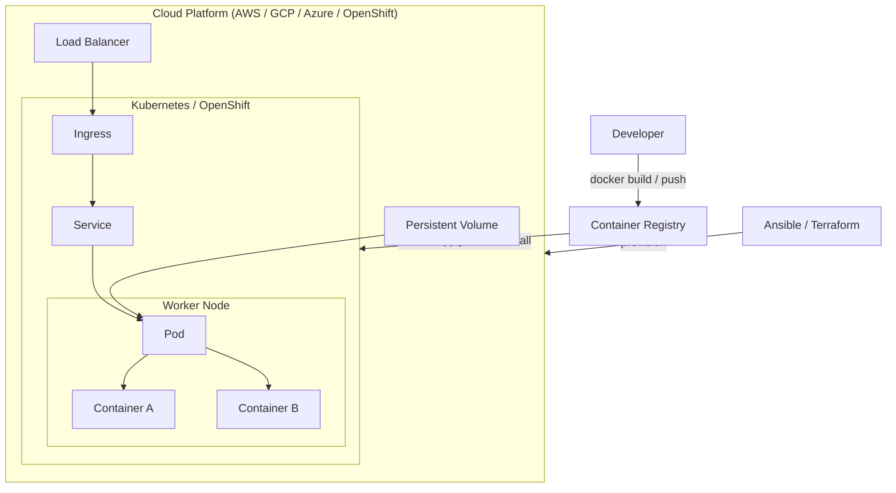
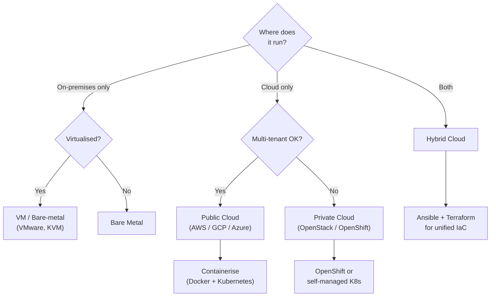
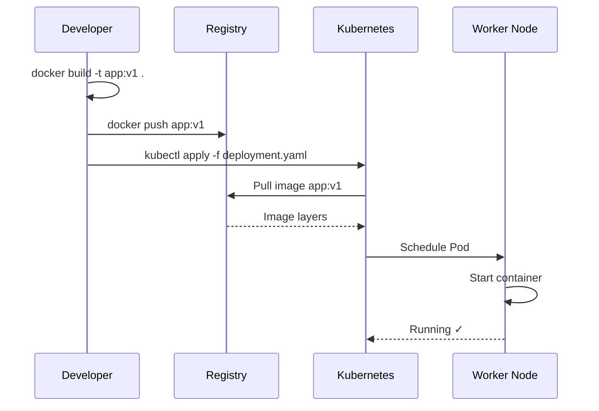

This section covers the full cloud-native stack — from cloud service models and virtualization primitives, through Docker containers and Kubernetes orchestration, to Ansible automation and production security hardening.

## What's Covered

| Section | Topics |
|---|---|
| [Cloud Fundamentals](/cloud/fundamentals/cloud-concepts) | Service models, deployment types, major providers |
| [Virtualization](/cloud/fundamentals/virtualization) | VMs, hypervisors, containers vs VMs |
| [Docker](/cloud/containers/docker) | Images, containers, Dockerfiles, volumes, networking |
| [Docker Compose](/cloud/containers/docker-compose) | Multi-service apps, compose files, overrides |
| [Container Registries](/cloud/containers/container-registry) | Docker Hub, ECR, GCR, ACR, private registries |
| [Kubernetes](/cloud/orchestration/kubernetes) | Architecture, Pods, Deployments, Services, Ingress |
| [Kubernetes Advanced](/cloud/orchestration/kubernetes-advanced) | RBAC, namespaces, network policies, storage, autoscaling |
| [Helm](/cloud/orchestration/helm) | Charts, releases, values, templating, repositories |
| [OpenShift](/cloud/orchestration/openshift) | vs Kubernetes, Routes, Projects, Operators, SCC |
| [Ansible](/cloud/iac/ansible) | Inventory, playbooks, roles, modules, Vault |
| [Terraform](/cloud/iac/terraform) | Providers, resources, state, modules, workspaces |
| [Cloud Security](/cloud/security/cloud-security) | IAM, shared responsibility, compliance, posture |
| [Container Security](/cloud/security/container-security) | Image scanning, pod security, supply-chain hardening |

## The Cloud-Native Stack

## Deployment Model Decision Tree

## Container Lifecycle

## Quick Navigation

| I want to… | Go to |
|---|---|
| Understand IaaS vs PaaS vs SaaS | [Cloud Concepts](/cloud/fundamentals/cloud-concepts) |
| Write my first Dockerfile | [Docker](/cloud/containers/docker) |
| Run multiple services locally | [Docker Compose](/cloud/containers/docker-compose) |
| Deploy to Kubernetes | [Kubernetes](/cloud/orchestration/kubernetes) |
| Package an app with Helm | [Helm](/cloud/orchestration/helm) |
| Automate server configuration | [Ansible](/cloud/iac/ansible) |
| Provision cloud infrastructure | [Terraform](/cloud/iac/terraform) |
| Understand OpenShift vs K8s | [OpenShift](/cloud/orchestration/openshift) |
| Harden containers in production | [Container Security](/cloud/security/container-security) |
| Set up cloud IAM correctly | [Cloud Security](/cloud/security/cloud-security) |

## Learning Path

| Stage | Topics | Files |
|---|---|---|
| **Foundations** | Cloud models, VMs vs containers | Cloud Concepts → Virtualization |
| **Containers** | Docker fundamentals, Compose, registries | Docker → Compose → Registries |
| **Orchestration** | Kubernetes core, Helm packaging | Kubernetes → Helm |
| **Enterprise** | OpenShift, advanced K8s, RBAC | OpenShift → Kubernetes Advanced |
| **Automation** | Ansible playbooks, Terraform IaC | Ansible → Terraform |
| **Production** | Security hardening, compliance | Cloud Security → Container Security |

## Related Sections

- [Security / Infrastructure](/security/infrastructure/cloud-security) — cloud security from the infosec angle
- [Security / Infrastructure](/security/infrastructure/container-security) — container-specific threat modelling
- [Auth / Authorization](/auth/authorization/zero-trust) — Zero Trust applied to cloud workloads
- [Auth / Protocols](/auth/protocols/certificates-pki) — mTLS and PKI for service mesh
