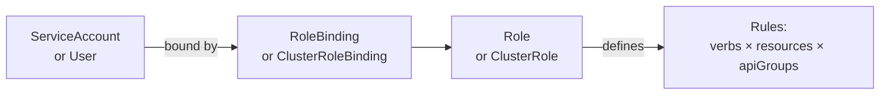

import \{ Tabs, TabItem \} from '@astrojs/starlight/components';
import \{ Aside, Card, CardGrid, Steps, Badge \} from '@astrojs/starlight/components';


Production Kubernetes requires more than deploying workloads. This page covers the operational and security primitives that separate a functional cluster from a production-ready one.

## Namespaces

Namespaces provide a logical partition within a cluster — separate resource quotas, RBAC scopes, and network policy domains.

```bash
# Common namespace pattern
kubectl create namespace development
kubectl create namespace staging
kubectl create namespace production
kubectl create namespace monitoring
kubectl create namespace kube-system   # already exists — system components
```

```yaml
# Set default namespace for your context
kubectl config set-context --current --namespace=production
```

### Resource Quotas per Namespace

```yaml
apiVersion: v1
kind: ResourceQuota
metadata:
  name: production-quota
  namespace: production
spec:
  hard:
    pods: "50"
    requests.cpu: "20"
    requests.memory: 40Gi
    limits.cpu: "40"
    limits.memory: 80Gi
    persistentvolumeclaims: "20"
    services.loadbalancers: "5"
```

### LimitRange — Default Resource Limits

```yaml
apiVersion: v1
kind: LimitRange
metadata:
  name: default-limits
  namespace: production
spec:
  limits:
    - type: Container
      default:
        cpu: "500m"
        memory: "512Mi"
      defaultRequest:
        cpu: "100m"
        memory: "128Mi"
      max:
        cpu: "4"
        memory: "8Gi"
```

---

## RBAC (Role-Based Access Control)

K8s RBAC controls who can do what on which resources.



### Role (Namespace-scoped)

```yaml
apiVersion: rbac.authorization.k8s.io/v1
kind: Role
metadata:
  name: pod-reader
  namespace: production
rules:
  - apiGroups: [""]
    resources: ["pods", "pods/log"]
    verbs: ["get", "list", "watch"]
  - apiGroups: ["apps"]
    resources: ["deployments"]
    verbs: ["get", "list", "watch", "update", "patch"]
```

### ClusterRole (Cluster-wide)

```yaml
apiVersion: rbac.authorization.k8s.io/v1
kind: ClusterRole
metadata:
  name: monitoring-reader
rules:
  - apiGroups: [""]
    resources: ["nodes", "pods", "services", "endpoints"]
    verbs: ["get", "list", "watch"]
  - apiGroups: ["metrics.k8s.io"]
    resources: ["nodes", "pods"]
    verbs: ["get", "list"]
```

### RoleBinding

```yaml
apiVersion: rbac.authorization.k8s.io/v1
kind: RoleBinding
metadata:
  name: dev-pod-reader
  namespace: production
subjects:
  - kind: User
    name: alice@example.com
    apiGroup: rbac.authorization.k8s.io
  - kind: ServiceAccount
    name: ci-deployer
    namespace: ci
roleRef:
  kind: Role
  name: pod-reader
  apiGroup: rbac.authorization.k8s.io
```

### ServiceAccount for Applications

```yaml
apiVersion: v1
kind: ServiceAccount
metadata:
  name: myapp
  namespace: production
  annotations:
    eks.amazonaws.com/role-arn: arn:aws:iam::123456789:role/myapp-role  # IRSA (AWS)
automountServiceAccountToken: false   # opt-in only when needed
```

---

## Network Policies

By default, all pods can communicate freely. NetworkPolicy restricts ingress and egress traffic.

```yaml
apiVersion: networking.k8s.io/v1
kind: NetworkPolicy
metadata:
  name: api-policy
  namespace: production
spec:
  podSelector:
    matchLabels:
      app: api
  policyTypes:
    - Ingress
    - Egress
  ingress:
    # Allow traffic only from the ingress controller
    - from:
        - namespaceSelector:
            matchLabels:
              kubernetes.io/metadata.name: ingress-nginx
          podSelector:
            matchLabels:
              app.kubernetes.io/name: ingress-nginx
      ports:
        - protocol: TCP
          port: 3000
  egress:
    # Allow DNS
    - to: []
      ports:
        - protocol: UDP
          port: 53
    # Allow database access
    - to:
        - podSelector:
            matchLabels:
              app: postgres
      ports:
        - protocol: TCP
          port: 5432
```

**Default deny all** — apply first, then add specific allow rules:
```yaml
apiVersion: networking.k8s.io/v1
kind: NetworkPolicy
metadata:
  name: default-deny-all
  namespace: production
spec:
  podSelector: {}    # selects all pods in namespace
  policyTypes:
    - Ingress
    - Egress
```

---

## Autoscaling

### Horizontal Pod Autoscaler (HPA)

Scales the number of Pod replicas based on metrics.

```yaml
apiVersion: autoscaling/v2
kind: HorizontalPodAutoscaler
metadata:
  name: myapp
  namespace: production
spec:
  scaleTargetRef:
    apiVersion: apps/v1
    kind: Deployment
    name: myapp
  minReplicas: 2
  maxReplicas: 20
  metrics:
    - type: Resource
      resource:
        name: cpu
        target:
          type: Utilization
          averageUtilization: 70
    - type: Resource
      resource:
        name: memory
        target:
          type: AverageValue
          averageValue: 400Mi
    - type: Pods
      pods:
        metric:
          name: http_requests_per_second
        target:
          type: AverageValue
          averageValue: "500"
```

### Vertical Pod Autoscaler (VPA)

Automatically adjusts CPU/memory requests based on historical usage. Requires the VPA admission webhook.

```yaml
apiVersion: autoscaling.k8s.io/v1
kind: VerticalPodAutoscaler
metadata:
  name: myapp-vpa
spec:
  targetRef:
    apiVersion: apps/v1
    kind: Deployment
    name: myapp
  updatePolicy:
    updateMode: "Auto"    # "Off" to only recommend, "Initial" to set at start
```

### Cluster Autoscaler vs Karpenter

| Tool | Approach |
|---|---|
| **Cluster Autoscaler** | Works with node groups; scales up/down based on pending pods |
| **Karpenter** (AWS) | Provisions individual nodes directly; faster, more granular, just-in-time |

---

## Storage

### StorageClass

Defines how dynamic PersistentVolumes are provisioned.

```yaml
apiVersion: storage.k8s.io/v1
kind: StorageClass
metadata:
  name: fast-ssd
provisioner: ebs.csi.aws.com
parameters:
  type: gp3
  iops: "3000"
  throughput: "125"
  encrypted: "true"
reclaimPolicy: Retain        # Delete or Retain
volumeBindingMode: WaitForFirstConsumer  # provision in same AZ as pod
```

### PersistentVolumeClaim

```yaml
apiVersion: v1
kind: PersistentVolumeClaim
metadata:
  name: myapp-data
  namespace: production
spec:
  accessModes:
    - ReadWriteOnce         # RWO | ReadWriteMany | ReadOnlyMany
  storageClassName: fast-ssd
  resources:
    requests:
      storage: 20Gi
```

### Access Modes

| Mode | Short | Description |
|---|---|---|
| ReadWriteOnce | RWO | Single node read-write (typical block storage) |
| ReadOnlyMany | ROX | Multiple nodes read-only |
| ReadWriteMany | RWX | Multiple nodes read-write (NFS, EFS, CephFS) |
| ReadWriteOncePod | RWOP | Single pod read-write (K8s 1.22+) |

---

## Taints, Tolerations & Node Affinity

### Taints & Tolerations

Taints repel Pods from nodes; Tolerations allow a Pod to schedule on a tainted node.

```bash
# Taint a node (e.g., reserve for GPU workloads)
kubectl taint nodes gpu-node-1 nvidia.com/gpu=present:NoSchedule
```

```yaml
spec:
  tolerations:
    - key: "nvidia.com/gpu"
      operator: "Equal"
      value: "present"
      effect: "NoSchedule"
```

### Node Affinity

```yaml
spec:
  affinity:
    nodeAffinity:
      requiredDuringSchedulingIgnoredDuringExecution:
        nodeSelectorTerms:
          - matchExpressions:
              - key: topology.kubernetes.io/zone
                operator: In
                values:
                  - us-east-1a
                  - us-east-1b
    podAntiAffinity:
      preferredDuringSchedulingIgnoredDuringExecution:
        - weight: 100
          podAffinityTerm:
            labelSelector:
              matchLabels:
                app: myapp
            topologyKey: kubernetes.io/hostname
            # Prefer to spread pods across different nodes
```

---

## Pod Disruption Budgets (PDB)

Prevent too many pods from being evicted simultaneously during node drains or maintenance.

```yaml
apiVersion: policy/v1
kind: PodDisruptionBudget
metadata:
  name: myapp-pdb
  namespace: production
spec:
  minAvailable: 2           # or maxUnavailable: 1
  selector:
    matchLabels:
      app: myapp
```

---

## Pod Security (Pod Security Admission)

Replaces the deprecated PodSecurityPolicy. Applied at namespace level.

```yaml
# Label a namespace to enforce the restricted profile
apiVersion: v1
kind: Namespace
metadata:
  name: production
  labels:
    pod-security.kubernetes.io/enforce: restricted
    pod-security.kubernetes.io/enforce-version: v1.30
    pod-security.kubernetes.io/warn: restricted
    pod-security.kubernetes.io/audit: restricted
```

Security profile levels:

| Level | Description |
|---|---|
| `privileged` | No restrictions |
| `baseline` | Prevents known privilege escalation, allows some capabilities |
| `restricted` | Enforces best practices (non-root, read-only root FS, no privilege escalation) |

A `restricted` pod spec:
```yaml
spec:
  securityContext:
    runAsNonRoot: true
    runAsUser: 1000
    runAsGroup: 1000
    fsGroup: 1000
    seccompProfile:
      type: RuntimeDefault
  containers:
    - name: app
      securityContext:
        allowPrivilegeEscalation: false
        readOnlyRootFilesystem: true
        capabilities:
          drop: ["ALL"]
      volumeMounts:
        - name: tmp
          mountPath: /tmp
  volumes:
    - name: tmp
      emptyDir: {}
```

---

## Production Hardening Checklist

| Area | Action |
|---|---|
| RBAC | Least-privilege roles; no cluster-admin for apps; dedicated ServiceAccounts |
| Network | Default-deny NetworkPolicies; restrict egress to known destinations |
| Pod Security | `restricted` PSA profile for production namespaces |
| Resource Limits | Every container has requests AND limits set |
| Secrets | Use External Secrets Operator or Sealed Secrets — not plain K8s Secrets |
| Image | Pin image digests; private registry; scan on push |
| Audit Logging | Enable API server audit logging; ship to SIEM |
| etcd | Encrypt at rest; TLS; access restricted to control plane |
| Admission Control | OPA Gatekeeper or Kyverno for policy enforcement |
| PDB | Every Deployment with replicas > 1 has a PDB |
| Update Strategy | `RollingUpdate` with maxUnavailable=0 for zero-downtime deploys |
