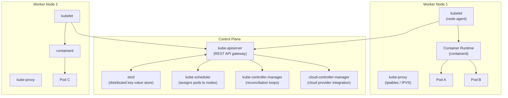

import \{ Tabs, TabItem \} from '@astrojs/starlight/components';
import \{ Aside, Card, CardGrid, Steps, Badge \} from '@astrojs/starlight/components';


Kubernetes (K8s) is the industry-standard open-source system for automating deployment, scaling, and management of containerised applications. It abstracts infrastructure into a declarative API — you describe the desired state, Kubernetes continuously reconciles reality to match it.

## Architecture



### Control Plane Components

| Component | Role |
|---|---|
| **kube-apiserver** | Single entry point for all API calls; validates and persists to etcd |
| **etcd** | Distributed consistent key-value store — the source of truth for all cluster state |
| **kube-scheduler** | Watches for unscheduled Pods, assigns them to suitable nodes based on resources and constraints |
| **kube-controller-manager** | Runs reconciliation controllers (ReplicaSet, Deployment, Job, etc.) |
| **cloud-controller-manager** | Integrates with cloud provider APIs (load balancers, volumes, node lifecycle) |

### Node Components

| Component | Role |
|---|---|
| **kubelet** | Agent that ensures containers described in PodSpecs are running |
| **kube-proxy** | Maintains network rules for Service routing (iptables or IPVS) |
| **Container runtime** | Runs containers (containerd, CRI-O) |

---

## Core Objects

### Pod

The smallest deployable unit in Kubernetes — one or more containers sharing a network namespace and storage volumes.

```yaml
apiVersion: v1
kind: Pod
metadata:
  name: myapp
  labels:
    app: myapp
spec:
  containers:
    - name: app
      image: myapp:v1.2.3
      ports:
        - containerPort: 3000
      resources:
        requests:
          cpu: "100m"
          memory: "128Mi"
        limits:
          cpu: "500m"
          memory: "512Mi"
      readinessProbe:
        httpGet:
          path: /health
          port: 3000
        initialDelaySeconds: 5
        periodSeconds: 10
      livenessProbe:
        httpGet:
          path: /health
          port: 3000
        initialDelaySeconds: 15
        periodSeconds: 20
      env:
        - name: NODE_ENV
          value: "production"
        - name: DB_PASSWORD
          valueFrom:
            secretKeyRef:
              name: db-secret
              key: password
  restartPolicy: Always
```

**Never deploy Pods directly in production** — use a controller (Deployment, StatefulSet, Job) so the Pod is recreated if it fails or the node goes down.

### Deployment

Manages a ReplicaSet to maintain N copies of a Pod, with rolling update support.

```yaml
apiVersion: apps/v1
kind: Deployment
metadata:
  name: myapp
  namespace: production
spec:
  replicas: 3
  selector:
    matchLabels:
      app: myapp
  strategy:
    type: RollingUpdate
    rollingUpdate:
      maxUnavailable: 1     # max pods that can be unavailable during update
      maxSurge: 1           # max extra pods during update
  template:
    metadata:
      labels:
        app: myapp
        version: "1.2.3"
    spec:
      containers:
        - name: app
          image: myapp:v1.2.3
          ports:
            - containerPort: 3000
          resources:
            requests:
              cpu: "200m"
              memory: "256Mi"
            limits:
              cpu: "1"
              memory: "1Gi"
```

### Service

Provides a stable virtual IP (ClusterIP) and DNS name for a set of Pods selected by label.

```yaml
apiVersion: v1
kind: Service
metadata:
  name: myapp
  namespace: production
spec:
  selector:
    app: myapp               # routes to pods with this label
  ports:
    - protocol: TCP
      port: 80               # service port
      targetPort: 3000       # container port
  type: ClusterIP            # internal only
```

#### Service Types

| Type | Description | When to Use |
|---|---|---|
| `ClusterIP` | Internal cluster IP only | Inter-service communication |
| `NodePort` | Exposes on each node's IP at a static port (30000–32767) | Dev/test; rarely in production |
| `LoadBalancer` | Provisions a cloud load balancer | Production external access (one per service) |
| `ExternalName` | DNS alias to an external hostname | Route to external services by name |

### Ingress

Routes external HTTP/HTTPS traffic to Services. Requires an Ingress Controller (Nginx, Traefik, ALB Controller, etc.).

```yaml
apiVersion: networking.k8s.io/v1
kind: Ingress
metadata:
  name: myapp-ingress
  namespace: production
  annotations:
    nginx.ingress.kubernetes.io/ssl-redirect: "true"
    cert-manager.io/cluster-issuer: "letsencrypt-prod"
spec:
  ingressClassName: nginx
  tls:
    - hosts:
        - api.example.com
      secretName: api-tls-cert
  rules:
    - host: api.example.com
      http:
        paths:
          - path: /
            pathType: Prefix
            backend:
              service:
                name: myapp
                port:
                  number: 80
```

### ConfigMap

Stores non-sensitive configuration data as key-value pairs.

```yaml
apiVersion: v1
kind: ConfigMap
metadata:
  name: app-config
data:
  LOG_LEVEL: "info"
  MAX_CONNECTIONS: "100"
  config.yaml: |
    server:
      port: 3000
      timeout: 30s
```

Consume in a Pod:
```yaml
spec:
  containers:
    - name: app
      envFrom:
        - configMapRef:
            name: app-config
      volumeMounts:
        - name: config-vol
          mountPath: /app/config
  volumes:
    - name: config-vol
      configMap:
        name: app-config
```

### Secret

Stores sensitive data (base64-encoded, not encrypted by default — use Sealed Secrets or External Secrets for encryption at rest).

```yaml
apiVersion: v1
kind: Secret
metadata:
  name: db-secret
type: Opaque
data:
  username: dXNlcm5hbWU=    # base64("username")
  password: c2VjcmV0        # base64("secret")
```

```bash
# Create from literal (kubectl encodes automatically)
kubectl create secret generic db-secret \
  --from-literal=username=myuser \
  --from-literal=password=mysecret

# Create from file
kubectl create secret generic tls-certs \
  --from-file=tls.crt=./cert.pem \
  --from-file=tls.key=./key.pem
```

### StatefulSet

Like Deployment but for stateful apps (databases). Provides:
- Stable network identity (`pod-0`, `pod-1`, ...)
- Ordered deployment/scaling/deletion
- Stable persistent volumes per pod

```yaml
apiVersion: apps/v1
kind: StatefulSet
metadata:
  name: postgres
spec:
  serviceName: postgres-headless
  replicas: 3
  selector:
    matchLabels:
      app: postgres
  template:
    metadata:
      labels:
        app: postgres
    spec:
      containers:
        - name: postgres
          image: postgres:16
          volumeMounts:
            - name: data
              mountPath: /var/lib/postgresql/data
  volumeClaimTemplates:
    - metadata:
        name: data
      spec:
        accessModes: ["ReadWriteOnce"]
        storageClassName: fast-ssd
        resources:
          requests:
            storage: 20Gi
```

### Job & CronJob

```yaml
# Run to completion
apiVersion: batch/v1
kind: Job
metadata:
  name: db-migrate
spec:
  backoffLimit: 3
  template:
    spec:
      restartPolicy: Never
      containers:
        - name: migrate
          image: myapp:v1.2.3
          command: ["npm", "run", "migrate"]

---
# Scheduled job
apiVersion: batch/v1
kind: CronJob
metadata:
  name: cleanup
spec:
  schedule: "0 2 * * *"    # daily at 02:00
  jobTemplate:
    spec:
      template:
        spec:
          restartPolicy: OnFailure
          containers:
            - name: cleanup
              image: myapp:v1.2.3
              command: ["npm", "run", "cleanup"]
```

---

## Labels, Selectors & Annotations

```yaml
metadata:
  labels:
    app: myapp              # selector key
    version: "1.2.3"
    environment: production
    tier: frontend
  annotations:
    deployment.kubernetes.io/revision: "3"
    # Annotations are not used for selection — store arbitrary metadata
    prometheus.io/scrape: "true"
    prometheus.io/port: "9090"
```

---

## Probes

| Probe | Purpose |
|---|---|
| `readinessProbe` | Gates traffic — pod only receives requests when ready |
| `livenessProbe` | Restarts container if it fails (detects deadlocks) |
| `startupProbe` | Delays liveness checks for slow-starting apps |

Probe types: `httpGet`, `tcpSocket`, `exec`, `grpc`.

---

## Essential kubectl Commands

```bash
# Context management
kubectl config get-contexts
kubectl config use-context my-cluster

# Apply manifests
kubectl apply -f deployment.yaml
kubectl apply -f ./k8s/               # apply all files in a directory
kubectl apply -k ./overlays/prod/     # Kustomize overlay

# Get resources
kubectl get pods -n production
kubectl get pods -A                   # all namespaces
kubectl get pods -l app=myapp         # filter by label
kubectl get all -n production

# Describe (human-readable details + events)
kubectl describe pod myapp-abc12 -n production
kubectl describe deployment myapp

# Logs
kubectl logs -f deploy/myapp          # follow logs
kubectl logs myapp-abc12 --previous   # last terminated container
kubectl logs -f myapp-abc12 -c sidecar  # specific container

# Execute commands
kubectl exec -it deploy/myapp -- sh

# Port forward for debugging
kubectl port-forward svc/myapp 8080:80

# Rollout management
kubectl rollout status deployment/myapp
kubectl rollout history deployment/myapp
kubectl rollout undo deployment/myapp          # rollback
kubectl rollout undo deployment/myapp --to-revision=3

# Scale
kubectl scale deployment myapp --replicas=5

# Delete
kubectl delete deployment myapp
kubectl delete -f deployment.yaml

# Resource usage
kubectl top nodes
kubectl top pods -n production

# Edit in place
kubectl edit deployment myapp
```

---

## Managed Kubernetes Services

| Service | Provider | Notes |
|---|---|---|
| EKS | AWS | Managed control plane; integrates with IAM, ALB, EFS |
| GKE | GCP | Most mature; Autopilot mode for fully serverless nodes |
| AKS | Azure | Integrates with Entra ID, Azure Monitor, Policy |
| OpenShift (ROSA/ARO) | Red Hat / AWS / Azure | Enterprise K8s with additional tooling |
| Rancher | SUSE | Multi-cluster management across any cloud/on-prem |
| k3s | Rancher | Lightweight K8s for edge and IoT |
