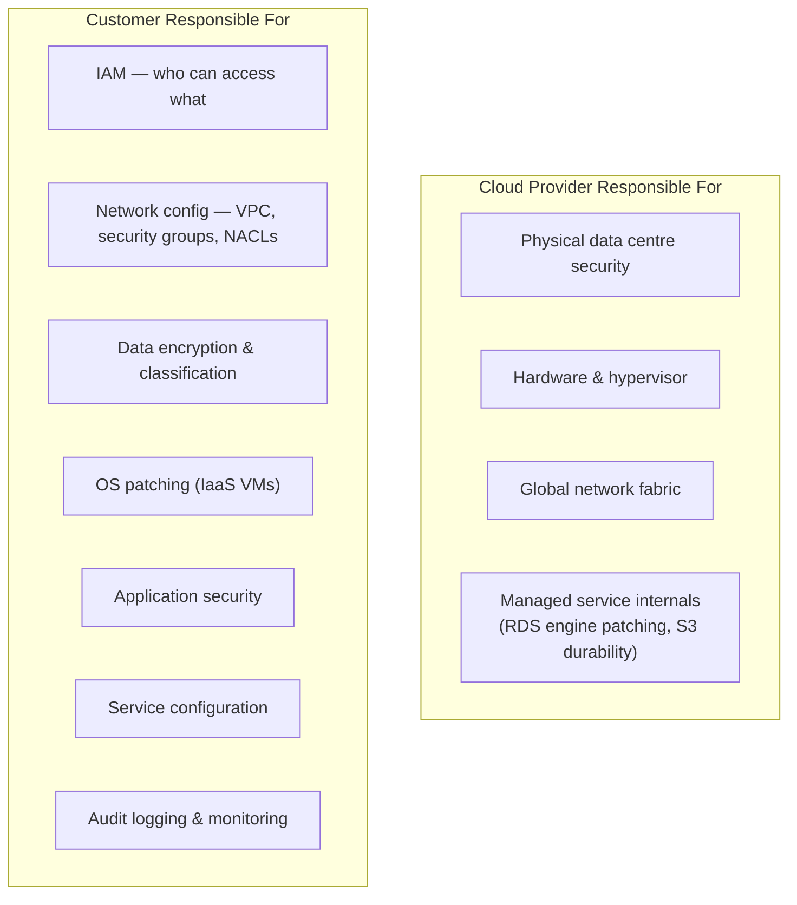
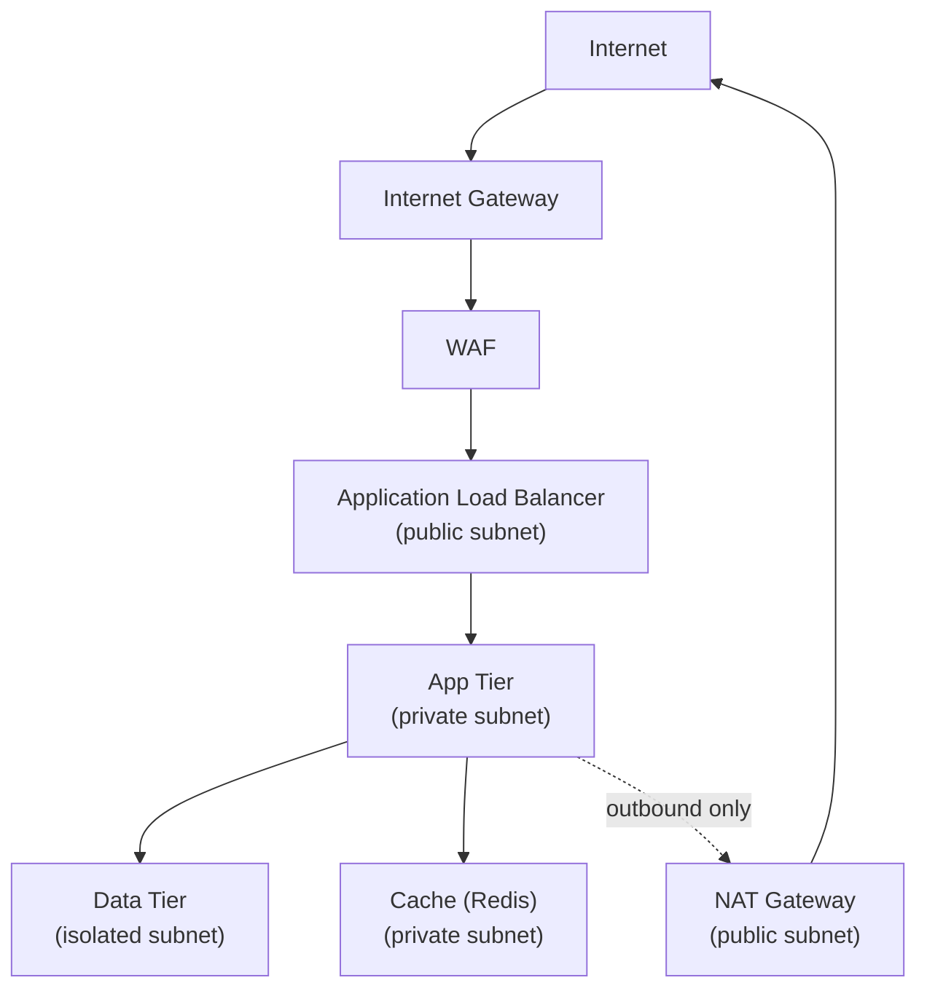

---
title: "Cloud Security"
description: "Cloud security fundamentals — shared responsibility, IAM hardening, network isolation, data protection, posture management, compliance, and security by provider."
---

import { Tabs, TabItem } from '@astrojs/starlight/components';
import { Aside, Card, CardGrid, Steps, Badge } from '@astrojs/starlight/components';


Cloud security is not the provider's responsibility alone. The **shared responsibility model** divides duties between the cloud provider (infrastructure security) and the customer (security in the cloud). Misconfigurations — not provider vulnerabilities — are the leading cause of cloud breaches.

## Shared Responsibility Model



| Layer | IaaS | PaaS | SaaS |
|---|---|---|---|
| Physical | Provider | Provider | Provider |
| Hypervisor | Provider | Provider | Provider |
| OS | **Customer** | Provider | Provider |
| Runtime/middleware | **Customer** | Provider | Provider |
| Application code | **Customer** | **Customer** | Provider |
| Data | **Customer** | **Customer** | **Customer** |
| Identity & access | **Customer** | **Customer** | **Customer** |
| Network controls | **Shared** | **Shared** | Provider |

---

## Identity & Access Management (IAM)

IAM is the most critical cloud security control. Over 80% of cloud incidents involve misconfigured or over-privileged IAM.

### Principle of Least Privilege

```json
// ✗ Over-privileged policy — full S3 access
{
  "Effect": "Allow",
  "Action": "s3:*",
  "Resource": "*"
}

// ✓ Least-privilege — read access to a specific bucket/prefix
{
  "Effect": "Allow",
  "Action": ["s3:GetObject", "s3:ListBucket"],
  "Resource": [
    "arn:aws:s3:::my-bucket",
    "arn:aws:s3:::my-bucket/data/*"
  ]
}
```

### AWS IAM Best Practices

```bash
# Check for root account MFA
aws iam get-account-summary | grep MFAEnabled

# List users without MFA
aws iam generate-credential-report
aws iam get-credential-report --query 'Content' --output text | base64 -d | grep -v ",true," | cut -d, -f1

# List access keys older than 90 days
aws iam list-users --query 'Users[].UserName' --output text | \
  xargs -I{} aws iam list-access-keys --user-name {}

# Find overly permissive policies
aws iam list-policies --scope Local | grep "\"*\""
```

### Service Account / Workload Identity

Never embed cloud credentials in container images or environment variables. Use workload identity instead:

**AWS — IRSA (IAM Roles for Service Accounts):**
```yaml
# Annotate the K8s ServiceAccount
apiVersion: v1
kind: ServiceAccount
metadata:
  name: myapp
  namespace: production
  annotations:
    eks.amazonaws.com/role-arn: arn:aws:iam::123456789:role/myapp-prod-role
```

**GCP — Workload Identity:**
```bash
gcloud iam service-accounts create myapp-sa
gcloud projects add-iam-policy-binding my-project \
  --member="serviceAccount:myapp-sa@my-project.iam.gserviceaccount.com" \
  --role="roles/storage.objectViewer"
gcloud iam service-accounts add-iam-policy-binding myapp-sa@... \
  --member="serviceAccount:my-project.svc.id.goog[production/myapp]" \
  --role="roles/iam.workloadIdentityUser"
```

---

## Network Security

### VPC Architecture (Defence in Depth)



### Security Groups (Stateful)

```hcl
# Allow HTTPS from internet to ALB
resource "aws_security_group" "alb" {
  name   = "alb-sg"
  vpc_id = aws_vpc.main.id

  ingress {
    from_port   = 443
    to_port     = 443
    protocol    = "tcp"
    cidr_blocks = ["0.0.0.0/0"]
  }

  egress {
    from_port       = 3000
    to_port         = 3000
    protocol        = "tcp"
    security_groups = [aws_security_group.app.id]
  }
}

# App tier — only allow traffic from ALB
resource "aws_security_group" "app" {
  name   = "app-sg"
  vpc_id = aws_vpc.main.id

  ingress {
    from_port       = 3000
    to_port         = 3000
    protocol        = "tcp"
    security_groups = [aws_security_group.alb.id]
  }

  egress {
    from_port       = 5432
    to_port         = 5432
    protocol        = "tcp"
    security_groups = [aws_security_group.db.id]
  }
}
```

### Private Endpoints (No Public Internet)

```hcl
# AWS VPC Endpoint for S3 — traffic stays on AWS network
resource "aws_vpc_endpoint" "s3" {
  vpc_id       = aws_vpc.main.id
  service_name = "com.amazonaws.us-east-1.s3"
  route_table_ids = [aws_route_table.private.id]

  policy = jsonencode({
    Statement = [{
      Effect    = "Allow"
      Principal = "*"
      Action    = ["s3:GetObject", "s3:PutObject"]
      Resource  = ["arn:aws:s3:::my-bucket/*"]
    }]
  })
}
```

---

## Data Protection

### Encryption at Rest

| Service | AWS | GCP | Azure |
|---|---|---|---|
| Key management | KMS | Cloud KMS | Key Vault |
| Object storage | SSE-KMS (S3) | CMEK (GCS) | SSE with CMK (Blob) |
| Databases | Encrypted by default (RDS) | CMEK | TDE |
| Block storage | EBS encrypted by default | PD encrypted | Managed Disks encrypted |
| Secrets | Secrets Manager | Secret Manager | Key Vault |

```bash
# AWS — enforce S3 encryption at bucket level
aws s3api put-bucket-encryption \
  --bucket my-bucket \
  --server-side-encryption-configuration '{
    "Rules": [{
      "ApplyServerSideEncryptionByDefault": {
        "SSEAlgorithm": "aws:kms",
        "KMSMasterKeyID": "arn:aws:kms:us-east-1:123:key/abc"
      },
      "BucketKeyEnabled": true
    }]
  }'

# Block all public access
aws s3api put-public-access-block \
  --bucket my-bucket \
  --public-access-block-configuration \
  "BlockPublicAcls=true,IgnorePublicAcls=true,BlockPublicPolicy=true,RestrictPublicBuckets=true"
```

### Encryption in Transit

- Enforce TLS 1.2+ on all load balancers and API gateways
- Use ACM (AWS), managed certificates (GCP), or Key Vault (Azure)
- Configure strict security policies on ALB/CloudFront

```hcl
resource "aws_lb_listener" "https" {
  load_balancer_arn = aws_lb.main.arn
  port              = 443
  protocol          = "HTTPS"
  ssl_policy        = "ELBSecurityPolicy-TLS13-1-2-2021-06"
  certificate_arn   = aws_acm_certificate.main.arn
}

# Redirect HTTP to HTTPS
resource "aws_lb_listener" "http_redirect" {
  load_balancer_arn = aws_lb.main.arn
  port              = 80
  protocol          = "HTTP"

  default_action {
    type = "redirect"
    redirect {
      protocol    = "HTTPS"
      port        = "443"
      status_code = "HTTP_301"
    }
  }
}
```

---

## Cloud Security Posture Management (CSPM)

CSPM tools continuously audit cloud configuration against security benchmarks (CIS, NIST, SOC 2).

| Tool | Type | Notes |
|---|---|---|
| AWS Security Hub | Native | Aggregates findings from GuardDuty, Inspector, Macie |
| AWS Config | Native | Tracks configuration changes; rules for compliance |
| GCP Security Command Center | Native | Misconfiguration detection, threat detection |
| Azure Defender for Cloud | Native | CSPM + CWPP for Azure and multi-cloud |
| Prisma Cloud | Third-party | Multi-cloud CSPM + CWPP (Palo Alto) |
| Wiz | Third-party | Agentless, graph-based risk analysis |
| Checkov | Open-source | IaC scanner (Terraform, CloudFormation) |
| Prowler | Open-source | CLI-based CIS benchmark checks |

```bash
# Run Prowler against an AWS account
docker run -it --rm \
  -e AWS_ACCESS_KEY_ID \
  -e AWS_SECRET_ACCESS_KEY \
  -e AWS_SESSION_TOKEN \
  public.ecr.aws/prowler-cloud/prowler:latest \
  aws --compliance cis_aws_3.0.0

# Scan Terraform with Checkov
checkov -d ./infra --framework terraform --output sarif > results.sarif
```

---

## Threat Detection

| Service | Provider | Detects |
|---|---|---|
| GuardDuty | AWS | Anomalous API calls, compromised instances, crypto mining, exfiltration |
| Inspector | AWS | Vulnerability scanning for EC2, containers, Lambda |
| Macie | AWS | Sensitive data in S3 (PII, credentials) |
| Security Command Center | GCP | Threats, misconfigurations, vulnerabilities |
| Microsoft Sentinel | Azure | SIEM + SOAR for Azure and multi-cloud |
| CloudTrail / Cloud Audit Logs | AWS / GCP | API call audit trail — enable everywhere |

```bash
# Enable GuardDuty in all regions
for region in $(aws ec2 describe-regions --query 'Regions[].RegionName' --output text); do
  aws guardduty create-detector --enable --region $region
done
```

---

## Compliance & Governance

### Policy as Code

**AWS SCPs (Service Control Policies)** — prevent actions across an entire AWS Organisation:
```json
{
  "Version": "2012-10-17",
  "Statement": [
    {
      "Sid": "DenyRegionsOutsideEU",
      "Effect": "Deny",
      "NotAction": [
        "iam:*", "sts:*", "cloudfront:*", "route53:*", "support:*"
      ],
      "Resource": "*",
      "Condition": {
        "StringNotEquals": {
          "aws:RequestedRegion": ["eu-west-1", "eu-central-1"]
        }
      }
    }
  ]
}
```

**Azure Policy** — deny deployments that don't meet standards:
```json
{
  "if": {
    "allOf": [
      { "field": "type", "equals": "Microsoft.Storage/storageAccounts" },
      { "field": "Microsoft.Storage/storageAccounts/supportsHttpsTrafficOnly", "notEquals": true }
    ]
  },
  "then": { "effect": "deny" }
}
```

---

## Cloud Security Checklist

| Area | Check |
|---|---|
| Identity | MFA on root / admin accounts; no long-lived access keys for humans |
| IAM | Least-privilege policies; no wildcard `*` resources; rotate keys |
| Network | No 0.0.0.0/0 ingress except ports 80/443 on ALB; no public DB endpoints |
| Storage | All S3/GCS/Blob buckets private by default; encryption enabled |
| Logging | CloudTrail / Cloud Audit Logs enabled in all regions; logs sent to immutable store |
| Threat detection | GuardDuty / SCC / Defender enabled |
| Secrets | No credentials in code, environment variables, or AMI |
| Compliance | CSPM tool configured; alerts on critical findings |
| Updates | Auto-patching enabled for managed services; VMs patched regularly |
| Incident response | Runbooks for common findings; contact security team defined |
