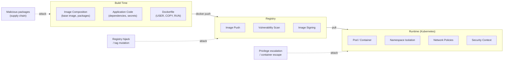
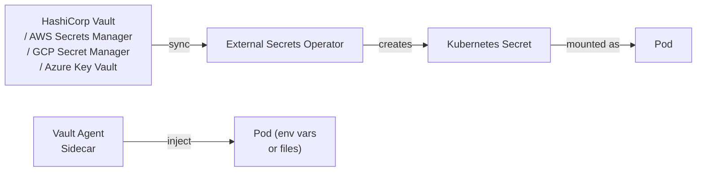

Container security spans the entire lifecycle: from what goes into an image (build time), to how images are stored (registry), to how they run (runtime), to how workloads are orchestrated (Kubernetes). A weak link at any stage creates exploitable exposure.

## Container Threat Model



---

## Image Hardening

### Use Minimal Base Images

```dockerfile
# ✗ Too much attack surface
FROM ubuntu:24.04

# ✓ Alpine — minimal OS (~5 MB)
FROM alpine:3.20

# ✓ Distroless — no shell, no package manager, no OS utilities
FROM gcr.io/distroless/static-debian12

# ✓ Scratch — completely empty (only for statically compiled binaries)
FROM scratch
```

| Base Image | Size | Shell | Package Manager | Use For |
|---|---|---|---|---|
| `ubuntu` / `debian` | 80–120 MB | ✓ | ✓ | Development, complex apps |
| `alpine` | 5 MB | `sh` | `apk` | Production (most apps) |
| `distroless` | 2–20 MB | ✗ | ✗ | Go, Java, Python production |
| `scratch` | 0 MB | ✗ | ✗ | Statically compiled Go/Rust |

### Run as Non-Root

```dockerfile
# ✓ Create and use a dedicated non-root user
RUN addgroup -S appgroup && adduser -S appuser -G appgroup
USER appuser

# Or using numeric UID/GID for pod security admission compatibility
USER 1000:1000
```

### Read-Only Filesystem

```dockerfile
# Application writes go to explicit writable mounts
VOLUME ["/tmp", "/app/logs"]
```

```yaml
# Kubernetes securityContext
containers:
  - name: app
    securityContext:
      readOnlyRootFilesystem: true
    volumeMounts:
      - name: tmp
        mountPath: /tmp
      - name: logs
        mountPath: /app/logs
volumes:
  - name: tmp
    emptyDir: {}
  - name: logs
    emptyDir: {}
```

### Drop All Capabilities

```yaml
securityContext:
  capabilities:
    drop: ["ALL"]
    add: []          # only add what is strictly required (e.g. NET_BIND_SERVICE)
```

Linux capabilities that applications almost never need (and often need to be dropped):
- `CAP_SYS_ADMIN` — broad system administration (most dangerous)
- `CAP_NET_ADMIN` — modify network interfaces
- `CAP_SYS_PTRACE` — trace arbitrary processes
- `CAP_SYS_MODULE` — load kernel modules

### Multi-Stage Builds (Exclude Build Tools)

```dockerfile
FROM golang:1.22 AS builder
WORKDIR /app
COPY go.* ./
RUN go mod download
COPY . .
RUN CGO_ENABLED=0 go build -trimpath -ldflags="-s -w" -o /bin/server ./cmd

FROM gcr.io/distroless/static-debian12:nonroot
COPY --from=builder /bin/server /server
ENTRYPOINT ["/server"]
```

The final image has no compiler, no shell, no package manager — nothing an attacker can use after a breach.

---

## Vulnerability Scanning

### Scanning Tools

| Tool | Type | Integration |
|---|---|---|
| **Trivy** | Open-source | CLI, CI, Kubernetes operator, registries |
| **Grype** | Open-source | CLI, CI |
| **Snyk Container** | SaaS | CI, IDE, registries |
| **AWS ECR Inspector** | Cloud-native | Continuous scanning in ECR |
| **GCP Artifact Registry** | Cloud-native | Built-in continuous scanning |
| **Harbor** | Registry | Trivy integration built in |

```bash
# Scan an image with Trivy
trivy image myapp:v1.2.3

# Scan and fail CI on CRITICAL or HIGH CVEs
trivy image --exit-code 1 --severity CRITICAL,HIGH myapp:v1.2.3

# Scan a Dockerfile for misconfigurations
trivy config ./Dockerfile

# Scan a running container's filesystem
trivy rootfs /var/lib/docker/overlay2/<id>/merged

# Output SARIF for GitHub Security tab
trivy image --format sarif --output trivy-results.sarif myapp:v1.2.3

# Scan Kubernetes cluster
trivy k8s --report summary cluster
```

### CI/CD Integration (GitHub Actions)

```yaml
- name: Scan image for vulnerabilities
  uses: aquasecurity/trivy-action@master
  with:
    image-ref: myregistry/myapp:${{ github.sha }}
    format: sarif
    output: trivy-results.sarif
    severity: CRITICAL,HIGH
    exit-code: 1

- name: Upload scan results
  uses: github/codeql-action/upload-sarif@v3
  with:
    sarif_file: trivy-results.sarif
```

---

## Supply Chain Security

### Sign Images with Cosign (Sigstore)

```bash
# Install cosign
brew install cosign

# Keyless signing via OIDC (in GitHub Actions — no key management)
cosign sign --yes myregistry/myapp:v1.2.3

# Verify signature
cosign verify myregistry/myapp:v1.2.3 \
  --certificate-identity-regexp "https://github.com/myorg/myapp/.*" \
  --certificate-oidc-issuer "https://token.actions.githubusercontent.com"
```

### SBOM (Software Bill of Materials)

An SBOM lists all components in an image — enables rapid CVE triage.

```bash
# Generate SBOM with Syft
syft myapp:v1.2.3 -o spdx-json > sbom.spdx.json

# Generate and attach SBOM to image in registry
syft myapp:v1.2.3 -o spdx-json | \
  cosign attest --predicate - --type spdxjson myapp:v1.2.3

# Scan SBOM for vulnerabilities
grype sbom:./sbom.spdx.json
```

### Admission Control — Block Unsigned or Vulnerable Images

```yaml
# Kyverno policy — require signed images
apiVersion: kyverno.io/v1
kind: ClusterPolicy
metadata:
  name: require-signed-images
spec:
  validationFailureAction: Enforce
  rules:
    - name: check-image-signature
      match:
        any:
          - resources:
              kinds: ["Pod"]
              namespaces: ["production"]
      verifyImages:
        - imageReferences:
            - "myregistry.example.com/*"
          attestors:
            - entries:
                - keyless:
                    subject: "https://github.com/myorg/*"
                    issuer: "https://token.actions.githubusercontent.com"
```

---

## Runtime Security

### seccomp — System Call Filtering

```yaml
spec:
  securityContext:
    seccompProfile:
      type: RuntimeDefault    # Docker/containerd default seccomp profile
      # or:
      # type: Localhost
      # localhostProfile: profiles/myapp.json
```

Custom seccomp profile (JSON):
```json
{
  "defaultAction": "SCMP_ACT_ERRNO",
  "architectures": ["SCMP_ARCH_X86_64"],
  "syscalls": [
    {
      "names": ["read", "write", "exit", "exit_group", "openat", "close",
                "fstat", "mmap", "mprotect", "brk", "rt_sigaction",
                "rt_sigprocmask", "nanosleep", "futex", "clone", "execve"],
      "action": "SCMP_ACT_ALLOW"
    }
  ]
}
```

### AppArmor

```bash
# Load a custom profile
apparmor_parser -r -W /etc/apparmor.d/myapp

# Apply in pod spec
metadata:
  annotations:
    container.apparmor.security.beta.kubernetes.io/app: localhost/myapp
```

### Falco — Runtime Threat Detection

Falco monitors kernel syscalls and generates alerts when containers behave suspiciously.

```yaml
# Falco rules examples
- rule: Shell spawned in container
  desc: A shell was spawned in a container
  condition: >
    container and
    proc.name in (bash, sh, zsh, dash) and
    not proc.pname in (containerd, dockerd, bash)
  output: >
    Shell spawned (user=%user.name container=%container.id
    image=%container.image.repository cmd=%proc.cmdline)
  priority: WARNING

- rule: Write to sensitive directory
  desc: An attempt to write to /etc in a container
  condition: >
    container and
    open_write and
    fd.name startswith /etc
  output: >
    Write to /etc (user=%user.name container=%container.id file=%fd.name)
  priority: ERROR
```

---

## Secrets Management in Containers



### External Secrets Operator

```yaml
# ExternalSecret — syncs a cloud secret to a K8s Secret
apiVersion: external-secrets.io/v1beta1
kind: ExternalSecret
metadata:
  name: db-credentials
  namespace: production
spec:
  refreshInterval: 1h
  secretStoreRef:
    name: aws-secrets-manager
    kind: ClusterSecretStore
  target:
    name: db-credentials        # K8s Secret name
    creationPolicy: Owner
  data:
    - secretKey: password       # K8s Secret key
      remoteRef:
        key: production/myapp/db  # AWS Secrets Manager path
        property: password
```

### Anti-patterns to Avoid

```dockerfile
# ✗ Secret baked into image
ENV DB_PASSWORD=secret123
ARG API_KEY=abc123

# ✗ Secret in RUN command (visible in docker history)
RUN curl -H "Authorization: Bearer secret" https://api.example.com

# ✓ Pass at runtime via K8s Secret / Secret Manager
```

---

## Container Security Checklist

| Category | Check |
|---|---|
| **Image** | Non-root USER; read-only root FS; minimal base image; no secrets in layers |
| **Build** | Multi-stage build; .dockerignore; pin base image digest |
| **Scanning** | Vulnerability scan on every push; block CRITICAL CVEs in CI |
| **Registry** | Private registry; immutable tags; scan continuously |
| **Signing** | Images signed with Cosign; admission controller verifies signatures |
| **SBOM** | SBOM generated and attached to every release image |
| **K8s Security** | `restricted` PSA; drop all capabilities; seccomp RuntimeDefault |
| **Network** | Default-deny NetworkPolicy; egress restricted to known endpoints |
| **Secrets** | External Secrets Operator; no K8s Secrets in git; Vault for dynamic credentials |
| **Runtime** | Falco deployed; alerts for shell spawn, sensitive file writes |
| **RBAC** | Dedicated ServiceAccount per workload; `automountServiceAccountToken: false` |
| **Updates** | Base image rebuild on CVE disclosure; automated PRs (Renovate/Dependabot) |
