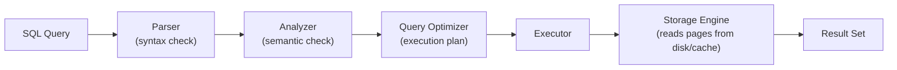
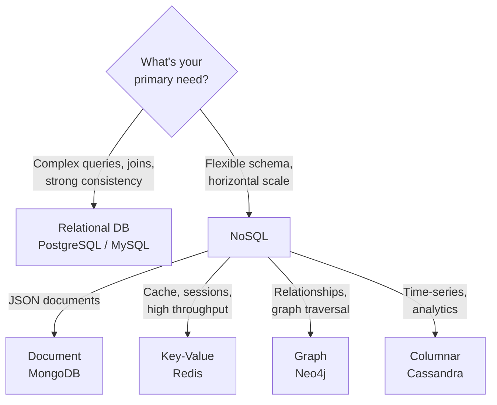

import { Aside } from '@astrojs/starlight/components';

This section covers database systems from the ground up — how data is stored and queried, what guarantees relational systems provide, when to choose NoSQL, and how to keep databases fast, reliable, and secure.

## What's Covered

| Section | Topics |
|---|---|
| [Relational Databases](/databases/relational/relational-databases) | PostgreSQL, MySQL, schemas, normalization, ACID |
| [NoSQL](/databases/nosql/nosql) | MongoDB, document/key-value/columnar/graph, CAP theorem |
| [SQL Fundamentals](/databases/sql/sql-fundamentals) | SELECT, JOINs, aggregations, DDL/DML/DCL |
| [Transactions](/databases/internals/transactions) | ACID, isolation levels, locks, deadlocks |
| [Indexing](/databases/internals/indexing) | B-tree, hash indexes, composite indexes, covering indexes |
| [Replication](/databases/operations/replication) | Primary/replica, sync vs async, failover, read scaling |
| [Backup & Recovery](/databases/operations/backup-recovery) | Strategies, RTO/RPO, point-in-time recovery |
| [Performance Tuning](/databases/operations/performance-tuning) | EXPLAIN, query optimization, connection pooling |
| [Security](/databases/operations/security) | Users, roles, encryption, SQL injection prevention |

## How a Query Executes

## Relational vs NoSQL at a Glance

## Quick Navigation

| I want to… | Go to |
|---|---|
| Choose between PostgreSQL and MySQL | [Relational Databases](/databases/relational/relational-databases) |
| Understand ACID guarantees | [Transactions](/databases/internals/transactions) |
| Know when to use NoSQL | [NoSQL](/databases/nosql/nosql) |
| Write better SQL | [SQL Fundamentals](/databases/sql/sql-fundamentals) |
| Speed up slow queries | [Performance Tuning](/databases/operations/performance-tuning) |
| Understand indexes | [Indexing](/databases/internals/indexing) |
| Set up replication | [Replication](/databases/operations/replication) |
| Plan disaster recovery | [Backup & Recovery](/databases/operations/backup-recovery) |
| Secure a database | [Security](/databases/operations/security) |

## Related Sections

- [Security / Web](/security/web/sql-injection) — SQL injection attacks and prevention
- [Auth / Credentials](/auth/credentials/passwords-hashing) — password hashing stored in databases
- [Cloud / Containers](/cloud/containers/docker) — running databases in Docker
