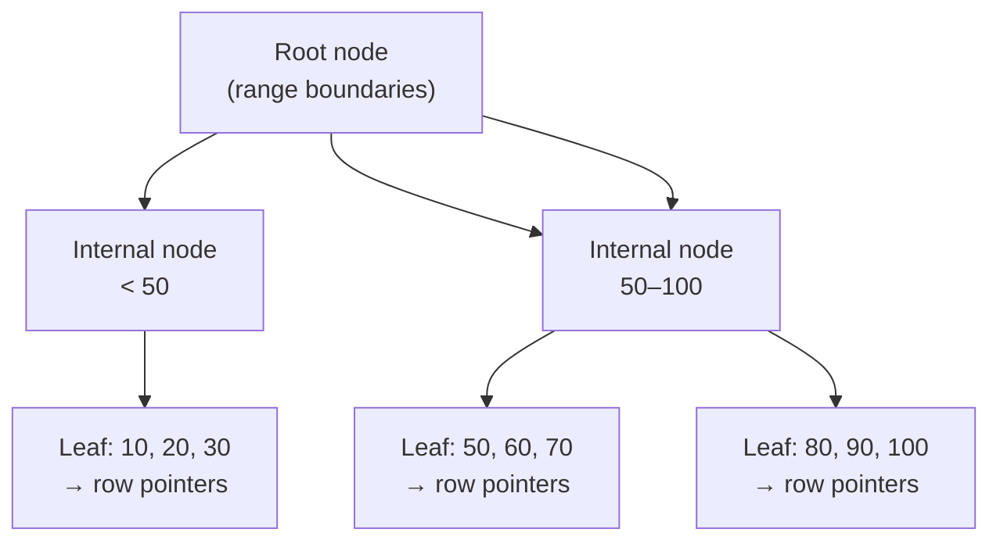

import { Aside } from '@astrojs/starlight/components';

An **index** is a separate data structure that lets the database find rows without scanning the entire table. Without an index, every query touching a large table becomes a full table scan.

## How B-Tree Indexes Work

The default index type. Data is stored in a balanced tree sorted by the indexed column.



- **O(log n)** lookup instead of O(n) full scan
- Supports `=`, `<`, `>`, `BETWEEN`, `LIKE 'prefix%'`
- Does NOT help with `LIKE '%suffix'` or functions on the column (`WHERE LOWER(email) = ...`)

---

## Index Types

| Type | Use Case | Syntax |
|---|---|---|
| **B-tree** (default) | Equality and range queries | `CREATE INDEX idx ON t(col)` |
| **Hash** | Equality only (`=`) | `CREATE INDEX idx ON t USING HASH(col)` |
| **GIN** | Arrays, JSONB, full-text search | `CREATE INDEX idx ON t USING GIN(col)` |
| **GiST** | Geometry, ranges, proximity | `CREATE INDEX idx ON t USING GiST(col)` |
| **BRIN** | Very large tables with physical ordering (e.g., timestamps) | `CREATE INDEX idx ON t USING BRIN(col)` |

---

## Composite Indexes

An index on multiple columns. Column order matters.

```sql
CREATE INDEX idx_user_date ON orders(user_id, created_at DESC);
```

- Useful for queries that filter on `user_id` AND/OR sort by `created_at`
- The **leftmost prefix rule**: a composite index `(a, b, c)` can be used for queries on `a`, `(a, b)`, or `(a, b, c)` — but NOT on `b` alone
- Put the most selective column first (or the one used in `WHERE` most often)

---

## Partial Indexes

Index only a subset of rows. Smaller, faster.

```sql
-- Only index active users (rare, so index is tiny)
CREATE INDEX idx_active_users ON users(email) WHERE status = 'active';

-- Only index unprocessed jobs
CREATE INDEX idx_pending_jobs ON jobs(created_at) WHERE status = 'pending';
```

---

## Covering Indexes

If an index contains all columns needed by a query, the database never touches the table (index-only scan).

```sql
-- Query: SELECT email, name FROM users WHERE id = ?
-- Covering index:
CREATE INDEX idx_covering ON users(id) INCLUDE (email, name);  -- Postgres 11+
```

---

## When to Add an Index

| Add an index when… | Don't add an index when… |
|---|---|
| Column appears in `WHERE`, `JOIN ON`, or `ORDER BY` on large tables | Table is small (< a few thousand rows) |
| Column has high cardinality (many distinct values) | Column has very low cardinality (e.g., boolean flags) |
| Query is demonstrably slow (check EXPLAIN) | Write throughput is critical (indexes slow down INSERT/UPDATE/DELETE) |

<Aside type="tip">Measure first with `EXPLAIN (ANALYZE, BUFFERS)`, then add indexes targeted at actual slow queries.</Aside>

```sql
EXPLAIN (ANALYZE, BUFFERS)
SELECT * FROM orders WHERE user_id = 42 ORDER BY created_at DESC LIMIT 10;
```

Look for: `Seq Scan` on large tables (bad), `Index Scan` / `Index Only Scan` (good).

---

## Index Maintenance

- Indexes bloat over time with updates and deletes — run `REINDEX` or `VACUUM` (Postgres handles this automatically via autovacuum)
- `pg_stat_user_indexes` shows index usage — drop unused indexes
- `pg_stat_user_tables` shows sequential scans — candidates for new indexes
