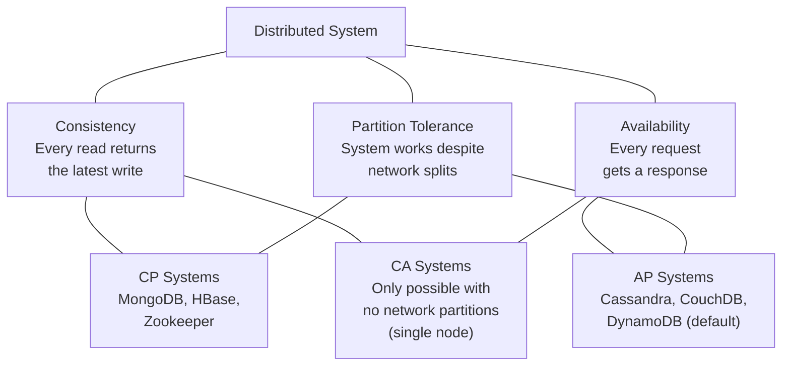

import { Tabs, TabItem } from '@astrojs/starlight/components';
import { Aside } from '@astrojs/starlight/components';

**NoSQL** ("Not Only SQL") is a broad category of databases that abandon the rigid table/row/column model in favour of flexible schemas, horizontal scaling, or specialised data models.

## NoSQL Types

| Type | Model | Best For | Examples |
|---|---|---|---|
| **Document** | JSON/BSON documents | Flexible schemas, nested data | MongoDB, CouchDB, Firestore |
| **Key-Value** | Key → arbitrary blob | Cache, sessions, counters | Redis, DynamoDB, etcd |
| **Columnar** | Column families | Analytics, write-heavy, time-series | Cassandra, HBase, BigTable |
| **Graph** | Nodes + edges | Relationships, recommendation engines | Neo4j, Amazon Neptune |
| **Search** | Inverted indexes | Full-text search | Elasticsearch, OpenSearch |

---

## MongoDB

MongoDB is the leading document database. Documents are stored as BSON (binary JSON) and grouped into **collections** (analogous to tables).

**Key concepts:**

| Concept | Equivalent in SQL |
|---|---|
| Database | Database |
| Collection | Table |
| Document | Row |
| Field | Column |
| `_id` | Primary key (auto-generated ObjectId) |
| Embedded document | JOIN (denormalised) |

**Strengths:**
- Schema-less (or schema-flexible with validation)
- Horizontal sharding built in
- Rich query language, aggregation pipeline
- Good for hierarchical/nested data

**Weaknesses:**
- No multi-document ACID transactions before v4.0 (now supported but with overhead)
- JOINs are expensive (`$lookup`); prefer embedding related data
- No foreign key enforcement by default

### MongoDB Queries in Application Code

<Tabs>
<TabItem label="Python">
```python
from pymongo import MongoClient

client = MongoClient("mongodb://localhost:27017/")
db = client["mydb"]

# Insert
db.users.insert_one({"name": "Alice", "email": "alice@example.com", "roles": ["admin"]})

# Query with filter and projection
results = db.users.find({"roles": "admin"}, {"name": 1, "email": 1})

# Aggregation pipeline
pipeline = [
    {"$match": {"status": "completed"}},
    {"$group": {"_id": "$user_id", "total": {"$sum": "$amount"}}},
    {"$sort": {"total": -1}}
]
db.orders.aggregate(pipeline)
```
</TabItem>
<TabItem label="JavaScript">
```javascript
// Insert
db.users.insertOne({ name: "Alice", email: "alice@example.com", roles: ["admin"] })

// Query with filter and projection
db.users.find({ roles: "admin" }, { name: 1, email: 1 })

// Aggregation pipeline
db.orders.aggregate([
  { $match: { status: "completed" } },
  { $group: { _id: "$user_id", total: { $sum: "$amount" } } },
  { $sort: { total: -1 } }
])
```
</TabItem>
<TabItem label="C#">
```csharp
var client = new MongoClient("mongodb://localhost:27017");
var db = client.GetDatabase("mydb");
var users = db.GetCollection<BsonDocument>("users");

// Insert
await users.InsertOneAsync(new BsonDocument {
    { "name", "Alice" }, { "email", "alice@example.com" },
    { "roles", new BsonArray { "admin" } }
});

// Query with filter and projection
var filter = Builders<BsonDocument>.Filter.AnyEq("roles", "admin");
var projection = Builders<BsonDocument>.Projection.Include("name").Include("email");
var results = await users.Find(filter).Project(projection).ToListAsync();
```
</TabItem>
<TabItem label="Java">
```java
MongoClient client = MongoClients.create("mongodb://localhost:27017");
MongoDatabase db = client.getDatabase("mydb");
MongoCollection<Document> users = db.getCollection("users");

// Insert
users.insertOne(new Document("name", "Alice")
    .append("email", "alice@example.com")
    .append("roles", List.of("admin")));

// Query with filter and projection
Bson filter = Filters.eq("roles", "admin");
Bson projection = Projections.fields(Projections.include("name", "email"));
users.find(filter).projection(projection).forEach(doc -> System.out.println(doc));
```
</TabItem>
</Tabs>

---

## CAP Theorem

The **CAP theorem** (Brewer, 2000) states that a distributed data store can guarantee at most **two** of three properties simultaneously:



**In practice:** Network partitions happen — every distributed system must tolerate them (P is not optional). The real trade-off is **C vs A** during a partition.

| Choice | Behaviour during partition |
|---|---|
| **CP** | Returns an error or timeout rather than stale data |
| **AP** | Returns potentially stale data rather than an error |

**PACELC** extends CAP: even without partitions, there's a latency/consistency trade-off (lower latency = weaker consistency).

---

## When to Choose NoSQL

| Use NoSQL when… | Use Relational when… |
|---|---|
| Schema changes frequently | Schema is stable and well-defined |
| Data is hierarchical / nested | Data is highly relational |
| Need to shard horizontally | Vertical scaling is sufficient |
| Read/write throughput is extreme | Complex multi-table queries are required |
| Data model maps directly to documents | Strong consistency / ACID is critical |
