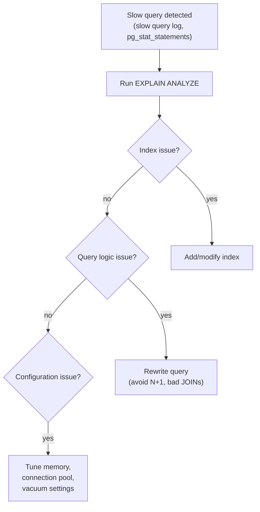

import { Aside } from '@astrojs/starlight/components';

Performance problems are almost always caused by one of: missing indexes, poorly written queries, too many connections, or under-provisioned hardware. Fix in that order.

## Query Optimization Workflow



---

## EXPLAIN / EXPLAIN ANALYZE

`EXPLAIN` shows the execution plan the query planner chose. `EXPLAIN ANALYZE` actually runs the query and shows real timing.

```sql
EXPLAIN (ANALYZE, BUFFERS, FORMAT TEXT)
SELECT u.name, COUNT(o.id)
FROM users u
LEFT JOIN orders o ON o.user_id = u.id
WHERE u.created_at > NOW() - INTERVAL '30 days'
GROUP BY u.id;
```

**Key things to look for:**

| Node Type | What It Means |
|---|---|
| `Seq Scan` on large table | No usable index — consider adding one |
| `Index Scan` | Using an index — good |
| `Index Only Scan` | Covering index — best |
| `Hash Join` / `Merge Join` | Normal for joining large sets |
| `Nested Loop` on large sets | Can be slow; check if an index is missing |
| High `rows=X (actual rows=Y)` mismatch | Stale statistics — run `ANALYZE` |

---

## Common Query Optimizations

### Avoid functions on indexed columns

```sql
-- Bad: index on email can't be used
WHERE LOWER(email) = 'alice@example.com'

-- Good: use a functional index
CREATE INDEX idx_email_lower ON users(LOWER(email));
-- or store email already lowercased
```

### Avoid SELECT *

Fetches unnecessary columns, increases I/O and memory usage, and prevents index-only scans.

### Fix N+1 Queries

```sql
-- Bad: 1 query for users + N queries for orders (N+1)
-- Fix: JOIN or use a batch fetch

SELECT u.id, u.name, COUNT(o.id) AS order_count
FROM users u
LEFT JOIN orders o ON o.user_id = u.id
GROUP BY u.id;
```

### Use Pagination Correctly

```sql
-- Bad: OFFSET 100000 still reads and discards 100k rows
SELECT * FROM posts ORDER BY id LIMIT 10 OFFSET 100000;

-- Good: keyset (cursor) pagination
SELECT * FROM posts WHERE id > 100000 ORDER BY id LIMIT 10;
```

---

## Connection Pooling

Databases handle a limited number of connections. Each connection consumes memory (~5–10 MB in Postgres). Connection pooling reuses connections across application threads.

| Tool | Works with | Mode |
|---|---|---|
| **PgBouncer** | PostgreSQL | Transaction / session pooling |
| **RDS Proxy** | AWS RDS (MySQL, Postgres) | Managed, IAM auth |
| **ProxySQL** | MySQL | Query routing + pooling |

**Transaction pooling** (PgBouncer default) is most efficient — a connection is only held during an active transaction.

---

## Key PostgreSQL Configuration Parameters

| Parameter | Default | Recommendation |
|---|---|---|
| `shared_buffers` | 128 MB | 25% of RAM |
| `work_mem` | 4 MB | 16–64 MB (per sort/hash operation) |
| `effective_cache_size` | 4 GB | ~75% of RAM (planner hint only) |
| `max_connections` | 100 | Use a connection pooler; keep this low |
| `autovacuum` | on | Leave on; tune `autovacuum_vacuum_scale_factor` for large tables |

---

## Monitoring

- **`pg_stat_statements`** (Postgres extension) — tracks total calls, total time, and mean time per query. Best first stop for finding slow queries.
- **`pg_stat_user_tables`** — shows seq scans (candidates for indexes) and dead tuples (candidates for vacuum).
- **Slow query log** (MySQL: `slow_query_log`, Postgres: `log_min_duration_statement`) — logs queries exceeding a threshold.
