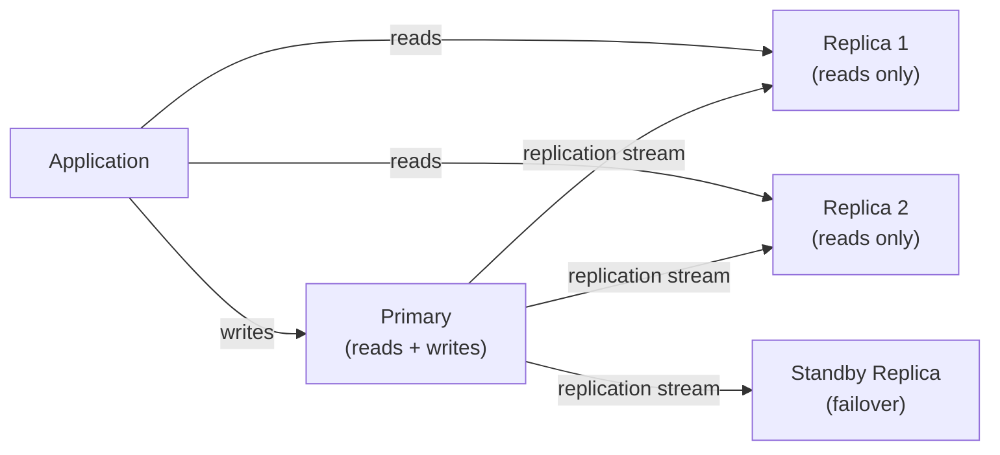
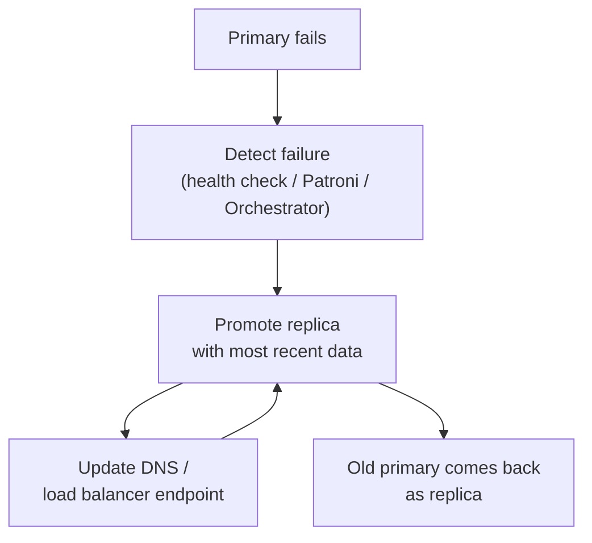

import { Aside } from '@astrojs/starlight/components';

**Replication** copies data from one database server (primary) to one or more others (replicas). It provides redundancy, read scaling, and the foundation for high availability.

## Primary / Replica Architecture



The primary handles all writes. Replicas receive a stream of changes and apply them.

---

## Synchronous vs Asynchronous

| | Synchronous | Asynchronous |
|---|---|---|
| **Durability** | Write confirmed only after replica acknowledges | Write confirmed after primary writes to WAL |
| **Latency** | Higher (waits for replica) | Lower (no waiting) |
| **Data loss on crash** | Zero (replica is up-to-date) | Possible (replica may lag) |
| **Throughput** | Lower | Higher |
| **Use case** | Financial data, zero-RPO requirement | Analytics replicas, read scaling |

```sql
-- Postgres: configure synchronous standby
synchronous_commit = on          -- default: async
synchronous_standby_names = '1 (replica1)'  -- wait for at least 1 named standby
```

---

## Replication in PostgreSQL

PostgreSQL uses **streaming replication** (WAL-based).

- **Physical replication**: byte-for-byte copy of the WAL. Fast, simple. Replica must be same major version.
- **Logical replication**: replicate specific tables or change events. Allows cross-version replication, partial table replication, and use by subscribers (e.g., message queues).

```sql
-- Check replication lag on primary
SELECT client_addr, state, write_lag, flush_lag, replay_lag
FROM pg_stat_replication;
```

---

## Replication in MySQL

MySQL uses **binary log (binlog)** replication:

- **Statement-based**: replicates SQL statements (smaller log, non-deterministic functions can cause drift)
- **Row-based**: replicates actual row changes (larger log, safe)
- **Mixed**: default in newer MySQL versions

---

## Failover

When the primary fails, a replica must be promoted to primary.



**Automatic failover tools:**
- Postgres: **Patroni** (etcd/Consul/ZooKeeper backed), **pg_auto_failover**, AWS RDS Multi-AZ
- MySQL: **Orchestrator**, **ProxySQL**, MySQL Group Replication, AWS RDS Multi-AZ

---

## Read Scaling

Replicas can serve read traffic, reducing load on the primary.

**Pattern:** Route `SELECT` queries to replicas, all writes to primary.

Common tools: **PgBouncer** (connection pooling), **HAProxy**, **ProxySQL**, **RDS Proxy**, application-level read/write splitting.

<Aside type="caution">Watch for replica lag — reads from replicas may return slightly stale data. This is acceptable for analytics, feeds, and searches; not acceptable for "read-your-own-writes" scenarios.</Aside>
