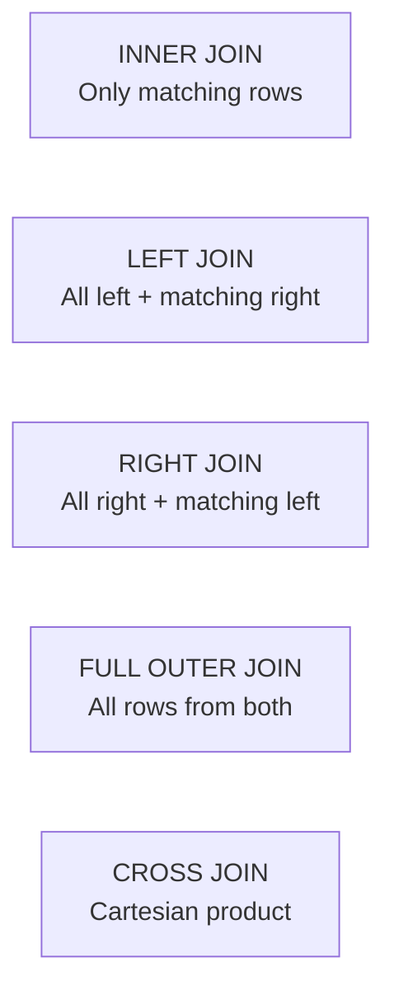

import { Aside } from '@astrojs/starlight/components';

SQL (Structured Query Language) is the standard language for interacting with relational databases. It is divided into sub-languages by purpose.

## SQL Sub-languages

| Sub-language | Purpose | Keywords |
|---|---|---|
| **DDL** — Data Definition | Define structure | `CREATE`, `ALTER`, `DROP`, `TRUNCATE` |
| **DML** — Data Manipulation | Read and write data | `SELECT`, `INSERT`, `UPDATE`, `DELETE` |
| **DCL** — Data Control | Permissions | `GRANT`, `REVOKE` |
| **TCL** — Transaction Control | Transaction flow | `BEGIN`, `COMMIT`, `ROLLBACK`, `SAVEPOINT` |

---

## SELECT

```sql
SELECT column1, column2
FROM   table_name
WHERE  condition
GROUP BY column1
HAVING aggregate_condition
ORDER BY column1 DESC
LIMIT  10 OFFSET 20;
```

**Execution order** (not the same as writing order):
`FROM` → `JOIN` → `WHERE` → `GROUP BY` → `HAVING` → `SELECT` → `ORDER BY` → `LIMIT`

---

## JOINs



```sql
-- Most common: INNER and LEFT
SELECT u.name, o.total
FROM   users u
JOIN   orders o ON o.user_id = u.id          -- INNER JOIN

SELECT u.name, o.total
FROM   users u
LEFT JOIN orders o ON o.user_id = u.id       -- includes users with no orders
```

---

## Aggregations

```sql
SELECT
    department,
    COUNT(*)          AS headcount,
    AVG(salary)       AS avg_salary,
    MAX(salary)       AS top_salary
FROM   employees
GROUP BY department
HAVING COUNT(*) > 5
ORDER BY avg_salary DESC;
```

Common aggregate functions: `COUNT`, `SUM`, `AVG`, `MIN`, `MAX`, `STRING_AGG`, `ARRAY_AGG` (Postgres).

---

## Subqueries & CTEs

```sql
-- Subquery
SELECT name FROM users
WHERE id IN (SELECT user_id FROM orders WHERE total > 1000);

-- CTE (cleaner, reusable)
WITH high_value AS (
    SELECT user_id FROM orders WHERE total > 1000
)
SELECT name FROM users
WHERE id IN (SELECT user_id FROM high_value);
```

CTEs are preferable — they're readable and can be referenced multiple times.

---

## Window Functions

Window functions compute over a "window" of rows without collapsing them like `GROUP BY`.

```sql
SELECT
    name,
    department,
    salary,
    RANK()   OVER (PARTITION BY department ORDER BY salary DESC) AS dept_rank,
    AVG(salary) OVER (PARTITION BY department)                   AS dept_avg
FROM employees;
```

Common: `ROW_NUMBER()`, `RANK()`, `DENSE_RANK()`, `LAG()`, `LEAD()`, `SUM() OVER (...)`.

---

## DDL Essentials

```sql
CREATE TABLE products (
    id          BIGSERIAL PRIMARY KEY,
    name        TEXT        NOT NULL,
    price       NUMERIC(10,2) NOT NULL CHECK (price >= 0),
    category_id INT         REFERENCES categories(id) ON DELETE SET NULL,
    created_at  TIMESTAMPTZ DEFAULT NOW()
);

ALTER TABLE products ADD COLUMN sku TEXT UNIQUE;
ALTER TABLE products DROP COLUMN sku;
DROP TABLE products;              -- permanent
TRUNCATE TABLE products;          -- fast delete all rows, keeps structure
```

---

## DML Essentials

```sql
INSERT INTO users (name, email) VALUES ('Alice', 'alice@example.com');

-- Upsert (Postgres)
INSERT INTO users (id, email) VALUES (1, 'new@example.com')
ON CONFLICT (id) DO UPDATE SET email = EXCLUDED.email;

UPDATE users SET status = 'inactive' WHERE last_login < NOW() - INTERVAL '90 days';

DELETE FROM sessions WHERE expires_at < NOW();
```

---

## Common Pitfalls

| Pitfall | Fix |
|---|---|
| `SELECT *` in production queries | Name columns explicitly |
| `WHERE` on a non-indexed column in large tables | Add an index |
| `NOT IN` with a subquery that can return NULL | Use `NOT EXISTS` instead |
| N+1 queries (fetching related rows in a loop) | Use a JOIN or batch fetch |
| Forgetting `WHERE` on `UPDATE`/`DELETE` | Double-check before running |
