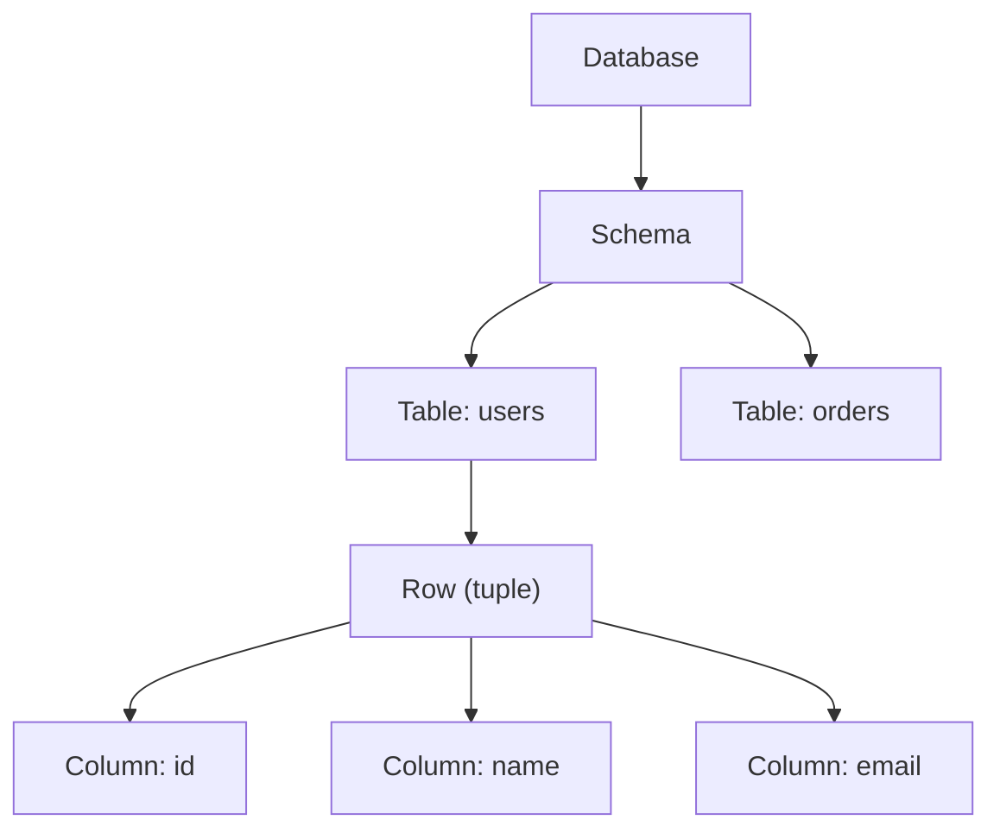
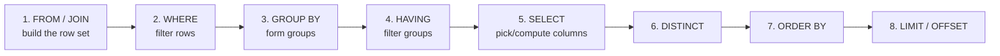
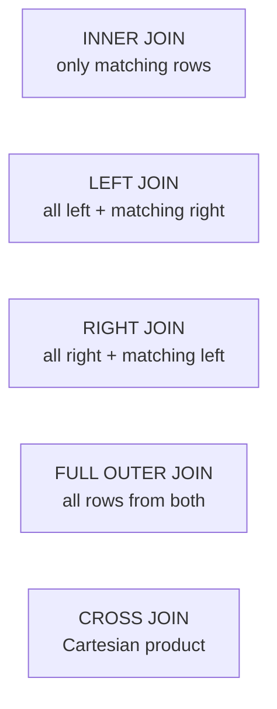
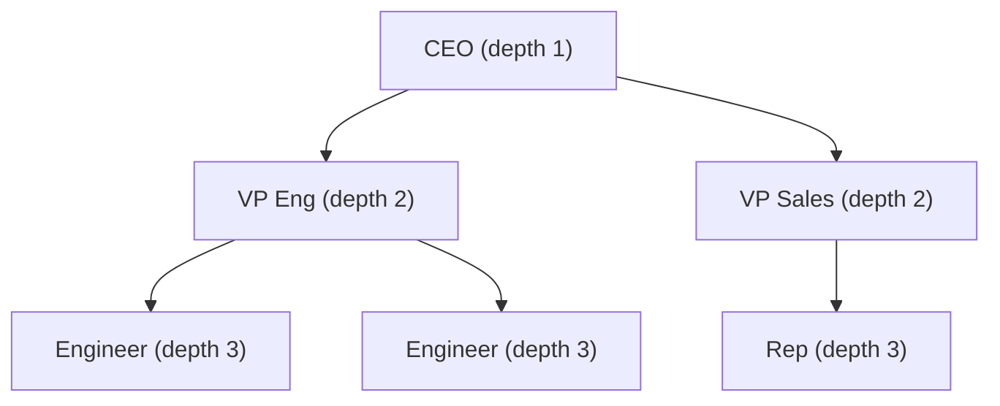
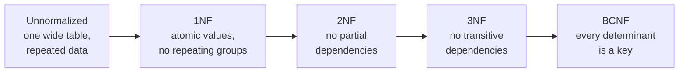
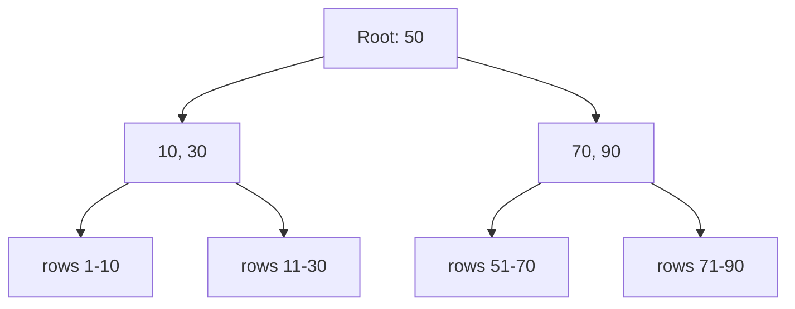

import { Aside } from '@astrojs/starlight/components';

SQL (Structured Query Language) is the standard language for interacting with **relational databases**. It is *declarative*: you describe **what** result you want, and the database's query planner decides **how** to get it. This is a deep distinction — in an imperative language you write loops and tell the machine each step; in SQL you state a goal and the engine figures out the execution strategy. Understanding this mental model is the key to writing good SQL: you are not iterating over rows, you are describing sets.

This document covers both the *practical* syntax you use every day and the *theory* that explains why relational databases behave the way they do.

---

## The Relational Model

Before any syntax, it helps to understand what a relational database actually *is*. It was formalised by Edgar F. Codd in 1970 and rests on **set theory** and **first-order predicate logic**.

| Relational term | Everyday term | Meaning |
|---|---|---|
| Relation | Table | A set of rows with a fixed set of columns |
| Tuple | Row | A single record |
| Attribute | Column | A named, typed field |
| Domain | Data type | The set of allowed values for an attribute |
| Cardinality | Row count | Number of tuples in a relation |
| Degree | Column count | Number of attributes in a relation |

Two consequences of the "relation = set" idea matter in practice:

1. **There is no inherent row order.** A table is a *set*, and sets are unordered. If you want ordered output you *must* use `ORDER BY` — otherwise the order is undefined and may change between runs.
2. **In pure theory, there are no duplicate rows.** Real SQL relaxes this (tables are technically *multisets*/bags), which is why `DISTINCT` and `UNION` vs `UNION ALL` exist.


```mermaid
flowchart TD
    DB["Database"] --> S["Schema"]
    S --> T1["Table: users"]
    S --> T2["Table: orders"]
    T1 --> R1["Row (tuple)"]
    R1 --> C1["Column: id"]
    R1 --> C2["Column: name"]
    R1 --> C3["Column: email"]
```

<Aside type="note" title="Relational vs. non-relational">
"NoSQL" databases (document stores like MongoDB, key-value stores like Redis, wide-column stores like Cassandra) drop some of these guarantees — usually strict schemas and/or joins — in exchange for horizontal scaling or flexibility. Relational databases trade some of that scalability for **consistency, joins, and a powerful declarative query language**. Neither is universally "better"; they solve different problems.
</Aside>

---

## ACID — The Transactional Guarantees

Relational databases are defined as much by their *guarantees* as by their query language. Those guarantees are summarised as **ACID**.

| Property | Meaning | Example of what it prevents |
|---|---|---|
| **A**tomicity | A transaction is all-or-nothing | A money transfer that debits one account but crashes before crediting the other |
| **C**onsistency | A transaction moves the DB from one valid state to another, respecting all constraints | A foreign key pointing to a row that doesn't exist |
| **I**solation | Concurrent transactions don't interfere with each other's intermediate state | One user reading half-finished data another user is writing |
| **D**urability | Once committed, data survives crashes/power loss | Losing a confirmed order because the server rebooted |

These are why you can trust a bank, an inventory system, or an order pipeline to a relational database. We'll return to isolation in the [Transactions](#transactions) section.

---

## SQL Sub-languages

SQL is divided into sub-languages by purpose. Knowing which category a statement belongs to clarifies its behaviour (e.g. DDL usually auto-commits, DML usually doesn't).

| Sub-language | Purpose | Keywords |
|---|---|---|
| **DDL** — Data Definition | Define and change structure | `CREATE`, `ALTER`, `DROP`, `TRUNCATE` |
| **DML** — Data Manipulation | Read and write data | `SELECT`, `INSERT`, `UPDATE`, `DELETE` |
| **DCL** — Data Control | Permissions | `GRANT`, `REVOKE` |
| **TCL** — Transaction Control | Transaction flow | `BEGIN`, `COMMIT`, `ROLLBACK`, `SAVEPOINT` |

<Aside type="caution" title="DDL often auto-commits">
In many databases (notably MySQL), DDL statements like `CREATE` or `ALTER` implicitly commit the current transaction and **cannot be rolled back**. PostgreSQL is a notable exception — most of its DDL is transactional. Know your engine before wrapping schema changes in a transaction.
</Aside>

---

## Data Types

Picking the right type is part correctness, part performance, and part documentation. These are the categories you'll meet most often (names vary slightly by engine; PostgreSQL shown).

| Category | Types | Notes |
|---|---|---|
| Integer | `SMALLINT`, `INT`, `BIGINT` | Use `BIGINT` for IDs that may exceed ~2.1 billion |
| Exact decimal | `NUMERIC(p,s)` / `DECIMAL(p,s)` | **Always** use for money — never floats |
| Floating point | `REAL`, `DOUBLE PRECISION` | Approximate; fine for scientific data, dangerous for currency |
| Text | `CHAR(n)`, `VARCHAR(n)`, `TEXT` | In Postgres `TEXT` and `VARCHAR` perform identically |
| Boolean | `BOOLEAN` | `TRUE` / `FALSE` / `NULL` |
| Date / time | `DATE`, `TIME`, `TIMESTAMP`, `TIMESTAMPTZ` | Prefer `TIMESTAMPTZ` (timezone-aware) |
| Binary | `BYTEA`, `BLOB` | Raw bytes |
| Structured | `JSON`, `JSONB`, `ARRAY`, `UUID` | `JSONB` is indexable; `JSON` stores raw text |

<Aside type="danger" title="Never store money in a float">
`0.1 + 0.2` is not exactly `0.3` in binary floating point. For currency, prices, and anything where exactness matters, use `NUMERIC`/`DECIMAL`. Floating-point rounding errors accumulate and produce off-by-a-penny bugs that are miserable to track down.
</Aside>

---

## NULL — The Three-Valued Logic

`NULL` is not a value; it means **"unknown"** or **"missing"**. This single fact causes more bugs than almost anything else in SQL, because comparisons with `NULL` don't behave like comparisons with values.

```sql
NULL = NULL      -- → NULL (not TRUE!)
NULL = 5         -- → NULL
NULL <> 5        -- → NULL
5 > NULL         -- → NULL
```

SQL uses **three-valued logic**: every boolean expression is `TRUE`, `FALSE`, or `NULL` (unknown). A `WHERE` clause only keeps rows where the condition is `TRUE` — so `NULL` results are discarded.

```sql
-- WRONG: this never matches anything, because = NULL is never TRUE
SELECT * FROM users WHERE deleted_at = NULL;

-- CORRECT: use IS NULL / IS NOT NULL
SELECT * FROM users WHERE deleted_at IS NULL;
```

Useful NULL-handling functions:

```sql
COALESCE(a, b, c)   -- returns first non-NULL argument
NULLIF(a, b)        -- returns NULL if a = b, else a
a IS DISTINCT FROM b -- like <>, but NULL-safe (treats NULL as comparable)
```

<Aside type="tip">
`COALESCE(column, 0)` is the idiomatic way to substitute a default for a missing value, e.g. treating a `NULL` order total as `0` in a sum.
</Aside>

---

## SELECT — The Heart of SQL

```sql
SELECT   column1, column2
FROM     table_name
WHERE    condition
GROUP BY column1
HAVING   aggregate_condition
ORDER BY column1 DESC
LIMIT    10 OFFSET 20;
```

### Logical Execution Order

The order you *write* a query is not the order the database *evaluates* it. Understanding the logical order explains a lot of "why can't I do that?" errors.


```mermaid
flowchart LR
    F["1. FROM / JOIN<br/>build the row set"] --> W["2. WHERE<br/>filter rows"]
    W --> G["3. GROUP BY<br/>form groups"]
    G --> H["4. HAVING<br/>filter groups"]
    H --> S["5. SELECT<br/>pick/compute columns"]
    S --> D["6. DISTINCT"]
    D --> O["7. ORDER BY"]
    O --> L["8. LIMIT / OFFSET"]
```

This order explains two classic gotchas:

- **You can't use a `SELECT` alias in `WHERE`.** `WHERE` (step 2) runs before `SELECT` (step 5), so the alias doesn't exist yet. You *can* use it in `ORDER BY` (step 7), which runs after.
- **You can't filter aggregates in `WHERE`.** Aggregates are formed at `GROUP BY` (step 3), after `WHERE`. Filter them with `HAVING` instead.

```sql
-- WRONG: alias `total` not yet visible to WHERE
SELECT price * qty AS total FROM items WHERE total > 100;

-- CORRECT: repeat the expression, or use a subquery/CTE
SELECT price * qty AS total FROM items WHERE price * qty > 100;
```

### WHERE Operators

```sql
WHERE age BETWEEN 18 AND 65            -- inclusive range
WHERE country IN ('CH', 'DE', 'AT')   -- membership
WHERE name LIKE 'A%'                   -- pattern: starts with A
WHERE name ILIKE '%son%'              -- case-insensitive (Postgres)
WHERE email ~ '^[a-z]+@'              -- regex (Postgres)
WHERE deleted_at IS NULL
WHERE status NOT IN ('cancelled', 'refunded')
WHERE created_at >= NOW() - INTERVAL '7 days'
```

`LIKE` wildcards: `%` matches any sequence of characters, `_` matches exactly one character.

---

## JOINs

A JOIN combines rows from two tables based on a related column. This is the relational model's superpower — data is split into normalized tables and recombined on demand.


```mermaid
flowchart LR
    IJ["INNER JOIN<br/>only matching rows"]
    LJ["LEFT JOIN<br/>all left + matching right"]
    RJ["RIGHT JOIN<br/>all right + matching left"]
    FJ["FULL OUTER JOIN<br/>all rows from both"]
    CJ["CROSS JOIN<br/>Cartesian product"]
```

### The mental model: Venn diagrams

| JOIN type | Keeps |
|---|---|
| `INNER JOIN` | Rows with a match in **both** tables |
| `LEFT [OUTER] JOIN` | **All** left rows; right columns `NULL` where no match |
| `RIGHT [OUTER] JOIN` | **All** right rows; left columns `NULL` where no match |
| `FULL OUTER JOIN` | All rows from both; `NULL` on the side without a match |
| `CROSS JOIN` | Every left row × every right row (no condition) |

```sql
-- INNER: users who have at least one order
SELECT u.name, o.total
FROM   users u
JOIN   orders o ON o.user_id = u.id;

-- LEFT: ALL users, with their orders if any (NULL otherwise)
SELECT u.name, o.total
FROM   users u
LEFT JOIN orders o ON o.user_id = u.id;
```

### Anti-join — finding rows with no match

A `LEFT JOIN` plus an `IS NULL` filter is the standard way to find "rows in A with nothing in B":

```sql
-- Users who have NEVER placed an order
SELECT u.name
FROM   users u
LEFT JOIN orders o ON o.user_id = u.id
WHERE  o.id IS NULL;
```

### Self-join — joining a table to itself

```sql
-- Employees and their managers (both live in the same table)
SELECT e.name AS employee, m.name AS manager
FROM   employees e
LEFT JOIN employees m ON e.manager_id = m.id;
```

<Aside type="tip" title="ON vs WHERE in outer joins">
In a `LEFT JOIN`, a condition in `ON` is applied **before** the join completes (it decides what counts as a match), while a condition in `WHERE` is applied **after** (it filters the combined result). Putting a right-table filter in `WHERE` silently turns your `LEFT JOIN` back into an `INNER JOIN`, because the `NULL` rows fail the filter. Put right-table conditions in `ON` to preserve unmatched left rows.
</Aside>

---

## Set Operations

These combine the results of two queries vertically (stacking rows), unlike JOINs which combine horizontally. Both queries must have the same number of columns with compatible types.

| Operator | Result |
|---|---|
| `UNION` | All rows from both, **duplicates removed** |
| `UNION ALL` | All rows from both, **duplicates kept** (faster) |
| `INTERSECT` | Only rows present in **both** |
| `EXCEPT` (`MINUS` in Oracle) | Rows in the first but **not** the second |

```sql
SELECT email FROM customers
UNION
SELECT email FROM newsletter_subscribers;   -- combined, deduplicated
```

<Aside type="tip">
Use `UNION ALL` unless you specifically need duplicate removal — `UNION` performs a sort/hash to deduplicate, which costs time. If you know the sets are disjoint, `UNION ALL` is strictly cheaper.
</Aside>

---

## Aggregations & GROUP BY

Aggregate functions collapse many rows into one summary value. `GROUP BY` runs them per group rather than over the whole table.

```sql
SELECT
    department,
    COUNT(*)        AS headcount,
    AVG(salary)     AS avg_salary,
    MAX(salary)     AS top_salary,
    SUM(salary)     AS payroll
FROM   employees
GROUP BY department
HAVING COUNT(*) > 5            -- filter groups, not rows
ORDER BY avg_salary DESC;
```

Common aggregates: `COUNT`, `SUM`, `AVG`, `MIN`, `MAX`, `STRING_AGG`/`GROUP_CONCAT`, `ARRAY_AGG` (Postgres).

### The golden rule of GROUP BY

Every column in the `SELECT` list must either appear in `GROUP BY` **or** be wrapped in an aggregate function. Otherwise the database can't decide which value to show for the group.

```sql
-- ERROR in standard SQL: `name` is neither grouped nor aggregated
SELECT department, name, AVG(salary)
FROM employees
GROUP BY department;
```

### COUNT subtleties

```sql
COUNT(*)            -- counts rows, including those with NULLs
COUNT(column)       -- counts rows where `column` IS NOT NULL
COUNT(DISTINCT col) -- counts distinct non-NULL values
```

<Aside type="caution" title="Aggregates ignore NULLs">
`AVG`, `SUM`, etc. skip `NULL`s entirely. `AVG(salary)` over rows `[100, NULL, 200]` is `150`, not `100` — the `NULL` row is excluded from both the sum *and* the count. This is usually what you want, but be aware of it.
</Aside>

---

## Subqueries

A subquery is a query nested inside another. There are three flavours.

```sql
-- 1. Scalar subquery: returns a single value
SELECT name, salary,
       (SELECT AVG(salary) FROM employees) AS company_avg
FROM employees;

-- 2. Row/column subquery with IN
SELECT name FROM users
WHERE id IN (SELECT user_id FROM orders WHERE total > 1000);

-- 3. Correlated subquery: references the outer query, runs per outer row
SELECT name FROM employees e
WHERE salary > (SELECT AVG(salary)
                FROM employees
                WHERE department = e.department);   -- e.department links them
```

### EXISTS vs IN

`EXISTS` checks for the *existence* of any matching row and short-circuits — often faster, and crucially **NULL-safe**, unlike `NOT IN`.

```sql
-- Customers who have placed at least one order
SELECT c.name FROM customers c
WHERE EXISTS (SELECT 1 FROM orders o WHERE o.customer_id = c.id);
```

<Aside type="danger" title="The NOT IN + NULL trap">
If the subquery in a `NOT IN` returns even one `NULL`, the **entire** `NOT IN` evaluates to `NULL` for every row, and you get *zero* results — silently. This is because `x NOT IN (1, NULL)` becomes `x <> 1 AND x <> NULL`, and `x <> NULL` is `NULL`. Always prefer `NOT EXISTS` (which is NULL-safe) when the subquery column might be nullable.
</Aside>

---

## CTEs (Common Table Expressions)

A CTE is a named, temporary result set defined with `WITH`. It makes complex queries readable by breaking them into named steps, and can be referenced multiple times.

```sql
WITH high_value AS (
    SELECT user_id, SUM(total) AS spent
    FROM   orders
    GROUP BY user_id
    HAVING SUM(total) > 1000
)
SELECT u.name, hv.spent
FROM   users u
JOIN   high_value hv ON hv.user_id = u.id
ORDER BY hv.spent DESC;
```

CTEs are generally preferable to nested subqueries — they read top-to-bottom like a pipeline and avoid deeply nested parentheses.

### Recursive CTEs

A recursive CTE references itself, which lets you traverse hierarchies and graphs (org charts, category trees, bills of materials) — something otherwise impossible in plain SQL.

```sql
WITH RECURSIVE subordinates AS (
    -- Anchor: start with the CEO (no manager)
    SELECT id, name, manager_id, 1 AS depth
    FROM   employees
    WHERE  manager_id IS NULL

    UNION ALL

    -- Recursive step: everyone who reports to a row already found
    SELECT e.id, e.name, e.manager_id, s.depth + 1
    FROM   employees e
    JOIN   subordinates s ON e.manager_id = s.id
)
SELECT * FROM subordinates ORDER BY depth;
```


```mermaid
flowchart TD
    CEO["CEO (depth 1)"] --> VP1["VP Eng (depth 2)"]
    CEO --> VP2["VP Sales (depth 2)"]
    VP1 --> E1["Engineer (depth 3)"]
    VP1 --> E2["Engineer (depth 3)"]
    VP2 --> E3["Rep (depth 3)"]
```

---

## Window Functions

Window functions compute over a "window" of related rows **without collapsing them** the way `GROUP BY` does. You keep every row *and* get the aggregate alongside it — this is their defining feature.

```sql
SELECT
    name,
    department,
    salary,
    RANK()      OVER (PARTITION BY department ORDER BY salary DESC) AS dept_rank,
    AVG(salary) OVER (PARTITION BY department)                      AS dept_avg,
    salary - AVG(salary) OVER (PARTITION BY department)             AS diff_from_avg
FROM employees;
```

The `OVER (...)` clause defines the window:

- `PARTITION BY` — split rows into groups (like `GROUP BY`, but rows survive).
- `ORDER BY` — order within each partition (needed for ranking and running totals).
- A *frame* (`ROWS BETWEEN ...`) — optionally restrict which rows in the partition the function sees.

| Function | Purpose |
|---|---|
| `ROW_NUMBER()` | Unique sequential number per partition |
| `RANK()` | Rank with gaps after ties (1,2,2,4) |
| `DENSE_RANK()` | Rank without gaps (1,2,2,3) |
| `LAG(col, n)` / `LEAD(col, n)` | Value from a previous / following row |
| `NTILE(n)` | Split rows into n buckets (quartiles, etc.) |
| `SUM() OVER (...)` | Running total |
| `FIRST_VALUE` / `LAST_VALUE` | First/last value in the frame |

```sql
-- Running total of revenue, ordered by date
SELECT
    order_date,
    daily_revenue,
    SUM(daily_revenue) OVER (ORDER BY order_date
                             ROWS BETWEEN UNBOUNDED PRECEDING AND CURRENT ROW)
        AS running_total
FROM daily_sales;

-- Month-over-month change using LAG
SELECT
    month,
    revenue,
    revenue - LAG(revenue) OVER (ORDER BY month) AS change
FROM monthly_revenue;
```

<Aside type="note" title="GROUP BY vs window function">
Use `GROUP BY` when you want **one row per group** (a summary). Use a window function when you want to **keep every row** but attach a group-level calculation (a rank, a running total, a comparison to the group average). They answer different questions.
</Aside>

---

## Normalization

Normalization is the process of structuring tables to **reduce redundancy** and **prevent anomalies** (insertion, update, and deletion anomalies). It's the theory behind "why split data into multiple tables instead of one big spreadsheet?"


```mermaid
flowchart LR
    U["Unnormalized<br/>one wide table,<br/>repeated data"] --> N1["1NF<br/>atomic values,<br/>no repeating groups"]
    N1 --> N2["2NF<br/>no partial<br/>dependencies"]
    N2 --> N3["3NF<br/>no transitive<br/>dependencies"]
    N3 --> BC["BCNF<br/>every determinant<br/>is a key"]
```

| Form | Rule (informally) |
|---|---|
| **1NF** | Each cell holds a single atomic value; no repeating groups or arrays-in-a-cell |
| **2NF** | 1NF **and** every non-key column depends on the *whole* primary key (matters for composite keys) |
| **3NF** | 2NF **and** no non-key column depends on *another* non-key column (no transitive dependencies) |
| **BCNF** | A stricter 3NF: every determinant must be a candidate key |

The practical payoff: store each fact in exactly one place. A customer's address lives in one row; change it once and every order referencing that customer is instantly correct.

<Aside type="tip" title="Normalize, then denormalize deliberately">
Aim for 3NF as a default — it's a sweet spot of integrity and simplicity. **Denormalization** (deliberately duplicating data for read speed) is a valid optimization, but do it consciously after measuring, not by accident. Premature denormalization trades correctness for performance you may not need.
</Aside>

---

## Keys & Constraints

Constraints are rules the database enforces for you, so bad data can't get in regardless of which application writes it. This is the "C" (consistency) in ACID made concrete.

| Constraint | Guarantees |
|---|---|
| `PRIMARY KEY` | Unique **and** not null; identifies each row |
| `FOREIGN KEY` | Value must exist in the referenced table (referential integrity) |
| `UNIQUE` | No duplicate values in the column(s) |
| `NOT NULL` | Value is required |
| `CHECK` | Value satisfies a boolean condition |
| `DEFAULT` | Value used when none is supplied |

### Referential actions

When a referenced (parent) row is deleted or updated, the foreign key decides what happens to children:

```sql
category_id INT REFERENCES categories(id) ON DELETE CASCADE   -- delete children too
                                          ON DELETE SET NULL  -- orphan them (set FK to NULL)
                                          ON DELETE RESTRICT  -- block the delete (default)
```

---

## DDL Essentials

```sql
CREATE TABLE products (
    id          BIGSERIAL PRIMARY KEY,
    name        TEXT          NOT NULL,
    price       NUMERIC(10,2) NOT NULL CHECK (price >= 0),
    category_id INT           REFERENCES categories(id) ON DELETE SET NULL,
    sku         TEXT          UNIQUE,
    in_stock    BOOLEAN       NOT NULL DEFAULT TRUE,
    created_at  TIMESTAMPTZ   NOT NULL DEFAULT NOW()
);

ALTER TABLE products ADD COLUMN weight_grams INT;
ALTER TABLE products ALTER COLUMN price TYPE NUMERIC(12,2);
ALTER TABLE products DROP COLUMN weight_grams;
ALTER TABLE products RENAME COLUMN sku TO product_code;

DROP TABLE products;       -- permanently removes table AND data
TRUNCATE TABLE products;   -- fast: deletes all rows, keeps structure
```

| Operation | Removes data? | Removes structure? | Logged per-row? | Rollback-able? |
|---|---|---|---|---|
| `DELETE FROM t` | Yes | No | Yes (slow) | Yes |
| `TRUNCATE t` | Yes | No | No (fast) | Sometimes |
| `DROP TABLE t` | Yes | Yes | — | Sometimes |

---

## DML Essentials

```sql
-- INSERT (single and multi-row)
INSERT INTO users (name, email) VALUES ('Alice', 'alice@example.com');
INSERT INTO users (name, email) VALUES
    ('Bob',   'bob@example.com'),
    ('Carol', 'carol@example.com');

-- INSERT ... SELECT (copy from another query)
INSERT INTO archived_users (id, name)
SELECT id, name FROM users WHERE deleted_at IS NOT NULL;

-- UPSERT (Postgres): insert, or update if the key already exists
INSERT INTO users (id, email) VALUES (1, 'new@example.com')
ON CONFLICT (id) DO UPDATE SET email = EXCLUDED.email;

-- UPDATE — always double-check the WHERE clause
UPDATE users
SET    status = 'inactive'
WHERE  last_login < NOW() - INTERVAL '90 days';

-- DELETE
DELETE FROM sessions WHERE expires_at < NOW();

-- RETURNING (Postgres): get back the rows you changed
UPDATE products SET price = price * 1.1
WHERE category_id = 3
RETURNING id, name, price;
```

<Aside type="danger" title="The most expensive typo in SQL">
`UPDATE users SET status = 'inactive';` — with **no** `WHERE` — updates *every row in the table*. Same for `DELETE`. In a real database, run the matching `SELECT` first, wrap destructive statements in a transaction, and keep backups. This mistake has taken down production systems.
</Aside>

---

## Transactions

A transaction groups several statements so they succeed or fail as a unit — the "A" (atomicity) in ACID.

```sql
BEGIN;
    UPDATE accounts SET balance = balance - 100 WHERE id = 1;
    UPDATE accounts SET balance = balance + 100 WHERE id = 2;
COMMIT;        -- both happen, or with ROLLBACK, neither does

-- Savepoints allow partial rollback within a transaction
BEGIN;
    INSERT INTO orders ...;
    SAVEPOINT after_order;
    INSERT INTO order_items ...;   -- if this fails:
    ROLLBACK TO after_order;       -- undo just the items, keep the order
COMMIT;
```

### Isolation Levels

Isolation (the "I" in ACID) controls how much concurrent transactions can affect each other. Higher isolation is safer but allows less concurrency. The SQL standard defines four levels by which anomalies they permit.

| Level | Dirty read | Non-repeatable read | Phantom read |
|---|---|---|---|
| Read Uncommitted | Possible | Possible | Possible |
| Read Committed | — | Possible | Possible |
| Repeatable Read | — | — | Possible* |
| Serializable | — | — | — |

- **Dirty read** — seeing another transaction's *uncommitted* changes.
- **Non-repeatable read** — re-reading a row and getting a different value because another transaction committed in between.
- **Phantom read** — re-running a query and finding new rows that match.

<Aside type="note">
Defaults differ by engine: PostgreSQL and Oracle default to **Read Committed**; MySQL's InnoDB defaults to **Repeatable Read** (and prevents phantoms at that level via gap locking, marked with the asterisk above). **Serializable** is the strongest — transactions behave as if run one at a time — at the cost of more contention and possible retries.
</Aside>

---

## Indexes

An index is a separate data structure that lets the database find rows without scanning the whole table — like the index at the back of a book. They are the single biggest lever for query performance.

```sql
CREATE INDEX idx_users_email ON users (email);
CREATE UNIQUE INDEX idx_users_email_uniq ON users (email);
CREATE INDEX idx_orders_user_date ON orders (user_id, created_at);  -- composite
```

### How a B-tree index works

Most indexes are **B-trees** (balanced trees): a sorted, tree-shaped structure that turns an O(n) full scan into an O(log n) lookup. Because it keeps keys sorted, a B-tree also accelerates range queries (`>`, `<`, `BETWEEN`) and `ORDER BY` on the indexed column.


```mermaid
flowchart TD
    Root["Root: 50"] --> A["10, 30"]
    Root --> B["70, 90"]
    A --> L1["rows 1-10"]
    A --> L2["rows 11-30"]
    B --> L3["rows 51-70"]
    B --> L4["rows 71-90"]
```

| Index type | Best for |
|---|---|
| B-tree | Equality and range queries, sorting (the default) |
| Hash | Equality only (`=`), no ranges |
| GIN | `JSONB`, arrays, full-text search (Postgres) |
| GiST | Geometric / nearest-neighbour data |

### The cost of indexes

Indexes aren't free. They speed up reads but **slow down writes** (`INSERT`/`UPDATE`/`DELETE` must update every affected index) and consume disk space. Index the columns you filter, join, and sort on — not every column.

<Aside type="caution" title="Index column order matters">
A composite index on `(user_id, created_at)` can be used for queries filtering on `user_id` alone, or `user_id` *and* `created_at` — but **not** `created_at` alone. Think of it like a phone book sorted by last name then first name: useless for finding everyone named "Alex" regardless of surname. Put the most-filtered column first.
</Aside>

---

## Views

A view is a saved query that behaves like a virtual table. It doesn't store data (a *materialized* view does) — it re-runs its query each time you reference it. Views encapsulate complexity and provide a stable interface even if underlying tables change.

```sql
CREATE VIEW active_customers AS
SELECT id, name, email
FROM   customers
WHERE  deleted_at IS NULL AND status = 'active';

SELECT * FROM active_customers WHERE name LIKE 'A%';  -- query it like a table

-- Materialized view: stores the result, must be refreshed (Postgres)
CREATE MATERIALIZED VIEW monthly_revenue AS
SELECT date_trunc('month', created_at) AS month, SUM(total) AS revenue
FROM orders GROUP BY 1;

REFRESH MATERIALIZED VIEW monthly_revenue;  -- recompute on demand
```

| | View | Materialized view |
|---|---|---|
| Stores data | No | Yes |
| Always current | Yes | Only after `REFRESH` |
| Query speed | Re-runs each time | Fast (precomputed) |
| Use when | Always-fresh, cheap query | Expensive query, staleness acceptable |

---

## Reading Query Plans

When a query is slow, the database can show you *how* it intends to run it via `EXPLAIN`. Adding `ANALYZE` actually runs the query and reports real timings.

```sql
EXPLAIN ANALYZE
SELECT * FROM orders WHERE user_id = 42;
```

What to look for:

- **Seq Scan** (sequential / full-table scan) on a large table → often a missing index.
- **Index Scan** / **Index Only Scan** → the index is being used. Good.
- A row-estimate wildly different from the actual count → the planner's statistics may be stale; run `ANALYZE`.
- Nested loop joins over large inputs → may indicate a missing join index.

<Aside type="tip">
Optimize by *measuring*, not guessing. Run `EXPLAIN ANALYZE`, find the most expensive node, address that, and re-measure. Most real-world slowness comes from a single missing index or an accidental full scan — not from needing to rewrite the whole query.
</Aside>

---

## Common Pitfalls

| Pitfall | Why it bites | Fix |
|---|---|---|
| `SELECT *` in production | Fetches unused columns, breaks on schema changes, prevents index-only scans | Name columns explicitly |
| `= NULL` instead of `IS NULL` | `= NULL` is never `TRUE`; matches nothing | Use `IS NULL` / `IS NOT NULL` |
| `NOT IN` with nullable subquery | One `NULL` makes the whole thing return zero rows | Use `NOT EXISTS` |
| Filtering on a non-indexed column | Forces a full-table scan | Add an index on the filter column |
| Right-table filter in `WHERE` of a `LEFT JOIN` | Silently turns it into an `INNER JOIN` | Move the condition into `ON` |
| `UPDATE`/`DELETE` without `WHERE` | Affects every row | `SELECT` first, use transactions |
| N+1 queries (one query per row in a loop) | Hundreds of round-trips | Use a `JOIN` or batch with `IN` |
| Money in `FLOAT` | Rounding errors accumulate | Use `NUMERIC`/`DECIMAL` |
| Implicit type casts in `WHERE` | `WHERE id = '42'` may disable the index | Match the column's declared type |
| Mixing aggregates and bare columns | Ambiguous which value to show | Add the column to `GROUP BY` or aggregate it |

---

## Quick Mental Checklist

When writing a query, walk through this:

1. **What set of rows do I want?** → `FROM` + `JOIN`
2. **Which of those rows?** → `WHERE`
3. **Do I need summaries per group?** → `GROUP BY` + aggregates
4. **Filter on those summaries?** → `HAVING`
5. **Which columns / computed values?** → `SELECT`
6. **What order?** → `ORDER BY`
7. **How many?** → `LIMIT` / `OFFSET`

Then ask: *Is each filtered/joined/sorted column indexed? Could any column be `NULL`? Did I really mean `INNER` or `LEFT`?* Those three questions catch the majority of SQL bugs.