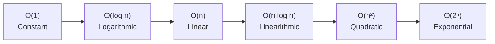

import { Tabs, TabItem } from '@astrojs/starlight/components';
import { Aside } from '@astrojs/starlight/components';

Complexity analysis lets you predict how an algorithm's running time (or memory usage) scales as input size grows. This is how you decide whether an algorithm is practical before writing a single line of code.

---

## Why Counting Exact Steps Doesn't Work

An algorithm's exact number of steps depends on hardware, compiler, and input values. Instead, we classify algorithms by their **rate of growth**.

Two algorithms that take 3n² + 5 steps and 100n² + 1000 steps respectively both belong to O(n²) — the constant factors matter less than the shape of the growth.

---

## Worst-Case Analysis

The **worst case** is the maximum number of steps for any input of size n.

**Why worst case?**
- Guarantees upper bound on running time
- Protects against adversarial inputs
- Easier to reason about than average case

**Example: Linear search**

<Tabs>
<TabItem label="Python">
```python
def find(arr, target):
    for i in range(len(arr)):
        if arr[i] == target:
            return i
    return -1
```
</TabItem>
<TabItem label="JavaScript">
```javascript
function find(arr, target) {
    for (let i = 0; i < arr.length; i++) {
        if (arr[i] === target) return i;
    }
    return -1;
}
```
</TabItem>
<TabItem label="C#">
```csharp
int Find(int[] arr, int target) {
    for (int i = 0; i < arr.Length; i++) {
        if (arr[i] == target) return i;
    }
    return -1;
}
```
</TabItem>
<TabItem label="Java">
```java
int find(int[] arr, int target) {
    for (int i = 0; i < arr.length; i++) {
        if (arr[i] == target) return i;
    }
    return -1;
}
```
</TabItem>
</Tabs>

- **Best case:** Target is at index 0 → 1 comparison
- **Worst case:** Target is at the last position, or not present → n comparisons
- **We care about worst case:** O(n)

---

## Asymptotic Notation

Asymptotic notation describes the **shape** of growth, ignoring constants and lower-order terms.

### Big O — O(g(n)) — Upper Bound

**f(n) ∈ O(g(n))** means: f grows **no faster than** g (up to a constant factor).

Formally: there exists C > 0 and n₀ such that f(n) ≤ C × g(n) for all n ≥ n₀.

**Intuition:** O is the ceiling. "This algorithm runs in at most O(n²) time."

**Proving Big O:** Remove terms that make f smaller; scale remaining terms to match g.

```
f(n) = 4n³ − n² + n
Claim: f ∈ O(n³)

For n ≥ 1:
4n³ − n² + n ≤ 4n³ + 0 + n³   ← drop −n², replace n with n³
             ≤ 5n³
So C = 5, n₀ = 1. ✓
```

### Omega — Ω(g(n)) — Lower Bound

**f(n) ∈ Ω(g(n))** means: f grows **no slower than** g.

Formally: there exists c > 0 and n₀ such that f(n) ≥ c × g(n) for all n ≥ n₀.

**Intuition:** Ω is the floor. "This algorithm needs at least Ω(n) time."

**Proving Omega:** Remove terms that make f larger; scale remaining to match g.

```
f(n) = 4n³ − n² + n
Claim: f ∈ Ω(n³)

For n ≥ 1:
4n³ − n² + n ≥ 4n³ − n³ + 0   ← replace −n² with −n³ (worse), drop n
             ≥ 3n³
So c = 3, n₀ = 1. ✓
```

### Theta — Θ(g(n)) — Tight Bound

**f(n) ∈ Θ(g(n))** means: f is **both O(g) and Ω(g)**. The function grows at exactly the rate of g.

```
f(n) = 4n³ − n² + n ∈ Θ(n³)
because it is both O(n³) and Ω(n³).
```

**Intuition:** Θ is an exact characterization. "This algorithm runs in exactly Θ(n log n) time."

---

## Common Growth Classes

Listed from fastest to slowest:

| Class | Name | Example | n=10 | n=20 |
|---|---|---|---|---|
| O(1) | Constant | Array access | 1 | 1 |
| O(log n) | Logarithmic | Binary search | 3 | 4 |
| O(n) | Linear | Linear search | 10 | 20 |
| O(n log n) | Linearithmic | Merge sort | 33 | 86 |
| O(n²) | Quadratic | Bubble sort | 100 | 400 |
| O(n³) | Cubic | Matrix multiply (naive) | 1,000 | 8,000 |
| O(2ⁿ) | Exponential | SAT brute force | 1,024 | 1,048,576 |
| O(n!) | Factorial | TSP brute force | 3,628,800 | 2.4 × 10¹⁸ |



**Polynomial growth** (everything up to O(nᵏ)) is generally considered *practically solvable*.  
**Exponential growth** (O(2ⁿ), O(n!)) is practically *unsolvable* for large n.

---

## Rules for Combining Complexities

| Situation | Rule | Example |
|---|---|---|
| Sequential steps | Add, take the larger | O(n) + O(n²) = O(n²) |
| Nested loops | Multiply | O(n) × O(n) = O(n²) |
| Constant factor | Drop it | O(7n) = O(n) |
| Lower-order terms | Drop them | O(n² + n) = O(n²) |

**Nested loop example:**

<Tabs>
<TabItem label="Python">
```python
for i in range(n):          # n iterations
    for j in range(n):      # n iterations each
        process(arr[i][j])  # O(1) each

# Total: n × n × O(1) = O(n²)
```
</TabItem>
<TabItem label="JavaScript">
```javascript
for (let i = 0; i < n; i++) {       // n iterations
    for (let j = 0; j < n; j++) {   // n iterations each
        process(arr[i][j]);          // O(1) each
    }
}
// Total: n × n × O(1) = O(n²)
```
</TabItem>
<TabItem label="C#">
```csharp
for (int i = 0; i < n; i++) {       // n iterations
    for (int j = 0; j < n; j++) {   // n iterations each
        Process(arr[i, j]);          // O(1) each
    }
}
// Total: n × n × O(1) = O(n²)
```
</TabItem>
<TabItem label="Java">
```java
for (int i = 0; i < n; i++) {       // n iterations
    for (int j = 0; j < n; j++) {   // n iterations each
        process(arr[i][j]);          // O(1) each
    }
}
// Total: n × n × O(1) = O(n²)
```
</TabItem>
</Tabs>

---

## Concrete Examples

### Binary Search — O(log n)

<Tabs>
<TabItem label="Python">
```python
def binary_search(arr, target):
    lo, hi = 0, len(arr) - 1
    while lo <= hi:
        mid = (lo + hi) // 2
        if arr[mid] == target:
            return mid
        elif arr[mid] < target:
            lo = mid + 1
        else:
            hi = mid - 1
    return -1
```
</TabItem>
<TabItem label="JavaScript">
```javascript
function binarySearch(arr, target) {
    let lo = 0, hi = arr.length - 1;
    while (lo <= hi) {
        const mid = Math.floor((lo + hi) / 2);
        if (arr[mid] === target) return mid;
        else if (arr[mid] < target) lo = mid + 1;
        else hi = mid - 1;
    }
    return -1;
}
```
</TabItem>
<TabItem label="C#">
```csharp
int BinarySearch(int[] arr, int target) {
    int lo = 0, hi = arr.Length - 1;
    while (lo <= hi) {
        int mid = (lo + hi) / 2;
        if (arr[mid] == target) return mid;
        else if (arr[mid] < target) lo = mid + 1;
        else hi = mid - 1;
    }
    return -1;
}
```
</TabItem>
<TabItem label="Java">
```java
int binarySearch(int[] arr, int target) {
    int lo = 0, hi = arr.length - 1;
    while (lo <= hi) {
        int mid = (lo + hi) / 2;
        if (arr[mid] == target) return mid;
        else if (arr[mid] < target) lo = mid + 1;
        else hi = mid - 1;
    }
    return -1;
}
```
</TabItem>
</Tabs>

Each step halves the search space. Starting from n elements:
```
Step 1: n/2 elements remain
Step 2: n/4 elements remain
...
Step k: n/2ᵏ elements remain → done when n/2ᵏ = 1 → k = log₂(n)
```

**Worst case:** O(log n)

### Sorting — O(n log n)

Merge sort splits the array (O(log n) levels) and merges at each level (O(n) work):
```
Total: O(n log n)
```

Bubble sort compares every pair on each pass (O(n²)):
```
Pass 1: n−1 comparisons
Pass 2: n−2 comparisons
...
Total: (n−1) + (n−2) + … + 1 = n(n−1)/2 ≈ n²/2 → O(n²)
```

---

## Logarithm Base

In Big O, the base of a logarithm doesn't matter because:
```
log_a(n) = log_b(n) / log_b(a)
```
The log_b(a) factor is a constant, which we drop in O notation. So O(log₂ n) = O(log₁₀ n) = O(ln n).

---

## Special Cases to Watch

**The n in the exponent vs. the exponent n:**
- O(n²) — polynomial — manageable
- O(2ⁿ) — exponential — blows up instantly

**The log in the base vs. in the argument:**
- O(log n) — very fast, barely grows
- O(n log n) — still practical for most inputs
