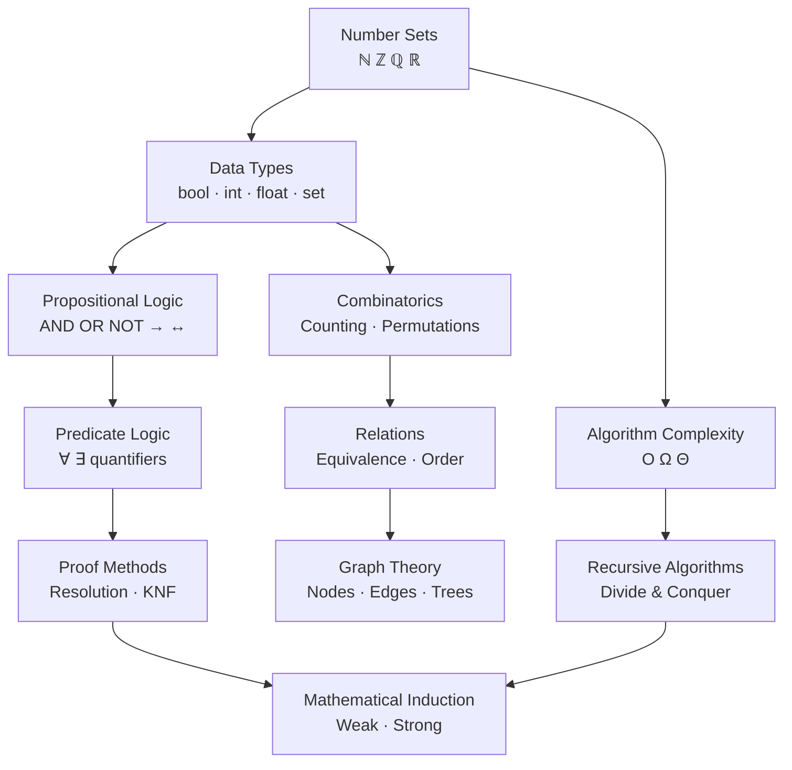

This section covers the mathematical foundations used in computer science, based on Discrete Mathematics (DMATH). You do not need to be a mathematician — the goal is to build the intuition behind the concepts so you can reason clearly about algorithms, data structures, and software correctness.

## What's Covered

| Section | Topics |
|---|---|
| [Number Sets](/math/foundations/number-sets) | ℕ, ℤ, ℚ, ℝ, ℂ — what numbers are available and why it matters |
| [Algebra Basics](/math/foundations/algebra) | Arithmetic rules, modular arithmetic, exponents, logarithms |
| [Boolean & Logic](/math/data-types/boolean) | AND, OR, NOT, XOR, implication, equivalence |
| [Integers & Binary](/math/data-types/integers) | Binary representation, integer division, modulo |
| [Floats & IEEE 754](/math/data-types/floats) | How real numbers are stored, rounding, precision |
| [Sets & Functions](/math/data-types/sets-functions) | Sets, subsets, union, intersection; functions and mappings |
| [Propositional Logic](/math/logic/propositional-logic) | Truth tables, tautologies, logical laws, simplification |
| [Predicate Logic](/math/logic/predicate-logic) | Variables in statements, quantifiers ∀ and ∃ |
| [Proof Methods](/math/logic/proof-methods) | Semantic entailment, resolution, conjunctive normal form |
| [Complexity & Big O](/math/algorithms/complexity) | Big O, Omega, Theta — measuring algorithm growth |
| [Recursive Algorithms](/math/algorithms/recursion) | Recursion trees, divide-and-conquer, recurrence relations |
| [Mathematical Induction](/math/algorithms/induction) | Weak and strong induction — proving things for all n |
| [Counting Rules](/math/combinatorics/counting-rules) | Sum rule, product rule, inclusion-exclusion, generating functions |
| [Permutations & Combinations](/math/combinatorics/permutations-combinations) | Ordered vs. unordered selection, with and without replacement |
| [Relations & Properties](/math/relations/relations) | Reflexive, symmetric, transitive; equivalences, orderings, Hasse diagrams |
| [Graph Basics](/math/graphs/graph-basics) | Nodes, edges, directed/undirected, adjacency, Handshaking Lemma |
| [Special Graphs](/math/graphs/special-graphs) | Regular, complete, bipartite, planar, isomorphic graphs |
| [Trees](/math/graphs/trees) | Tree definition, k-ary trees, leaf/node counts |

## Concept Map

## Learning Path

| Stage | Topics |
|---|---|
| **Start here** | Number Sets → Boolean & Logic → Propositional Logic |
| **Core reasoning** | Predicate Logic → Proof Methods → Induction |
| **Algorithms** | Complexity → Recursion → Counting |
| **Structures** | Relations → Graph Theory |

## Related Sections

- [Programming / Algorithms](/programming/algorithms) — applying complexity analysis in practice
- [Programming / Data Structures](/programming/data-structures) — graphs and trees as code
