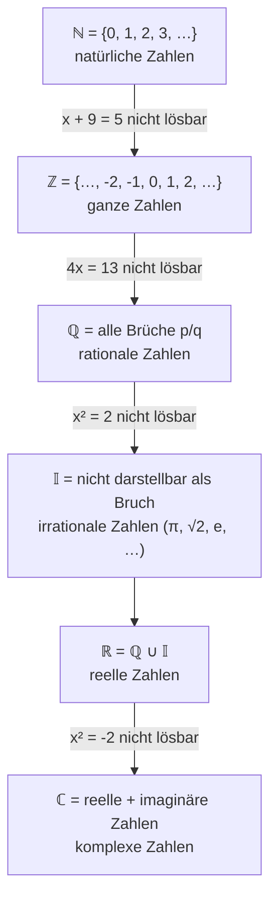
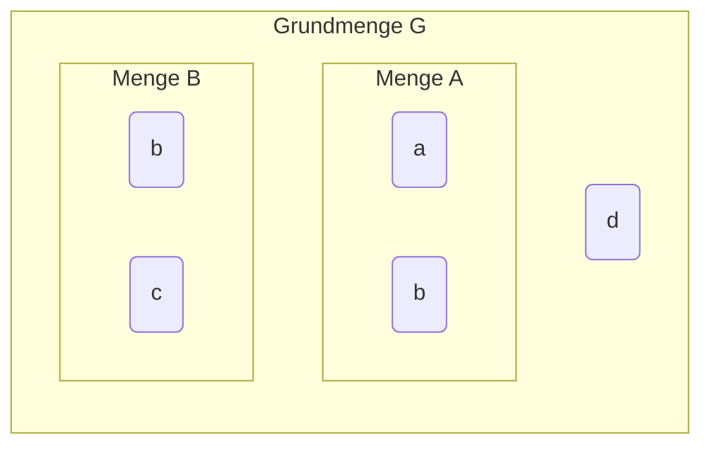
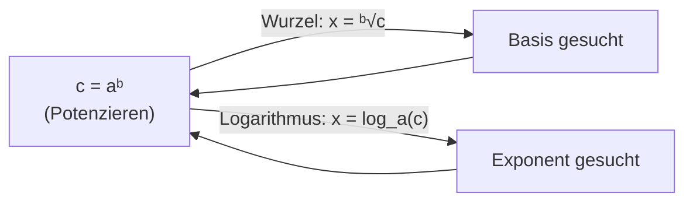

## Mathematische Zeichen & Logik

Mathematik ist eine Sprache — und wie jede Sprache hat sie ihre eigene Grammatik und Symbole. Das Beherrschen dieser Zeichen ist die Voraussetzung dafür, mathematische Aussagen korrekt zu lesen und zu formulieren.

| Zeichen | Bedeutung | Beispiel |
|---|---|---|
| `∈` | „Ist Element von" | `-2 ∈ ℤ` |
| `∉` | „Ist nicht Element von" | `-2 ∉ ℕ` |
| `∃` | „Es existiert" | `∃ a, b, c ∈ ℕ mit a² + b² = c²` |
| `∄` | „Es existiert nicht" | `∄ a, b ∈ ℝ mit |a + b| > |a| + |b|` |
| `∀` | „Für alle" | `∀ a ∈ ℝ gilt |a| ≥ 0` |
| `∑` | Summenzeichen | `∑ aᵢ` |
| `∏` | Produktzeichen | `∏ aᵢ` |
| `!` | Fakultät | `3! = 1 · 2 · 3 = 6` |
| `≈` | Ungefähr gleich | `1/3 ≈ 0,333` |
| `≡` | Äquivalent / gleichwertig | `¬(A ∨ B) ≡ ¬A ∧ ¬B` |

### Aussagenlogik

Eine **Aussage** ist eine Behauptung, die entweder wahr oder falsch ist — nicht beides gleichzeitig.

Die wichtigsten Verknüpfungen:
- **UND (∧):** `A ∧ B` ist wahr, wenn *beide* Aussagen wahr sind.
- **ODER (∨):** `A ∨ B` ist wahr, wenn *mindestens eine* Aussage wahr ist.
- **NICHT (¬):** `¬A` kehrt den Wahrheitswert um.

Die **De Morganschen Gesetze** sind zentrale Umformungsregeln:

```
¬(A ∨ B) ≡ ¬A ∧ ¬B
¬(A ∧ B) ≡ ¬A ∨ ¬B
```

*Warum wichtig?* Diese Gesetze erlauben es, komplexe Verneinungen aufzulösen — ein Muster, das in der Logik, Informatik und Rechtswissenschaft gleichermaßen auftaucht.

---

## Zahlen und Zahlenbereiche

Zahlen sind nicht alle gleich — sie unterscheiden sich in ihrer Struktur. Der beste Weg, die verschiedenen Zahlenmengen zu verstehen, ist, sie als schrittweise Erweiterungen zu sehen, die jeweils entstanden, weil bisherige Mengen zur Lösung bestimmter Gleichungen nicht ausreichten.



Jede Erweiterung hat ihren Grund: Es gibt Gleichungen, die in der kleineren Menge keine Lösung haben. Die reellen Zahlen füllen die gesamte Zahlengerade aus — jeder Punkt auf der Geraden entspricht genau einer reellen Zahl.

**Wichtige Konventionen:**
- `ℕ* = {1, 2, 3, …}` — natürliche Zahlen *ohne* Null
- `ℤ⁺ = {0, 1, 2, …}` — positive ganze Zahlen (= ℕ)
- `ℤ⁻ = {…, -2, -1, 0}` — negative ganze Zahlen inkl. Null

### Rationale vs. irrationale Zahlen

Rationale Zahlen lassen sich als Bruch `p/q` darstellen (mit `p, q ∈ ℤ, q ≠ 0`). Das bedeutet, sie haben eine endliche oder *periodische* Dezimaldarstellung: `1/3 = 0,333… = 0,3̄`.

Irrationale Zahlen hingegen haben eine unendliche, *nicht-periodische* Dezimaldarstellung — `π = 3,14159265…` oder `√2 = 1,41421356…` — und können nicht als Bruch geschrieben werden.

---

## Der Betrag

Der **Betrag** |a| einer reellen Zahl a ist ihr Abstand vom Nullpunkt auf der Zahlengerade — immer eine nicht-negative Zahl.

$$|a| = \begin{cases} a & \text{für } a \geq 0 \\ -a & \text{für } a < 0 \end{cases}$$

**Beispiele:** `|3| = 3`, `|-4| = 4`, `|0| = 0`

**Rechenregeln:**

| Gesetz | Formel | Achtung |
|---|---|---|
| Produkt | `|a · b| = |a| · |b|` | gilt stets |
| Quotient | `|a / b| = |a| / |b|` | `b ≠ 0` |
| Dreiecksungleichung | `|a + b| ≤ |a| + |b|` | Gleichheit nur wenn gleiche Vorzeichen |
| Negation | `|-a| = |a|` | |
| Symmetrie | `|b - a| = |a - b|` | Abstand ist symmetrisch |
| Wurzel | `√(a²) = |a|` | *nicht* `√(a²) = a`! |

Die letzte Regel wird oft falsch angewendet: `√((-3)²) = √9 = 3 = |-3|`, *nicht* -3. Der Betrag verhindert hier negative Ergebnisse.

*Geometrische Bedeutung:* `|a - b|` ist der Abstand zwischen den Punkten a und b auf der Zahlengeraden.

---

## Teilbarkeit, ggT und kgV

### Teilbarkeitsregeln

Eine natürliche Zahl ist durch…
- **2** teilbar: letzte Ziffer gerade
- **3** teilbar: Quersumme durch 3 teilbar
- **4** teilbar: letzte *zwei* Ziffern durch 4 teilbar
- **5** teilbar: letzte Ziffer ist 0 oder 5
- **9** teilbar: Quersumme durch 9 teilbar
- **10** teilbar: letzte Ziffer ist 0

### Primzahlen

Primzahlen sind natürliche Zahlen `> 1`, die *nur* durch 1 und sich selbst teilbar sind: 2, 3, 5, 7, 11, 13, 17, 19, 23, …

**Fundamentalsatz der Arithmetik:** Jede natürliche Zahl `n > 1` lässt sich *eindeutig* als Produkt von Primzahlen darstellen:
```
n = p₁^n₁ · p₂^n₂ · … · pₖ^nₖ
```
Beispiel: `4536 = 2³ · 3⁴ · 7`

### Größter gemeinsamer Teiler (ggT) und kleinstes gemeinsames Vielfaches (kgV)

**Vorgehen:**
1. Alle Zahlen in ihre Primfaktoren zerlegen.
2. **ggT** = Produkt der *gemeinsamen* Primfaktoren (jeweils mit der *kleinsten* Häufigkeit).
3. **kgV** = Produkt *aller* auftretenden Primfaktoren (jeweils mit der *größten* Häufigkeit).

**Beispiel:** `ggT(24, 36, 60)` und `kgV(24, 36, 60)`
```
24 = 2³ · 3
36 = 2² · 3²
60 = 2² · 3 · 5

ggT = 2² · 3       = 12
kgV = 2³ · 3² · 5 = 360
```

*Warum braucht man das?* ggT und kgV sind fundamental beim Kürzen und Addieren von Brüchen — und tauchen in Informatik (Euklidscher Algorithmus), Musiktheorie und Taktplanung auf.

---

## Prozentrechnung

Prozentrechnung ist kein isoliertes Thema — sie ist das Fundament von Zinsrechnung, Rabatten, Statistik und vielem mehr.

**Kernbegriffe:**

| Variable | Name | Bedeutung | Beispiel (8%) |
|---|---|---|---|
| `p` | Zinsfuss | Anzahl der Prozente | `p = 8` |
| `i = p/100` | Zinssatz | Dezimaldarstellung | `i = 0,08` |
| `q = 1 + i` | Aufzinsfaktor | Faktor bei Zunahme | `q = 1,08` |
| `q = 1 - i` | Abzinsfaktor | Faktor bei Abnahme | `q = 0,92` |

**Die direkte Berechnung** ist eleganter als die klassische:
- Preis mit 8% Aufschlag: `Preis · 1,08` (statt erst 8% berechnen und dann addieren)
- Mehrere Aufschläge hintereinander: `Preis · q₁ · q₂ · …` (Reihenfolge egal!)


**Die große Frage der Prozentrechnung:** Wie groß ist der Grundwert?

$$\text{Relative Veränderung} = \frac{\text{neuer Wert} - \text{ursprünglicher Wert}}{\text{ursprünglicher Wert}}$$

**Achtung bei Umkehroperationen:** Wenn ein Preis zuerst um 20% sinkt und dann um 20% steigt, ist das Ergebnis *nicht* der Ausgangswert: `1,20 · 0,80 = 0,96` — ein Verlust von 4%!

### Intervalldarstellungen

Intervalle beschreiben Mengen von reellen Zahlen zwischen zwei Grenzen. Die Klammern zeigen an, ob die Grenzwerte eingeschlossen sind:

| Schreibweise | Bedeutung | Enthält Grenzen? |
|---|---|---|
| `]a; b[` oder `(a, b)` | offenes Intervall | Nein |
| `[a; b]` | abgeschlossenes Intervall | Ja |
| `[a; b[` | halboffenes Intervall | Links ja, rechts nein |
| `]a; ∞[` | nach rechts unbeschränkt | nur linke Grenze |

**Hinweis:** Unendlichkeit (`∞`) kann nie in einem Intervall *enthalten* sein — es gibt keine „größte reelle Zahl". Deshalb schreibt man immer `]a; ∞[` und nie `[a; ∞]`.

---

## Summen-, Produkt- und Fakultätszeichen

### Das Summenzeichen (Σ)

Das Summenzeichen ist eine kompakte Schreibweise für Summen mit vielen Gliedern:

$$\sum_{i=1}^{n} a_i = a_1 + a_2 + \cdots + a_n$$

Die Variable `i` heißt Laufvariable, `1` ist der Startwert, `n` der Endwert.

### Das Produktzeichen (Π)

Analog zur Summe, aber für Produkte:

$$\prod_{i=1}^{n} a_i = a_1 \cdot a_2 \cdots a_n$$

### Die Fakultät (!)

Die Fakultät `n!` ist das Produkt aller natürlichen Zahlen von 1 bis n:

$$n! = 1 \cdot 2 \cdot 3 \cdots n = \prod_{i=1}^{n} i$$

Per Definition: `0! = 1` (wichtig für kombinatorische Formeln)

**Beispiele:** `3! = 6`, `5! = 120`, `10! = 3'628'800`

### Binomialkoeffizient

Der Binomialkoeffizient `n über m` zählt, auf wie viele Arten man `m` Elemente aus `n` auswählen kann (ohne Reihenfolge):

$$\binom{n}{m} = \frac{n!}{m! \cdot (n-m)!}$$

### Binomische Formeln

Die drei binomischen Formeln sind wichtige Abkürzungen beim Expandieren von Produkten:

$$
(a + b)^2 = a^2 + 2ab + b^2
$$

$$
(a - b)^2 = a^2 - 2ab + b^2
$$

$$
(a + b)(a - b) = a^2 - b^2
$$

Die dritte Formel — die **dritte binomische Formel** oder **Differenz der Quadrate** — ist besonders nützlich zum Faktorisieren.

---

## Grundgesetze für reelle Zahlen

Die Rechengesetze sind keine willkürlichen Regeln, sondern folgen aus der Struktur der reellen Zahlen:

| Gesetz | Addition | Multiplikation |
|---|---|---|
| Kommutativgesetz | `a + b = b + a` | `a · b = b · a` |
| Assoziativgesetz | `(a+b)+c = a+(b+c)` | `(a·b)·c = a·(b·c)` |
| Distributivgesetz | `a·(b+c) = a·b + a·c` | — |
| Neutrales Element | `a + 0 = a` | `a · 1 = a` |
| Inverses Element | `a + (-a) = 0` | `a · (1/a) = 1` (a ≠ 0) |

**Rechnerhierarchie (Punkt vor Strich, Potenz zuerst):**
```
Stufe 3: Potenzieren, Radizieren, Logarithmieren
Stufe 2: Multiplikation, Division
Stufe 1: Addition, Subtraktion
```

---

## Mengenlehre

Mengen sind die Grundlage der modernen Mathematik. Eine **Menge** ist eine wohldefinierte Zusammenfassung von Objekten (Elementen).

### Darstellung von Mengen

Mengen können auf drei Arten beschrieben werden:

1. **Aufzählend:** `A = {1, 2, 3, 4}`
2. **Durch Bildungsvorschrift:** `A = {x | x ∈ ℕ, x ≤ 4}`
3. **Beschreibend:** „die Menge der natürlichen Zahlen ≤ 4"

**Mächtigkeit (Kardinalität):** `|A|` bezeichnet die Anzahl der Elemente einer Menge. Zwei Mengen sind **gleichmächtig**, wenn `|A| = |B|`.

### Mengenoperationen



| Operation | Zeichen | Bedeutung | Beispiel (`A={a,b}`, `B={b,c}`) |
|---|---|---|---|
| Vereinigung | `A ∪ B` | alle Elemente aus A *oder* B | `{a, b, c}` |
| Durchschnitt | `A ∩ B` | nur Elemente in A *und* B | `{b}` |
| Differenz | `A \ B` | Elemente in A, *nicht* in B | `{a}` |
| Komplement | `Ā` | Elemente der Grundmenge *nicht* in A | hängt von G ab |
| Kartesisches Produkt | `A × B` | alle geordneten Paare (a; b) | `{(a,b),(a,c),(b,b),(b,c)}` |

### Teilmengen

B ist **Teilmenge** von A (`B ⊂ A`), wenn jedes Element von B auch in A enthalten ist. B ist eine **echte** Teilmenge (`B ⊊ A`), wenn zusätzlich A Elemente hat, die nicht in B sind.

Eine Menge mit `n` Elementen hat genau `2ⁿ` Teilmengen — die Potenzmenge.

---

## Höhere Rechenoperationen: Potenz, Wurzel, Logarithmus

Diese drei Operationen bilden eine Einheit — sie sind die Umkehrfunktionen voneinander.



### Potenzrechnung

Im Ausdruck `b = aⁿ` heißt `a` die **Basis**, `n` der **Exponent** und `aⁿ` die **n-te Potenz von a**.

**Wichtige Voraberkenntnisse:**
- `aⁿ` ist für allgemeine (nicht-ganzzahlige) `n` nur definiert, wenn `a > 0`
- `(-a)ⁿ ≠ -aⁿ` im Allgemeinen! Klammern sind entscheidend.
- `(-1)ⁿ = 1` für gerade `n`, und `= -1` für ungerade `n`

**Potenzgesetze — Fall 1: Gleicher Exponent, beliebige Basis:**

| Gesetz | Formel | Beispiel |
|---|---|---|
| Produktregel | `aⁿ · bⁿ = (a·b)ⁿ` | `4³ · 3³ = 12³` |
| Quotientenregel | `aⁿ / bⁿ = (a/b)ⁿ` | `4³ / 2³ = 2³` |
| **Achtung!** | `aⁿ + bⁿ ≠ (a+b)ⁿ` | `2³ + 3³ ≠ 5³` |

**Potenzgesetze — Fall 2: Gleiche Basis, beliebige Exponenten:**

| Regel | Gesetz | Bedeutung |
|---|---|---|
| Regel 0 | `a⁰ = 1` (a ≠ 0) | Jede Zahl hoch 0 ergibt 1 |
| Regel 1 | `aⁿ · aᵐ = aⁿ⁺ᵐ` | Gleiche Basis: Exponenten addieren |
| Regel 2 | `a⁻ⁿ = 1/aⁿ` | Negativer Exponent = Kehrwert |
| Regel 3 | `aⁿ / aᵐ = aⁿ⁻ᵐ` | Gleiche Basis: Exponenten subtrahieren |
| Regel 4 | `(aⁿ)ᵐ = aⁿ·ᵐ` | Potenz einer Potenz: multiplizieren |
| Regel 5 | `ⁿ√a = a^(1/n)` | Wurzel als gebrochener Exponent |
| Regel 6 | `a^(m/n) = ⁿ√(aᵐ)` | Allgemein gebrochener Exponent |

*Warum ist `a⁰ = 1`?* Folgt direkt aus Regel 3: `aⁿ / aⁿ = aⁿ⁻ⁿ = a⁰`, und jede Zahl durch sich selbst ist 1.

### Wissenschaftliche Notation (Exponentialform)

Sehr große oder sehr kleine Zahlen werden in der Form `m · 10ⁿ` geschrieben, wobei `1 ≤ m < 10`:
- `2100 ≈ 1,268 · 10³⁰`
- Lichtjahr: `≈ 9,461 · 10¹⁵ m`

**Dezimalvorsätze** (Auszug):

| Vorsatz | Zeichen | Wert |
|---|---|---|
| Giga | G | `10⁹` |
| Mega | M | `10⁶` |
| Kilo | k | `10³` |
| Milli | m | `10⁻³` |
| Mikro | μ | `10⁻⁶` |
| Nano | n | `10⁻⁹` |

### Logarithmen

Der **Logarithmus** ist die Antwort auf die Frage: „Auf welche Potenz muss ich die Basis `a` erheben, um `c` zu erhalten?"

$$c = a^x \iff x = \log_a c$$

**Voraussetzungen:** Basis `a > 0, a ≠ 1`; Numerus `c > 0`.

Spezialfälle:
- `log_a(1) = 0` (weil `a⁰ = 1`)
- `log_a(a) = 1` (weil `a¹ = a`)
- `log₁₀` heißt **dekadischer Logarithmus** (`lg` oder `log`)
- `log_e` heißt **natürlicher Logarithmus** (`ln`), mit `e ≈ 2,71828…`

**Umrechnungsformel (Basiswechsel):**
$$\log_a c = \frac{\ln c}{\ln a} = \frac{\lg c}{\lg a}$$

**Logarithmengesetze:**

| Nr | Gesetz | Beispiel |
|---|---|---|
| 1 | `log_a(c·d) = log_a(c) + log_a(d)` | `lg(100 000) = lg(100) + lg(1000) = 5` |
| 2 | `log_a(cᵈ) = d · log_a(c)` | `lg(10⁵) = 5 · lg(10) = 5` |
| 3 | `log_a(1/d) = -log_a(d)` | |
| 4 | `log_a(c/d) = log_a(c) - log_a(d)` | |
| 5 | `log_a(ⁿ√c) = (1/n) · log_a(c)` | |
| 6 | `a^(log_a c) = c` | Umkehreigenschaft |
| 7 | `log_a(aᵇ) = b` | Umkehreigenschaft |

*Warum sind Logarithmen nützlich?* Sie transformieren Multiplikation in Addition und erlauben es, Exponenten zu lösen — zentral für Exponentialwachstum, pH-Werte, Dezibel-Skala und Zinseszinsrechnung.

### Die Euler'sche Zahl e

Die Zahl `e = 2,71828…` entsteht als Grenzwert der Zinseszinsrechnung bei unendlich häufiger Aufzinsung:

$$e = \lim_{n \to \infty} \left(1 + \frac{1}{n}\right)^n$$

| n | `(1 + 1/n)ⁿ` |
|---|---|
| 4 | 2,44141 |
| 100 | 2,70481 |
| 10'000 | 2,71815 |
| 1'000'000 | 2,71828… |

`e` ist irrational und tritt natürlicherweise in Wachstums- und Zerfallsprozessen auf — deshalb ist der natürliche Logarithmus `ln` in der Wissenschaft universell.

### Runden und signifikante Stellen

- **Signifikante Stellen:** Alle Ziffern, die eine echte Genauigkeit ausdrücken (keine führenden Nullen).
- Beispiel: `0,00234` hat 3 signifikante Stellen; `23400` kann 3, 4 oder 5 haben (mehrdeutig ohne Kontext).
- Bei Berechnungen bestimmt die Eingabe mit der *geringsten* Genauigkeit die Genauigkeit des Ergebnisses.

---

## Geometrische Grundlagen (Überblick)

Wichtige Formeln für Flächen und Volumen, die immer wieder gebraucht werden:

| Figur | Fläche | Besonderheit |
|---|---|---|
| Rechteck | `A = a · b` | |
| Dreieck | `A = (a · h) / 2` | h = Höhe auf a |
| Kreis | `A = π · r²` | `π ≈ 3,14159…` |
| Trapez | `A = (a + c) / 2 · h` | a, c = parallele Seiten |

**Pythagoras:** In einem rechtwinkligen Dreieck gilt `a² + b² = c²` (c = Hypotenuse).
