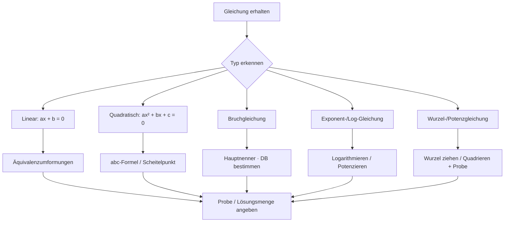
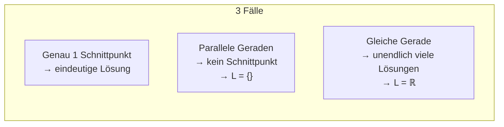

## Was ist eine Gleichung?

Eine Gleichung ist eine mathematische Aussage, die behauptet, dass zwei Ausdrücke denselben Wert haben. Das Lösen einer Gleichung bedeutet, alle Werte der Unbekannten zu finden, für die diese Aussage wahr ist.

**Das allerwichtigste Prinzip:** Vom ersten bis zum letzten Schritt darf sich die Lösungsmenge nicht ungewollt verändern.

---

## Gleichungstypen im Überblick

Das Erkennen des Gleichungstyps ist der erste und wichtigste Schritt — denn jeder Typ hat seine eigene Lösungsstrategie:

| Typ | Beispiel | Lösungsmethode |
|---|---|---|
| Lineare Gleichung | `8x + 7 = 25` | Äquivalenzumformungen |
| Bruchgleichung | `7/(2x) + 5/(3x) = 5/12` | Hauptnenner, Definitionsbereich prüfen |
| Gleichung mit Betragszeichen | `|x + 2| = 4` | Fallunterscheidung |
| Lineares Gleichungssystem | `2x = 6y - 4; 3x + 4 = 2y` | Einsetzung, Gleichsetzung, Addition |
| Quadratische Gleichung | `x² + 5x - 24 = 0` | Lösungsformel (abc-Formel) |
| Wurzelgleichung | `√(2x+3) = √(x+2)` | Quadrieren (+ Probe!) |
| Potenzgleichung | `x⁶ = 64` | n-te Wurzel ziehen |
| Exponentialgleichung | `e^(3x-2) = e^(x+3)` | Logarithmieren |
| Logarithmusgleichung | `ln(2x) + ln(6x) = ln 48` | Logarithmengesetze anwenden |
| Textgleichung | Wortproblem → Gleichung | Modellierung + Lösung |



---

## Äquivalenzumformungen — Was darf ich?

Beim Lösen von Gleichungen gilt das **Prinzip der Äquivalenz**: Jede Umformung muss die Lösungsmenge unverändert lassen.

**Erlaubt (Äquivalenzumformungen):**
- Auf beiden Seiten dieselbe Zahl **addieren oder subtrahieren**
- Auf beiden Seiten mit derselben Zahl ≠ 0 **multiplizieren oder dividieren**
- Unter Voraussetzungen: **Logarithmieren** oder **Radizieren**

### Gewinnumformungen (= neue Scheinlösungen möglich)

Wenn man auf beiden Seiten **quadriert** (oder eine andere gerade Potenz anwendet) oder **Betragszeichen setzt**, können *neue* Lösungen entstehen, die in der Originalgleichung nicht gelten.

**Folge:** Probe ist Pflicht!

```
Beispiel: x + 2 = 8  →  L = {6}
Quadriert: (x+2)² = 64  →  L = {-10; 6}
Die "neue" Lösung x = -10 muss geprüft werden → in Original: -10 + 2 = -8 ≠ 8 → kein!
```

### Verlustumformungen (= Lösungen können verloren gehen)

Das **Dividieren durch einen Term**, der die Variable enthält, ist eine Verlustumformung — häufig ein Fehler!

```
Falsch: x(x - 5) = x | ÷ x → x - 5 = 1 → x = 6   [nur eine Lösung!]
Richtig: x(x - 5) = x → x² - 5x - x = 0 → x² - 6x = 0 → x(x-6) = 0
→ x₁ = 0, x₂ = 6   [beide Lösungen!]
```

### Allgemeingültig, teilgültig, unlösbar

| Ergebnis am Ende | Bedeutung | Lösungsmenge |
|---|---|---|
| `x = 5` o.ä. (ein konkreter Wert) | **teilgültig** (Normalfall) | `L = {5}` |
| `0 = 1` (falsche Aussage) | **unlösbar** | `L = {}` |
| `0 = 0` oder `x = x` (stets wahr) | **allgemeingültig** | `L = ℝ` (oder DB) |

---

## Definitions- und Lösungsbereich

Der **Definitionsbereich (DB)** einer Gleichung gibt an, aus welcher Menge die Lösung stammen darf. Er ergibt sich aus Einschränkungen der Gleichung selbst:

- Nenner darf nicht Null werden: `1/(x-2)` → `x ≠ 2`
- Ausdruck unter gerader Wurzel muss ≥ 0 sein: `√(x+3)` → `x ≥ -3`
- Logarithmus-Argument muss > 0 sein: `ln(x-1)` → `x > 1`

Die **Lösungsmenge L** ist die Menge aller Werte im DB, die die Gleichung erfüllen.

---

## Lineare Gleichungen

Eine lineare Gleichung hat die Form `ax + b = c` mit `a ≠ 0`. Das systematische Vorgehen:

1. Klammern auflösen und vereinfachen
2. Terme mit x auf eine Seite bringen
3. Konstanten auf die andere Seite
4. Durch den Koeffizienten von x dividieren

**Beispiel:**
```
8x + 7 = 25
8x = 18      | -7
x = 18/8     | :8
x = 9/4
L = {9/4}
```

---

## Bruchgleichungen

Bei Bruchgleichungen muss der Definitionsbereich *vor* dem Lösen bestimmt werden (alle Werte, die Nenner = 0 machen, ausschließen). Dann mit dem Hauptnenner multiplizieren.

**Beispiel:**
```
DB: x ≠ 0, x ≠ -2

7/(2x) + 5/(3x) = 5/12

Hauptnenner: 12x
→ 42 + 20 = 5x
→ 62 = 5x
→ x = 62/5  (liegt im DB → OK)
```

---

## Ungleichungen

Ungleichungen funktionieren wie Gleichungen — mit einer wichtigen Ausnahme:

**Bei Multiplikation oder Division mit einer negativen Zahl dreht sich das Ungleichheitszeichen um!**

```
-8x + 7 < 25
-8x < 18       | - 7
x > -9/4       | : (-8)  ← Zeichen dreht sich!
L = {x | x > -9/4}
```

Bei **Bruchungleichungen** muss eine Fallunterscheidung nach dem Vorzeichen des Nenners erfolgen, weil man nicht einfach mit dem Nenner multiplizieren kann, ohne zu wissen ob er positiv oder negativ ist.

---

## Betragsgleichungen

Der Betrag `|A| = c` (mit `c ≥ 0`) wird durch Fallunterscheidung gelöst:

$$|A| = c \iff A = c \quad \text{oder} \quad A = -c$$

**Beispiel:**
```
|x + 2| = 4

Fall 1: x + 2 = 4  →  x = 2
Fall 2: x + 2 = -4  →  x = -6

L = {-6; 2}
```

Probe immer empfohlen!

---

## Lineare Gleichungssysteme

Ein **lineares Gleichungssystem (LGS)** besteht aus mehreren linearen Gleichungen mit mehreren Unbekannten. Man sucht die Werte, die *alle* Gleichungen gleichzeitig erfüllen.

**Geometrische Interpretation:** Jede lineare Gleichung in zwei Unbekannten beschreibt eine Gerade. Die Lösung ist der Schnittpunkt.



### Drei Lösungsverfahren

**Gleichsetzungsmethode:** Beide Gleichungen nach derselben Variable auflösen, dann gleichsetzen.

**Einsetzungsmethode:** Eine Gleichung nach einer Variablen auflösen, den Ausdruck in die andere Gleichung einsetzen.

**Additionsmethode:** Gleichungen geeignet mit Faktoren multiplizieren, so dass beim Addieren eine Variable wegfällt.

```
Beispiel (Additionsmethode):
I)  x + 2y = 12
II) 4x + 2y = 18

II) - I): 3x = 6 → x = 2
Einsetzen: 2 + 2y = 12 → y = 5
L = {(2; 5)}
```

---

## Quadratische Gleichungen

Eine quadratische Gleichung hat die Normalform `ax² + bx + c = 0` mit `a ≠ 0`.

### Die Lösungsformel (abc-Formel)

$$x_{1,2} = \frac{-b \pm \sqrt{b^2 - 4ac}}{2a}$$

Der Ausdruck `D = b² - 4ac` heißt **Diskriminante** und bestimmt die Anzahl der Lösungen:

| Diskriminante | Anzahl Lösungen | Bedeutung |
|---|---|---|
| `D > 0` | 2 reelle Lösungen | Parabel schneidet x-Achse zweimal |
| `D = 0` | 1 Lösung (Doppellösung) | Parabel berührt x-Achse |
| `D < 0` | keine reelle Lösung | Parabel liegt ganz über/unter x-Achse |

**Beispiel:**
```
2x² - 16x + 24 = 0  →  a = 2, b = -16, c = 24

x₁,₂ = (16 ± √(256 - 192)) / 4
      = (16 ± √64) / 4
      = (16 ± 8) / 4

x₁ = 24/4 = 6    x₂ = 8/4 = 2
L = {2; 6}
```

### Quadratische Ergänzung (Scheitelpunktform)

Durch **quadratische Ergänzung** kann `ax² + bx + c` in die Form `a(x + d)² + e` umgeformt werden. Der Scheitelpunkt liegt dann bei `(-d; e)`.

---

## Wurzelgleichungen

Gleichungen, in denen die Unbekannte unter einer Wurzel steht.

**Vorgehen:**
1. DB bestimmen (Ausdruck unter Wurzel ≥ 0)
2. Wurzel isolieren (auf eine Seite bringen)
3. Beiden Seiten auf die entsprechende Potenz erheben
4. **Probe machen** (Quadrieren ist eine Gewinnumformung!)

**Beispiel:**
```
√(x + 4) - 4 = 0     DB: x ≥ -4
√(x + 4) = 4
x + 4 = 16            | quadrieren
x = 12

Probe: √(12 + 4) - 4 = √16 - 4 = 0 ✓
L = {12}
```

---

## Potenzgleichungen

Gleichungen, in denen die Lösungsvariable in der **Basis** steht: `xⁿ = a`.

**Vorgehen:** Gleichung auf `xⁿ = a` bringen, dann n-te Wurzel ziehen.

**Wichtig:** Bei *geraden* Exponenten gibt es ggf. zwei Lösungen (positive und negative), und negative Werte von `a` haben *keine* reelle Lösung:

```
x⁵ = 32    →  x = ⁵√32 = 2          L = {2}
x⁴ = 16    →  x = ±⁴√16 = ±2        L = {-2; 2}
x⁴ = -16   →  keine reelle Lösung    L = {}
```

---

## Exponentialgleichungen

Gleichungen, in denen die Unbekannte im **Exponenten** steht: `aˣ = c`.

**Methode 1 — Exponentenvergleich** (wenn beide Seiten auf gleiche Basis gebracht werden können):
```
8ˣ = 2
(2³)ˣ = 2¹
3x = 1
x = 1/3     L = {1/3}
```

**Methode 2 — Logarithmieren** (allgemeine Methode):
```
3^(2x+1) = 81
lg(3^(2x+1)) = lg(81)
(2x + 1) · lg(3) = lg(81) = 4 · lg(3)
2x + 1 = 4
x = 3/2 = 1,5     L = {1,5}
```

**Vorgehen bei `e`-Gleichungen:** Gleichung auf `e^(Ausdruck) = Zahl` bringen, dann beide Seiten logarithmieren mit `ln`.

---

## Logarithmusgleichungen

Gleichungen, in denen die Unbekannte im Argument eines Logarithmus steht.

**Vorgehen:**
1. DB bestimmen (alle Argument-Ausdrücke müssen > 0 sein)
2. Logarithmengesetze anwenden, um zu vereinfachen
3. Beide Seiten potenzieren (`a^(log_a x) = x`)
4. Probe (wegen des eingeschränkten DB)

**Beispiel:**
```
ln(2x) + ln(6x) = ln(48)
ln(12x²) = ln(48)          | Produktgesetz: ln(a) + ln(b) = ln(ab)
12x² = 48                   | Umkehreigenschaft des ln
x² = 4
x = ±2

Probe: DB erfordert 2x > 0 und 6x > 0, also x > 0
→ x = -2 entfällt     L = {2}
```

---

## Gleichungssysteme mit mehr als 2 Unbekannten

Für Systeme mit 3 oder mehr Unbekannten verwendet man die **Additionsmethode (Gauß-Algorithmus)**:

Schritt für Schritt werden Variablen durch Addition geeignet skalierter Gleichungen eliminiert, bis man eine Gleichung mit nur einer Unbekannten hat. Dann wird rückwärts eingesetzt.

```
I)   x + y + z = 6
II)  x + 2y + z = 8
III) 2x + y + 3z = 14

II - I:   y = 2
III - 2·I: -y + z = 2  →  z = 4  (mit y = 2)
Einsetzen in I: x + 2 + 4 = 6  →  x = 0

L = {(0; 2; 4)}
```

### Spezialfälle bei LGS

Ein LGS kann auch unlösbar oder unendlich viele Lösungen haben — erkennbar daran, dass beim Lösen eine Zeile der Form `0 = c ≠ 0` (unlösbar) oder `0 = 0` (unendlich viele) entsteht.

---

## Nichtlineare Gleichungssysteme

Wenn mindestens eine Gleichung nichtlinear ist (z. B. Hyperbel + Gerade), löst man typischerweise:

1. Eine Gleichung nach einer Variable auflösen
2. In die andere Gleichung einsetzen → führt auf Polynomgleichung
3. Diese lösen und Probe machen

**Geometrisch:** Eine Hyperbel und eine Gerade können sich in 0, 1 oder 2 Punkten schneiden.

---

## Gleichungen auf quadratische Form zurückführen

Manche Gleichungen sehen auf den ersten Blick kompliziert aus, lassen sich aber durch Substitution auf eine quadratische Gleichung reduzieren.

**Substitutionsidee:** Wenn im Ausdruck ein Muster der Form `f(x)² + a·f(x) + b = 0` erkennbar ist, setzt man `u = f(x)` und löst zuerst nach `u` auf, dann nach `x`.

```
Beispiel: x⁴ - 5x² + 4 = 0
Substitution: u = x²  →  u² - 5u + 4 = 0
→ (u-1)(u-4) = 0  →  u₁ = 1, u₂ = 4
Rücksubstitution:
x² = 1 → x = ±1
x² = 4 → x = ±2
L = {-2, -1, 1, 2}
```
