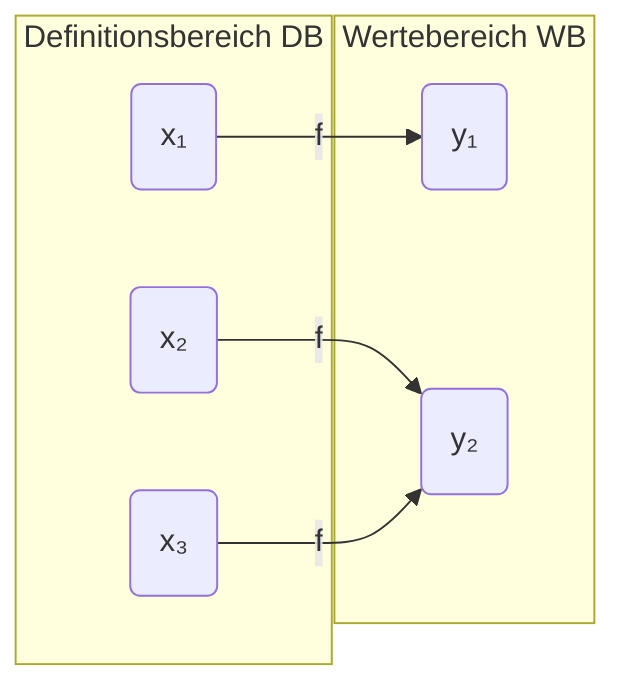
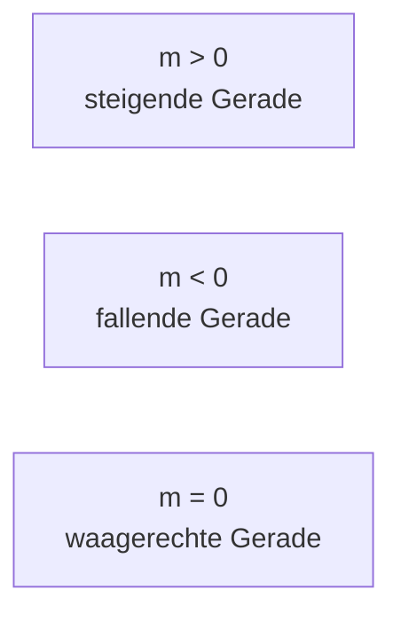
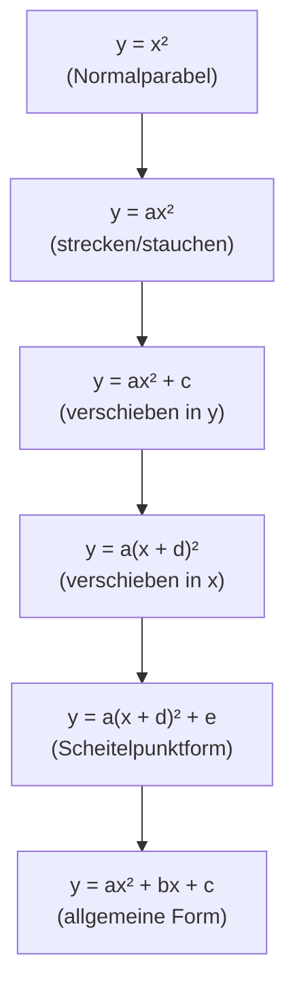
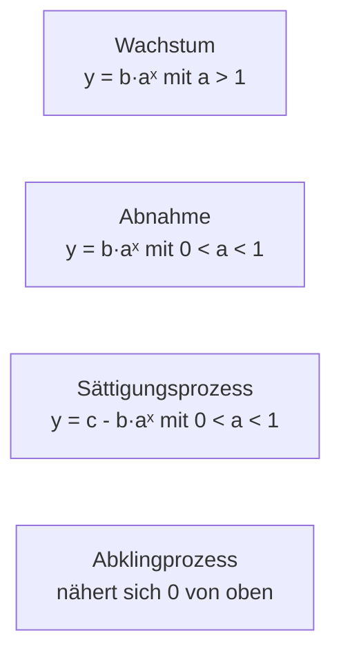

## Was ist eine Funktion?

Eine Funktion ist eine geregelte Zuordnung: jedem Eingabewert wird *genau ein* Ausgabewert zugeordnet. Das klingt einfach — ist aber präzise:

**Formal:** Eine Funktion `f` ist eine Zuordnung `y = f(x)`, so dass es für jedes `x` im Definitionsbereich DB genau einen Wert `y = f(x)` gibt.

**Die entscheidende Bedingung:** Einem x-Wert darf nur *ein* y-Wert entsprechen. Mehreren x-Werten kann aber derselbe y-Wert zugeordnet sein.



Aus dem Definitionsbereich geht von *jedem* Element genau ein Pfeil weg. Im Wertebereich können mehrere Pfeile ankommen — aber kein x darf zwei Pfeile haben.

**Wichtige Begriffe:**

| Begriff | Zeichen | Bedeutung |
|---|---|---|
| Unabhängige Variable | `x` | Eingabewert (Argument) |
| Abhängige Variable | `y` | Ausgabewert (Funktionswert) |
| Definitionsbereich | `D` / `DB` | Menge aller erlaubten x-Werte |
| Wertebereich | `W` / `WB` | Menge aller angenommenen y-Werte |
| Abszisse | x-Achse | horizontale Achse |
| Ordinate | y-Achse | vertikale Achse |

### Das kartesische Koordinatensystem

Das kartesische (rechtwinklige) Koordinatensystem besteht aus zwei senkrecht aufeinander stehenden Achsen. Es unterteilt die Ebene in vier **Quadranten**:

```
   2. Quadrant  |  1. Quadrant
    x < 0, y > 0 | x > 0, y > 0
  ---------------+---------------
    x < 0, y < 0 | x > 0, y < 0
   3. Quadrant  |  4. Quadrant
```

**Spiegelungen eines Punktes P(x; y):**
- An der y-Achse → `P(-x; y)`
- An der x-Achse → `P(x; -y)`
- Am Nullpunkt → `P(-x; -y)`

**Abstand zweier Punkte** A(x₁; y₁) und B(x₂; y₂):
$$d = \sqrt{(x_2 - x_1)^2 + (y_2 - y_1)^2}$$

---

## Lineare Funktion

Die lineare Funktion ist das einfachste und zugleich wichtigste Funktionsmodell der Mathematik.

$$y = f(x) = mx + b$$

- `m` = **Steigung** (Proportionalitätsfaktor): wie steil ist die Gerade?
- `b` = **y-Achsenabschnitt**: wo trifft die Gerade die y-Achse?

**Steigungsdefinition:** `m = vertikale Differenz / horizontale Differenz`



### Eigenschaften der linearen Funktion

| Eigenschaft | Formel / Wert |
|---|---|
| Nullstelle (x-Achsenschnittpunkt) | `x = -b/m` |
| y-Achsenschnittpunkt | `(0; b)` |
| Definitionsbereich | `ℝ` |
| Wertebereich | `ℝ` (bei m ≠ 0) |

### Varianten zur Gleichung einer Geraden

**Zwei-Punkte-Form:** Gegeben P₁(x₁; y₁) und P₂(x₂; y₂):
$$m = \frac{y_2 - y_1}{x_2 - x_1}, \quad \text{dann} \quad y - y_1 = m(x - x_1)$$

**Punkt-Steigungs-Form:** Gegeben Punkt P(x₀; y₀) und Steigung m:
$$y - y_0 = m(x - x_0)$$

### Parallele und senkrechte Geraden

- **Parallele Geraden** haben *dieselbe* Steigung: `m₁ = m₂`
- **Senkrechte Geraden**: die Steigungen sind negative Kehrwerte: `m₁ · m₂ = -1`

### Schnittpunkt zweier Geraden

Gleichung der ersten Gerade `= ` Gleichung der zweiten Gerade setzen und nach x auflösen.

```
y₁ = 2x + 1
y₂ = -x + 7
→ 2x + 1 = -x + 7 → 3x = 6 → x = 2, y = 5
Schnittpunkt: (2; 5)
```

### Umkehrfunktion der linearen Funktion

Die Umkehrfunktion `f⁻¹` vertauscht x und y. Man löst `y = mx + b` nach x auf und benennt dann um:
$$f^{-1}(x) = \frac{x - b}{m} = \frac{1}{m}x - \frac{b}{m}$$

Die Graphen von `f` und `f⁻¹` sind an der Winkelhalbierenden `y = x` gespiegelt.

---

## Die Hyperbel

Die Hyperbel beschreibt die **indirekte Proportionalität**: Je mehr von dem einen, desto weniger vom anderen — ihr Produkt bleibt konstant.

$$y = f(x) = \frac{c}{x} \quad (c \neq 0)$$

**Eigenschaften der Normalhyperbel:**

| Eigenschaft | Wert |
|---|---|
| DB | `ℝ \ {0}` (x = 0 ausgeschlossen) |
| WB | `ℝ \ {0}` |
| Nullstellen | keine |
| y-Achsenschnittpunkt | keiner |
| Asymptoten | x-Achse (y = 0) und y-Achse (x = 0) |
| Symmetrie | Punktsymmetrisch zum Ursprung |

### Verschobene Hyperbel

$$y = f(x) = \frac{c}{x + d} + e$$

- `d`: Verschiebung in x-Richtung → vertikale Asymptote bei `x = -d`
- `e`: Verschiebung in y-Richtung → horizontale Asymptote bei `y = e`

*Warum ist c ≠ 0 notwendig?* Ohne c gäbe es keinen Graphen — der Term `c/x` würde zu 0 und das wäre eine konstante Funktion, keine Hyperbel.

---

## Die Quadratische Funktion (Parabel)

$$y = f(x) = ax^2 + bx + c \quad (a \neq 0)$$

Der Graph einer quadratischen Funktion ist eine **Parabel**.

### Schrittweise Entstehung



- `a > 0`: Parabel öffnet sich **nach oben** (Minimum)
- `a < 0`: Parabel öffnet sich **nach unten** (Maximum)
- `|a| > 1`: schmalere Parabel
- `|a| < 1`: breitere Parabel

### Scheitelpunkt

Der Scheitelpunkt `S(xs; ys)` ist der tiefste (bzw. höchste) Punkt der Parabel:

$$x_s = -\frac{b}{2a}, \quad y_s = c - \frac{b^2}{4a}$$

**Scheitelpunktform:** `y = a(x - xs)² + ys`

### Anzahl Nullstellen (Diskriminante D)

$$D = b^2 - 4ac$$

| D | Anzahl Nullstellen | Lage der Parabel |
|---|---|---|
| `D > 0` | 2 | schneidet x-Achse zweimal |
| `D = 0` | 1 (Berührpunkt) | berührt x-Achse |
| `D < 0` | 0 | liegt ganz über / unter x-Achse |

---

## Die Wurzelfunktion

$$y = f(x) = \sqrt{x} = x^{1/2}$$

Die Wurzelfunktion ist die Umkehrfunktion von `y = x²` (auf dem nicht-negativen Bereich).

**Eigenschaften:**
- DB = `[0; ∞[` (negative Werte nicht definiert)
- WB = `[0; ∞[`
- Monoton wachsend

### Allgemeine Wurzelfunktion

$$y = a\sqrt{x + c} + d$$

- `c > 0`: Verschiebung um c nach links
- `d > 0`: Verschiebung um d nach oben
- `a`: Streckung / Stauchung

*Warum sind Wurzelfunktionen wichtig?* Sie erscheinen bei physikalischen Gesetzen (Schwingungsdauer des Pendels: `T ~ √l`), in der Statistik und in geometrischen Berechnungen.

---

## Extremalwertaufgaben mit Nebenbedingungen

Eine Extremalwertaufgabe sucht das Maximum oder Minimum einer Funktion unter einer einschränkenden Bedingung (Nebenbedingung).

**Vorgehen:**
1. Zu maximierende / minimierende Größe als Funktion aufstellen (Zielfunktion)
2. Nebenbedingung (Constraint) identifizieren
3. Nebenbedingung in Zielfunktion einsetzen → Funktion nur einer Variable
4. Scheitelpunkt bzw. Minimum/Maximum bestimmen (über Scheitelpunktformel)
5. Ergebnis interpretieren und formulieren

```
Beispiel: Rechteck mit festem Umfang U = 20.
→ Umfang: 2l + 2b = 20  →  b = 10 - l  (Nebenbedingung)
→ Fläche: F(l) = l · b = l(10 - l) = -l² + 10l  (Zielfunktion)
→ Scheitelpunkt: l = 5, F = 25  (Maximum)
```

---

## Die Exponentialfunktion

Exponentielles Wachstum (oder Abnahme) begegnet uns überall: Zinseszins, Bevölkerungswachstum, radioaktiver Zerfall, Virusausbreitung.

$$y = f(x) = b \cdot a^x \quad (a \in \mathbb{R}^+_* \setminus \{1\},\ b \neq 0)$$

- `a > 1`: Wachstum (je größer a, desto schneller)
- `0 < a < 1`: Abnahme
- `b`: Startwert (`f(0) = b`)

**Eigenschaften:**

| Eigenschaft | Wert |
|---|---|
| DB | `ℝ` |
| WB | `(0; ∞)` wenn b > 0, oder `(-∞; 0)` wenn b < 0 |
| y-Achsenschnittpunkt | `(0; b)` |
| Asymptote | x-Achse (y = 0) |
| Monotonie | streng monoton wachsend (a > 1) / fallend (a < 1) |

### Verschobene Exponentialfunktion

$$y = b \cdot a^x + v$$

Die horizontale Asymptote verschiebt sich zu `y = v`.

### Exponentielles Wachstum in der Praxis

**Verdoppelungszeit T_V:** Die Zeit, nach der sich eine Größe verdoppelt — unabhängig vom aktuellen Wert!

$$T_V = \log_a 2 = \frac{\ln 2}{\ln a}$$

**Halbwertszeit T_H:** Die Zeit, nach der die Hälfte übrig bleibt:

$$T_H = \log_a \frac{1}{2} = -\frac{\ln 2}{\ln a}$$

### Die natürliche Exponentialfunktion

$$y = e^x$$

Die e-Funktion ist die Exponentialfunktion mit der Eulerschen Zahl `e ≈ 2,718` als Basis. Sie hat die besondere Eigenschaft, dass ihre eigene Ableitung wieder sie selbst ist — eine zentrale Eigenschaft in der Analysis.

**Umformung allgemeiner Exponentialfunktion in e-Form:**
$$b \cdot a^x = b \cdot e^{x \cdot \ln a}$$

### Exponentielle Prozesstypen



---

## Die Logarithmusfunktion

Die Logarithmusfunktion ist die Umkehrfunktion der Exponentialfunktion.

$$y = f(x) = \log_a x \quad (a > 0,\ a \neq 1,\ x > 0)$$

**Eigenschaften:**

| Eigenschaft | Wert |
|---|---|
| DB | `(0; ∞)` — nur positive x-Werte! |
| WB | `ℝ` |
| Nullstelle | `x = 1` (stets, unabhängig von a) |
| Asymptote | y-Achse (`x = 0`) |
| Monotonie | wachsend für a > 1; fallend für 0 < a < 1 |

*Warum hat log_a(1) immer Nullstelle bei x = 1?* Weil `a⁰ = 1` für jede Basis gilt — somit ist log_a(1) = 0.

Da Logarithmus und Exponentialfunktion Umkehrfunktionen sind, sind ihre Graphen an `y = x` gespiegelt:

```
y = ln(x)  ↔  y = eˣ
y = lg(x)  ↔  y = 10ˣ
```

---

## Eigenschaften von Funktionen im Überblick

### Nullstellen

Die Nullstellen von `f(x)` sind die Lösungen der Gleichung `f(x) = 0` — also die x-Werte, wo der Graph die x-Achse schneidet.

### y-Achsenschnittpunkt

Immer `(0; f(0))` — Funktionswert an der Stelle `x = 0` einsetzen.

### Symmetrie

- **Gerade Funktion (achsensymmetrisch zur y-Achse):** `f(-x) = f(x)` für alle x im DB
  → Beispiele: `x²`, `cos(x)`, `|x|`
- **Ungerade Funktion (punktsymmetrisch zum Ursprung):** `f(-x) = -f(x)` für alle x im DB
  → Beispiele: `x³`, `sin(x)`, `x`

### Stetigkeit

Eine Funktion ist **stetig** an einer Stelle x₀, wenn man sie dort „ohne Absetzen des Stifts" zeichnen kann — mathematisch: wenn der Grenzwert mit dem Funktionswert übereinstimmt.

Unstetigkeitsstellen entstehen typischerweise bei:
- Sprüngen (z. B. Stufenfunktionen)
- Polstellen (Nenner = 0 in Bruchfunktionen)

### Monotonie

| Typ | Bedingung |
|---|---|
| Monoton wachsend | `f(x₁) ≤ f(x₂)` für alle `x₁ < x₂` |
| Streng monoton wachsend | `f(x₁) < f(x₂)` für alle `x₁ < x₂` |
| Monoton fallend | `f(x₁) ≥ f(x₂)` für alle `x₁ < x₂` |
| Konstant | `f(x₁) = f(x₂)` für alle x₁, x₂ |

### Umkehrbarkeit

Eine Funktion ist **umkehrbar**, wenn sie *streng monoton* ist — dann existiert zu jedem y-Wert genau ein x-Wert.

**Umkehrfunktion berechnen:**
1. Gleichung `y = f(x)` nach `x` auflösen
2. x und y vertauschen
3. Ergebnis ist `f⁻¹(x)`

Die Umkehrfunktion hat vertauschte Definitions- und Wertebereiche: DB(`f⁻¹`) = WB(`f`).

---

## Potenzfunktionen

$$y = f(x) = x^n$$

Alle bisher besprochenen Funktionen der Form `xⁿ` sind Spezialfälle der Potenzfunktion.

### Verhalten nach Exponent

| n | Beispiel | Verhalten |
|---|---|---|
| n = 1 | `y = x` | Gerade durch Ursprung |
| n gerade, n ≥ 2 | `y = x²`, `y = x⁴` | Parabel-ähnlich, achsensymmetrisch zur y-Achse |
| n ungerade, n ≥ 3 | `y = x³`, `y = x⁵` | punktsymmetrisch zum Ursprung |
| n = -1 | `y = 1/x` | Normalhyperbel |
| n gerade, n ≤ -2 | `y = x⁻²` | gerade, positiv, Pol bei x = 0 |
| n = 1/2 | `y = √x` | Wurzelfunktion |
| n = p/q allgemein | `y = xˢ` | Potenzfunktion mit gebrochenem Exp. |

**Allgemeine Potenzfunktion** `y = xᵖ` mit `p ∈ ℝ`:
- DB = `ℝ⁺` wenn p kein ganzzahliger Exponent
- Gebrochen rationaler Exponent `p = m/n`: `xᵐ/ⁿ = ⁿ√(xᵐ)`

---

## Zusammengesetzte Potenzfunktionen (Polynome & Gebrochen-rationale Fkt.)

### Polynome

Ein **Polynom** vom Grad n ist eine Summe von Potenzfunktionen:

$$p(x) = a_n x^n + a_{n-1} x^{n-1} + \cdots + a_1 x + a_0 \quad (a_n \neq 0)$$

- Grad des Polynoms = höchster Exponent
- Anzahl möglicher Nullstellen = max. n (Fundamentalsatz der Algebra)
- Für `x → ±∞` dominiert der höchste Term

**Sonderfälle:**
- Grad 1: lineare Funktion
- Grad 2: quadratische Funktion (Parabel)
- Grad 3: kubische Funktion

### Gebrochen-rationale Funktionen

$$f(x) = \frac{p(x)}{q(x)}$$

mit p(x), q(x) Polynome und `q(x) ≠ 0`.

**Polstellen:** Wo der Nenner `q(x) = 0`, hat die Funktion eine Polstelle (vertikale Asymptote).

**Horizontale Asymptoten** (Verhalten für `x → ±∞`):
- Grad(p) < Grad(q): Asymptote bei `y = 0`
- Grad(p) = Grad(q): Asymptote bei `y = Leitkoeffizient(p) / Leitkoeffizient(q)`
- Grad(p) > Grad(q): keine horizontale Asymptote (ggf. schiefe Asymptote)

*Warum ist die Partialbruchzerlegung nützlich?* Gebrochen-rationale Funktionen können durch Zerlegung in einfachere Brüche integriert werden — eine Technik, die in der Analysis unverzichtbar ist.
