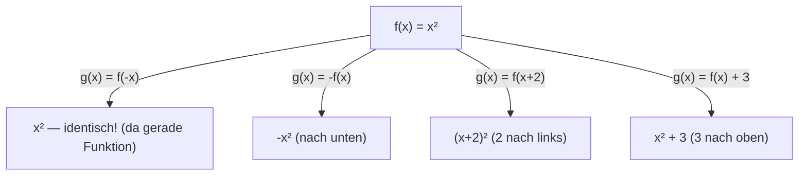
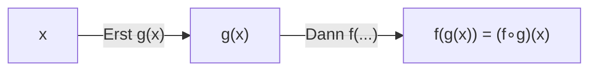
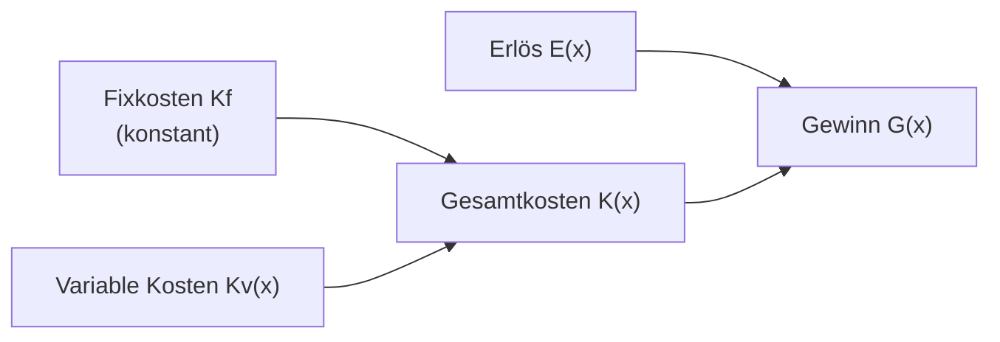
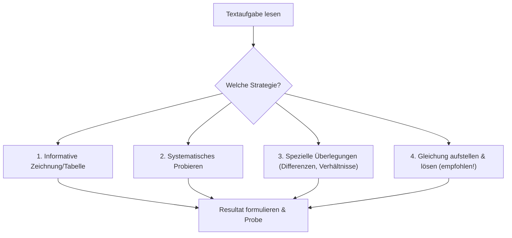
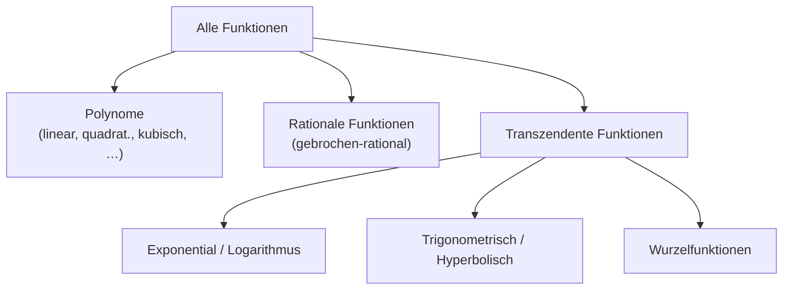

## Logarithmusfunktion (vertieft)

Die Logarithmusfunktion haben wir als Umkehrfunktion der Exponentialfunktion kennengelernt. Hier eine systematische Vertiefung ihrer Eigenschaften und Transformationen.

$$y = f(x) = \log_a x \quad (a > 0,\ a \neq 1,\ x > 0)$$

**Zusammenfassung der Eigenschaften:**

| Eigenschaft | `a > 1` | `0 < a < 1` |
|---|---|---|
| DB | `(0; ∞)` | `(0; ∞)` |
| WB | `ℝ` | `ℝ` |
| Nullstelle | `x = 1` | `x = 1` |
| Asymptote | `x = 0` (y-Achse) | `x = 0` (y-Achse) |
| Monotonie | streng wachsend | streng fallend |

**Transformationen:** Verschiebungen, Spiegelungen und Streckungen der Logarithmusfunktion folgen denselben Regeln wie bei anderen Funktionen:
- `y = log_a(x + c)`: Verschiebung um c nach links (Vorsicht: DB ändert sich!)
- `y = log_a(x) + d`: Verschiebung um d nach oben
- `y = -log_a(x)`: Spiegelung an der x-Achse

---

## Erweiterung des Funktionsbegriffs

### Von einer Funktion zur anderen — Transformationsregeln

Gegeben `f(x)`: Wie entsteht daraus `g(x)`?

| Transformation | Formel | Beschreibung |
|---|---|---|
| Spiegelung an y-Achse | `g(x) = f(-x)` | x-Werte spiegeln |
| Spiegelung an x-Achse | `g(x) = -f(x)` | y-Werte negieren |
| Punktspiegelung am Ursprung | `g(x) = -f(-x)` | beides kombiniert |
| Verschiebung in y-Richtung | `g(x) = f(x) + d` | d > 0: nach oben |
| Verschiebung in x-Richtung | `g(x) = f(x + c)` | c > 0: nach *links* (Achtung!) |
| Streckung in y-Richtung | `g(x) = a · f(x)` | `|a|` > 1: strecken, `|a|` < 1: stauchen |
| Betrag der Funktion | `g(x) = |f(x)|` | negativen Teil nach oben klappen |



*Warum ist `c > 0` eine Verschiebung nach links?* Weil `f(x + 2)` fragt: „An welcher Stelle x muss f ausgewertet werden, damit ich denselben Wert bekomme?" Die Antwort: bei `x - 2` — also 2 Einheiten nach links.

### Funktionen addieren und multiplizieren

Wenn `f` und `g` Funktionen sind, definiert man:

- **Summe:** `(f + g)(x) = f(x) + g(x)` — DB = DB(f) ∩ DB(g)
- **Produkt:** `(f · g)(x) = f(x) · g(x)` — DB = DB(f) ∩ DB(g)

### Verkettung von Funktionen

Die **Verkettung** (Komposition) führt zwei Funktionen hintereinander aus:

$$(f \circ g)(x) = f(g(x))$$

*Lesart:* „f nach g" — **zuerst g, dann f**. Die Schreibweise von rechts nach links lesen!



**Beispiel:**
```
f(z) = sin(z),  g(z) = z²

r(x) = f(g(x)) = sin(x²)    [erst quadrieren, dann Sinus]
s(x) = g(f(x)) = sin²(x)    [erst Sinus, dann quadrieren]
```

Die Reihenfolge ist **nicht** egal: `f ∘ g ≠ g ∘ f` im Allgemeinen!

*Warum wichtig?* Verkettungen erscheinen überall in der Analysis (Kettenregel), in der Informatik (Funktionskomposition) und in der Physik (verschachtelte Modelle).

### Betragsfunktion erweitert

Die Betragsfunktion `g(x) = |f(x)|` entsteht, indem alle negativen Funktionswerte an der x-Achse gespiegelt werden. Graphisch: Der Teil des Graphen, der unter der x-Achse liegt, wird nach oben geklappt.

### Zusammenhang zwischen Ungleichungen und Funktionen

Die graphische Lösung einer Ungleichung `f(x) > g(x)` entspricht der Frage: „Für welche x liegt der Graph von f *über* dem Graph von g?"

---

## Hyperbolische Funktionen

Die hyperbolischen Funktionen sind weniger bekannt als Sinus und Kosinus, aber genauso fundamental. Sie entstehen direkt aus der Euler'schen Zahl `e`.

$$\cosh(x) = \frac{e^x + e^{-x}}{2} \qquad \text{(Kosinus hyperbolicus)}$$
$$\sinh(x) = \frac{e^x - e^{-x}}{2} \qquad \text{(Sinus hyperbolicus)}$$

**In der Natur:** Jedes hängende Seil oder eine Kette folgt der Form von `cosh(x)` — der sogenannten **Kettenlinie**. Was wie eine Parabel aussieht, ist tatsächlich ein Kosinus hyperbolicus.

**Eigenschaften:**

| Eigenschaft | `cosh(x)` | `sinh(x)` |
|---|---|---|
| DB | `ℝ` | `ℝ` |
| WB | `[1; ∞)` | `ℝ` |
| Symmetrie | gerade (wie cos) | ungerade (wie sin) |
| Nullstellen | keine | `x = 0` |
| Minimum | `(0; 1)` | — |

**Analogie zur Trigonometrie:**
$$\cosh^2(x) - \sinh^2(x) = 1$$

(vergleiche: `cos²(x) + sin²(x) = 1` — gleiche Struktur, anderes Vorzeichen!)

Die Umkehrfunktionen heißen Areasinus hyperbolicus (`arsinh`) und Areakosinus hyperbolicus (`arcosh`).

---

## Elemente der Trigonometrie: Tangens

### Steigung und Winkel im Alltag

Die Steigung `m` einer Geraden lässt sich auch als Winkel ausdrücken. Im Alltag begegnet uns das bei:
- Straßenneigung: „10% Gefälle" bedeutet 10 cm Höhenunterschied auf 100 cm Horizontaldistanz
- Dachneigung
- Geländeanalyse

**Beziehung:** `m = tan(α)`, wobei `α` der Winkel zur Horizontalen ist.

### Tangens und Kotangens im rechtwinkligen Dreieck

Im rechtwinkligen Dreieck mit Winkel `α`:

$$\tan(\alpha) = \frac{\text{Gegenkathete}}{\text{Ankathete}} \qquad \cot(\alpha) = \frac{\text{Ankathete}}{\text{Gegenkathete}} = \frac{1}{\tan(\alpha)}$$

```
      /|
     / |  Gegenkathete
    /  |
   / α |
  ------
  Ankathete
```

**Beispiel:** Ein Hang hat ein Gefälle von 15%. Das entspricht einem Winkel `α = arctan(0,15) ≈ 8,5°`.

### Die allgemeine Tangensfunktion

$$y = f(x) = \tan(x)$$

- DB: `ℝ \ {π/2 + kπ | k ∈ ℤ}` (an den Polstellen nicht definiert)
- WB: `ℝ`
- Periodisch mit Periode `π`
- Polstellen bei `x = π/2, -π/2, 3π/2, …`

---

## Betriebswirtschaftliche Funktionen & Ökonomische Modelle

Mathematik ist nicht abstrakt — sie beschreibt reale wirtschaftliche Zusammenhänge. Diese Modelle verbinden lineare und quadratische Funktionen mit ökonomischen Größen.

### Kosten-, Erlös- und Gewinnfunktion

| Funktion | Formel | Beschreibung |
|---|---|---|
| Erlösfunktion | `E(x) = x · p(x)` | Menge × Stückpreis |
| Kostenfunktion | `K(x) = Kv(x) + Kf` | variable + fixe Kosten |
| Gewinnfunktion | `G(x) = E(x) - K(x)` | Erlös minus Kosten |
| Deckungsbeitrag | `D(x) = E(x) - Kv(x)` | Erlös minus variable Kosten |
| Stückkostenrate | `k(x) = K(x) / x` | Kosten pro Einheit |



**Break-even-Punkt:** Der Punkt, an dem `G(x) = 0`, also `E(x) = K(x)` — Gewinnschwelle.

### Angebot und Nachfrage

- **Nachfragefunktion** `p(x)`: Je mehr angeboten wird, desto tiefer der Preis (fallend).
- **Angebotsfunktion** `q(x)`: Je höher der Preis, desto mehr wird angeboten (steigend).
- **Gleichgewichtspreis:** Schnittpunkt von Angebot und Nachfrage (`p(x) = q(x)` lösen).

---

## Textgleichungen

Textgleichungen verbinden mathematisches Modellieren mit dem Lösen von Gleichungen. Der Knackpunkt ist nicht das Rechnen, sondern das **richtige Aufstellen** der Gleichung.

### Problemlösungsstrategien

Es gibt verschiedene Wege, Textaufgaben zu lösen:



**Warum die Gleichungsmethode bevorzugen?** Sie liefert immer exakte Ergebnisse und funktioniert unabhängig davon, ob die Zahlen „schön" sind.

### Vorgehen beim Aufstellen von Gleichungen

1. **Variable deklarieren:** Was ist die Unbekannte? Wie wird sie bezeichnet?
2. **Gleichung aufstellen:** Alle Bedingungen des Textes in mathematische Form bringen.
3. **Lösen:** Gleichung lösen.
4. **Probe und Formulierung:** Ergebnis in die ursprüngliche Fragestellung einsetzen und beantworten.

### Häufige Typen von Textgleichungen

**Bewegungsaufgaben:** `Weg = Geschwindigkeit × Zeit`
```
Tanja fährt mit 16 km/h, Claudia startet 30 min später mit 24 km/h.
Nach welcher Zeit holt Claudia Tanja ein?

Variable: t = Fahrzeit von Claudia [h]
Tanjas Weg: s_T = 16 · (t + 0,5)
Claudias Weg: s_C = 24 · t

Gleichsetzen: 16(t + 0,5) = 24t
→ 16t + 8 = 24t → 8 = 8t → t = 1 h
→ Treffpunkt nach 1 h Fahrzeit Claudias = 1,5 h nach Tanja
→ Entfernung: 24 · 1 = 24 km
```

**Mischungsaufgaben:** `Menge₁ · Konzentration₁ + Menge₂ · Konzentration₂ = Gesamt`

**Arbeit/Leistungsaufgaben:** `Leistung = Arbeit / Zeit`; bei gemeinsamer Arbeit: Leistungen addieren.

**Zins- und Finanzmathematik:** `Kₙ = K₀ · qⁿ`, Wachstumsfaktoren korrekt anwenden.

---

## Koordinatentransformationen

### Parallelverschiebung des Koordinatensystems

Manchmal ist es einfacher, ein Problem in einem *anderen* Koordinatensystem zu beschreiben — z. B. wenn der Ursprung im Scheitelpunkt einer Parabel liegt.

**Transformation:** Gegeben ein neues Koordinatensystem mit Ursprung im Punkt (a; b) des alten Systems:

$$x = u + a \qquad y = v + b$$

Umgekehrt:
$$u = x - a \qquad v = y - b$$

**Beispiel:** Die Parabel `y = x² + 2x + 3` hat den Scheitelpunkt `S(-1; 2)`. Im verschobenen System `(u = x + 1, v = y - 2)` vereinfacht sie sich zu:
$$v = u^2 \quad \text{(Normalparabel!)}$$

*Warum hilfreich?* Koordinatentransformationen können komplizierte Gleichungen stark vereinfachen. Die Kurve ändert sich nicht — nur ihre Beschreibung.

### Polarkoordinaten

Kartesische Koordinaten (x; y) beschreiben einen Punkt durch zwei senkrechte Abstände. **Polarkoordinaten** (r; φ) beschreiben ihn durch Abstand und Winkel vom Ursprung:

$$x = r \cdot \cos(\varphi) \qquad y = r \cdot \sin(\varphi)$$

Umgekehrt:
$$r = \sqrt{x^2 + y^2} \qquad \varphi = \arctan\left(\frac{y}{x}\right)$$

**Der Kreis in Polarform:** Ein Kreis mit Radius r um den Ursprung hat die elegante Gleichung:
$$r = \text{const}$$

im Gegensatz zur kartesischen Form `x² + y² = r²`.

### Komplexe Zahlen in Polarform

Ein wichtiger Anwendungsfall der Polarkoordinaten: Jede komplexe Zahl `z = a + bi` lässt sich als Punkt in der Zahlenebene darstellen und in Polarform schreiben:

$$z = r \cdot (\cos\varphi + i \cdot \sin\varphi) = r \cdot e^{i\varphi}$$

wobei `r = |z| = √(a² + b²)` der Betrag und `φ` das Argument (Winkel) der komplexen Zahl ist.

---

## Parameterdarstellung von Funktionen

Bisher wurden Kurven meist als `y = f(x)` beschrieben. Die **Parameterdarstellung** bietet mehr Flexibilität:

$$x = x(t), \quad y = y(t) \quad t \in [t_{\min}; t_{\max}]$$

Der Parameter `t` kann z. B. die Zeit darstellen.

### Beispiel: Kreisdarstellung

Ein Kreis mit Radius r und Mittelpunkt (0; 0) in drei Darstellungsformen:

| Form | Gleichung | Einschränkung |
|---|---|---|
| Implizit | `x² + y² = r²` | |
| Explizit | `y = ±√(r² - x²)` | Zwei Gleichungen nötig |
| Parameter | `x = r·cos(t), y = r·sin(t)` | `t ∈ [0; 2π[` |

Die Parameterdarstellung beschreibt den vollen Kreis mit einer einzigen Formel — und gibt sogar die Richtung der Durchlaufung vor (mathematisch positiv = gegen den Uhrzeigersinn).

### Allgemeine Kurven in der Ebene

Kurven, die *nicht* als Funktion `y = f(x)` darstellbar sind (weil einem x-Wert mehrere y-Werte entsprechen), lassen sich oft elegant parametrisieren:

```
Ellipse:
x(t) = a · cos(t)
y(t) = b · sin(t)

→ eliminiert man t: (x/a)² + (y/b)² = 1
```

**Lissajous-Figuren** entstehen, wenn x- und y-Frequenz verschieden sind — bekannte Muster in der Physik und Elektronik.

### Parameterdarstellung räumlicher Kurven

Im dreidimensionalen Raum:
$$x = x(t), \quad y = y(t), \quad z = z(t)$$

Beispiel: Eine Schraublinie (Helix) mit Radius r und Steigung h:
```
x(t) = r · cos(t)
y(t) = r · sin(t)
z(t) = h · t
```

---

## Zusammenfassung: Übersicht aller Funktionstypen

| Funktion | Grundform | DB | Asymptoten |
|---|---|---|---|
| Linear | `mx + b` | ℝ | keine |
| Quadratisch | `ax² + bx + c` | ℝ | keine |
| Kubisch | `ax³ + …` | ℝ | keine |
| Hyperbel | `c/(x + d) + e` | `ℝ \ {-d}` | x = -d; y = e |
| Wurzel | `a√(x + c) + d` | `[-c; ∞)` | keine |
| Exponential | `b · aˣ + v` | ℝ | y = v |
| Logarithmus | `log_a(x + c) + d` | `(-c; ∞)` | x = -c |
| Potenz (n > 0) | `xⁿ` | ℝ oder ℝ⁺ | keine |
| Gebrochen-rat. | `p(x)/q(x)` | `ℝ \ {Nullst. q}` | vertikal & horiz. |
| sinh / cosh | `(eˣ ± e⁻ˣ)/2` | ℝ | keine |
| Tangens | `tan(x)` | `ℝ \ {π/2 + kπ}` | vertikal bei Polen |



### Wie erkenne ich den Funktionstyp am Graphen?

- **Gerade** → linear
- **Parabel** → quadratisch
- **Zwei symmetrische Äste mit Asymptoten** → Hyperbel oder gebrochen-rational
- **Nur im positiven x-Bereich, wächst langsam** → Logarithmus oder Wurzel
- **Wächst immer schneller / fällt immer schneller** → Exponentialfunktion
- **Schwingt mit gleicher Amplitude** → trigonometrisch (sin/cos/tan)
- **Schwingt mit wachsender Amplitude** → Kombination oder hyperbolisch
